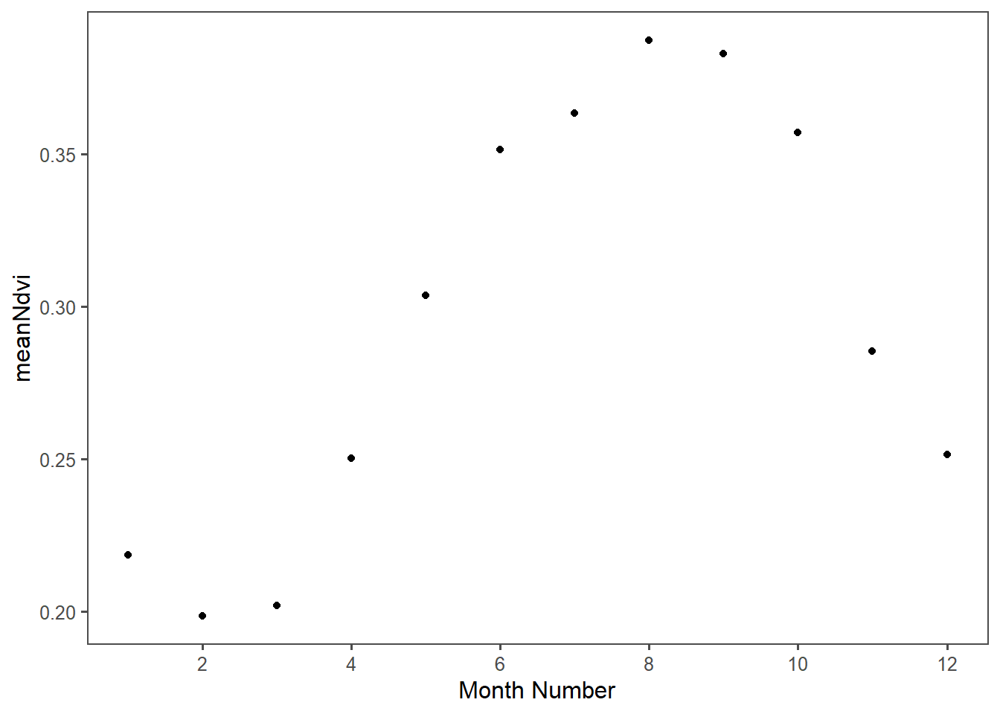
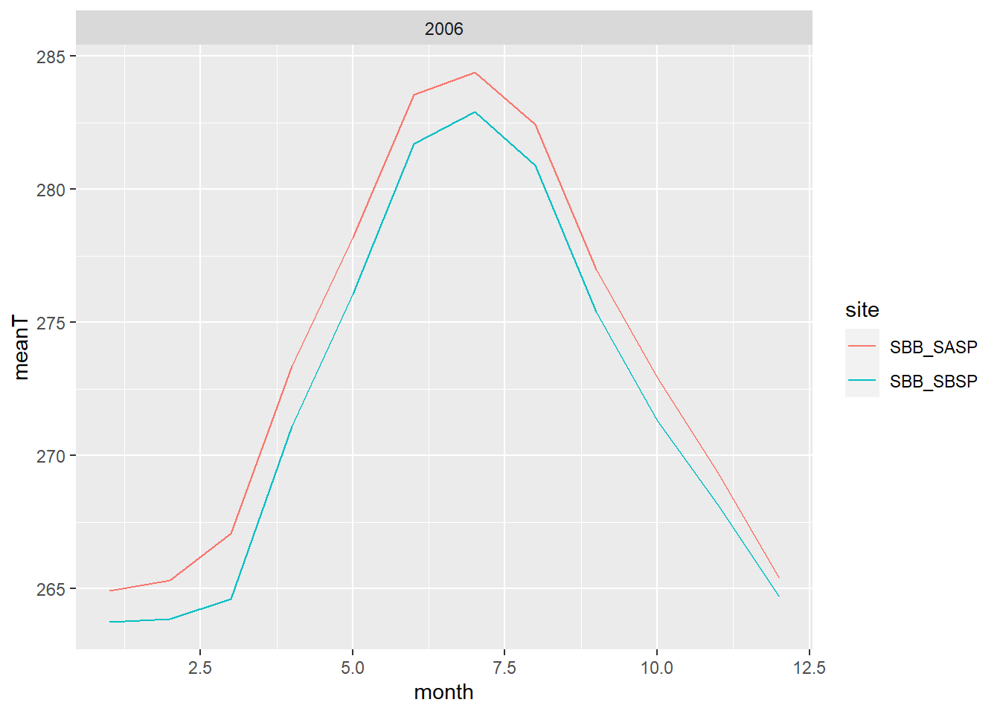
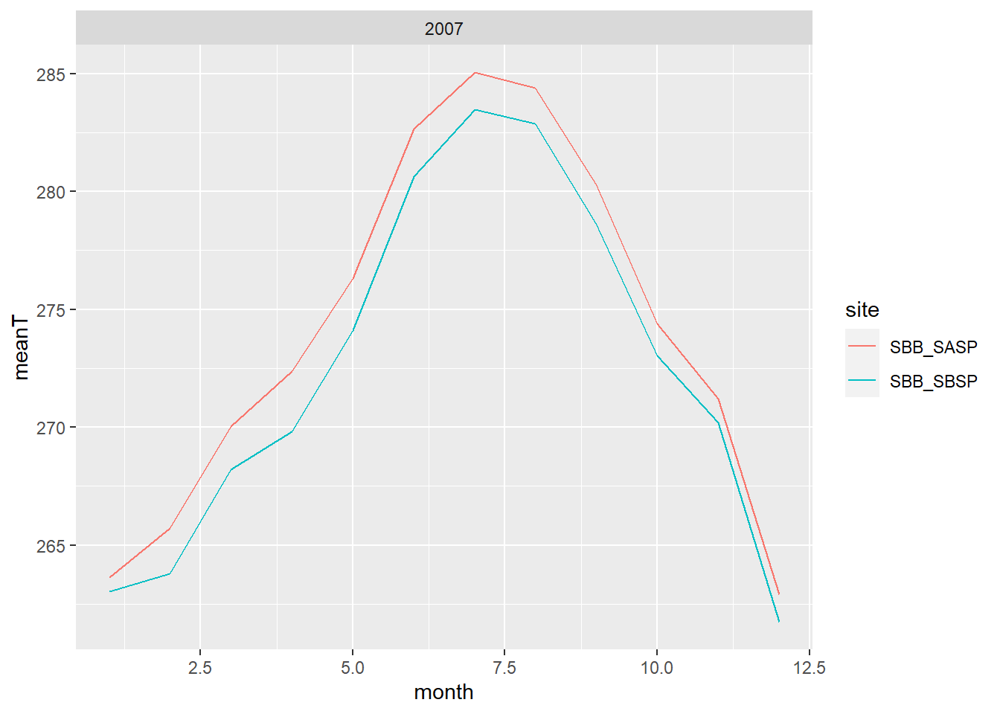
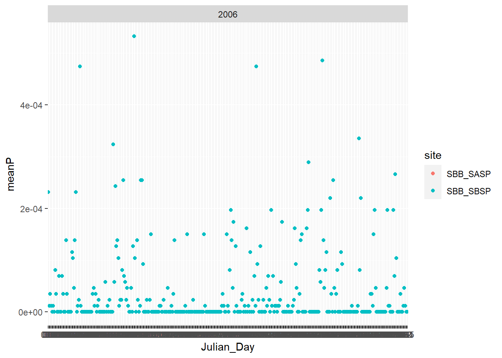
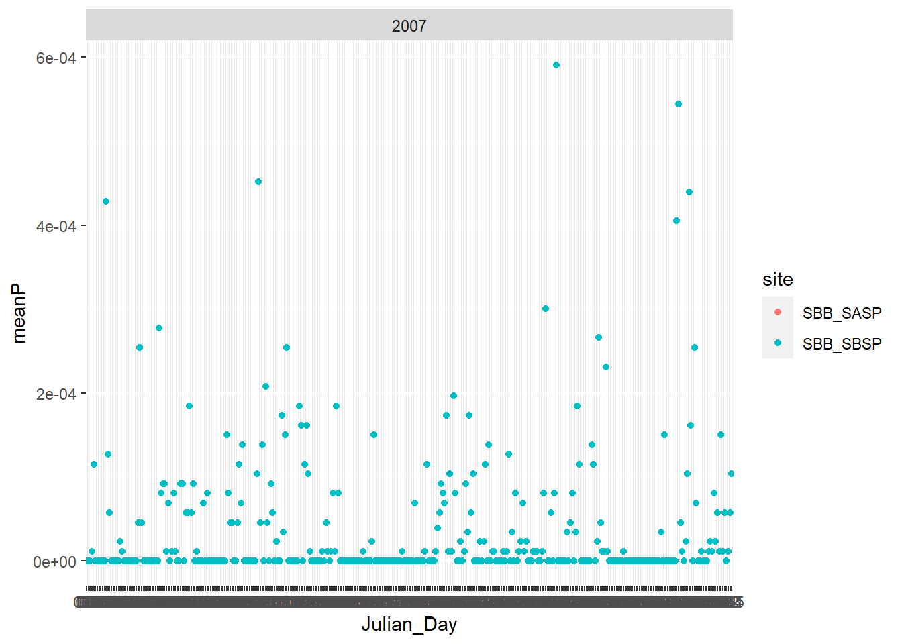
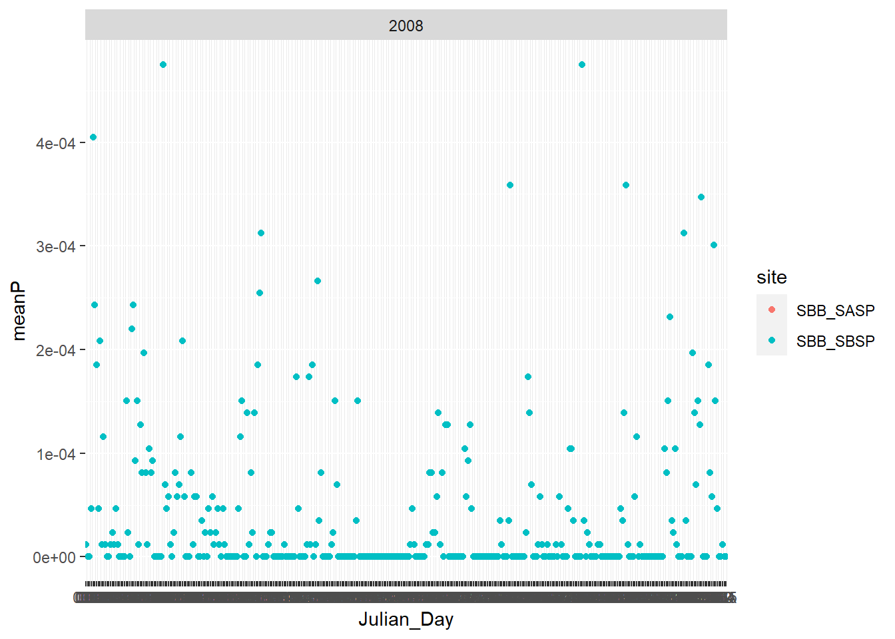
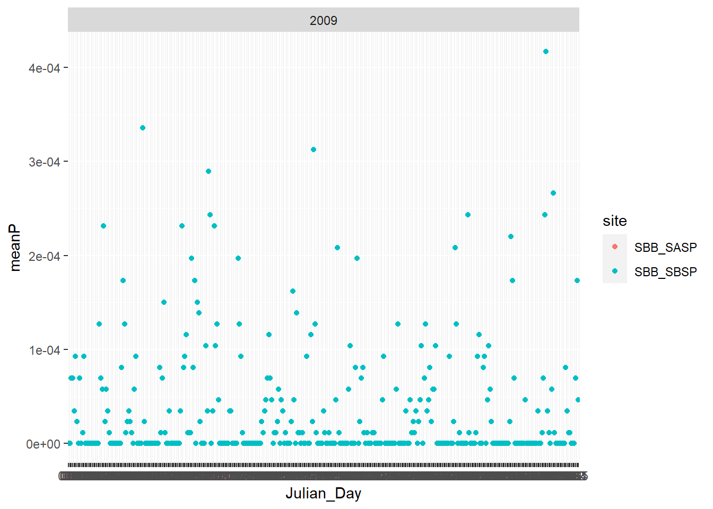
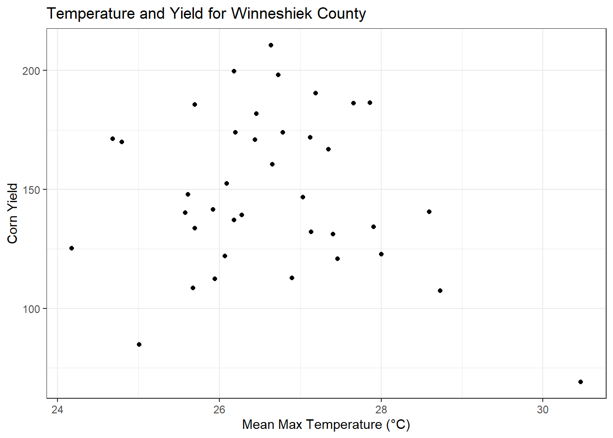

--- 
title: "ESS Final Project"
author: "Jan Sitterson"
date: "2022-03-24"
site: bookdown::bookdown_site
editor_options: 
  chunk_output_type: console
---
# Intro
This is an R Bookdown document of the data analysis skills I have learned through ESS 580. Weekly assignments are compiled in this bookdown so I (or someone else) can use this as a template for my own research data. 


# R Markdown
## SiteDescription
The Poudre River at Lincoln Bridge is shown below

Some key aspects of this location are:

  - Downstream of only a little bit of urban stormwater

  - Near Odell Brewing CO
  
  - Near an open space area and the Poudre River Trail
  
  - **Downstream of many agricultral diversions**


## Data Acquisition and Plotting tests


```r
q <- readNWISdv(siteNumbers = '06752260',
                parameterCd = '00060',
                startDate = '2017-01-01',
                endDate = '2022-01-01') %>%
  rename(q = 'X_00060_00003')
```


## Static Data Plotter


```r
ggplot(q, aes(x = Date, y = q)) + 
  geom_line() + 
  ylab('Q (cfs)') + 
  ggtitle('Discharge in the Poudre River, Fort Collins')
```

```
## Warning: Removed 31 row(s) containing missing values (geom_path).
```


## Interactive Data Plotter


```r
q_xts <- xts(q$q, order.by = q$Date)


dygraph(q_xts) %>%
  dyAxis("y", label = "Discharge (cfs)") 
```

```{=html}
<div id="htmlwidget-a10913eb2b79c1883481" style="width:672px;height:480px;" class="dygraphs html-widget"></div>
<script type="application/json" data-for="htmlwidget-a10913eb2b79c1883481">{"x":{"attrs":{"axes":{"x":{"pixelsPerLabel":60},"y":[]},"labels":["day","V1"],"legend":"auto","retainDateWindow":false,"ylabel":"Discharge (cfs)"},"scale":"daily","annotations":[],"shadings":[],"events":[],"format":"date","data":[["2017-01-01T00:00:00.000Z","2017-01-02T00:00:00.000Z","2017-01-03T00:00:00.000Z","2017-01-04T00:00:00.000Z","2017-01-05T00:00:00.000Z","2017-01-06T00:00:00.000Z","2017-01-07T00:00:00.000Z","2017-01-08T00:00:00.000Z","2017-01-09T00:00:00.000Z","2017-01-10T00:00:00.000Z","2017-01-11T00:00:00.000Z","2017-01-12T00:00:00.000Z","2017-01-13T00:00:00.000Z","2017-01-14T00:00:00.000Z","2017-01-15T00:00:00.000Z","2017-01-16T00:00:00.000Z","2017-01-17T00:00:00.000Z","2017-01-18T00:00:00.000Z","2017-01-19T00:00:00.000Z","2017-01-20T00:00:00.000Z","2017-01-21T00:00:00.000Z","2017-01-22T00:00:00.000Z","2017-01-23T00:00:00.000Z","2017-01-24T00:00:00.000Z","2017-01-25T00:00:00.000Z","2017-01-26T00:00:00.000Z","2017-01-27T00:00:00.000Z","2017-01-28T00:00:00.000Z","2017-01-29T00:00:00.000Z","2017-01-30T00:00:00.000Z","2017-01-31T00:00:00.000Z","2017-02-01T00:00:00.000Z","2017-02-02T00:00:00.000Z","2017-02-03T00:00:00.000Z","2017-02-04T00:00:00.000Z","2017-02-05T00:00:00.000Z","2017-02-06T00:00:00.000Z","2017-02-07T00:00:00.000Z","2017-02-08T00:00:00.000Z","2017-02-09T00:00:00.000Z","2017-02-10T00:00:00.000Z","2017-02-11T00:00:00.000Z","2017-02-12T00:00:00.000Z","2017-02-13T00:00:00.000Z","2017-02-14T00:00:00.000Z","2017-02-15T00:00:00.000Z","2017-02-16T00:00:00.000Z","2017-02-17T00:00:00.000Z","2017-02-18T00:00:00.000Z","2017-02-19T00:00:00.000Z","2017-02-20T00:00:00.000Z","2017-02-21T00:00:00.000Z","2017-02-22T00:00:00.000Z","2017-02-23T00:00:00.000Z","2017-02-24T00:00:00.000Z","2017-02-25T00:00:00.000Z","2017-02-26T00:00:00.000Z","2017-02-27T00:00:00.000Z","2017-02-28T00:00:00.000Z","2017-03-01T00:00:00.000Z","2017-03-02T00:00:00.000Z","2017-03-03T00:00:00.000Z","2017-03-04T00:00:00.000Z","2017-03-05T00:00:00.000Z","2017-03-06T00:00:00.000Z","2017-03-07T00:00:00.000Z","2017-03-08T00:00:00.000Z","2017-03-09T00:00:00.000Z","2017-03-10T00:00:00.000Z","2017-03-11T00:00:00.000Z","2017-03-12T00:00:00.000Z","2017-03-13T00:00:00.000Z","2017-03-14T00:00:00.000Z","2017-03-15T00:00:00.000Z","2017-03-16T00:00:00.000Z","2017-03-17T00:00:00.000Z","2017-03-18T00:00:00.000Z","2017-03-19T00:00:00.000Z","2017-03-20T00:00:00.000Z","2017-03-21T00:00:00.000Z","2017-03-22T00:00:00.000Z","2017-03-23T00:00:00.000Z","2017-03-24T00:00:00.000Z","2017-03-25T00:00:00.000Z","2017-03-26T00:00:00.000Z","2017-03-27T00:00:00.000Z","2017-03-28T00:00:00.000Z","2017-03-29T00:00:00.000Z","2017-03-30T00:00:00.000Z","2017-03-31T00:00:00.000Z","2017-04-01T00:00:00.000Z","2017-04-02T00:00:00.000Z","2017-04-03T00:00:00.000Z","2017-04-04T00:00:00.000Z","2017-04-05T00:00:00.000Z","2017-04-06T00:00:00.000Z","2017-04-07T00:00:00.000Z","2017-04-08T00:00:00.000Z","2017-04-09T00:00:00.000Z","2017-04-10T00:00:00.000Z","2017-04-11T00:00:00.000Z","2017-04-12T00:00:00.000Z","2017-04-13T00:00:00.000Z","2017-04-14T00:00:00.000Z","2017-04-15T00:00:00.000Z","2017-04-16T00:00:00.000Z","2017-04-17T00:00:00.000Z","2017-04-18T00:00:00.000Z","2017-04-19T00:00:00.000Z","2017-04-20T00:00:00.000Z","2017-04-21T00:00:00.000Z","2017-04-22T00:00:00.000Z","2017-04-23T00:00:00.000Z","2017-04-24T00:00:00.000Z","2017-04-25T00:00:00.000Z","2017-04-26T00:00:00.000Z","2017-04-27T00:00:00.000Z","2017-04-28T00:00:00.000Z","2017-04-29T00:00:00.000Z","2017-04-30T00:00:00.000Z","2017-05-01T00:00:00.000Z","2017-05-02T00:00:00.000Z","2017-05-03T00:00:00.000Z","2017-05-04T00:00:00.000Z","2017-05-05T00:00:00.000Z","2017-05-06T00:00:00.000Z","2017-05-07T00:00:00.000Z","2017-05-08T00:00:00.000Z","2017-05-09T00:00:00.000Z","2017-05-10T00:00:00.000Z","2017-05-11T00:00:00.000Z","2017-05-12T00:00:00.000Z","2017-05-13T00:00:00.000Z","2017-05-14T00:00:00.000Z","2017-05-15T00:00:00.000Z","2017-05-16T00:00:00.000Z","2017-05-17T00:00:00.000Z","2017-05-18T00:00:00.000Z","2017-05-19T00:00:00.000Z","2017-05-20T00:00:00.000Z","2017-05-21T00:00:00.000Z","2017-05-22T00:00:00.000Z","2017-05-23T00:00:00.000Z","2017-05-24T00:00:00.000Z","2017-05-25T00:00:00.000Z","2017-05-26T00:00:00.000Z","2017-05-27T00:00:00.000Z","2017-05-28T00:00:00.000Z","2017-05-29T00:00:00.000Z","2017-05-30T00:00:00.000Z","2017-05-31T00:00:00.000Z","2017-06-01T00:00:00.000Z","2017-06-02T00:00:00.000Z","2017-06-03T00:00:00.000Z","2017-06-04T00:00:00.000Z","2017-06-05T00:00:00.000Z","2017-06-06T00:00:00.000Z","2017-06-07T00:00:00.000Z","2017-06-08T00:00:00.000Z","2017-06-09T00:00:00.000Z","2017-06-10T00:00:00.000Z","2017-06-11T00:00:00.000Z","2017-06-12T00:00:00.000Z","2017-06-13T00:00:00.000Z","2017-06-14T00:00:00.000Z","2017-06-15T00:00:00.000Z","2017-06-16T00:00:00.000Z","2017-06-17T00:00:00.000Z","2017-06-18T00:00:00.000Z","2017-06-19T00:00:00.000Z","2017-06-20T00:00:00.000Z","2017-06-21T00:00:00.000Z","2017-06-22T00:00:00.000Z","2017-06-23T00:00:00.000Z","2017-06-24T00:00:00.000Z","2017-06-25T00:00:00.000Z","2017-06-26T00:00:00.000Z","2017-06-27T00:00:00.000Z","2017-06-28T00:00:00.000Z","2017-06-29T00:00:00.000Z","2017-06-30T00:00:00.000Z","2017-07-01T00:00:00.000Z","2017-07-02T00:00:00.000Z","2017-07-03T00:00:00.000Z","2017-07-04T00:00:00.000Z","2017-07-05T00:00:00.000Z","2017-07-06T00:00:00.000Z","2017-07-07T00:00:00.000Z","2017-07-08T00:00:00.000Z","2017-07-09T00:00:00.000Z","2017-07-10T00:00:00.000Z","2017-07-11T00:00:00.000Z","2017-07-12T00:00:00.000Z","2017-07-13T00:00:00.000Z","2017-07-14T00:00:00.000Z","2017-07-15T00:00:00.000Z","2017-07-16T00:00:00.000Z","2017-07-17T00:00:00.000Z","2017-07-18T00:00:00.000Z","2017-07-19T00:00:00.000Z","2017-07-20T00:00:00.000Z","2017-07-21T00:00:00.000Z","2017-07-22T00:00:00.000Z","2017-07-23T00:00:00.000Z","2017-07-24T00:00:00.000Z","2017-07-25T00:00:00.000Z","2017-07-26T00:00:00.000Z","2017-07-27T00:00:00.000Z","2017-07-28T00:00:00.000Z","2017-07-29T00:00:00.000Z","2017-07-30T00:00:00.000Z","2017-07-31T00:00:00.000Z","2017-08-01T00:00:00.000Z","2017-08-02T00:00:00.000Z","2017-08-03T00:00:00.000Z","2017-08-04T00:00:00.000Z","2017-08-05T00:00:00.000Z","2017-08-06T00:00:00.000Z","2017-08-07T00:00:00.000Z","2017-08-08T00:00:00.000Z","2017-08-09T00:00:00.000Z","2017-08-10T00:00:00.000Z","2017-08-11T00:00:00.000Z","2017-08-12T00:00:00.000Z","2017-08-13T00:00:00.000Z","2017-08-14T00:00:00.000Z","2017-08-15T00:00:00.000Z","2017-08-16T00:00:00.000Z","2017-08-17T00:00:00.000Z","2017-08-18T00:00:00.000Z","2017-08-19T00:00:00.000Z","2017-08-20T00:00:00.000Z","2017-08-21T00:00:00.000Z","2017-08-22T00:00:00.000Z","2017-08-23T00:00:00.000Z","2017-08-24T00:00:00.000Z","2017-08-25T00:00:00.000Z","2017-08-26T00:00:00.000Z","2017-08-27T00:00:00.000Z","2017-08-28T00:00:00.000Z","2017-08-29T00:00:00.000Z","2017-08-30T00:00:00.000Z","2017-08-31T00:00:00.000Z","2017-09-01T00:00:00.000Z","2017-09-02T00:00:00.000Z","2017-09-03T00:00:00.000Z","2017-09-04T00:00:00.000Z","2017-09-05T00:00:00.000Z","2017-09-06T00:00:00.000Z","2017-09-07T00:00:00.000Z","2017-09-08T00:00:00.000Z","2017-09-09T00:00:00.000Z","2017-09-10T00:00:00.000Z","2017-09-11T00:00:00.000Z","2017-09-12T00:00:00.000Z","2017-09-13T00:00:00.000Z","2017-09-14T00:00:00.000Z","2017-09-15T00:00:00.000Z","2017-09-16T00:00:00.000Z","2017-09-17T00:00:00.000Z","2017-09-18T00:00:00.000Z","2017-09-19T00:00:00.000Z","2017-09-20T00:00:00.000Z","2017-09-21T00:00:00.000Z","2017-09-22T00:00:00.000Z","2017-09-23T00:00:00.000Z","2017-09-24T00:00:00.000Z","2017-09-25T00:00:00.000Z","2017-09-26T00:00:00.000Z","2017-09-27T00:00:00.000Z","2017-09-28T00:00:00.000Z","2017-09-29T00:00:00.000Z","2017-09-30T00:00:00.000Z","2017-10-01T00:00:00.000Z","2017-10-02T00:00:00.000Z","2017-10-03T00:00:00.000Z","2017-10-04T00:00:00.000Z","2017-10-05T00:00:00.000Z","2017-10-06T00:00:00.000Z","2017-10-07T00:00:00.000Z","2017-10-08T00:00:00.000Z","2017-10-09T00:00:00.000Z","2017-10-10T00:00:00.000Z","2017-10-11T00:00:00.000Z","2017-10-12T00:00:00.000Z","2017-10-13T00:00:00.000Z","2017-10-14T00:00:00.000Z","2017-10-15T00:00:00.000Z","2017-10-16T00:00:00.000Z","2017-10-17T00:00:00.000Z","2017-10-18T00:00:00.000Z","2017-10-19T00:00:00.000Z","2017-10-20T00:00:00.000Z","2017-10-21T00:00:00.000Z","2017-10-22T00:00:00.000Z","2017-10-23T00:00:00.000Z","2017-10-24T00:00:00.000Z","2017-10-25T00:00:00.000Z","2017-10-26T00:00:00.000Z","2017-10-27T00:00:00.000Z","2017-10-28T00:00:00.000Z","2017-10-29T00:00:00.000Z","2017-10-30T00:00:00.000Z","2017-10-31T00:00:00.000Z","2017-11-01T00:00:00.000Z","2017-11-02T00:00:00.000Z","2017-11-03T00:00:00.000Z","2017-11-04T00:00:00.000Z","2017-11-05T00:00:00.000Z","2017-11-06T00:00:00.000Z","2017-11-07T00:00:00.000Z","2017-11-08T00:00:00.000Z","2017-11-09T00:00:00.000Z","2017-11-10T00:00:00.000Z","2017-11-11T00:00:00.000Z","2017-11-12T00:00:00.000Z","2017-11-13T00:00:00.000Z","2017-11-14T00:00:00.000Z","2017-11-15T00:00:00.000Z","2017-11-16T00:00:00.000Z","2017-11-17T00:00:00.000Z","2017-11-18T00:00:00.000Z","2017-11-19T00:00:00.000Z","2017-11-20T00:00:00.000Z","2017-11-21T00:00:00.000Z","2017-11-22T00:00:00.000Z","2017-11-23T00:00:00.000Z","2017-11-24T00:00:00.000Z","2017-11-25T00:00:00.000Z","2017-11-26T00:00:00.000Z","2017-11-27T00:00:00.000Z","2017-11-28T00:00:00.000Z","2017-11-29T00:00:00.000Z","2017-11-30T00:00:00.000Z","2017-12-01T00:00:00.000Z","2017-12-02T00:00:00.000Z","2017-12-03T00:00:00.000Z","2017-12-04T00:00:00.000Z","2017-12-05T00:00:00.000Z","2017-12-06T00:00:00.000Z","2017-12-07T00:00:00.000Z","2017-12-08T00:00:00.000Z","2017-12-09T00:00:00.000Z","2017-12-10T00:00:00.000Z","2017-12-11T00:00:00.000Z","2017-12-12T00:00:00.000Z","2017-12-13T00:00:00.000Z","2017-12-14T00:00:00.000Z","2017-12-15T00:00:00.000Z","2017-12-16T00:00:00.000Z","2017-12-17T00:00:00.000Z","2017-12-18T00:00:00.000Z","2017-12-19T00:00:00.000Z","2017-12-20T00:00:00.000Z","2017-12-21T00:00:00.000Z","2017-12-22T00:00:00.000Z","2017-12-23T00:00:00.000Z","2017-12-24T00:00:00.000Z","2017-12-25T00:00:00.000Z","2017-12-26T00:00:00.000Z","2017-12-27T00:00:00.000Z","2017-12-28T00:00:00.000Z","2017-12-29T00:00:00.000Z","2017-12-30T00:00:00.000Z","2017-12-31T00:00:00.000Z","2018-01-01T00:00:00.000Z","2018-01-02T00:00:00.000Z","2018-01-03T00:00:00.000Z","2018-01-04T00:00:00.000Z","2018-01-05T00:00:00.000Z","2018-01-06T00:00:00.000Z","2018-01-07T00:00:00.000Z","2018-01-08T00:00:00.000Z","2018-01-09T00:00:00.000Z","2018-01-10T00:00:00.000Z","2018-01-11T00:00:00.000Z","2018-01-12T00:00:00.000Z","2018-01-13T00:00:00.000Z","2018-01-14T00:00:00.000Z","2018-01-15T00:00:00.000Z","2018-01-16T00:00:00.000Z","2018-01-17T00:00:00.000Z","2018-01-18T00:00:00.000Z","2018-01-19T00:00:00.000Z","2018-01-20T00:00:00.000Z","2018-01-21T00:00:00.000Z","2018-01-22T00:00:00.000Z","2018-01-23T00:00:00.000Z","2018-01-24T00:00:00.000Z","2018-01-25T00:00:00.000Z","2018-01-26T00:00:00.000Z","2018-01-27T00:00:00.000Z","2018-01-28T00:00:00.000Z","2018-01-29T00:00:00.000Z","2018-01-30T00:00:00.000Z","2018-01-31T00:00:00.000Z","2018-02-01T00:00:00.000Z","2018-02-02T00:00:00.000Z","2018-02-03T00:00:00.000Z","2018-02-04T00:00:00.000Z","2018-02-05T00:00:00.000Z","2018-02-06T00:00:00.000Z","2018-02-07T00:00:00.000Z","2018-02-08T00:00:00.000Z","2018-02-09T00:00:00.000Z","2018-02-10T00:00:00.000Z","2018-02-11T00:00:00.000Z","2018-02-12T00:00:00.000Z","2018-02-13T00:00:00.000Z","2018-02-14T00:00:00.000Z","2018-02-15T00:00:00.000Z","2018-02-16T00:00:00.000Z","2018-02-17T00:00:00.000Z","2018-02-18T00:00:00.000Z","2018-02-19T00:00:00.000Z","2018-02-20T00:00:00.000Z","2018-02-21T00:00:00.000Z","2018-02-22T00:00:00.000Z","2018-02-23T00:00:00.000Z","2018-02-24T00:00:00.000Z","2018-02-25T00:00:00.000Z","2018-02-26T00:00:00.000Z","2018-02-27T00:00:00.000Z","2018-02-28T00:00:00.000Z","2018-03-01T00:00:00.000Z","2018-03-02T00:00:00.000Z","2018-03-03T00:00:00.000Z","2018-03-04T00:00:00.000Z","2018-03-05T00:00:00.000Z","2018-03-06T00:00:00.000Z","2018-03-07T00:00:00.000Z","2018-03-08T00:00:00.000Z","2018-03-09T00:00:00.000Z","2018-03-10T00:00:00.000Z","2018-03-11T00:00:00.000Z","2018-03-12T00:00:00.000Z","2018-03-13T00:00:00.000Z","2018-03-14T00:00:00.000Z","2018-03-15T00:00:00.000Z","2018-03-16T00:00:00.000Z","2018-03-17T00:00:00.000Z","2018-03-18T00:00:00.000Z","2018-03-19T00:00:00.000Z","2018-03-20T00:00:00.000Z","2018-03-21T00:00:00.000Z","2018-03-22T00:00:00.000Z","2018-03-23T00:00:00.000Z","2018-03-24T00:00:00.000Z","2018-03-25T00:00:00.000Z","2018-03-26T00:00:00.000Z","2018-03-27T00:00:00.000Z","2018-03-28T00:00:00.000Z","2018-03-29T00:00:00.000Z","2018-03-30T00:00:00.000Z","2018-03-31T00:00:00.000Z","2018-04-01T00:00:00.000Z","2018-04-02T00:00:00.000Z","2018-04-03T00:00:00.000Z","2018-04-04T00:00:00.000Z","2018-04-05T00:00:00.000Z","2018-04-06T00:00:00.000Z","2018-04-07T00:00:00.000Z","2018-04-08T00:00:00.000Z","2018-04-09T00:00:00.000Z","2018-04-10T00:00:00.000Z","2018-04-11T00:00:00.000Z","2018-04-12T00:00:00.000Z","2018-04-13T00:00:00.000Z","2018-04-14T00:00:00.000Z","2018-04-15T00:00:00.000Z","2018-04-16T00:00:00.000Z","2018-04-17T00:00:00.000Z","2018-04-18T00:00:00.000Z","2018-04-19T00:00:00.000Z","2018-04-20T00:00:00.000Z","2018-04-21T00:00:00.000Z","2018-04-22T00:00:00.000Z","2018-04-23T00:00:00.000Z","2018-04-24T00:00:00.000Z","2018-04-25T00:00:00.000Z","2018-04-26T00:00:00.000Z","2018-04-27T00:00:00.000Z","2018-04-28T00:00:00.000Z","2018-04-29T00:00:00.000Z","2018-04-30T00:00:00.000Z","2018-05-01T00:00:00.000Z","2018-05-02T00:00:00.000Z","2018-05-03T00:00:00.000Z","2018-05-04T00:00:00.000Z","2018-05-05T00:00:00.000Z","2018-05-06T00:00:00.000Z","2018-05-07T00:00:00.000Z","2018-05-08T00:00:00.000Z","2018-05-09T00:00:00.000Z","2018-05-10T00:00:00.000Z","2018-05-11T00:00:00.000Z","2018-05-12T00:00:00.000Z","2018-05-13T00:00:00.000Z","2018-05-14T00:00:00.000Z","2018-05-15T00:00:00.000Z","2018-05-16T00:00:00.000Z","2018-05-17T00:00:00.000Z","2018-05-18T00:00:00.000Z","2018-05-19T00:00:00.000Z","2018-05-20T00:00:00.000Z","2018-05-21T00:00:00.000Z","2018-05-22T00:00:00.000Z","2018-05-23T00:00:00.000Z","2018-05-24T00:00:00.000Z","2018-05-25T00:00:00.000Z","2018-05-26T00:00:00.000Z","2018-05-27T00:00:00.000Z","2018-05-28T00:00:00.000Z","2018-05-29T00:00:00.000Z","2018-05-30T00:00:00.000Z","2018-05-31T00:00:00.000Z","2018-06-01T00:00:00.000Z","2018-06-02T00:00:00.000Z","2018-06-03T00:00:00.000Z","2018-06-04T00:00:00.000Z","2018-06-05T00:00:00.000Z","2018-06-06T00:00:00.000Z","2018-06-07T00:00:00.000Z","2018-06-08T00:00:00.000Z","2018-06-09T00:00:00.000Z","2018-06-10T00:00:00.000Z","2018-06-11T00:00:00.000Z","2018-06-12T00:00:00.000Z","2018-06-13T00:00:00.000Z","2018-06-14T00:00:00.000Z","2018-06-15T00:00:00.000Z","2018-06-16T00:00:00.000Z","2018-06-17T00:00:00.000Z","2018-06-18T00:00:00.000Z","2018-06-19T00:00:00.000Z","2018-06-20T00:00:00.000Z","2018-06-21T00:00:00.000Z","2018-06-22T00:00:00.000Z","2018-06-23T00:00:00.000Z","2018-06-24T00:00:00.000Z","2018-06-25T00:00:00.000Z","2018-06-26T00:00:00.000Z","2018-06-27T00:00:00.000Z","2018-06-28T00:00:00.000Z","2018-06-29T00:00:00.000Z","2018-06-30T00:00:00.000Z","2018-07-01T00:00:00.000Z","2018-07-02T00:00:00.000Z","2018-07-03T00:00:00.000Z","2018-07-04T00:00:00.000Z","2018-07-05T00:00:00.000Z","2018-07-06T00:00:00.000Z","2018-07-07T00:00:00.000Z","2018-07-08T00:00:00.000Z","2018-07-09T00:00:00.000Z","2018-07-10T00:00:00.000Z","2018-07-11T00:00:00.000Z","2018-07-12T00:00:00.000Z","2018-07-13T00:00:00.000Z","2018-07-14T00:00:00.000Z","2018-07-15T00:00:00.000Z","2018-07-16T00:00:00.000Z","2018-07-17T00:00:00.000Z","2018-07-18T00:00:00.000Z","2018-07-19T00:00:00.000Z","2018-07-20T00:00:00.000Z","2018-07-21T00:00:00.000Z","2018-07-22T00:00:00.000Z","2018-07-23T00:00:00.000Z","2018-07-24T00:00:00.000Z","2018-07-25T00:00:00.000Z","2018-07-26T00:00:00.000Z","2018-07-27T00:00:00.000Z","2018-07-28T00:00:00.000Z","2018-07-29T00:00:00.000Z","2018-07-30T00:00:00.000Z","2018-07-31T00:00:00.000Z","2018-08-01T00:00:00.000Z","2018-08-02T00:00:00.000Z","2018-08-03T00:00:00.000Z","2018-08-04T00:00:00.000Z","2018-08-05T00:00:00.000Z","2018-08-06T00:00:00.000Z","2018-08-07T00:00:00.000Z","2018-08-08T00:00:00.000Z","2018-08-09T00:00:00.000Z","2018-08-10T00:00:00.000Z","2018-08-11T00:00:00.000Z","2018-08-12T00:00:00.000Z","2018-08-13T00:00:00.000Z","2018-08-14T00:00:00.000Z","2018-08-15T00:00:00.000Z","2018-08-16T00:00:00.000Z","2018-08-17T00:00:00.000Z","2018-08-18T00:00:00.000Z","2018-08-19T00:00:00.000Z","2018-08-20T00:00:00.000Z","2018-08-21T00:00:00.000Z","2018-08-22T00:00:00.000Z","2018-08-23T00:00:00.000Z","2018-08-24T00:00:00.000Z","2018-08-25T00:00:00.000Z","2018-08-26T00:00:00.000Z","2018-08-27T00:00:00.000Z","2018-08-28T00:00:00.000Z","2018-08-29T00:00:00.000Z","2018-08-30T00:00:00.000Z","2018-08-31T00:00:00.000Z","2018-09-01T00:00:00.000Z","2018-09-02T00:00:00.000Z","2018-09-03T00:00:00.000Z","2018-09-04T00:00:00.000Z","2018-09-05T00:00:00.000Z","2018-09-06T00:00:00.000Z","2018-09-07T00:00:00.000Z","2018-09-08T00:00:00.000Z","2018-09-09T00:00:00.000Z","2018-09-10T00:00:00.000Z","2018-09-11T00:00:00.000Z","2018-09-12T00:00:00.000Z","2018-09-13T00:00:00.000Z","2018-09-14T00:00:00.000Z","2018-09-15T00:00:00.000Z","2018-09-16T00:00:00.000Z","2018-09-17T00:00:00.000Z","2018-09-18T00:00:00.000Z","2018-09-19T00:00:00.000Z","2018-09-20T00:00:00.000Z","2018-09-21T00:00:00.000Z","2018-09-22T00:00:00.000Z","2018-09-23T00:00:00.000Z","2018-09-24T00:00:00.000Z","2018-09-25T00:00:00.000Z","2018-09-26T00:00:00.000Z","2018-09-27T00:00:00.000Z","2018-09-28T00:00:00.000Z","2018-09-29T00:00:00.000Z","2018-09-30T00:00:00.000Z","2018-10-01T00:00:00.000Z","2018-10-02T00:00:00.000Z","2018-10-03T00:00:00.000Z","2018-10-04T00:00:00.000Z","2018-10-05T00:00:00.000Z","2018-10-06T00:00:00.000Z","2018-10-07T00:00:00.000Z","2018-10-08T00:00:00.000Z","2018-10-09T00:00:00.000Z","2018-10-10T00:00:00.000Z","2018-10-11T00:00:00.000Z","2018-10-12T00:00:00.000Z","2018-10-13T00:00:00.000Z","2018-10-14T00:00:00.000Z","2018-10-15T00:00:00.000Z","2018-10-16T00:00:00.000Z","2018-10-17T00:00:00.000Z","2018-10-18T00:00:00.000Z","2018-10-19T00:00:00.000Z","2018-10-20T00:00:00.000Z","2018-10-21T00:00:00.000Z","2018-10-22T00:00:00.000Z","2018-10-23T00:00:00.000Z","2018-10-24T00:00:00.000Z","2018-10-25T00:00:00.000Z","2018-10-26T00:00:00.000Z","2018-10-27T00:00:00.000Z","2018-10-28T00:00:00.000Z","2018-10-29T00:00:00.000Z","2018-10-30T00:00:00.000Z","2018-10-31T00:00:00.000Z","2018-11-01T00:00:00.000Z","2018-11-02T00:00:00.000Z","2018-11-03T00:00:00.000Z","2018-11-04T00:00:00.000Z","2018-11-05T00:00:00.000Z","2018-11-06T00:00:00.000Z","2018-11-07T00:00:00.000Z","2018-11-08T00:00:00.000Z","2018-11-09T00:00:00.000Z","2018-11-10T00:00:00.000Z","2018-11-11T00:00:00.000Z","2018-11-12T00:00:00.000Z","2018-11-13T00:00:00.000Z","2018-11-14T00:00:00.000Z","2018-11-15T00:00:00.000Z","2018-11-16T00:00:00.000Z","2018-11-17T00:00:00.000Z","2018-11-18T00:00:00.000Z","2018-11-19T00:00:00.000Z","2018-11-20T00:00:00.000Z","2018-11-21T00:00:00.000Z","2018-11-22T00:00:00.000Z","2018-11-23T00:00:00.000Z","2018-11-24T00:00:00.000Z","2018-11-25T00:00:00.000Z","2018-11-26T00:00:00.000Z","2018-11-27T00:00:00.000Z","2018-11-28T00:00:00.000Z","2018-11-29T00:00:00.000Z","2018-11-30T00:00:00.000Z","2018-12-01T00:00:00.000Z","2018-12-02T00:00:00.000Z","2018-12-03T00:00:00.000Z","2018-12-04T00:00:00.000Z","2018-12-05T00:00:00.000Z","2018-12-06T00:00:00.000Z","2018-12-07T00:00:00.000Z","2018-12-08T00:00:00.000Z","2018-12-09T00:00:00.000Z","2018-12-10T00:00:00.000Z","2018-12-11T00:00:00.000Z","2018-12-12T00:00:00.000Z","2018-12-13T00:00:00.000Z","2018-12-14T00:00:00.000Z","2018-12-15T00:00:00.000Z","2018-12-16T00:00:00.000Z","2018-12-17T00:00:00.000Z","2018-12-18T00:00:00.000Z","2018-12-19T00:00:00.000Z","2018-12-20T00:00:00.000Z","2018-12-21T00:00:00.000Z","2018-12-22T00:00:00.000Z","2018-12-23T00:00:00.000Z","2018-12-24T00:00:00.000Z","2018-12-25T00:00:00.000Z","2018-12-26T00:00:00.000Z","2018-12-27T00:00:00.000Z","2018-12-28T00:00:00.000Z","2018-12-29T00:00:00.000Z","2018-12-30T00:00:00.000Z","2018-12-31T00:00:00.000Z","2019-01-01T00:00:00.000Z","2019-01-02T00:00:00.000Z","2019-01-03T00:00:00.000Z","2019-01-04T00:00:00.000Z","2019-01-05T00:00:00.000Z","2019-01-06T00:00:00.000Z","2019-01-07T00:00:00.000Z","2019-01-08T00:00:00.000Z","2019-01-09T00:00:00.000Z","2019-01-10T00:00:00.000Z","2019-01-11T00:00:00.000Z","2019-01-12T00:00:00.000Z","2019-01-13T00:00:00.000Z","2019-01-14T00:00:00.000Z","2019-01-15T00:00:00.000Z","2019-01-16T00:00:00.000Z","2019-01-17T00:00:00.000Z","2019-01-18T00:00:00.000Z","2019-01-19T00:00:00.000Z","2019-01-20T00:00:00.000Z","2019-01-21T00:00:00.000Z","2019-01-22T00:00:00.000Z","2019-01-23T00:00:00.000Z","2019-01-24T00:00:00.000Z","2019-01-25T00:00:00.000Z","2019-01-26T00:00:00.000Z","2019-01-27T00:00:00.000Z","2019-01-28T00:00:00.000Z","2019-01-29T00:00:00.000Z","2019-01-30T00:00:00.000Z","2019-01-31T00:00:00.000Z","2019-02-01T00:00:00.000Z","2019-02-02T00:00:00.000Z","2019-02-03T00:00:00.000Z","2019-02-04T00:00:00.000Z","2019-02-05T00:00:00.000Z","2019-02-06T00:00:00.000Z","2019-02-07T00:00:00.000Z","2019-02-08T00:00:00.000Z","2019-02-09T00:00:00.000Z","2019-02-10T00:00:00.000Z","2019-02-11T00:00:00.000Z","2019-02-12T00:00:00.000Z","2019-02-13T00:00:00.000Z","2019-02-14T00:00:00.000Z","2019-02-15T00:00:00.000Z","2019-02-16T00:00:00.000Z","2019-02-17T00:00:00.000Z","2019-02-18T00:00:00.000Z","2019-02-19T00:00:00.000Z","2019-02-20T00:00:00.000Z","2019-02-21T00:00:00.000Z","2019-02-22T00:00:00.000Z","2019-02-23T00:00:00.000Z","2019-02-24T00:00:00.000Z","2019-02-25T00:00:00.000Z","2019-02-26T00:00:00.000Z","2019-02-27T00:00:00.000Z","2019-02-28T00:00:00.000Z","2019-03-01T00:00:00.000Z","2019-03-02T00:00:00.000Z","2019-03-03T00:00:00.000Z","2019-03-04T00:00:00.000Z","2019-03-05T00:00:00.000Z","2019-03-06T00:00:00.000Z","2019-03-07T00:00:00.000Z","2019-03-08T00:00:00.000Z","2019-03-09T00:00:00.000Z","2019-03-10T00:00:00.000Z","2019-03-11T00:00:00.000Z","2019-03-12T00:00:00.000Z","2019-03-13T00:00:00.000Z","2019-03-14T00:00:00.000Z","2019-03-15T00:00:00.000Z","2019-03-16T00:00:00.000Z","2019-03-17T00:00:00.000Z","2019-03-18T00:00:00.000Z","2019-03-19T00:00:00.000Z","2019-03-20T00:00:00.000Z","2019-03-21T00:00:00.000Z","2019-03-22T00:00:00.000Z","2019-03-23T00:00:00.000Z","2019-03-24T00:00:00.000Z","2019-03-25T00:00:00.000Z","2019-03-26T00:00:00.000Z","2019-03-27T00:00:00.000Z","2019-03-28T00:00:00.000Z","2019-03-29T00:00:00.000Z","2019-03-30T00:00:00.000Z","2019-03-31T00:00:00.000Z","2019-04-01T00:00:00.000Z","2019-04-02T00:00:00.000Z","2019-04-03T00:00:00.000Z","2019-04-04T00:00:00.000Z","2019-04-05T00:00:00.000Z","2019-04-06T00:00:00.000Z","2019-04-07T00:00:00.000Z","2019-04-08T00:00:00.000Z","2019-04-09T00:00:00.000Z","2019-04-10T00:00:00.000Z","2019-04-11T00:00:00.000Z","2019-04-12T00:00:00.000Z","2019-04-13T00:00:00.000Z","2019-04-14T00:00:00.000Z","2019-04-15T00:00:00.000Z","2019-04-16T00:00:00.000Z","2019-04-17T00:00:00.000Z","2019-04-18T00:00:00.000Z","2019-04-19T00:00:00.000Z","2019-04-20T00:00:00.000Z","2019-04-21T00:00:00.000Z","2019-04-22T00:00:00.000Z","2019-04-23T00:00:00.000Z","2019-04-24T00:00:00.000Z","2019-04-25T00:00:00.000Z","2019-04-26T00:00:00.000Z","2019-04-27T00:00:00.000Z","2019-04-28T00:00:00.000Z","2019-04-29T00:00:00.000Z","2019-04-30T00:00:00.000Z","2019-05-01T00:00:00.000Z","2019-05-02T00:00:00.000Z","2019-05-03T00:00:00.000Z","2019-05-04T00:00:00.000Z","2019-05-05T00:00:00.000Z","2019-05-06T00:00:00.000Z","2019-05-07T00:00:00.000Z","2019-05-08T00:00:00.000Z","2019-05-09T00:00:00.000Z","2019-05-10T00:00:00.000Z","2019-05-11T00:00:00.000Z","2019-05-12T00:00:00.000Z","2019-05-13T00:00:00.000Z","2019-05-14T00:00:00.000Z","2019-05-15T00:00:00.000Z","2019-05-16T00:00:00.000Z","2019-05-17T00:00:00.000Z","2019-05-18T00:00:00.000Z","2019-05-19T00:00:00.000Z","2019-05-20T00:00:00.000Z","2019-05-21T00:00:00.000Z","2019-05-22T00:00:00.000Z","2019-05-23T00:00:00.000Z","2019-05-24T00:00:00.000Z","2019-05-25T00:00:00.000Z","2019-05-26T00:00:00.000Z","2019-05-27T00:00:00.000Z","2019-05-28T00:00:00.000Z","2019-05-29T00:00:00.000Z","2019-05-30T00:00:00.000Z","2019-05-31T00:00:00.000Z","2019-06-01T00:00:00.000Z","2019-06-02T00:00:00.000Z","2019-06-03T00:00:00.000Z","2019-06-04T00:00:00.000Z","2019-06-05T00:00:00.000Z","2019-06-06T00:00:00.000Z","2019-06-07T00:00:00.000Z","2019-06-08T00:00:00.000Z","2019-06-09T00:00:00.000Z","2019-06-10T00:00:00.000Z","2019-06-11T00:00:00.000Z","2019-06-12T00:00:00.000Z","2019-06-13T00:00:00.000Z","2019-06-14T00:00:00.000Z","2019-06-15T00:00:00.000Z","2019-06-16T00:00:00.000Z","2019-06-17T00:00:00.000Z","2019-06-18T00:00:00.000Z","2019-06-19T00:00:00.000Z","2019-06-20T00:00:00.000Z","2019-06-21T00:00:00.000Z","2019-06-22T00:00:00.000Z","2019-06-23T00:00:00.000Z","2019-06-24T00:00:00.000Z","2019-06-25T00:00:00.000Z","2019-06-26T00:00:00.000Z","2019-06-27T00:00:00.000Z","2019-06-28T00:00:00.000Z","2019-06-29T00:00:00.000Z","2019-06-30T00:00:00.000Z","2019-07-01T00:00:00.000Z","2019-07-02T00:00:00.000Z","2019-07-03T00:00:00.000Z","2019-07-04T00:00:00.000Z","2019-07-05T00:00:00.000Z","2019-07-06T00:00:00.000Z","2019-07-07T00:00:00.000Z","2019-07-08T00:00:00.000Z","2019-07-09T00:00:00.000Z","2019-07-10T00:00:00.000Z","2019-07-11T00:00:00.000Z","2019-07-12T00:00:00.000Z","2019-07-13T00:00:00.000Z","2019-07-14T00:00:00.000Z","2019-07-15T00:00:00.000Z","2019-07-16T00:00:00.000Z","2019-07-17T00:00:00.000Z","2019-07-18T00:00:00.000Z","2019-07-19T00:00:00.000Z","2019-07-20T00:00:00.000Z","2019-07-21T00:00:00.000Z","2019-07-22T00:00:00.000Z","2019-07-23T00:00:00.000Z","2019-07-24T00:00:00.000Z","2019-07-25T00:00:00.000Z","2019-07-26T00:00:00.000Z","2019-07-27T00:00:00.000Z","2019-07-28T00:00:00.000Z","2019-07-29T00:00:00.000Z","2019-07-30T00:00:00.000Z","2019-07-31T00:00:00.000Z","2019-08-01T00:00:00.000Z","2019-08-02T00:00:00.000Z","2019-08-03T00:00:00.000Z","2019-08-04T00:00:00.000Z","2019-08-05T00:00:00.000Z","2019-08-06T00:00:00.000Z","2019-08-07T00:00:00.000Z","2019-08-08T00:00:00.000Z","2019-08-09T00:00:00.000Z","2019-08-10T00:00:00.000Z","2019-08-11T00:00:00.000Z","2019-08-12T00:00:00.000Z","2019-08-13T00:00:00.000Z","2019-08-14T00:00:00.000Z","2019-08-15T00:00:00.000Z","2019-08-16T00:00:00.000Z","2019-08-17T00:00:00.000Z","2019-08-18T00:00:00.000Z","2019-08-19T00:00:00.000Z","2019-08-20T00:00:00.000Z","2019-08-21T00:00:00.000Z","2019-08-22T00:00:00.000Z","2019-08-23T00:00:00.000Z","2019-08-24T00:00:00.000Z","2019-08-25T00:00:00.000Z","2019-08-26T00:00:00.000Z","2019-08-27T00:00:00.000Z","2019-08-28T00:00:00.000Z","2019-08-29T00:00:00.000Z","2019-08-30T00:00:00.000Z","2019-08-31T00:00:00.000Z","2019-09-01T00:00:00.000Z","2019-09-02T00:00:00.000Z","2019-09-03T00:00:00.000Z","2019-09-04T00:00:00.000Z","2019-09-05T00:00:00.000Z","2019-09-06T00:00:00.000Z","2019-09-07T00:00:00.000Z","2019-09-08T00:00:00.000Z","2019-09-09T00:00:00.000Z","2019-09-10T00:00:00.000Z","2019-09-11T00:00:00.000Z","2019-09-12T00:00:00.000Z","2019-09-13T00:00:00.000Z","2019-09-14T00:00:00.000Z","2019-09-15T00:00:00.000Z","2019-09-16T00:00:00.000Z","2019-09-17T00:00:00.000Z","2019-09-18T00:00:00.000Z","2019-09-19T00:00:00.000Z","2019-09-20T00:00:00.000Z","2019-09-21T00:00:00.000Z","2019-09-22T00:00:00.000Z","2019-09-23T00:00:00.000Z","2019-09-24T00:00:00.000Z","2019-09-25T00:00:00.000Z","2019-09-26T00:00:00.000Z","2019-09-27T00:00:00.000Z","2019-09-28T00:00:00.000Z","2019-09-29T00:00:00.000Z","2019-09-30T00:00:00.000Z","2019-10-01T00:00:00.000Z","2019-10-02T00:00:00.000Z","2019-10-03T00:00:00.000Z","2019-10-04T00:00:00.000Z","2019-10-05T00:00:00.000Z","2019-10-06T00:00:00.000Z","2019-10-07T00:00:00.000Z","2019-10-08T00:00:00.000Z","2019-10-09T00:00:00.000Z","2019-10-10T00:00:00.000Z","2019-10-11T00:00:00.000Z","2019-10-12T00:00:00.000Z","2019-10-13T00:00:00.000Z","2019-10-14T00:00:00.000Z","2019-10-15T00:00:00.000Z","2019-10-16T00:00:00.000Z","2019-10-17T00:00:00.000Z","2019-10-18T00:00:00.000Z","2019-10-19T00:00:00.000Z","2019-10-20T00:00:00.000Z","2019-10-21T00:00:00.000Z","2019-10-22T00:00:00.000Z","2019-10-23T00:00:00.000Z","2019-10-24T00:00:00.000Z","2019-10-25T00:00:00.000Z","2019-10-26T00:00:00.000Z","2019-10-27T00:00:00.000Z","2019-10-28T00:00:00.000Z","2019-10-29T00:00:00.000Z","2019-10-30T00:00:00.000Z","2019-10-31T00:00:00.000Z","2019-11-01T00:00:00.000Z","2019-11-02T00:00:00.000Z","2019-11-03T00:00:00.000Z","2019-11-04T00:00:00.000Z","2019-11-05T00:00:00.000Z","2019-11-06T00:00:00.000Z","2019-11-07T00:00:00.000Z","2019-11-08T00:00:00.000Z","2019-11-09T00:00:00.000Z","2019-11-10T00:00:00.000Z","2019-11-11T00:00:00.000Z","2019-11-12T00:00:00.000Z","2019-11-13T00:00:00.000Z","2019-11-14T00:00:00.000Z","2019-11-15T00:00:00.000Z","2019-11-16T00:00:00.000Z","2019-11-17T00:00:00.000Z","2019-11-18T00:00:00.000Z","2019-11-19T00:00:00.000Z","2019-11-20T00:00:00.000Z","2019-11-21T00:00:00.000Z","2019-11-22T00:00:00.000Z","2019-11-23T00:00:00.000Z","2019-11-24T00:00:00.000Z","2019-11-25T00:00:00.000Z","2019-11-26T00:00:00.000Z","2019-11-27T00:00:00.000Z","2019-11-28T00:00:00.000Z","2019-11-29T00:00:00.000Z","2019-11-30T00:00:00.000Z","2019-12-01T00:00:00.000Z","2019-12-02T00:00:00.000Z","2019-12-03T00:00:00.000Z","2019-12-04T00:00:00.000Z","2019-12-05T00:00:00.000Z","2019-12-06T00:00:00.000Z","2019-12-07T00:00:00.000Z","2019-12-08T00:00:00.000Z","2019-12-09T00:00:00.000Z","2019-12-10T00:00:00.000Z","2019-12-11T00:00:00.000Z","2019-12-12T00:00:00.000Z","2019-12-13T00:00:00.000Z","2019-12-14T00:00:00.000Z","2019-12-15T00:00:00.000Z","2019-12-16T00:00:00.000Z","2019-12-17T00:00:00.000Z","2019-12-18T00:00:00.000Z","2019-12-19T00:00:00.000Z","2019-12-20T00:00:00.000Z","2019-12-21T00:00:00.000Z","2019-12-22T00:00:00.000Z","2019-12-23T00:00:00.000Z","2019-12-24T00:00:00.000Z","2019-12-25T00:00:00.000Z","2019-12-26T00:00:00.000Z","2019-12-27T00:00:00.000Z","2019-12-28T00:00:00.000Z","2019-12-29T00:00:00.000Z","2019-12-30T00:00:00.000Z","2019-12-31T00:00:00.000Z","2020-01-01T00:00:00.000Z","2020-01-02T00:00:00.000Z","2020-01-03T00:00:00.000Z","2020-01-04T00:00:00.000Z","2020-01-05T00:00:00.000Z","2020-01-06T00:00:00.000Z","2020-01-07T00:00:00.000Z","2020-01-08T00:00:00.000Z","2020-01-09T00:00:00.000Z","2020-01-10T00:00:00.000Z","2020-01-11T00:00:00.000Z","2020-01-12T00:00:00.000Z","2020-01-13T00:00:00.000Z","2020-01-14T00:00:00.000Z","2020-01-15T00:00:00.000Z","2020-01-16T00:00:00.000Z","2020-01-17T00:00:00.000Z","2020-01-18T00:00:00.000Z","2020-01-19T00:00:00.000Z","2020-01-20T00:00:00.000Z","2020-01-21T00:00:00.000Z","2020-01-22T00:00:00.000Z","2020-01-23T00:00:00.000Z","2020-01-24T00:00:00.000Z","2020-01-25T00:00:00.000Z","2020-01-26T00:00:00.000Z","2020-01-27T00:00:00.000Z","2020-01-28T00:00:00.000Z","2020-01-29T00:00:00.000Z","2020-01-30T00:00:00.000Z","2020-01-31T00:00:00.000Z","2020-02-01T00:00:00.000Z","2020-02-02T00:00:00.000Z","2020-02-03T00:00:00.000Z","2020-02-04T00:00:00.000Z","2020-02-05T00:00:00.000Z","2020-02-06T00:00:00.000Z","2020-02-07T00:00:00.000Z","2020-02-08T00:00:00.000Z","2020-02-09T00:00:00.000Z","2020-02-10T00:00:00.000Z","2020-02-11T00:00:00.000Z","2020-02-12T00:00:00.000Z","2020-02-13T00:00:00.000Z","2020-02-14T00:00:00.000Z","2020-02-15T00:00:00.000Z","2020-02-16T00:00:00.000Z","2020-02-17T00:00:00.000Z","2020-02-18T00:00:00.000Z","2020-02-19T00:00:00.000Z","2020-02-20T00:00:00.000Z","2020-02-21T00:00:00.000Z","2020-02-22T00:00:00.000Z","2020-02-23T00:00:00.000Z","2020-02-24T00:00:00.000Z","2020-02-25T00:00:00.000Z","2020-02-26T00:00:00.000Z","2020-02-27T00:00:00.000Z","2020-02-28T00:00:00.000Z","2020-02-29T00:00:00.000Z","2020-03-01T00:00:00.000Z","2020-03-02T00:00:00.000Z","2020-03-03T00:00:00.000Z","2020-03-04T00:00:00.000Z","2020-03-05T00:00:00.000Z","2020-03-06T00:00:00.000Z","2020-03-07T00:00:00.000Z","2020-03-08T00:00:00.000Z","2020-03-09T00:00:00.000Z","2020-03-10T00:00:00.000Z","2020-03-11T00:00:00.000Z","2020-03-12T00:00:00.000Z","2020-03-13T00:00:00.000Z","2020-03-14T00:00:00.000Z","2020-03-15T00:00:00.000Z","2020-03-16T00:00:00.000Z","2020-03-17T00:00:00.000Z","2020-03-18T00:00:00.000Z","2020-03-19T00:00:00.000Z","2020-03-20T00:00:00.000Z","2020-03-21T00:00:00.000Z","2020-03-22T00:00:00.000Z","2020-03-23T00:00:00.000Z","2020-03-24T00:00:00.000Z","2020-03-25T00:00:00.000Z","2020-03-26T00:00:00.000Z","2020-03-27T00:00:00.000Z","2020-03-28T00:00:00.000Z","2020-03-29T00:00:00.000Z","2020-03-30T00:00:00.000Z","2020-03-31T00:00:00.000Z","2020-04-01T00:00:00.000Z","2020-04-02T00:00:00.000Z","2020-04-03T00:00:00.000Z","2020-04-04T00:00:00.000Z","2020-04-05T00:00:00.000Z","2020-04-06T00:00:00.000Z","2020-04-07T00:00:00.000Z","2020-04-08T00:00:00.000Z","2020-04-09T00:00:00.000Z","2020-04-10T00:00:00.000Z","2020-04-11T00:00:00.000Z","2020-04-12T00:00:00.000Z","2020-04-13T00:00:00.000Z","2020-04-14T00:00:00.000Z","2020-04-15T00:00:00.000Z","2020-04-16T00:00:00.000Z","2020-04-17T00:00:00.000Z","2020-04-18T00:00:00.000Z","2020-04-19T00:00:00.000Z","2020-04-20T00:00:00.000Z","2020-04-21T00:00:00.000Z","2020-04-22T00:00:00.000Z","2020-04-23T00:00:00.000Z","2020-04-24T00:00:00.000Z","2020-04-25T00:00:00.000Z","2020-04-26T00:00:00.000Z","2020-04-27T00:00:00.000Z","2020-04-28T00:00:00.000Z","2020-04-29T00:00:00.000Z","2020-04-30T00:00:00.000Z","2020-05-01T00:00:00.000Z","2020-05-02T00:00:00.000Z","2020-05-03T00:00:00.000Z","2020-05-04T00:00:00.000Z","2020-05-05T00:00:00.000Z","2020-05-06T00:00:00.000Z","2020-05-07T00:00:00.000Z","2020-05-08T00:00:00.000Z","2020-05-09T00:00:00.000Z","2020-05-10T00:00:00.000Z","2020-05-11T00:00:00.000Z","2020-05-12T00:00:00.000Z","2020-05-13T00:00:00.000Z","2020-05-14T00:00:00.000Z","2020-05-15T00:00:00.000Z","2020-05-16T00:00:00.000Z","2020-05-17T00:00:00.000Z","2020-05-18T00:00:00.000Z","2020-05-19T00:00:00.000Z","2020-05-20T00:00:00.000Z","2020-05-21T00:00:00.000Z","2020-05-22T00:00:00.000Z","2020-05-23T00:00:00.000Z","2020-05-24T00:00:00.000Z","2020-05-25T00:00:00.000Z","2020-05-26T00:00:00.000Z","2020-05-27T00:00:00.000Z","2020-05-28T00:00:00.000Z","2020-05-29T00:00:00.000Z","2020-05-30T00:00:00.000Z","2020-05-31T00:00:00.000Z","2020-06-01T00:00:00.000Z","2020-06-02T00:00:00.000Z","2020-06-03T00:00:00.000Z","2020-06-04T00:00:00.000Z","2020-06-05T00:00:00.000Z","2020-06-06T00:00:00.000Z","2020-06-07T00:00:00.000Z","2020-06-08T00:00:00.000Z","2020-06-09T00:00:00.000Z","2020-06-10T00:00:00.000Z","2020-06-11T00:00:00.000Z","2020-06-12T00:00:00.000Z","2020-06-13T00:00:00.000Z","2020-06-14T00:00:00.000Z","2020-06-15T00:00:00.000Z","2020-06-16T00:00:00.000Z","2020-06-17T00:00:00.000Z","2020-06-18T00:00:00.000Z","2020-06-19T00:00:00.000Z","2020-06-20T00:00:00.000Z","2020-06-21T00:00:00.000Z","2020-06-22T00:00:00.000Z","2020-06-23T00:00:00.000Z","2020-06-24T00:00:00.000Z","2020-06-25T00:00:00.000Z","2020-06-26T00:00:00.000Z","2020-06-27T00:00:00.000Z","2020-06-28T00:00:00.000Z","2020-06-29T00:00:00.000Z","2020-06-30T00:00:00.000Z","2020-07-01T00:00:00.000Z","2020-07-02T00:00:00.000Z","2020-07-03T00:00:00.000Z","2020-07-04T00:00:00.000Z","2020-07-05T00:00:00.000Z","2020-07-06T00:00:00.000Z","2020-07-07T00:00:00.000Z","2020-07-08T00:00:00.000Z","2020-07-09T00:00:00.000Z","2020-07-10T00:00:00.000Z","2020-07-11T00:00:00.000Z","2020-07-12T00:00:00.000Z","2020-07-13T00:00:00.000Z","2020-07-14T00:00:00.000Z","2020-07-15T00:00:00.000Z","2020-07-16T00:00:00.000Z","2020-07-17T00:00:00.000Z","2020-07-18T00:00:00.000Z","2020-07-19T00:00:00.000Z","2020-07-20T00:00:00.000Z","2020-07-21T00:00:00.000Z","2020-07-22T00:00:00.000Z","2020-07-23T00:00:00.000Z","2020-07-24T00:00:00.000Z","2020-07-25T00:00:00.000Z","2020-07-26T00:00:00.000Z","2020-07-27T00:00:00.000Z","2020-07-28T00:00:00.000Z","2020-07-29T00:00:00.000Z","2020-07-30T00:00:00.000Z","2020-07-31T00:00:00.000Z","2020-08-01T00:00:00.000Z","2020-08-02T00:00:00.000Z","2020-08-03T00:00:00.000Z","2020-08-04T00:00:00.000Z","2020-08-05T00:00:00.000Z","2020-08-06T00:00:00.000Z","2020-08-07T00:00:00.000Z","2020-08-08T00:00:00.000Z","2020-08-09T00:00:00.000Z","2020-08-10T00:00:00.000Z","2020-08-11T00:00:00.000Z","2020-08-12T00:00:00.000Z","2020-08-13T00:00:00.000Z","2020-08-14T00:00:00.000Z","2020-08-15T00:00:00.000Z","2020-08-16T00:00:00.000Z","2020-08-17T00:00:00.000Z","2020-08-18T00:00:00.000Z","2020-08-19T00:00:00.000Z","2020-08-20T00:00:00.000Z","2020-08-21T00:00:00.000Z","2020-08-22T00:00:00.000Z","2020-08-23T00:00:00.000Z","2020-08-24T00:00:00.000Z","2020-08-25T00:00:00.000Z","2020-08-26T00:00:00.000Z","2020-08-27T00:00:00.000Z","2020-08-28T00:00:00.000Z","2020-08-29T00:00:00.000Z","2020-08-30T00:00:00.000Z","2020-08-31T00:00:00.000Z","2020-09-01T00:00:00.000Z","2020-09-02T00:00:00.000Z","2020-09-03T00:00:00.000Z","2020-09-04T00:00:00.000Z","2020-09-05T00:00:00.000Z","2020-09-06T00:00:00.000Z","2020-09-07T00:00:00.000Z","2020-09-08T00:00:00.000Z","2020-09-09T00:00:00.000Z","2020-09-10T00:00:00.000Z","2020-09-11T00:00:00.000Z","2020-09-12T00:00:00.000Z","2020-09-13T00:00:00.000Z","2020-09-14T00:00:00.000Z","2020-09-15T00:00:00.000Z","2020-09-16T00:00:00.000Z","2020-09-17T00:00:00.000Z","2020-09-18T00:00:00.000Z","2020-09-19T00:00:00.000Z","2020-09-20T00:00:00.000Z","2020-09-21T00:00:00.000Z","2020-09-22T00:00:00.000Z","2020-09-23T00:00:00.000Z","2020-09-24T00:00:00.000Z","2020-09-25T00:00:00.000Z","2020-09-26T00:00:00.000Z","2020-09-27T00:00:00.000Z","2020-09-28T00:00:00.000Z","2020-09-29T00:00:00.000Z","2020-09-30T00:00:00.000Z","2020-10-01T00:00:00.000Z","2020-10-02T00:00:00.000Z","2020-10-03T00:00:00.000Z","2020-10-04T00:00:00.000Z","2020-10-05T00:00:00.000Z","2020-10-06T00:00:00.000Z","2020-10-07T00:00:00.000Z","2020-10-08T00:00:00.000Z","2020-10-09T00:00:00.000Z","2020-10-10T00:00:00.000Z","2020-10-11T00:00:00.000Z","2020-10-12T00:00:00.000Z","2020-10-13T00:00:00.000Z","2020-10-14T00:00:00.000Z","2020-10-15T00:00:00.000Z","2020-10-16T00:00:00.000Z","2020-10-17T00:00:00.000Z","2020-10-18T00:00:00.000Z","2020-10-19T00:00:00.000Z","2020-10-20T00:00:00.000Z","2020-10-21T00:00:00.000Z","2020-10-22T00:00:00.000Z","2020-10-23T00:00:00.000Z","2020-10-24T00:00:00.000Z","2020-10-25T00:00:00.000Z","2020-10-26T00:00:00.000Z","2020-10-27T00:00:00.000Z","2020-10-28T00:00:00.000Z","2020-10-29T00:00:00.000Z","2020-10-30T00:00:00.000Z","2020-10-31T00:00:00.000Z","2020-11-01T00:00:00.000Z","2020-11-02T00:00:00.000Z","2020-11-03T00:00:00.000Z","2020-11-04T00:00:00.000Z","2020-11-05T00:00:00.000Z","2020-11-06T00:00:00.000Z","2020-11-07T00:00:00.000Z","2020-11-08T00:00:00.000Z","2020-11-09T00:00:00.000Z","2020-11-10T00:00:00.000Z","2020-11-11T00:00:00.000Z","2020-11-12T00:00:00.000Z","2020-11-13T00:00:00.000Z","2020-11-14T00:00:00.000Z","2020-11-15T00:00:00.000Z","2020-11-16T00:00:00.000Z","2020-11-17T00:00:00.000Z","2020-11-18T00:00:00.000Z","2020-11-19T00:00:00.000Z","2020-11-20T00:00:00.000Z","2020-11-21T00:00:00.000Z","2020-11-22T00:00:00.000Z","2020-11-23T00:00:00.000Z","2020-11-24T00:00:00.000Z","2020-11-25T00:00:00.000Z","2020-11-26T00:00:00.000Z","2020-11-27T00:00:00.000Z","2020-11-28T00:00:00.000Z","2020-11-29T00:00:00.000Z","2020-11-30T00:00:00.000Z","2020-12-01T00:00:00.000Z","2020-12-02T00:00:00.000Z","2020-12-03T00:00:00.000Z","2020-12-04T00:00:00.000Z","2020-12-05T00:00:00.000Z","2020-12-06T00:00:00.000Z","2020-12-07T00:00:00.000Z","2020-12-08T00:00:00.000Z","2020-12-09T00:00:00.000Z","2020-12-10T00:00:00.000Z","2020-12-11T00:00:00.000Z","2020-12-12T00:00:00.000Z","2020-12-13T00:00:00.000Z","2020-12-14T00:00:00.000Z","2020-12-15T00:00:00.000Z","2020-12-16T00:00:00.000Z","2020-12-17T00:00:00.000Z","2020-12-18T00:00:00.000Z","2020-12-19T00:00:00.000Z","2020-12-20T00:00:00.000Z","2020-12-21T00:00:00.000Z","2020-12-22T00:00:00.000Z","2020-12-23T00:00:00.000Z","2020-12-24T00:00:00.000Z","2020-12-25T00:00:00.000Z","2020-12-26T00:00:00.000Z","2020-12-27T00:00:00.000Z","2020-12-28T00:00:00.000Z","2020-12-29T00:00:00.000Z","2020-12-30T00:00:00.000Z","2020-12-31T00:00:00.000Z","2021-01-01T00:00:00.000Z","2021-01-02T00:00:00.000Z","2021-01-03T00:00:00.000Z","2021-01-04T00:00:00.000Z","2021-01-05T00:00:00.000Z","2021-01-06T00:00:00.000Z","2021-01-07T00:00:00.000Z","2021-01-08T00:00:00.000Z","2021-01-09T00:00:00.000Z","2021-01-10T00:00:00.000Z","2021-01-11T00:00:00.000Z","2021-01-12T00:00:00.000Z","2021-01-13T00:00:00.000Z","2021-01-14T00:00:00.000Z","2021-01-15T00:00:00.000Z","2021-01-16T00:00:00.000Z","2021-01-17T00:00:00.000Z","2021-01-18T00:00:00.000Z","2021-01-19T00:00:00.000Z","2021-01-20T00:00:00.000Z","2021-01-21T00:00:00.000Z","2021-01-22T00:00:00.000Z","2021-01-23T00:00:00.000Z","2021-01-24T00:00:00.000Z","2021-01-25T00:00:00.000Z","2021-01-26T00:00:00.000Z","2021-01-27T00:00:00.000Z","2021-01-28T00:00:00.000Z","2021-01-29T00:00:00.000Z","2021-01-30T00:00:00.000Z","2021-01-31T00:00:00.000Z","2021-02-01T00:00:00.000Z","2021-02-02T00:00:00.000Z","2021-02-03T00:00:00.000Z","2021-02-04T00:00:00.000Z","2021-02-05T00:00:00.000Z","2021-02-06T00:00:00.000Z","2021-02-07T00:00:00.000Z","2021-02-08T00:00:00.000Z","2021-02-09T00:00:00.000Z","2021-02-10T00:00:00.000Z","2021-02-11T00:00:00.000Z","2021-02-12T00:00:00.000Z","2021-02-13T00:00:00.000Z","2021-02-14T00:00:00.000Z","2021-02-15T00:00:00.000Z","2021-02-16T00:00:00.000Z","2021-02-17T00:00:00.000Z","2021-02-18T00:00:00.000Z","2021-02-19T00:00:00.000Z","2021-02-20T00:00:00.000Z","2021-02-21T00:00:00.000Z","2021-02-22T00:00:00.000Z","2021-02-23T00:00:00.000Z","2021-02-24T00:00:00.000Z","2021-02-25T00:00:00.000Z","2021-02-26T00:00:00.000Z","2021-02-27T00:00:00.000Z","2021-02-28T00:00:00.000Z","2021-03-01T00:00:00.000Z","2021-03-02T00:00:00.000Z","2021-03-03T00:00:00.000Z","2021-03-04T00:00:00.000Z","2021-03-05T00:00:00.000Z","2021-03-06T00:00:00.000Z","2021-03-07T00:00:00.000Z","2021-03-08T00:00:00.000Z","2021-03-09T00:00:00.000Z","2021-03-10T00:00:00.000Z","2021-03-11T00:00:00.000Z","2021-03-12T00:00:00.000Z","2021-03-13T00:00:00.000Z","2021-03-14T00:00:00.000Z","2021-03-15T00:00:00.000Z","2021-03-16T00:00:00.000Z","2021-03-17T00:00:00.000Z","2021-03-18T00:00:00.000Z","2021-03-19T00:00:00.000Z","2021-03-20T00:00:00.000Z","2021-03-21T00:00:00.000Z","2021-03-22T00:00:00.000Z","2021-03-23T00:00:00.000Z","2021-03-24T00:00:00.000Z","2021-03-25T00:00:00.000Z","2021-03-26T00:00:00.000Z","2021-03-27T00:00:00.000Z","2021-03-28T00:00:00.000Z","2021-03-29T00:00:00.000Z","2021-03-30T00:00:00.000Z","2021-03-31T00:00:00.000Z","2021-04-01T00:00:00.000Z","2021-04-02T00:00:00.000Z","2021-04-03T00:00:00.000Z","2021-04-04T00:00:00.000Z","2021-04-05T00:00:00.000Z","2021-04-06T00:00:00.000Z","2021-04-07T00:00:00.000Z","2021-04-08T00:00:00.000Z","2021-04-09T00:00:00.000Z","2021-04-10T00:00:00.000Z","2021-04-11T00:00:00.000Z","2021-04-12T00:00:00.000Z","2021-04-13T00:00:00.000Z","2021-04-14T00:00:00.000Z","2021-04-15T00:00:00.000Z","2021-04-16T00:00:00.000Z","2021-04-17T00:00:00.000Z","2021-04-18T00:00:00.000Z","2021-04-19T00:00:00.000Z","2021-04-20T00:00:00.000Z","2021-04-21T00:00:00.000Z","2021-04-22T00:00:00.000Z","2021-04-23T00:00:00.000Z","2021-04-24T00:00:00.000Z","2021-04-25T00:00:00.000Z","2021-04-26T00:00:00.000Z","2021-04-27T00:00:00.000Z","2021-04-28T00:00:00.000Z","2021-04-29T00:00:00.000Z","2021-04-30T00:00:00.000Z","2021-05-01T00:00:00.000Z","2021-05-02T00:00:00.000Z","2021-05-03T00:00:00.000Z","2021-05-04T00:00:00.000Z","2021-05-05T00:00:00.000Z","2021-05-06T00:00:00.000Z","2021-05-07T00:00:00.000Z","2021-05-08T00:00:00.000Z","2021-05-09T00:00:00.000Z","2021-05-10T00:00:00.000Z","2021-05-11T00:00:00.000Z","2021-05-12T00:00:00.000Z","2021-05-13T00:00:00.000Z","2021-05-14T00:00:00.000Z","2021-05-15T00:00:00.000Z","2021-05-16T00:00:00.000Z","2021-05-17T00:00:00.000Z","2021-05-18T00:00:00.000Z","2021-05-19T00:00:00.000Z","2021-05-20T00:00:00.000Z","2021-05-21T00:00:00.000Z","2021-05-22T00:00:00.000Z","2021-05-23T00:00:00.000Z","2021-05-24T00:00:00.000Z","2021-05-25T00:00:00.000Z","2021-05-26T00:00:00.000Z","2021-05-27T00:00:00.000Z","2021-05-28T00:00:00.000Z","2021-05-29T00:00:00.000Z","2021-05-30T00:00:00.000Z","2021-05-31T00:00:00.000Z","2021-06-01T00:00:00.000Z","2021-06-02T00:00:00.000Z","2021-06-03T00:00:00.000Z","2021-06-04T00:00:00.000Z","2021-06-05T00:00:00.000Z","2021-06-06T00:00:00.000Z","2021-06-07T00:00:00.000Z","2021-06-08T00:00:00.000Z","2021-06-09T00:00:00.000Z","2021-06-10T00:00:00.000Z","2021-06-11T00:00:00.000Z","2021-06-12T00:00:00.000Z","2021-06-13T00:00:00.000Z","2021-06-14T00:00:00.000Z","2021-06-15T00:00:00.000Z","2021-06-16T00:00:00.000Z","2021-06-17T00:00:00.000Z","2021-06-18T00:00:00.000Z","2021-06-19T00:00:00.000Z","2021-06-20T00:00:00.000Z","2021-06-21T00:00:00.000Z","2021-06-22T00:00:00.000Z","2021-06-23T00:00:00.000Z","2021-06-24T00:00:00.000Z","2021-06-25T00:00:00.000Z","2021-06-26T00:00:00.000Z","2021-06-27T00:00:00.000Z","2021-06-28T00:00:00.000Z","2021-06-29T00:00:00.000Z","2021-06-30T00:00:00.000Z","2021-07-01T00:00:00.000Z","2021-07-02T00:00:00.000Z","2021-07-03T00:00:00.000Z","2021-07-04T00:00:00.000Z","2021-07-05T00:00:00.000Z","2021-07-06T00:00:00.000Z","2021-07-07T00:00:00.000Z","2021-07-08T00:00:00.000Z","2021-07-09T00:00:00.000Z","2021-07-10T00:00:00.000Z","2021-07-11T00:00:00.000Z","2021-07-12T00:00:00.000Z","2021-07-13T00:00:00.000Z","2021-07-14T00:00:00.000Z","2021-07-15T00:00:00.000Z","2021-07-16T00:00:00.000Z","2021-07-17T00:00:00.000Z","2021-07-18T00:00:00.000Z","2021-07-19T00:00:00.000Z","2021-07-20T00:00:00.000Z","2021-07-21T00:00:00.000Z","2021-07-22T00:00:00.000Z","2021-07-23T00:00:00.000Z","2021-07-24T00:00:00.000Z","2021-07-25T00:00:00.000Z","2021-07-26T00:00:00.000Z","2021-07-27T00:00:00.000Z","2021-07-28T00:00:00.000Z","2021-07-29T00:00:00.000Z","2021-07-30T00:00:00.000Z","2021-07-31T00:00:00.000Z","2021-08-01T00:00:00.000Z","2021-08-02T00:00:00.000Z","2021-08-03T00:00:00.000Z","2021-08-04T00:00:00.000Z","2021-08-05T00:00:00.000Z","2021-08-06T00:00:00.000Z","2021-08-07T00:00:00.000Z","2021-08-08T00:00:00.000Z","2021-08-09T00:00:00.000Z","2021-08-10T00:00:00.000Z","2021-08-11T00:00:00.000Z","2021-08-12T00:00:00.000Z","2021-08-13T00:00:00.000Z","2021-08-14T00:00:00.000Z","2021-08-15T00:00:00.000Z","2021-08-16T00:00:00.000Z","2021-08-17T00:00:00.000Z","2021-08-18T00:00:00.000Z","2021-08-19T00:00:00.000Z","2021-08-20T00:00:00.000Z","2021-08-21T00:00:00.000Z","2021-08-22T00:00:00.000Z","2021-08-23T00:00:00.000Z","2021-08-24T00:00:00.000Z","2021-08-25T00:00:00.000Z","2021-08-26T00:00:00.000Z","2021-08-27T00:00:00.000Z","2021-08-28T00:00:00.000Z","2021-08-29T00:00:00.000Z","2021-08-30T00:00:00.000Z","2021-08-31T00:00:00.000Z","2021-09-01T00:00:00.000Z","2021-09-02T00:00:00.000Z","2021-09-03T00:00:00.000Z","2021-09-04T00:00:00.000Z","2021-09-05T00:00:00.000Z","2021-09-06T00:00:00.000Z","2021-09-07T00:00:00.000Z","2021-09-08T00:00:00.000Z","2021-09-09T00:00:00.000Z","2021-09-10T00:00:00.000Z","2021-09-11T00:00:00.000Z","2021-09-12T00:00:00.000Z","2021-09-13T00:00:00.000Z","2021-09-14T00:00:00.000Z","2021-09-15T00:00:00.000Z","2021-09-16T00:00:00.000Z","2021-09-17T00:00:00.000Z","2021-09-18T00:00:00.000Z","2021-09-19T00:00:00.000Z","2021-09-20T00:00:00.000Z","2021-09-21T00:00:00.000Z","2021-09-22T00:00:00.000Z","2021-09-23T00:00:00.000Z","2021-09-24T00:00:00.000Z","2021-09-25T00:00:00.000Z","2021-09-26T00:00:00.000Z","2021-09-27T00:00:00.000Z","2021-09-28T00:00:00.000Z","2021-09-29T00:00:00.000Z","2021-09-30T00:00:00.000Z","2021-10-01T00:00:00.000Z","2021-10-02T00:00:00.000Z","2021-10-03T00:00:00.000Z","2021-10-04T00:00:00.000Z","2021-10-05T00:00:00.000Z","2021-10-06T00:00:00.000Z","2021-10-07T00:00:00.000Z","2021-10-08T00:00:00.000Z","2021-10-09T00:00:00.000Z","2021-10-10T00:00:00.000Z","2021-10-11T00:00:00.000Z","2021-10-12T00:00:00.000Z","2021-10-13T00:00:00.000Z","2021-10-14T00:00:00.000Z","2021-10-15T00:00:00.000Z","2021-10-16T00:00:00.000Z","2021-10-17T00:00:00.000Z","2021-10-18T00:00:00.000Z","2021-10-19T00:00:00.000Z","2021-10-20T00:00:00.000Z","2021-10-21T00:00:00.000Z","2021-10-22T00:00:00.000Z","2021-10-23T00:00:00.000Z","2021-10-24T00:00:00.000Z","2021-10-25T00:00:00.000Z","2021-10-26T00:00:00.000Z","2021-10-27T00:00:00.000Z","2021-10-28T00:00:00.000Z","2021-10-29T00:00:00.000Z","2021-10-30T00:00:00.000Z","2021-10-31T00:00:00.000Z","2021-11-01T00:00:00.000Z","2021-11-02T00:00:00.000Z","2021-11-03T00:00:00.000Z","2021-11-04T00:00:00.000Z","2021-11-05T00:00:00.000Z","2021-11-06T00:00:00.000Z","2021-11-07T00:00:00.000Z","2021-11-08T00:00:00.000Z","2021-11-09T00:00:00.000Z","2021-11-10T00:00:00.000Z","2021-11-11T00:00:00.000Z","2021-11-12T00:00:00.000Z","2021-11-13T00:00:00.000Z","2021-11-14T00:00:00.000Z","2021-11-15T00:00:00.000Z","2021-11-16T00:00:00.000Z","2021-11-17T00:00:00.000Z","2021-11-18T00:00:00.000Z","2021-11-19T00:00:00.000Z","2021-11-20T00:00:00.000Z","2021-11-21T00:00:00.000Z","2021-11-22T00:00:00.000Z","2021-11-23T00:00:00.000Z","2021-11-24T00:00:00.000Z","2021-11-25T00:00:00.000Z","2021-11-26T00:00:00.000Z","2021-11-27T00:00:00.000Z","2021-11-28T00:00:00.000Z","2021-11-29T00:00:00.000Z","2021-11-30T00:00:00.000Z","2021-12-02T00:00:00.000Z","2021-12-03T00:00:00.000Z","2021-12-04T00:00:00.000Z","2021-12-05T00:00:00.000Z","2021-12-06T00:00:00.000Z","2021-12-07T00:00:00.000Z","2021-12-08T00:00:00.000Z","2021-12-09T00:00:00.000Z","2021-12-10T00:00:00.000Z","2021-12-11T00:00:00.000Z","2021-12-12T00:00:00.000Z","2021-12-13T00:00:00.000Z","2021-12-14T00:00:00.000Z","2021-12-15T00:00:00.000Z","2021-12-16T00:00:00.000Z","2021-12-17T00:00:00.000Z","2021-12-18T00:00:00.000Z","2021-12-19T00:00:00.000Z","2021-12-20T00:00:00.000Z","2021-12-21T00:00:00.000Z","2021-12-22T00:00:00.000Z","2021-12-23T00:00:00.000Z","2021-12-24T00:00:00.000Z","2021-12-25T00:00:00.000Z","2021-12-26T00:00:00.000Z","2021-12-27T00:00:00.000Z","2021-12-28T00:00:00.000Z","2021-12-29T00:00:00.000Z","2021-12-30T00:00:00.000Z","2021-12-31T00:00:00.000Z","2022-01-01T00:00:00.000Z"],[12,15,17,22,29,30,31,52,74.1,95,102,102,104,105,106,106,105,97.8,102,100,97,89,84.8,82.4,64.5,62.6,67.4,73.9,71.6,72.8,72.5,75.5,64.9,57,69.2,72.6,89.1,104,112,111,125,144,146,124,108,93.1,48.5,32.7,29.2,27.6,26.5,27.9,25.9,30.8,29.3,28.1,29.6,28.1,30.9,27.5,25.7,23,24.9,26.1,22.5,8.01,8.9,9.74,9.49,7.35,5.29,3.36,6.21,7.26,6.57,4.29,5.57,14.4,15,25.1,38.5,42.2,66.4,53.4,38.7,42.8,61.4,96.4,73.5,62.5,31.4,15.7,26.5,10.3,28.7,5.53,3.85,4.16,5.85,6.52,8.46,17.5,18,20.8,46.9,59.8,64.1,81.5,14.8,27.3,15.2,7.9,5.86,5.55,7.2,15.8,26,33,26.5,12.2,12.9,24.6,28,23.2,35.5,126,171,178,42.6,217,268,199,433,685,383,338,80.6,769,942,980,1200,1630,1770,1820,2510,2580,2640,2270,1990,1810,1810,1590,1470,1340,1430,1640,1720,1700,1910,1930,1830,2080,1830,1660,1070,778,366,618,655,667,560,725,887,886,797,699,860,558,379,324,314,365,165,33,56.3,60.4,74.4,125,172,80.9,162,170,199,187,178,112,114,156,204,180,141,164,209,131,95,82.9,164,256,227,217,190,171,147,165,186,242,248,199,220,294,291,295,227,148,133,122,115,115,147,152,127,114,110,356,505,526,538,535,526,504,501,482,486,486,525,513,494,404,405,379,404,456,445,445,344,262,258,279,117,82,38.7,18.5,18.5,16.8,16.9,53.7,85.8,62.9,56.1,38.3,139,190,169,113,155,169,132,115,120,136,102,115,106,122,154,153,148,140,118,130,123,94.6,89.1,114,161,157,129,101,89.8,73.4,68.2,77.4,66.5,55.8,29.2,42.7,49,85,55.4,55.1,74,31.6,16.2,28.3,71.9,66.1,61.9,70.3,61.1,59.1,66.2,74.8,56.7,53.3,57.1,62.1,67.4,76,76.1,76.5,73.7,87.4,88.7,82.8,76.9,85.8,82.4,83.3,62.8,41,31.4,56.4,79,92.2,92.7,91.1,104,119,87.9,83.9,86.4,72.4,80.9,82.5,72.9,58.3,56,65.8,61.8,65.4,93,138,110,74.1,79.5,70.5,72.3,68,66.9,58.7,74.3,68.7,63.6,62.3,79.8,79.2,65.8,65.1,65.7,61.2,58.2,42.7,43.1,78,79.5,68.7,61.3,50.6,46.8,52,48.8,23.7,27.2,27.2,30.8,31.7,35.3,30.5,59.1,62,59.2,53.5,44.6,33.9,25.9,13.3,11.6,6.84,12.1,27.7,22.1,13.7,11.2,16.6,11.3,7.6,8.17,7.36,10.9,9.57,8.06,7.6,6.99,13.4,22.5,12.2,14.6,16.5,14,6.19,6.49,16.2,29.1,35.2,28.9,25.9,32.3,35.5,35.2,46,41.2,34.2,44.2,35.6,30.3,30.7,43.4,66.8,66.5,75.8,77.8,32.1,52.5,24.7,20.2,14.5,17.2,13.6,5.77,5.36,24.4,24.6,18,19,15.2,11.1,11.5,11,10.7,11.3,14.8,12.7,8.58,8.08,7.84,27.4,30.3,16.9,24.7,48.9,35,37.9,43.8,75.4,109,154,173,259,268,253,290,296,320,390,470,652,1080,1380,1300,1140,982,962,1060,870,692,625,753,851,819,949,1140,1270,1440,1360,1040,884,850,762,622,459,462,484,447,380,476,535,361,232,215,255,224,253,411,882,699,793,532,283,332,243,175,150,33.3,27.1,34.1,36.1,39.2,27.9,58,105,169,162,154,169,171,183,130,149,121,84.9,81.2,92.7,80.6,73.8,91.2,124,119,129,146,206,154,132,130,170,215,127,87.2,79.3,72.5,87.3,83.1,93.2,59,57.9,64.2,71.4,95.5,68.4,42.1,33.2,45.7,66.9,85.5,134,186,151,119,117,136,126,112,71.9,76.8,57.8,57.8,56,41.5,57.1,33,17.5,61.7,29.8,31.3,50.8,58.1,102,105,64,47.3,40.3,37.4,43.3,41.1,26.7,18.8,7.9,13.4,6.7,12.4,46.3,32.1,63.6,81.1,67.9,53.3,73.4,72,67.7,63.2,60.4,58.1,53.8,50.5,68.9,81.7,88,83.4,84.8,85.8,86.5,94.6,93.2,88.7,82,84,106,132,117,102,233,342,321,308,302,278,272,137,31.5,50.2,50,23.4,31.3,33.6,30,28.1,18.8,10.6,19,12.8,27.2,21.3,8.69,9.12,5.13,5.27,14.5,15,6.24,5.11,4.46,4.85,4.54,6.47,12.9,6.63,15.6,9.73,10.3,7.4,10.7,6.96,7.1,6.75,8.67,5.77,7.34,12.1,14.3,7.86,17.2,15.7,9.48,6.3,12.5,15.2,6.59,10.7,12,11.7,7.87,9.82,9.39,10.8,10.7,11.4,13,14.1,8.96,6.18,9.46,15.1,14.1,13.4,7.71,7.38,13.7,13.6,7.89,15.7,9.19,13.7,9.47,9.07,9.31,14.8,10.6,14.1,17.2,16.2,16.3,16.3,8.32,9.91,12.2,18,16.7,13.6,9.32,9.55,13.9,13,16.8,31.8,31.6,32.8,30.4,28.5,32.4,34.3,30.3,26.5,33.5,38.8,24.9,30,30.1,31.9,26.5,29.7,33.1,33.4,29.3,23,21.3,26.1,24.7,25.8,28.4,27.8,31.4,34.9,34.3,38.2,33.6,30.6,34,34.1,33.9,32.9,32,32.3,71,60.3,46.8,54.6,59.4,63.5,61.4,51.9,56,57.7,57.7,44.7,41.5,29.4,18.6,41.2,41.4,46.2,33.2,25.5,21.7,15.9,12.8,12.2,14.4,19.1,29.4,32.5,46.2,42.3,31.8,26.9,22.3,26.4,23.3,33.1,16.9,17.4,34.9,51,90.4,73.4,46.8,40.6,41.1,87.2,140,75.4,81.3,60.8,39.9,12.8,8.82,7.88,14.3,13.7,51.6,54.5,38.9,58.9,106,85.5,119,345,558,782,747,616,542,409,350,271,255,211,222,259,299,357,249,188,213,353,489,624,707,502,608,753,834,448,533,410,474,616,653,641,645,852,818,1140,1320,1390,1240,919,977,905,781,666,801,994,1220,1260,979,638,538,556,393,285,237,220,250,306,346,239,199,214,165,227,199,169,210,153,82.7,76.3,120,118,124,297,256,235,218,203,207,202,179,204,222,208,199,218,196,179,182,155,132,150,149,154,135,93.6,93,103,105,110,103,87.8,97.4,112,122,126,144,130,136,94.8,109,87.9,71,68.2,104,97.8,106,115,91.2,110,157,87.1,60.4,44.2,39.3,31.2,18.1,16.7,15.9,16.2,16.4,15.6,15.7,15.2,12.9,10.6,11.2,11.8,14.3,30.7,29.4,31.3,36.6,51.2,39.2,51.2,62.2,44.4,189,314,339,341,293,159,66.6,46.6,24.8,31.1,38.5,23.9,22,33.5,27.2,47.7,42.9,50.8,32.9,23.8,14.7,10.2,9.32,8.55,9.84,9.22,9.05,9.12,11.7,9.26,9.55,9.39,7.58,6.67,7.82,6.7,6.44,6.17,5.97,5.93,5.93,5.88,5.89,5.75,5.58,5.93,6.65,7.75,5.59,5.46,6.14,6.18,8.54,6.57,8.2,11.6,43.6,63.1,61.5,59.1,52.7,47,49.7,51,45.2,41.6,43.1,48.8,37.9,37.1,52.2,47.2,44.6,43.9,43.2,42.6,42,38.8,35.9,38.2,43,39.9,23.8,39.7,35.9,37.7,40.4,31,27.9,28.4,27.3,27.5,31.3,21.2,24,29.3,20.8,27.2,21.7,23.8,27.6,30.9,20.7,20.5,18.9,19.4,21.1,24.1,22.8,21.5,22.3,18,18.1,21.8,23.6,28.1,26.3,27.1,32,17.5,13.1,14.8,23.8,18.3,15.5,16.3,22.8,17.9,14.8,15.5,14.3,10.6,9.69,15.2,8.41,10.3,14.1,16.8,20.6,7,7.48,8.38,8.47,8.08,6.94,6.75,7.94,9.08,8.06,7.82,8.66,10.9,8.83,6.86,9.17,8.05,6.71,7.71,17.5,26.6,30.8,38.7,11.1,21.6,16.4,10,11.1,14.9,7.15,17.7,7.04,9.33,11.4,6.95,6.69,6.56,6.32,6.57,6.05,6.11,6.13,6.83,6.8,6.85,15.4,22.9,6.75,6.51,30.5,12.4,31.9,41.6,66.8,66.4,48.6,37.1,60.8,56.7,69.8,47.3,8.45,27.2,24,23,36.1,71.1,84.8,40.6,15.5,12.8,10.3,6.99,69.7,169,288,305,226,197,308,258,270,494,545,613,287,252,243,87.5,18.4,30.1,113,404,738,1050,1430,1300,963,982,901,1020,958,762,696,443,354,150,173,360,335,174,135,123,257,356,159,147,130,96.8,103,124,119,110,96.5,45,24.9,16.8,30.7,71.3,224,216,198,201,182,162,137,104,68.1,138,137,97.2,86.2,87.9,81.4,70.7,60.6,73,80.5,86.9,74.3,68.4,55,67,80.8,63.9,86.8,75.4,82,73.1,50.5,56.2,51.7,63.1,50.8,43.7,34.3,37.1,49.5,53.4,63.2,60.1,41.6,35.4,56.9,71.7,84.9,136,113,96.7,91.7,77.2,66,60.1,77.5,75.5,71,59.3,52.3,50.1,76.2,61.1,51.6,29,22.5,35.2,40.5,33.9,32.1,40.1,36.5,65.3,45.2,31.8,39.7,24,13.7,18.1,23.3,23.2,26.9,19.5,18.4,10.4,8.19,8.38,9.76,8.23,6.64,7.41,7.04,6.84,6.79,7.81,6.49,11.3,20.2,15.2,11.2,11.8,18.4,19.9,18.2,10.2,10.5,9.69,11.9,11.3,6.03,6.19,98.6,327,418,395,402,419,351,191,41.4,9.83,9.6,8.64,8.56,8.82,12.3,11.5,10.4,11,10.4,10.3,9.17,8.74,8.27,8.02,8.04,7.97,8.01,8.92,10.3,10.1,9.97,10,12.4,10.2,10.1,9.9,9.87,9.51,9.56,15.5,19.6,20.4,17.6,20.9,26.8,34,33.9,36.2,39.6,44.7,33.6,28.8,23.5,35.4,30.1,40.7,39,36.7,32.9,37.4,42.5,30.9,24.6,23.6,37,39.9,31.8,32.1,31.4,22.6,27.8,33.9,33.1,29.4,25.1,23.4,19.3,16.2,16,16.9,22.4,19.9,7.24,22.9,35,15,14.4,17.7,17.7,18.9,18.5,20.6,20.8,22.5,21.8,21.2,21.3,25.1,31.2,29.3,27.5,26.2,28.3,30.5,30.8,26.2,27.7,28.9,24.5,18.9,20.3,21.6,26.8,28.1,27.2,27.2,30.3,37.9,54.5,52.3,45.8,36.5,28.3,29.4,36.3,34,34.8,33.1,34.2,20.4,10.4,7.01,7.1,7.15,7.4,7.51,7.56,7.35,7.89,11.6,15.2,21.8,32.3,40.8,17,30.2,24.7,19.7,33.1,45.7,35.8,34.7,41.9,32.4,25.6,22.4,20.6,35.2,50.6,20.9,17.9,16.2,15.6,16.5,17.8,19.1,20.4,23.1,16.6,15.2,15.7,15.7,14.8,15.1,16.8,19.6,18.1,17.4,19.3,18.8,17.5,18.5,20.7,20.3,20.9,21.6,22.6,24.9,79.9,236,580,689,1100,1430,1410,1300,1340,1460,1570,1370,1250,1150,1170,931,1030,1130,1250,1270,1610,1160,1400,1400,2320,1650,1200,1120,865,957,974,1000,978,975,864,866,1070,1300,1460,1600,1580,1420,1180,958,627,500,419,429,473,274,238,234,288,298,308,267,233,403,554,412,237,138,130,290,189,57.2,101,254,225,130,24.5,143,212,83.9,37.7,30.2,43,63.7,76.1,116,75,31.2,30.6,179,52.7,156,194,139,94.5,67.1,42.3,56.6,79.7,191,196,74.9,178,320,76.7,107,276,170,92.9,79.7,46.4,54.7,48.6,48.2,51,30,44.1,31.8,35.8,85.3,75.1,61.9,21.8,26.3,28.2,26.9,23.5,29.2,13.6,1.31,7.71,6.92,23.5,26.1,31,15,9.08,9.03,8.71,8.33,7.81,5.58,6.37,7.65,9.66,9.44,8.68,8.2,8.09,7.71,7.17,7.7,7.22,6.07,5.85,15,14,10.9,10.5,17.5,33.3,24.8,24.3,17.7,15.2,12.8,16.7,15.5,20.4,18.6,20.3,37.5,41.2,42.5,34.9,30,25.9,21,19.9,18.2,20,19.6,20.3,21.7,21.8,22.1,22.4,22.8,23.9,20.5,69.6,104,108,93,61.9,53.9,46.1,40.7,40,39.9,40,40.3,39.3,37.1,38.2,35.7,34.9,34.2,33.8,34.1,32.9,26,24.5,24.2,24,20.7,20.6,20.6,22.1,21.6,23.6,25.2,null,null,null,null,null,null,null,null,null,null,null,null,null,null,null,null,null,null,null,null,null,null,null,null,null,null,null,null,null,null,null]]},"evals":[],"jsHooks":[]}</script>
```


## Assignment Prompt 


This assignment will be primarily about demonstrating some expertise in using
RMarkdown, since we will be using Rmds as the primary form of homework and 
assignments. With that in mind, your assignment for this homework is to:

## DyGraph example 

```r
dygraph(q_xts) %>% 
dyRangeSelector()%>% 
dyAxis("y", label = "Discharge (cfs)") 
```

```{=html}
<div id="htmlwidget-51f41323b11042825ffa" style="width:672px;height:480px;" class="dygraphs html-widget"></div>
<script type="application/json" data-for="htmlwidget-51f41323b11042825ffa">{"x":{"attrs":{"axes":{"x":{"pixelsPerLabel":60},"y":[]},"labels":["day","V1"],"legend":"auto","retainDateWindow":false,"showRangeSelector":true,"rangeSelectorHeight":40,"rangeSelectorPlotFillColor":" #A7B1C4","rangeSelectorPlotStrokeColor":"#808FAB","interactionModel":"Dygraph.Interaction.defaultModel","ylabel":"Discharge (cfs)"},"scale":"daily","annotations":[],"shadings":[],"events":[],"format":"date","data":[["2017-01-01T00:00:00.000Z","2017-01-02T00:00:00.000Z","2017-01-03T00:00:00.000Z","2017-01-04T00:00:00.000Z","2017-01-05T00:00:00.000Z","2017-01-06T00:00:00.000Z","2017-01-07T00:00:00.000Z","2017-01-08T00:00:00.000Z","2017-01-09T00:00:00.000Z","2017-01-10T00:00:00.000Z","2017-01-11T00:00:00.000Z","2017-01-12T00:00:00.000Z","2017-01-13T00:00:00.000Z","2017-01-14T00:00:00.000Z","2017-01-15T00:00:00.000Z","2017-01-16T00:00:00.000Z","2017-01-17T00:00:00.000Z","2017-01-18T00:00:00.000Z","2017-01-19T00:00:00.000Z","2017-01-20T00:00:00.000Z","2017-01-21T00:00:00.000Z","2017-01-22T00:00:00.000Z","2017-01-23T00:00:00.000Z","2017-01-24T00:00:00.000Z","2017-01-25T00:00:00.000Z","2017-01-26T00:00:00.000Z","2017-01-27T00:00:00.000Z","2017-01-28T00:00:00.000Z","2017-01-29T00:00:00.000Z","2017-01-30T00:00:00.000Z","2017-01-31T00:00:00.000Z","2017-02-01T00:00:00.000Z","2017-02-02T00:00:00.000Z","2017-02-03T00:00:00.000Z","2017-02-04T00:00:00.000Z","2017-02-05T00:00:00.000Z","2017-02-06T00:00:00.000Z","2017-02-07T00:00:00.000Z","2017-02-08T00:00:00.000Z","2017-02-09T00:00:00.000Z","2017-02-10T00:00:00.000Z","2017-02-11T00:00:00.000Z","2017-02-12T00:00:00.000Z","2017-02-13T00:00:00.000Z","2017-02-14T00:00:00.000Z","2017-02-15T00:00:00.000Z","2017-02-16T00:00:00.000Z","2017-02-17T00:00:00.000Z","2017-02-18T00:00:00.000Z","2017-02-19T00:00:00.000Z","2017-02-20T00:00:00.000Z","2017-02-21T00:00:00.000Z","2017-02-22T00:00:00.000Z","2017-02-23T00:00:00.000Z","2017-02-24T00:00:00.000Z","2017-02-25T00:00:00.000Z","2017-02-26T00:00:00.000Z","2017-02-27T00:00:00.000Z","2017-02-28T00:00:00.000Z","2017-03-01T00:00:00.000Z","2017-03-02T00:00:00.000Z","2017-03-03T00:00:00.000Z","2017-03-04T00:00:00.000Z","2017-03-05T00:00:00.000Z","2017-03-06T00:00:00.000Z","2017-03-07T00:00:00.000Z","2017-03-08T00:00:00.000Z","2017-03-09T00:00:00.000Z","2017-03-10T00:00:00.000Z","2017-03-11T00:00:00.000Z","2017-03-12T00:00:00.000Z","2017-03-13T00:00:00.000Z","2017-03-14T00:00:00.000Z","2017-03-15T00:00:00.000Z","2017-03-16T00:00:00.000Z","2017-03-17T00:00:00.000Z","2017-03-18T00:00:00.000Z","2017-03-19T00:00:00.000Z","2017-03-20T00:00:00.000Z","2017-03-21T00:00:00.000Z","2017-03-22T00:00:00.000Z","2017-03-23T00:00:00.000Z","2017-03-24T00:00:00.000Z","2017-03-25T00:00:00.000Z","2017-03-26T00:00:00.000Z","2017-03-27T00:00:00.000Z","2017-03-28T00:00:00.000Z","2017-03-29T00:00:00.000Z","2017-03-30T00:00:00.000Z","2017-03-31T00:00:00.000Z","2017-04-01T00:00:00.000Z","2017-04-02T00:00:00.000Z","2017-04-03T00:00:00.000Z","2017-04-04T00:00:00.000Z","2017-04-05T00:00:00.000Z","2017-04-06T00:00:00.000Z","2017-04-07T00:00:00.000Z","2017-04-08T00:00:00.000Z","2017-04-09T00:00:00.000Z","2017-04-10T00:00:00.000Z","2017-04-11T00:00:00.000Z","2017-04-12T00:00:00.000Z","2017-04-13T00:00:00.000Z","2017-04-14T00:00:00.000Z","2017-04-15T00:00:00.000Z","2017-04-16T00:00:00.000Z","2017-04-17T00:00:00.000Z","2017-04-18T00:00:00.000Z","2017-04-19T00:00:00.000Z","2017-04-20T00:00:00.000Z","2017-04-21T00:00:00.000Z","2017-04-22T00:00:00.000Z","2017-04-23T00:00:00.000Z","2017-04-24T00:00:00.000Z","2017-04-25T00:00:00.000Z","2017-04-26T00:00:00.000Z","2017-04-27T00:00:00.000Z","2017-04-28T00:00:00.000Z","2017-04-29T00:00:00.000Z","2017-04-30T00:00:00.000Z","2017-05-01T00:00:00.000Z","2017-05-02T00:00:00.000Z","2017-05-03T00:00:00.000Z","2017-05-04T00:00:00.000Z","2017-05-05T00:00:00.000Z","2017-05-06T00:00:00.000Z","2017-05-07T00:00:00.000Z","2017-05-08T00:00:00.000Z","2017-05-09T00:00:00.000Z","2017-05-10T00:00:00.000Z","2017-05-11T00:00:00.000Z","2017-05-12T00:00:00.000Z","2017-05-13T00:00:00.000Z","2017-05-14T00:00:00.000Z","2017-05-15T00:00:00.000Z","2017-05-16T00:00:00.000Z","2017-05-17T00:00:00.000Z","2017-05-18T00:00:00.000Z","2017-05-19T00:00:00.000Z","2017-05-20T00:00:00.000Z","2017-05-21T00:00:00.000Z","2017-05-22T00:00:00.000Z","2017-05-23T00:00:00.000Z","2017-05-24T00:00:00.000Z","2017-05-25T00:00:00.000Z","2017-05-26T00:00:00.000Z","2017-05-27T00:00:00.000Z","2017-05-28T00:00:00.000Z","2017-05-29T00:00:00.000Z","2017-05-30T00:00:00.000Z","2017-05-31T00:00:00.000Z","2017-06-01T00:00:00.000Z","2017-06-02T00:00:00.000Z","2017-06-03T00:00:00.000Z","2017-06-04T00:00:00.000Z","2017-06-05T00:00:00.000Z","2017-06-06T00:00:00.000Z","2017-06-07T00:00:00.000Z","2017-06-08T00:00:00.000Z","2017-06-09T00:00:00.000Z","2017-06-10T00:00:00.000Z","2017-06-11T00:00:00.000Z","2017-06-12T00:00:00.000Z","2017-06-13T00:00:00.000Z","2017-06-14T00:00:00.000Z","2017-06-15T00:00:00.000Z","2017-06-16T00:00:00.000Z","2017-06-17T00:00:00.000Z","2017-06-18T00:00:00.000Z","2017-06-19T00:00:00.000Z","2017-06-20T00:00:00.000Z","2017-06-21T00:00:00.000Z","2017-06-22T00:00:00.000Z","2017-06-23T00:00:00.000Z","2017-06-24T00:00:00.000Z","2017-06-25T00:00:00.000Z","2017-06-26T00:00:00.000Z","2017-06-27T00:00:00.000Z","2017-06-28T00:00:00.000Z","2017-06-29T00:00:00.000Z","2017-06-30T00:00:00.000Z","2017-07-01T00:00:00.000Z","2017-07-02T00:00:00.000Z","2017-07-03T00:00:00.000Z","2017-07-04T00:00:00.000Z","2017-07-05T00:00:00.000Z","2017-07-06T00:00:00.000Z","2017-07-07T00:00:00.000Z","2017-07-08T00:00:00.000Z","2017-07-09T00:00:00.000Z","2017-07-10T00:00:00.000Z","2017-07-11T00:00:00.000Z","2017-07-12T00:00:00.000Z","2017-07-13T00:00:00.000Z","2017-07-14T00:00:00.000Z","2017-07-15T00:00:00.000Z","2017-07-16T00:00:00.000Z","2017-07-17T00:00:00.000Z","2017-07-18T00:00:00.000Z","2017-07-19T00:00:00.000Z","2017-07-20T00:00:00.000Z","2017-07-21T00:00:00.000Z","2017-07-22T00:00:00.000Z","2017-07-23T00:00:00.000Z","2017-07-24T00:00:00.000Z","2017-07-25T00:00:00.000Z","2017-07-26T00:00:00.000Z","2017-07-27T00:00:00.000Z","2017-07-28T00:00:00.000Z","2017-07-29T00:00:00.000Z","2017-07-30T00:00:00.000Z","2017-07-31T00:00:00.000Z","2017-08-01T00:00:00.000Z","2017-08-02T00:00:00.000Z","2017-08-03T00:00:00.000Z","2017-08-04T00:00:00.000Z","2017-08-05T00:00:00.000Z","2017-08-06T00:00:00.000Z","2017-08-07T00:00:00.000Z","2017-08-08T00:00:00.000Z","2017-08-09T00:00:00.000Z","2017-08-10T00:00:00.000Z","2017-08-11T00:00:00.000Z","2017-08-12T00:00:00.000Z","2017-08-13T00:00:00.000Z","2017-08-14T00:00:00.000Z","2017-08-15T00:00:00.000Z","2017-08-16T00:00:00.000Z","2017-08-17T00:00:00.000Z","2017-08-18T00:00:00.000Z","2017-08-19T00:00:00.000Z","2017-08-20T00:00:00.000Z","2017-08-21T00:00:00.000Z","2017-08-22T00:00:00.000Z","2017-08-23T00:00:00.000Z","2017-08-24T00:00:00.000Z","2017-08-25T00:00:00.000Z","2017-08-26T00:00:00.000Z","2017-08-27T00:00:00.000Z","2017-08-28T00:00:00.000Z","2017-08-29T00:00:00.000Z","2017-08-30T00:00:00.000Z","2017-08-31T00:00:00.000Z","2017-09-01T00:00:00.000Z","2017-09-02T00:00:00.000Z","2017-09-03T00:00:00.000Z","2017-09-04T00:00:00.000Z","2017-09-05T00:00:00.000Z","2017-09-06T00:00:00.000Z","2017-09-07T00:00:00.000Z","2017-09-08T00:00:00.000Z","2017-09-09T00:00:00.000Z","2017-09-10T00:00:00.000Z","2017-09-11T00:00:00.000Z","2017-09-12T00:00:00.000Z","2017-09-13T00:00:00.000Z","2017-09-14T00:00:00.000Z","2017-09-15T00:00:00.000Z","2017-09-16T00:00:00.000Z","2017-09-17T00:00:00.000Z","2017-09-18T00:00:00.000Z","2017-09-19T00:00:00.000Z","2017-09-20T00:00:00.000Z","2017-09-21T00:00:00.000Z","2017-09-22T00:00:00.000Z","2017-09-23T00:00:00.000Z","2017-09-24T00:00:00.000Z","2017-09-25T00:00:00.000Z","2017-09-26T00:00:00.000Z","2017-09-27T00:00:00.000Z","2017-09-28T00:00:00.000Z","2017-09-29T00:00:00.000Z","2017-09-30T00:00:00.000Z","2017-10-01T00:00:00.000Z","2017-10-02T00:00:00.000Z","2017-10-03T00:00:00.000Z","2017-10-04T00:00:00.000Z","2017-10-05T00:00:00.000Z","2017-10-06T00:00:00.000Z","2017-10-07T00:00:00.000Z","2017-10-08T00:00:00.000Z","2017-10-09T00:00:00.000Z","2017-10-10T00:00:00.000Z","2017-10-11T00:00:00.000Z","2017-10-12T00:00:00.000Z","2017-10-13T00:00:00.000Z","2017-10-14T00:00:00.000Z","2017-10-15T00:00:00.000Z","2017-10-16T00:00:00.000Z","2017-10-17T00:00:00.000Z","2017-10-18T00:00:00.000Z","2017-10-19T00:00:00.000Z","2017-10-20T00:00:00.000Z","2017-10-21T00:00:00.000Z","2017-10-22T00:00:00.000Z","2017-10-23T00:00:00.000Z","2017-10-24T00:00:00.000Z","2017-10-25T00:00:00.000Z","2017-10-26T00:00:00.000Z","2017-10-27T00:00:00.000Z","2017-10-28T00:00:00.000Z","2017-10-29T00:00:00.000Z","2017-10-30T00:00:00.000Z","2017-10-31T00:00:00.000Z","2017-11-01T00:00:00.000Z","2017-11-02T00:00:00.000Z","2017-11-03T00:00:00.000Z","2017-11-04T00:00:00.000Z","2017-11-05T00:00:00.000Z","2017-11-06T00:00:00.000Z","2017-11-07T00:00:00.000Z","2017-11-08T00:00:00.000Z","2017-11-09T00:00:00.000Z","2017-11-10T00:00:00.000Z","2017-11-11T00:00:00.000Z","2017-11-12T00:00:00.000Z","2017-11-13T00:00:00.000Z","2017-11-14T00:00:00.000Z","2017-11-15T00:00:00.000Z","2017-11-16T00:00:00.000Z","2017-11-17T00:00:00.000Z","2017-11-18T00:00:00.000Z","2017-11-19T00:00:00.000Z","2017-11-20T00:00:00.000Z","2017-11-21T00:00:00.000Z","2017-11-22T00:00:00.000Z","2017-11-23T00:00:00.000Z","2017-11-24T00:00:00.000Z","2017-11-25T00:00:00.000Z","2017-11-26T00:00:00.000Z","2017-11-27T00:00:00.000Z","2017-11-28T00:00:00.000Z","2017-11-29T00:00:00.000Z","2017-11-30T00:00:00.000Z","2017-12-01T00:00:00.000Z","2017-12-02T00:00:00.000Z","2017-12-03T00:00:00.000Z","2017-12-04T00:00:00.000Z","2017-12-05T00:00:00.000Z","2017-12-06T00:00:00.000Z","2017-12-07T00:00:00.000Z","2017-12-08T00:00:00.000Z","2017-12-09T00:00:00.000Z","2017-12-10T00:00:00.000Z","2017-12-11T00:00:00.000Z","2017-12-12T00:00:00.000Z","2017-12-13T00:00:00.000Z","2017-12-14T00:00:00.000Z","2017-12-15T00:00:00.000Z","2017-12-16T00:00:00.000Z","2017-12-17T00:00:00.000Z","2017-12-18T00:00:00.000Z","2017-12-19T00:00:00.000Z","2017-12-20T00:00:00.000Z","2017-12-21T00:00:00.000Z","2017-12-22T00:00:00.000Z","2017-12-23T00:00:00.000Z","2017-12-24T00:00:00.000Z","2017-12-25T00:00:00.000Z","2017-12-26T00:00:00.000Z","2017-12-27T00:00:00.000Z","2017-12-28T00:00:00.000Z","2017-12-29T00:00:00.000Z","2017-12-30T00:00:00.000Z","2017-12-31T00:00:00.000Z","2018-01-01T00:00:00.000Z","2018-01-02T00:00:00.000Z","2018-01-03T00:00:00.000Z","2018-01-04T00:00:00.000Z","2018-01-05T00:00:00.000Z","2018-01-06T00:00:00.000Z","2018-01-07T00:00:00.000Z","2018-01-08T00:00:00.000Z","2018-01-09T00:00:00.000Z","2018-01-10T00:00:00.000Z","2018-01-11T00:00:00.000Z","2018-01-12T00:00:00.000Z","2018-01-13T00:00:00.000Z","2018-01-14T00:00:00.000Z","2018-01-15T00:00:00.000Z","2018-01-16T00:00:00.000Z","2018-01-17T00:00:00.000Z","2018-01-18T00:00:00.000Z","2018-01-19T00:00:00.000Z","2018-01-20T00:00:00.000Z","2018-01-21T00:00:00.000Z","2018-01-22T00:00:00.000Z","2018-01-23T00:00:00.000Z","2018-01-24T00:00:00.000Z","2018-01-25T00:00:00.000Z","2018-01-26T00:00:00.000Z","2018-01-27T00:00:00.000Z","2018-01-28T00:00:00.000Z","2018-01-29T00:00:00.000Z","2018-01-30T00:00:00.000Z","2018-01-31T00:00:00.000Z","2018-02-01T00:00:00.000Z","2018-02-02T00:00:00.000Z","2018-02-03T00:00:00.000Z","2018-02-04T00:00:00.000Z","2018-02-05T00:00:00.000Z","2018-02-06T00:00:00.000Z","2018-02-07T00:00:00.000Z","2018-02-08T00:00:00.000Z","2018-02-09T00:00:00.000Z","2018-02-10T00:00:00.000Z","2018-02-11T00:00:00.000Z","2018-02-12T00:00:00.000Z","2018-02-13T00:00:00.000Z","2018-02-14T00:00:00.000Z","2018-02-15T00:00:00.000Z","2018-02-16T00:00:00.000Z","2018-02-17T00:00:00.000Z","2018-02-18T00:00:00.000Z","2018-02-19T00:00:00.000Z","2018-02-20T00:00:00.000Z","2018-02-21T00:00:00.000Z","2018-02-22T00:00:00.000Z","2018-02-23T00:00:00.000Z","2018-02-24T00:00:00.000Z","2018-02-25T00:00:00.000Z","2018-02-26T00:00:00.000Z","2018-02-27T00:00:00.000Z","2018-02-28T00:00:00.000Z","2018-03-01T00:00:00.000Z","2018-03-02T00:00:00.000Z","2018-03-03T00:00:00.000Z","2018-03-04T00:00:00.000Z","2018-03-05T00:00:00.000Z","2018-03-06T00:00:00.000Z","2018-03-07T00:00:00.000Z","2018-03-08T00:00:00.000Z","2018-03-09T00:00:00.000Z","2018-03-10T00:00:00.000Z","2018-03-11T00:00:00.000Z","2018-03-12T00:00:00.000Z","2018-03-13T00:00:00.000Z","2018-03-14T00:00:00.000Z","2018-03-15T00:00:00.000Z","2018-03-16T00:00:00.000Z","2018-03-17T00:00:00.000Z","2018-03-18T00:00:00.000Z","2018-03-19T00:00:00.000Z","2018-03-20T00:00:00.000Z","2018-03-21T00:00:00.000Z","2018-03-22T00:00:00.000Z","2018-03-23T00:00:00.000Z","2018-03-24T00:00:00.000Z","2018-03-25T00:00:00.000Z","2018-03-26T00:00:00.000Z","2018-03-27T00:00:00.000Z","2018-03-28T00:00:00.000Z","2018-03-29T00:00:00.000Z","2018-03-30T00:00:00.000Z","2018-03-31T00:00:00.000Z","2018-04-01T00:00:00.000Z","2018-04-02T00:00:00.000Z","2018-04-03T00:00:00.000Z","2018-04-04T00:00:00.000Z","2018-04-05T00:00:00.000Z","2018-04-06T00:00:00.000Z","2018-04-07T00:00:00.000Z","2018-04-08T00:00:00.000Z","2018-04-09T00:00:00.000Z","2018-04-10T00:00:00.000Z","2018-04-11T00:00:00.000Z","2018-04-12T00:00:00.000Z","2018-04-13T00:00:00.000Z","2018-04-14T00:00:00.000Z","2018-04-15T00:00:00.000Z","2018-04-16T00:00:00.000Z","2018-04-17T00:00:00.000Z","2018-04-18T00:00:00.000Z","2018-04-19T00:00:00.000Z","2018-04-20T00:00:00.000Z","2018-04-21T00:00:00.000Z","2018-04-22T00:00:00.000Z","2018-04-23T00:00:00.000Z","2018-04-24T00:00:00.000Z","2018-04-25T00:00:00.000Z","2018-04-26T00:00:00.000Z","2018-04-27T00:00:00.000Z","2018-04-28T00:00:00.000Z","2018-04-29T00:00:00.000Z","2018-04-30T00:00:00.000Z","2018-05-01T00:00:00.000Z","2018-05-02T00:00:00.000Z","2018-05-03T00:00:00.000Z","2018-05-04T00:00:00.000Z","2018-05-05T00:00:00.000Z","2018-05-06T00:00:00.000Z","2018-05-07T00:00:00.000Z","2018-05-08T00:00:00.000Z","2018-05-09T00:00:00.000Z","2018-05-10T00:00:00.000Z","2018-05-11T00:00:00.000Z","2018-05-12T00:00:00.000Z","2018-05-13T00:00:00.000Z","2018-05-14T00:00:00.000Z","2018-05-15T00:00:00.000Z","2018-05-16T00:00:00.000Z","2018-05-17T00:00:00.000Z","2018-05-18T00:00:00.000Z","2018-05-19T00:00:00.000Z","2018-05-20T00:00:00.000Z","2018-05-21T00:00:00.000Z","2018-05-22T00:00:00.000Z","2018-05-23T00:00:00.000Z","2018-05-24T00:00:00.000Z","2018-05-25T00:00:00.000Z","2018-05-26T00:00:00.000Z","2018-05-27T00:00:00.000Z","2018-05-28T00:00:00.000Z","2018-05-29T00:00:00.000Z","2018-05-30T00:00:00.000Z","2018-05-31T00:00:00.000Z","2018-06-01T00:00:00.000Z","2018-06-02T00:00:00.000Z","2018-06-03T00:00:00.000Z","2018-06-04T00:00:00.000Z","2018-06-05T00:00:00.000Z","2018-06-06T00:00:00.000Z","2018-06-07T00:00:00.000Z","2018-06-08T00:00:00.000Z","2018-06-09T00:00:00.000Z","2018-06-10T00:00:00.000Z","2018-06-11T00:00:00.000Z","2018-06-12T00:00:00.000Z","2018-06-13T00:00:00.000Z","2018-06-14T00:00:00.000Z","2018-06-15T00:00:00.000Z","2018-06-16T00:00:00.000Z","2018-06-17T00:00:00.000Z","2018-06-18T00:00:00.000Z","2018-06-19T00:00:00.000Z","2018-06-20T00:00:00.000Z","2018-06-21T00:00:00.000Z","2018-06-22T00:00:00.000Z","2018-06-23T00:00:00.000Z","2018-06-24T00:00:00.000Z","2018-06-25T00:00:00.000Z","2018-06-26T00:00:00.000Z","2018-06-27T00:00:00.000Z","2018-06-28T00:00:00.000Z","2018-06-29T00:00:00.000Z","2018-06-30T00:00:00.000Z","2018-07-01T00:00:00.000Z","2018-07-02T00:00:00.000Z","2018-07-03T00:00:00.000Z","2018-07-04T00:00:00.000Z","2018-07-05T00:00:00.000Z","2018-07-06T00:00:00.000Z","2018-07-07T00:00:00.000Z","2018-07-08T00:00:00.000Z","2018-07-09T00:00:00.000Z","2018-07-10T00:00:00.000Z","2018-07-11T00:00:00.000Z","2018-07-12T00:00:00.000Z","2018-07-13T00:00:00.000Z","2018-07-14T00:00:00.000Z","2018-07-15T00:00:00.000Z","2018-07-16T00:00:00.000Z","2018-07-17T00:00:00.000Z","2018-07-18T00:00:00.000Z","2018-07-19T00:00:00.000Z","2018-07-20T00:00:00.000Z","2018-07-21T00:00:00.000Z","2018-07-22T00:00:00.000Z","2018-07-23T00:00:00.000Z","2018-07-24T00:00:00.000Z","2018-07-25T00:00:00.000Z","2018-07-26T00:00:00.000Z","2018-07-27T00:00:00.000Z","2018-07-28T00:00:00.000Z","2018-07-29T00:00:00.000Z","2018-07-30T00:00:00.000Z","2018-07-31T00:00:00.000Z","2018-08-01T00:00:00.000Z","2018-08-02T00:00:00.000Z","2018-08-03T00:00:00.000Z","2018-08-04T00:00:00.000Z","2018-08-05T00:00:00.000Z","2018-08-06T00:00:00.000Z","2018-08-07T00:00:00.000Z","2018-08-08T00:00:00.000Z","2018-08-09T00:00:00.000Z","2018-08-10T00:00:00.000Z","2018-08-11T00:00:00.000Z","2018-08-12T00:00:00.000Z","2018-08-13T00:00:00.000Z","2018-08-14T00:00:00.000Z","2018-08-15T00:00:00.000Z","2018-08-16T00:00:00.000Z","2018-08-17T00:00:00.000Z","2018-08-18T00:00:00.000Z","2018-08-19T00:00:00.000Z","2018-08-20T00:00:00.000Z","2018-08-21T00:00:00.000Z","2018-08-22T00:00:00.000Z","2018-08-23T00:00:00.000Z","2018-08-24T00:00:00.000Z","2018-08-25T00:00:00.000Z","2018-08-26T00:00:00.000Z","2018-08-27T00:00:00.000Z","2018-08-28T00:00:00.000Z","2018-08-29T00:00:00.000Z","2018-08-30T00:00:00.000Z","2018-08-31T00:00:00.000Z","2018-09-01T00:00:00.000Z","2018-09-02T00:00:00.000Z","2018-09-03T00:00:00.000Z","2018-09-04T00:00:00.000Z","2018-09-05T00:00:00.000Z","2018-09-06T00:00:00.000Z","2018-09-07T00:00:00.000Z","2018-09-08T00:00:00.000Z","2018-09-09T00:00:00.000Z","2018-09-10T00:00:00.000Z","2018-09-11T00:00:00.000Z","2018-09-12T00:00:00.000Z","2018-09-13T00:00:00.000Z","2018-09-14T00:00:00.000Z","2018-09-15T00:00:00.000Z","2018-09-16T00:00:00.000Z","2018-09-17T00:00:00.000Z","2018-09-18T00:00:00.000Z","2018-09-19T00:00:00.000Z","2018-09-20T00:00:00.000Z","2018-09-21T00:00:00.000Z","2018-09-22T00:00:00.000Z","2018-09-23T00:00:00.000Z","2018-09-24T00:00:00.000Z","2018-09-25T00:00:00.000Z","2018-09-26T00:00:00.000Z","2018-09-27T00:00:00.000Z","2018-09-28T00:00:00.000Z","2018-09-29T00:00:00.000Z","2018-09-30T00:00:00.000Z","2018-10-01T00:00:00.000Z","2018-10-02T00:00:00.000Z","2018-10-03T00:00:00.000Z","2018-10-04T00:00:00.000Z","2018-10-05T00:00:00.000Z","2018-10-06T00:00:00.000Z","2018-10-07T00:00:00.000Z","2018-10-08T00:00:00.000Z","2018-10-09T00:00:00.000Z","2018-10-10T00:00:00.000Z","2018-10-11T00:00:00.000Z","2018-10-12T00:00:00.000Z","2018-10-13T00:00:00.000Z","2018-10-14T00:00:00.000Z","2018-10-15T00:00:00.000Z","2018-10-16T00:00:00.000Z","2018-10-17T00:00:00.000Z","2018-10-18T00:00:00.000Z","2018-10-19T00:00:00.000Z","2018-10-20T00:00:00.000Z","2018-10-21T00:00:00.000Z","2018-10-22T00:00:00.000Z","2018-10-23T00:00:00.000Z","2018-10-24T00:00:00.000Z","2018-10-25T00:00:00.000Z","2018-10-26T00:00:00.000Z","2018-10-27T00:00:00.000Z","2018-10-28T00:00:00.000Z","2018-10-29T00:00:00.000Z","2018-10-30T00:00:00.000Z","2018-10-31T00:00:00.000Z","2018-11-01T00:00:00.000Z","2018-11-02T00:00:00.000Z","2018-11-03T00:00:00.000Z","2018-11-04T00:00:00.000Z","2018-11-05T00:00:00.000Z","2018-11-06T00:00:00.000Z","2018-11-07T00:00:00.000Z","2018-11-08T00:00:00.000Z","2018-11-09T00:00:00.000Z","2018-11-10T00:00:00.000Z","2018-11-11T00:00:00.000Z","2018-11-12T00:00:00.000Z","2018-11-13T00:00:00.000Z","2018-11-14T00:00:00.000Z","2018-11-15T00:00:00.000Z","2018-11-16T00:00:00.000Z","2018-11-17T00:00:00.000Z","2018-11-18T00:00:00.000Z","2018-11-19T00:00:00.000Z","2018-11-20T00:00:00.000Z","2018-11-21T00:00:00.000Z","2018-11-22T00:00:00.000Z","2018-11-23T00:00:00.000Z","2018-11-24T00:00:00.000Z","2018-11-25T00:00:00.000Z","2018-11-26T00:00:00.000Z","2018-11-27T00:00:00.000Z","2018-11-28T00:00:00.000Z","2018-11-29T00:00:00.000Z","2018-11-30T00:00:00.000Z","2018-12-01T00:00:00.000Z","2018-12-02T00:00:00.000Z","2018-12-03T00:00:00.000Z","2018-12-04T00:00:00.000Z","2018-12-05T00:00:00.000Z","2018-12-06T00:00:00.000Z","2018-12-07T00:00:00.000Z","2018-12-08T00:00:00.000Z","2018-12-09T00:00:00.000Z","2018-12-10T00:00:00.000Z","2018-12-11T00:00:00.000Z","2018-12-12T00:00:00.000Z","2018-12-13T00:00:00.000Z","2018-12-14T00:00:00.000Z","2018-12-15T00:00:00.000Z","2018-12-16T00:00:00.000Z","2018-12-17T00:00:00.000Z","2018-12-18T00:00:00.000Z","2018-12-19T00:00:00.000Z","2018-12-20T00:00:00.000Z","2018-12-21T00:00:00.000Z","2018-12-22T00:00:00.000Z","2018-12-23T00:00:00.000Z","2018-12-24T00:00:00.000Z","2018-12-25T00:00:00.000Z","2018-12-26T00:00:00.000Z","2018-12-27T00:00:00.000Z","2018-12-28T00:00:00.000Z","2018-12-29T00:00:00.000Z","2018-12-30T00:00:00.000Z","2018-12-31T00:00:00.000Z","2019-01-01T00:00:00.000Z","2019-01-02T00:00:00.000Z","2019-01-03T00:00:00.000Z","2019-01-04T00:00:00.000Z","2019-01-05T00:00:00.000Z","2019-01-06T00:00:00.000Z","2019-01-07T00:00:00.000Z","2019-01-08T00:00:00.000Z","2019-01-09T00:00:00.000Z","2019-01-10T00:00:00.000Z","2019-01-11T00:00:00.000Z","2019-01-12T00:00:00.000Z","2019-01-13T00:00:00.000Z","2019-01-14T00:00:00.000Z","2019-01-15T00:00:00.000Z","2019-01-16T00:00:00.000Z","2019-01-17T00:00:00.000Z","2019-01-18T00:00:00.000Z","2019-01-19T00:00:00.000Z","2019-01-20T00:00:00.000Z","2019-01-21T00:00:00.000Z","2019-01-22T00:00:00.000Z","2019-01-23T00:00:00.000Z","2019-01-24T00:00:00.000Z","2019-01-25T00:00:00.000Z","2019-01-26T00:00:00.000Z","2019-01-27T00:00:00.000Z","2019-01-28T00:00:00.000Z","2019-01-29T00:00:00.000Z","2019-01-30T00:00:00.000Z","2019-01-31T00:00:00.000Z","2019-02-01T00:00:00.000Z","2019-02-02T00:00:00.000Z","2019-02-03T00:00:00.000Z","2019-02-04T00:00:00.000Z","2019-02-05T00:00:00.000Z","2019-02-06T00:00:00.000Z","2019-02-07T00:00:00.000Z","2019-02-08T00:00:00.000Z","2019-02-09T00:00:00.000Z","2019-02-10T00:00:00.000Z","2019-02-11T00:00:00.000Z","2019-02-12T00:00:00.000Z","2019-02-13T00:00:00.000Z","2019-02-14T00:00:00.000Z","2019-02-15T00:00:00.000Z","2019-02-16T00:00:00.000Z","2019-02-17T00:00:00.000Z","2019-02-18T00:00:00.000Z","2019-02-19T00:00:00.000Z","2019-02-20T00:00:00.000Z","2019-02-21T00:00:00.000Z","2019-02-22T00:00:00.000Z","2019-02-23T00:00:00.000Z","2019-02-24T00:00:00.000Z","2019-02-25T00:00:00.000Z","2019-02-26T00:00:00.000Z","2019-02-27T00:00:00.000Z","2019-02-28T00:00:00.000Z","2019-03-01T00:00:00.000Z","2019-03-02T00:00:00.000Z","2019-03-03T00:00:00.000Z","2019-03-04T00:00:00.000Z","2019-03-05T00:00:00.000Z","2019-03-06T00:00:00.000Z","2019-03-07T00:00:00.000Z","2019-03-08T00:00:00.000Z","2019-03-09T00:00:00.000Z","2019-03-10T00:00:00.000Z","2019-03-11T00:00:00.000Z","2019-03-12T00:00:00.000Z","2019-03-13T00:00:00.000Z","2019-03-14T00:00:00.000Z","2019-03-15T00:00:00.000Z","2019-03-16T00:00:00.000Z","2019-03-17T00:00:00.000Z","2019-03-18T00:00:00.000Z","2019-03-19T00:00:00.000Z","2019-03-20T00:00:00.000Z","2019-03-21T00:00:00.000Z","2019-03-22T00:00:00.000Z","2019-03-23T00:00:00.000Z","2019-03-24T00:00:00.000Z","2019-03-25T00:00:00.000Z","2019-03-26T00:00:00.000Z","2019-03-27T00:00:00.000Z","2019-03-28T00:00:00.000Z","2019-03-29T00:00:00.000Z","2019-03-30T00:00:00.000Z","2019-03-31T00:00:00.000Z","2019-04-01T00:00:00.000Z","2019-04-02T00:00:00.000Z","2019-04-03T00:00:00.000Z","2019-04-04T00:00:00.000Z","2019-04-05T00:00:00.000Z","2019-04-06T00:00:00.000Z","2019-04-07T00:00:00.000Z","2019-04-08T00:00:00.000Z","2019-04-09T00:00:00.000Z","2019-04-10T00:00:00.000Z","2019-04-11T00:00:00.000Z","2019-04-12T00:00:00.000Z","2019-04-13T00:00:00.000Z","2019-04-14T00:00:00.000Z","2019-04-15T00:00:00.000Z","2019-04-16T00:00:00.000Z","2019-04-17T00:00:00.000Z","2019-04-18T00:00:00.000Z","2019-04-19T00:00:00.000Z","2019-04-20T00:00:00.000Z","2019-04-21T00:00:00.000Z","2019-04-22T00:00:00.000Z","2019-04-23T00:00:00.000Z","2019-04-24T00:00:00.000Z","2019-04-25T00:00:00.000Z","2019-04-26T00:00:00.000Z","2019-04-27T00:00:00.000Z","2019-04-28T00:00:00.000Z","2019-04-29T00:00:00.000Z","2019-04-30T00:00:00.000Z","2019-05-01T00:00:00.000Z","2019-05-02T00:00:00.000Z","2019-05-03T00:00:00.000Z","2019-05-04T00:00:00.000Z","2019-05-05T00:00:00.000Z","2019-05-06T00:00:00.000Z","2019-05-07T00:00:00.000Z","2019-05-08T00:00:00.000Z","2019-05-09T00:00:00.000Z","2019-05-10T00:00:00.000Z","2019-05-11T00:00:00.000Z","2019-05-12T00:00:00.000Z","2019-05-13T00:00:00.000Z","2019-05-14T00:00:00.000Z","2019-05-15T00:00:00.000Z","2019-05-16T00:00:00.000Z","2019-05-17T00:00:00.000Z","2019-05-18T00:00:00.000Z","2019-05-19T00:00:00.000Z","2019-05-20T00:00:00.000Z","2019-05-21T00:00:00.000Z","2019-05-22T00:00:00.000Z","2019-05-23T00:00:00.000Z","2019-05-24T00:00:00.000Z","2019-05-25T00:00:00.000Z","2019-05-26T00:00:00.000Z","2019-05-27T00:00:00.000Z","2019-05-28T00:00:00.000Z","2019-05-29T00:00:00.000Z","2019-05-30T00:00:00.000Z","2019-05-31T00:00:00.000Z","2019-06-01T00:00:00.000Z","2019-06-02T00:00:00.000Z","2019-06-03T00:00:00.000Z","2019-06-04T00:00:00.000Z","2019-06-05T00:00:00.000Z","2019-06-06T00:00:00.000Z","2019-06-07T00:00:00.000Z","2019-06-08T00:00:00.000Z","2019-06-09T00:00:00.000Z","2019-06-10T00:00:00.000Z","2019-06-11T00:00:00.000Z","2019-06-12T00:00:00.000Z","2019-06-13T00:00:00.000Z","2019-06-14T00:00:00.000Z","2019-06-15T00:00:00.000Z","2019-06-16T00:00:00.000Z","2019-06-17T00:00:00.000Z","2019-06-18T00:00:00.000Z","2019-06-19T00:00:00.000Z","2019-06-20T00:00:00.000Z","2019-06-21T00:00:00.000Z","2019-06-22T00:00:00.000Z","2019-06-23T00:00:00.000Z","2019-06-24T00:00:00.000Z","2019-06-25T00:00:00.000Z","2019-06-26T00:00:00.000Z","2019-06-27T00:00:00.000Z","2019-06-28T00:00:00.000Z","2019-06-29T00:00:00.000Z","2019-06-30T00:00:00.000Z","2019-07-01T00:00:00.000Z","2019-07-02T00:00:00.000Z","2019-07-03T00:00:00.000Z","2019-07-04T00:00:00.000Z","2019-07-05T00:00:00.000Z","2019-07-06T00:00:00.000Z","2019-07-07T00:00:00.000Z","2019-07-08T00:00:00.000Z","2019-07-09T00:00:00.000Z","2019-07-10T00:00:00.000Z","2019-07-11T00:00:00.000Z","2019-07-12T00:00:00.000Z","2019-07-13T00:00:00.000Z","2019-07-14T00:00:00.000Z","2019-07-15T00:00:00.000Z","2019-07-16T00:00:00.000Z","2019-07-17T00:00:00.000Z","2019-07-18T00:00:00.000Z","2019-07-19T00:00:00.000Z","2019-07-20T00:00:00.000Z","2019-07-21T00:00:00.000Z","2019-07-22T00:00:00.000Z","2019-07-23T00:00:00.000Z","2019-07-24T00:00:00.000Z","2019-07-25T00:00:00.000Z","2019-07-26T00:00:00.000Z","2019-07-27T00:00:00.000Z","2019-07-28T00:00:00.000Z","2019-07-29T00:00:00.000Z","2019-07-30T00:00:00.000Z","2019-07-31T00:00:00.000Z","2019-08-01T00:00:00.000Z","2019-08-02T00:00:00.000Z","2019-08-03T00:00:00.000Z","2019-08-04T00:00:00.000Z","2019-08-05T00:00:00.000Z","2019-08-06T00:00:00.000Z","2019-08-07T00:00:00.000Z","2019-08-08T00:00:00.000Z","2019-08-09T00:00:00.000Z","2019-08-10T00:00:00.000Z","2019-08-11T00:00:00.000Z","2019-08-12T00:00:00.000Z","2019-08-13T00:00:00.000Z","2019-08-14T00:00:00.000Z","2019-08-15T00:00:00.000Z","2019-08-16T00:00:00.000Z","2019-08-17T00:00:00.000Z","2019-08-18T00:00:00.000Z","2019-08-19T00:00:00.000Z","2019-08-20T00:00:00.000Z","2019-08-21T00:00:00.000Z","2019-08-22T00:00:00.000Z","2019-08-23T00:00:00.000Z","2019-08-24T00:00:00.000Z","2019-08-25T00:00:00.000Z","2019-08-26T00:00:00.000Z","2019-08-27T00:00:00.000Z","2019-08-28T00:00:00.000Z","2019-08-29T00:00:00.000Z","2019-08-30T00:00:00.000Z","2019-08-31T00:00:00.000Z","2019-09-01T00:00:00.000Z","2019-09-02T00:00:00.000Z","2019-09-03T00:00:00.000Z","2019-09-04T00:00:00.000Z","2019-09-05T00:00:00.000Z","2019-09-06T00:00:00.000Z","2019-09-07T00:00:00.000Z","2019-09-08T00:00:00.000Z","2019-09-09T00:00:00.000Z","2019-09-10T00:00:00.000Z","2019-09-11T00:00:00.000Z","2019-09-12T00:00:00.000Z","2019-09-13T00:00:00.000Z","2019-09-14T00:00:00.000Z","2019-09-15T00:00:00.000Z","2019-09-16T00:00:00.000Z","2019-09-17T00:00:00.000Z","2019-09-18T00:00:00.000Z","2019-09-19T00:00:00.000Z","2019-09-20T00:00:00.000Z","2019-09-21T00:00:00.000Z","2019-09-22T00:00:00.000Z","2019-09-23T00:00:00.000Z","2019-09-24T00:00:00.000Z","2019-09-25T00:00:00.000Z","2019-09-26T00:00:00.000Z","2019-09-27T00:00:00.000Z","2019-09-28T00:00:00.000Z","2019-09-29T00:00:00.000Z","2019-09-30T00:00:00.000Z","2019-10-01T00:00:00.000Z","2019-10-02T00:00:00.000Z","2019-10-03T00:00:00.000Z","2019-10-04T00:00:00.000Z","2019-10-05T00:00:00.000Z","2019-10-06T00:00:00.000Z","2019-10-07T00:00:00.000Z","2019-10-08T00:00:00.000Z","2019-10-09T00:00:00.000Z","2019-10-10T00:00:00.000Z","2019-10-11T00:00:00.000Z","2019-10-12T00:00:00.000Z","2019-10-13T00:00:00.000Z","2019-10-14T00:00:00.000Z","2019-10-15T00:00:00.000Z","2019-10-16T00:00:00.000Z","2019-10-17T00:00:00.000Z","2019-10-18T00:00:00.000Z","2019-10-19T00:00:00.000Z","2019-10-20T00:00:00.000Z","2019-10-21T00:00:00.000Z","2019-10-22T00:00:00.000Z","2019-10-23T00:00:00.000Z","2019-10-24T00:00:00.000Z","2019-10-25T00:00:00.000Z","2019-10-26T00:00:00.000Z","2019-10-27T00:00:00.000Z","2019-10-28T00:00:00.000Z","2019-10-29T00:00:00.000Z","2019-10-30T00:00:00.000Z","2019-10-31T00:00:00.000Z","2019-11-01T00:00:00.000Z","2019-11-02T00:00:00.000Z","2019-11-03T00:00:00.000Z","2019-11-04T00:00:00.000Z","2019-11-05T00:00:00.000Z","2019-11-06T00:00:00.000Z","2019-11-07T00:00:00.000Z","2019-11-08T00:00:00.000Z","2019-11-09T00:00:00.000Z","2019-11-10T00:00:00.000Z","2019-11-11T00:00:00.000Z","2019-11-12T00:00:00.000Z","2019-11-13T00:00:00.000Z","2019-11-14T00:00:00.000Z","2019-11-15T00:00:00.000Z","2019-11-16T00:00:00.000Z","2019-11-17T00:00:00.000Z","2019-11-18T00:00:00.000Z","2019-11-19T00:00:00.000Z","2019-11-20T00:00:00.000Z","2019-11-21T00:00:00.000Z","2019-11-22T00:00:00.000Z","2019-11-23T00:00:00.000Z","2019-11-24T00:00:00.000Z","2019-11-25T00:00:00.000Z","2019-11-26T00:00:00.000Z","2019-11-27T00:00:00.000Z","2019-11-28T00:00:00.000Z","2019-11-29T00:00:00.000Z","2019-11-30T00:00:00.000Z","2019-12-01T00:00:00.000Z","2019-12-02T00:00:00.000Z","2019-12-03T00:00:00.000Z","2019-12-04T00:00:00.000Z","2019-12-05T00:00:00.000Z","2019-12-06T00:00:00.000Z","2019-12-07T00:00:00.000Z","2019-12-08T00:00:00.000Z","2019-12-09T00:00:00.000Z","2019-12-10T00:00:00.000Z","2019-12-11T00:00:00.000Z","2019-12-12T00:00:00.000Z","2019-12-13T00:00:00.000Z","2019-12-14T00:00:00.000Z","2019-12-15T00:00:00.000Z","2019-12-16T00:00:00.000Z","2019-12-17T00:00:00.000Z","2019-12-18T00:00:00.000Z","2019-12-19T00:00:00.000Z","2019-12-20T00:00:00.000Z","2019-12-21T00:00:00.000Z","2019-12-22T00:00:00.000Z","2019-12-23T00:00:00.000Z","2019-12-24T00:00:00.000Z","2019-12-25T00:00:00.000Z","2019-12-26T00:00:00.000Z","2019-12-27T00:00:00.000Z","2019-12-28T00:00:00.000Z","2019-12-29T00:00:00.000Z","2019-12-30T00:00:00.000Z","2019-12-31T00:00:00.000Z","2020-01-01T00:00:00.000Z","2020-01-02T00:00:00.000Z","2020-01-03T00:00:00.000Z","2020-01-04T00:00:00.000Z","2020-01-05T00:00:00.000Z","2020-01-06T00:00:00.000Z","2020-01-07T00:00:00.000Z","2020-01-08T00:00:00.000Z","2020-01-09T00:00:00.000Z","2020-01-10T00:00:00.000Z","2020-01-11T00:00:00.000Z","2020-01-12T00:00:00.000Z","2020-01-13T00:00:00.000Z","2020-01-14T00:00:00.000Z","2020-01-15T00:00:00.000Z","2020-01-16T00:00:00.000Z","2020-01-17T00:00:00.000Z","2020-01-18T00:00:00.000Z","2020-01-19T00:00:00.000Z","2020-01-20T00:00:00.000Z","2020-01-21T00:00:00.000Z","2020-01-22T00:00:00.000Z","2020-01-23T00:00:00.000Z","2020-01-24T00:00:00.000Z","2020-01-25T00:00:00.000Z","2020-01-26T00:00:00.000Z","2020-01-27T00:00:00.000Z","2020-01-28T00:00:00.000Z","2020-01-29T00:00:00.000Z","2020-01-30T00:00:00.000Z","2020-01-31T00:00:00.000Z","2020-02-01T00:00:00.000Z","2020-02-02T00:00:00.000Z","2020-02-03T00:00:00.000Z","2020-02-04T00:00:00.000Z","2020-02-05T00:00:00.000Z","2020-02-06T00:00:00.000Z","2020-02-07T00:00:00.000Z","2020-02-08T00:00:00.000Z","2020-02-09T00:00:00.000Z","2020-02-10T00:00:00.000Z","2020-02-11T00:00:00.000Z","2020-02-12T00:00:00.000Z","2020-02-13T00:00:00.000Z","2020-02-14T00:00:00.000Z","2020-02-15T00:00:00.000Z","2020-02-16T00:00:00.000Z","2020-02-17T00:00:00.000Z","2020-02-18T00:00:00.000Z","2020-02-19T00:00:00.000Z","2020-02-20T00:00:00.000Z","2020-02-21T00:00:00.000Z","2020-02-22T00:00:00.000Z","2020-02-23T00:00:00.000Z","2020-02-24T00:00:00.000Z","2020-02-25T00:00:00.000Z","2020-02-26T00:00:00.000Z","2020-02-27T00:00:00.000Z","2020-02-28T00:00:00.000Z","2020-02-29T00:00:00.000Z","2020-03-01T00:00:00.000Z","2020-03-02T00:00:00.000Z","2020-03-03T00:00:00.000Z","2020-03-04T00:00:00.000Z","2020-03-05T00:00:00.000Z","2020-03-06T00:00:00.000Z","2020-03-07T00:00:00.000Z","2020-03-08T00:00:00.000Z","2020-03-09T00:00:00.000Z","2020-03-10T00:00:00.000Z","2020-03-11T00:00:00.000Z","2020-03-12T00:00:00.000Z","2020-03-13T00:00:00.000Z","2020-03-14T00:00:00.000Z","2020-03-15T00:00:00.000Z","2020-03-16T00:00:00.000Z","2020-03-17T00:00:00.000Z","2020-03-18T00:00:00.000Z","2020-03-19T00:00:00.000Z","2020-03-20T00:00:00.000Z","2020-03-21T00:00:00.000Z","2020-03-22T00:00:00.000Z","2020-03-23T00:00:00.000Z","2020-03-24T00:00:00.000Z","2020-03-25T00:00:00.000Z","2020-03-26T00:00:00.000Z","2020-03-27T00:00:00.000Z","2020-03-28T00:00:00.000Z","2020-03-29T00:00:00.000Z","2020-03-30T00:00:00.000Z","2020-03-31T00:00:00.000Z","2020-04-01T00:00:00.000Z","2020-04-02T00:00:00.000Z","2020-04-03T00:00:00.000Z","2020-04-04T00:00:00.000Z","2020-04-05T00:00:00.000Z","2020-04-06T00:00:00.000Z","2020-04-07T00:00:00.000Z","2020-04-08T00:00:00.000Z","2020-04-09T00:00:00.000Z","2020-04-10T00:00:00.000Z","2020-04-11T00:00:00.000Z","2020-04-12T00:00:00.000Z","2020-04-13T00:00:00.000Z","2020-04-14T00:00:00.000Z","2020-04-15T00:00:00.000Z","2020-04-16T00:00:00.000Z","2020-04-17T00:00:00.000Z","2020-04-18T00:00:00.000Z","2020-04-19T00:00:00.000Z","2020-04-20T00:00:00.000Z","2020-04-21T00:00:00.000Z","2020-04-22T00:00:00.000Z","2020-04-23T00:00:00.000Z","2020-04-24T00:00:00.000Z","2020-04-25T00:00:00.000Z","2020-04-26T00:00:00.000Z","2020-04-27T00:00:00.000Z","2020-04-28T00:00:00.000Z","2020-04-29T00:00:00.000Z","2020-04-30T00:00:00.000Z","2020-05-01T00:00:00.000Z","2020-05-02T00:00:00.000Z","2020-05-03T00:00:00.000Z","2020-05-04T00:00:00.000Z","2020-05-05T00:00:00.000Z","2020-05-06T00:00:00.000Z","2020-05-07T00:00:00.000Z","2020-05-08T00:00:00.000Z","2020-05-09T00:00:00.000Z","2020-05-10T00:00:00.000Z","2020-05-11T00:00:00.000Z","2020-05-12T00:00:00.000Z","2020-05-13T00:00:00.000Z","2020-05-14T00:00:00.000Z","2020-05-15T00:00:00.000Z","2020-05-16T00:00:00.000Z","2020-05-17T00:00:00.000Z","2020-05-18T00:00:00.000Z","2020-05-19T00:00:00.000Z","2020-05-20T00:00:00.000Z","2020-05-21T00:00:00.000Z","2020-05-22T00:00:00.000Z","2020-05-23T00:00:00.000Z","2020-05-24T00:00:00.000Z","2020-05-25T00:00:00.000Z","2020-05-26T00:00:00.000Z","2020-05-27T00:00:00.000Z","2020-05-28T00:00:00.000Z","2020-05-29T00:00:00.000Z","2020-05-30T00:00:00.000Z","2020-05-31T00:00:00.000Z","2020-06-01T00:00:00.000Z","2020-06-02T00:00:00.000Z","2020-06-03T00:00:00.000Z","2020-06-04T00:00:00.000Z","2020-06-05T00:00:00.000Z","2020-06-06T00:00:00.000Z","2020-06-07T00:00:00.000Z","2020-06-08T00:00:00.000Z","2020-06-09T00:00:00.000Z","2020-06-10T00:00:00.000Z","2020-06-11T00:00:00.000Z","2020-06-12T00:00:00.000Z","2020-06-13T00:00:00.000Z","2020-06-14T00:00:00.000Z","2020-06-15T00:00:00.000Z","2020-06-16T00:00:00.000Z","2020-06-17T00:00:00.000Z","2020-06-18T00:00:00.000Z","2020-06-19T00:00:00.000Z","2020-06-20T00:00:00.000Z","2020-06-21T00:00:00.000Z","2020-06-22T00:00:00.000Z","2020-06-23T00:00:00.000Z","2020-06-24T00:00:00.000Z","2020-06-25T00:00:00.000Z","2020-06-26T00:00:00.000Z","2020-06-27T00:00:00.000Z","2020-06-28T00:00:00.000Z","2020-06-29T00:00:00.000Z","2020-06-30T00:00:00.000Z","2020-07-01T00:00:00.000Z","2020-07-02T00:00:00.000Z","2020-07-03T00:00:00.000Z","2020-07-04T00:00:00.000Z","2020-07-05T00:00:00.000Z","2020-07-06T00:00:00.000Z","2020-07-07T00:00:00.000Z","2020-07-08T00:00:00.000Z","2020-07-09T00:00:00.000Z","2020-07-10T00:00:00.000Z","2020-07-11T00:00:00.000Z","2020-07-12T00:00:00.000Z","2020-07-13T00:00:00.000Z","2020-07-14T00:00:00.000Z","2020-07-15T00:00:00.000Z","2020-07-16T00:00:00.000Z","2020-07-17T00:00:00.000Z","2020-07-18T00:00:00.000Z","2020-07-19T00:00:00.000Z","2020-07-20T00:00:00.000Z","2020-07-21T00:00:00.000Z","2020-07-22T00:00:00.000Z","2020-07-23T00:00:00.000Z","2020-07-24T00:00:00.000Z","2020-07-25T00:00:00.000Z","2020-07-26T00:00:00.000Z","2020-07-27T00:00:00.000Z","2020-07-28T00:00:00.000Z","2020-07-29T00:00:00.000Z","2020-07-30T00:00:00.000Z","2020-07-31T00:00:00.000Z","2020-08-01T00:00:00.000Z","2020-08-02T00:00:00.000Z","2020-08-03T00:00:00.000Z","2020-08-04T00:00:00.000Z","2020-08-05T00:00:00.000Z","2020-08-06T00:00:00.000Z","2020-08-07T00:00:00.000Z","2020-08-08T00:00:00.000Z","2020-08-09T00:00:00.000Z","2020-08-10T00:00:00.000Z","2020-08-11T00:00:00.000Z","2020-08-12T00:00:00.000Z","2020-08-13T00:00:00.000Z","2020-08-14T00:00:00.000Z","2020-08-15T00:00:00.000Z","2020-08-16T00:00:00.000Z","2020-08-17T00:00:00.000Z","2020-08-18T00:00:00.000Z","2020-08-19T00:00:00.000Z","2020-08-20T00:00:00.000Z","2020-08-21T00:00:00.000Z","2020-08-22T00:00:00.000Z","2020-08-23T00:00:00.000Z","2020-08-24T00:00:00.000Z","2020-08-25T00:00:00.000Z","2020-08-26T00:00:00.000Z","2020-08-27T00:00:00.000Z","2020-08-28T00:00:00.000Z","2020-08-29T00:00:00.000Z","2020-08-30T00:00:00.000Z","2020-08-31T00:00:00.000Z","2020-09-01T00:00:00.000Z","2020-09-02T00:00:00.000Z","2020-09-03T00:00:00.000Z","2020-09-04T00:00:00.000Z","2020-09-05T00:00:00.000Z","2020-09-06T00:00:00.000Z","2020-09-07T00:00:00.000Z","2020-09-08T00:00:00.000Z","2020-09-09T00:00:00.000Z","2020-09-10T00:00:00.000Z","2020-09-11T00:00:00.000Z","2020-09-12T00:00:00.000Z","2020-09-13T00:00:00.000Z","2020-09-14T00:00:00.000Z","2020-09-15T00:00:00.000Z","2020-09-16T00:00:00.000Z","2020-09-17T00:00:00.000Z","2020-09-18T00:00:00.000Z","2020-09-19T00:00:00.000Z","2020-09-20T00:00:00.000Z","2020-09-21T00:00:00.000Z","2020-09-22T00:00:00.000Z","2020-09-23T00:00:00.000Z","2020-09-24T00:00:00.000Z","2020-09-25T00:00:00.000Z","2020-09-26T00:00:00.000Z","2020-09-27T00:00:00.000Z","2020-09-28T00:00:00.000Z","2020-09-29T00:00:00.000Z","2020-09-30T00:00:00.000Z","2020-10-01T00:00:00.000Z","2020-10-02T00:00:00.000Z","2020-10-03T00:00:00.000Z","2020-10-04T00:00:00.000Z","2020-10-05T00:00:00.000Z","2020-10-06T00:00:00.000Z","2020-10-07T00:00:00.000Z","2020-10-08T00:00:00.000Z","2020-10-09T00:00:00.000Z","2020-10-10T00:00:00.000Z","2020-10-11T00:00:00.000Z","2020-10-12T00:00:00.000Z","2020-10-13T00:00:00.000Z","2020-10-14T00:00:00.000Z","2020-10-15T00:00:00.000Z","2020-10-16T00:00:00.000Z","2020-10-17T00:00:00.000Z","2020-10-18T00:00:00.000Z","2020-10-19T00:00:00.000Z","2020-10-20T00:00:00.000Z","2020-10-21T00:00:00.000Z","2020-10-22T00:00:00.000Z","2020-10-23T00:00:00.000Z","2020-10-24T00:00:00.000Z","2020-10-25T00:00:00.000Z","2020-10-26T00:00:00.000Z","2020-10-27T00:00:00.000Z","2020-10-28T00:00:00.000Z","2020-10-29T00:00:00.000Z","2020-10-30T00:00:00.000Z","2020-10-31T00:00:00.000Z","2020-11-01T00:00:00.000Z","2020-11-02T00:00:00.000Z","2020-11-03T00:00:00.000Z","2020-11-04T00:00:00.000Z","2020-11-05T00:00:00.000Z","2020-11-06T00:00:00.000Z","2020-11-07T00:00:00.000Z","2020-11-08T00:00:00.000Z","2020-11-09T00:00:00.000Z","2020-11-10T00:00:00.000Z","2020-11-11T00:00:00.000Z","2020-11-12T00:00:00.000Z","2020-11-13T00:00:00.000Z","2020-11-14T00:00:00.000Z","2020-11-15T00:00:00.000Z","2020-11-16T00:00:00.000Z","2020-11-17T00:00:00.000Z","2020-11-18T00:00:00.000Z","2020-11-19T00:00:00.000Z","2020-11-20T00:00:00.000Z","2020-11-21T00:00:00.000Z","2020-11-22T00:00:00.000Z","2020-11-23T00:00:00.000Z","2020-11-24T00:00:00.000Z","2020-11-25T00:00:00.000Z","2020-11-26T00:00:00.000Z","2020-11-27T00:00:00.000Z","2020-11-28T00:00:00.000Z","2020-11-29T00:00:00.000Z","2020-11-30T00:00:00.000Z","2020-12-01T00:00:00.000Z","2020-12-02T00:00:00.000Z","2020-12-03T00:00:00.000Z","2020-12-04T00:00:00.000Z","2020-12-05T00:00:00.000Z","2020-12-06T00:00:00.000Z","2020-12-07T00:00:00.000Z","2020-12-08T00:00:00.000Z","2020-12-09T00:00:00.000Z","2020-12-10T00:00:00.000Z","2020-12-11T00:00:00.000Z","2020-12-12T00:00:00.000Z","2020-12-13T00:00:00.000Z","2020-12-14T00:00:00.000Z","2020-12-15T00:00:00.000Z","2020-12-16T00:00:00.000Z","2020-12-17T00:00:00.000Z","2020-12-18T00:00:00.000Z","2020-12-19T00:00:00.000Z","2020-12-20T00:00:00.000Z","2020-12-21T00:00:00.000Z","2020-12-22T00:00:00.000Z","2020-12-23T00:00:00.000Z","2020-12-24T00:00:00.000Z","2020-12-25T00:00:00.000Z","2020-12-26T00:00:00.000Z","2020-12-27T00:00:00.000Z","2020-12-28T00:00:00.000Z","2020-12-29T00:00:00.000Z","2020-12-30T00:00:00.000Z","2020-12-31T00:00:00.000Z","2021-01-01T00:00:00.000Z","2021-01-02T00:00:00.000Z","2021-01-03T00:00:00.000Z","2021-01-04T00:00:00.000Z","2021-01-05T00:00:00.000Z","2021-01-06T00:00:00.000Z","2021-01-07T00:00:00.000Z","2021-01-08T00:00:00.000Z","2021-01-09T00:00:00.000Z","2021-01-10T00:00:00.000Z","2021-01-11T00:00:00.000Z","2021-01-12T00:00:00.000Z","2021-01-13T00:00:00.000Z","2021-01-14T00:00:00.000Z","2021-01-15T00:00:00.000Z","2021-01-16T00:00:00.000Z","2021-01-17T00:00:00.000Z","2021-01-18T00:00:00.000Z","2021-01-19T00:00:00.000Z","2021-01-20T00:00:00.000Z","2021-01-21T00:00:00.000Z","2021-01-22T00:00:00.000Z","2021-01-23T00:00:00.000Z","2021-01-24T00:00:00.000Z","2021-01-25T00:00:00.000Z","2021-01-26T00:00:00.000Z","2021-01-27T00:00:00.000Z","2021-01-28T00:00:00.000Z","2021-01-29T00:00:00.000Z","2021-01-30T00:00:00.000Z","2021-01-31T00:00:00.000Z","2021-02-01T00:00:00.000Z","2021-02-02T00:00:00.000Z","2021-02-03T00:00:00.000Z","2021-02-04T00:00:00.000Z","2021-02-05T00:00:00.000Z","2021-02-06T00:00:00.000Z","2021-02-07T00:00:00.000Z","2021-02-08T00:00:00.000Z","2021-02-09T00:00:00.000Z","2021-02-10T00:00:00.000Z","2021-02-11T00:00:00.000Z","2021-02-12T00:00:00.000Z","2021-02-13T00:00:00.000Z","2021-02-14T00:00:00.000Z","2021-02-15T00:00:00.000Z","2021-02-16T00:00:00.000Z","2021-02-17T00:00:00.000Z","2021-02-18T00:00:00.000Z","2021-02-19T00:00:00.000Z","2021-02-20T00:00:00.000Z","2021-02-21T00:00:00.000Z","2021-02-22T00:00:00.000Z","2021-02-23T00:00:00.000Z","2021-02-24T00:00:00.000Z","2021-02-25T00:00:00.000Z","2021-02-26T00:00:00.000Z","2021-02-27T00:00:00.000Z","2021-02-28T00:00:00.000Z","2021-03-01T00:00:00.000Z","2021-03-02T00:00:00.000Z","2021-03-03T00:00:00.000Z","2021-03-04T00:00:00.000Z","2021-03-05T00:00:00.000Z","2021-03-06T00:00:00.000Z","2021-03-07T00:00:00.000Z","2021-03-08T00:00:00.000Z","2021-03-09T00:00:00.000Z","2021-03-10T00:00:00.000Z","2021-03-11T00:00:00.000Z","2021-03-12T00:00:00.000Z","2021-03-13T00:00:00.000Z","2021-03-14T00:00:00.000Z","2021-03-15T00:00:00.000Z","2021-03-16T00:00:00.000Z","2021-03-17T00:00:00.000Z","2021-03-18T00:00:00.000Z","2021-03-19T00:00:00.000Z","2021-03-20T00:00:00.000Z","2021-03-21T00:00:00.000Z","2021-03-22T00:00:00.000Z","2021-03-23T00:00:00.000Z","2021-03-24T00:00:00.000Z","2021-03-25T00:00:00.000Z","2021-03-26T00:00:00.000Z","2021-03-27T00:00:00.000Z","2021-03-28T00:00:00.000Z","2021-03-29T00:00:00.000Z","2021-03-30T00:00:00.000Z","2021-03-31T00:00:00.000Z","2021-04-01T00:00:00.000Z","2021-04-02T00:00:00.000Z","2021-04-03T00:00:00.000Z","2021-04-04T00:00:00.000Z","2021-04-05T00:00:00.000Z","2021-04-06T00:00:00.000Z","2021-04-07T00:00:00.000Z","2021-04-08T00:00:00.000Z","2021-04-09T00:00:00.000Z","2021-04-10T00:00:00.000Z","2021-04-11T00:00:00.000Z","2021-04-12T00:00:00.000Z","2021-04-13T00:00:00.000Z","2021-04-14T00:00:00.000Z","2021-04-15T00:00:00.000Z","2021-04-16T00:00:00.000Z","2021-04-17T00:00:00.000Z","2021-04-18T00:00:00.000Z","2021-04-19T00:00:00.000Z","2021-04-20T00:00:00.000Z","2021-04-21T00:00:00.000Z","2021-04-22T00:00:00.000Z","2021-04-23T00:00:00.000Z","2021-04-24T00:00:00.000Z","2021-04-25T00:00:00.000Z","2021-04-26T00:00:00.000Z","2021-04-27T00:00:00.000Z","2021-04-28T00:00:00.000Z","2021-04-29T00:00:00.000Z","2021-04-30T00:00:00.000Z","2021-05-01T00:00:00.000Z","2021-05-02T00:00:00.000Z","2021-05-03T00:00:00.000Z","2021-05-04T00:00:00.000Z","2021-05-05T00:00:00.000Z","2021-05-06T00:00:00.000Z","2021-05-07T00:00:00.000Z","2021-05-08T00:00:00.000Z","2021-05-09T00:00:00.000Z","2021-05-10T00:00:00.000Z","2021-05-11T00:00:00.000Z","2021-05-12T00:00:00.000Z","2021-05-13T00:00:00.000Z","2021-05-14T00:00:00.000Z","2021-05-15T00:00:00.000Z","2021-05-16T00:00:00.000Z","2021-05-17T00:00:00.000Z","2021-05-18T00:00:00.000Z","2021-05-19T00:00:00.000Z","2021-05-20T00:00:00.000Z","2021-05-21T00:00:00.000Z","2021-05-22T00:00:00.000Z","2021-05-23T00:00:00.000Z","2021-05-24T00:00:00.000Z","2021-05-25T00:00:00.000Z","2021-05-26T00:00:00.000Z","2021-05-27T00:00:00.000Z","2021-05-28T00:00:00.000Z","2021-05-29T00:00:00.000Z","2021-05-30T00:00:00.000Z","2021-05-31T00:00:00.000Z","2021-06-01T00:00:00.000Z","2021-06-02T00:00:00.000Z","2021-06-03T00:00:00.000Z","2021-06-04T00:00:00.000Z","2021-06-05T00:00:00.000Z","2021-06-06T00:00:00.000Z","2021-06-07T00:00:00.000Z","2021-06-08T00:00:00.000Z","2021-06-09T00:00:00.000Z","2021-06-10T00:00:00.000Z","2021-06-11T00:00:00.000Z","2021-06-12T00:00:00.000Z","2021-06-13T00:00:00.000Z","2021-06-14T00:00:00.000Z","2021-06-15T00:00:00.000Z","2021-06-16T00:00:00.000Z","2021-06-17T00:00:00.000Z","2021-06-18T00:00:00.000Z","2021-06-19T00:00:00.000Z","2021-06-20T00:00:00.000Z","2021-06-21T00:00:00.000Z","2021-06-22T00:00:00.000Z","2021-06-23T00:00:00.000Z","2021-06-24T00:00:00.000Z","2021-06-25T00:00:00.000Z","2021-06-26T00:00:00.000Z","2021-06-27T00:00:00.000Z","2021-06-28T00:00:00.000Z","2021-06-29T00:00:00.000Z","2021-06-30T00:00:00.000Z","2021-07-01T00:00:00.000Z","2021-07-02T00:00:00.000Z","2021-07-03T00:00:00.000Z","2021-07-04T00:00:00.000Z","2021-07-05T00:00:00.000Z","2021-07-06T00:00:00.000Z","2021-07-07T00:00:00.000Z","2021-07-08T00:00:00.000Z","2021-07-09T00:00:00.000Z","2021-07-10T00:00:00.000Z","2021-07-11T00:00:00.000Z","2021-07-12T00:00:00.000Z","2021-07-13T00:00:00.000Z","2021-07-14T00:00:00.000Z","2021-07-15T00:00:00.000Z","2021-07-16T00:00:00.000Z","2021-07-17T00:00:00.000Z","2021-07-18T00:00:00.000Z","2021-07-19T00:00:00.000Z","2021-07-20T00:00:00.000Z","2021-07-21T00:00:00.000Z","2021-07-22T00:00:00.000Z","2021-07-23T00:00:00.000Z","2021-07-24T00:00:00.000Z","2021-07-25T00:00:00.000Z","2021-07-26T00:00:00.000Z","2021-07-27T00:00:00.000Z","2021-07-28T00:00:00.000Z","2021-07-29T00:00:00.000Z","2021-07-30T00:00:00.000Z","2021-07-31T00:00:00.000Z","2021-08-01T00:00:00.000Z","2021-08-02T00:00:00.000Z","2021-08-03T00:00:00.000Z","2021-08-04T00:00:00.000Z","2021-08-05T00:00:00.000Z","2021-08-06T00:00:00.000Z","2021-08-07T00:00:00.000Z","2021-08-08T00:00:00.000Z","2021-08-09T00:00:00.000Z","2021-08-10T00:00:00.000Z","2021-08-11T00:00:00.000Z","2021-08-12T00:00:00.000Z","2021-08-13T00:00:00.000Z","2021-08-14T00:00:00.000Z","2021-08-15T00:00:00.000Z","2021-08-16T00:00:00.000Z","2021-08-17T00:00:00.000Z","2021-08-18T00:00:00.000Z","2021-08-19T00:00:00.000Z","2021-08-20T00:00:00.000Z","2021-08-21T00:00:00.000Z","2021-08-22T00:00:00.000Z","2021-08-23T00:00:00.000Z","2021-08-24T00:00:00.000Z","2021-08-25T00:00:00.000Z","2021-08-26T00:00:00.000Z","2021-08-27T00:00:00.000Z","2021-08-28T00:00:00.000Z","2021-08-29T00:00:00.000Z","2021-08-30T00:00:00.000Z","2021-08-31T00:00:00.000Z","2021-09-01T00:00:00.000Z","2021-09-02T00:00:00.000Z","2021-09-03T00:00:00.000Z","2021-09-04T00:00:00.000Z","2021-09-05T00:00:00.000Z","2021-09-06T00:00:00.000Z","2021-09-07T00:00:00.000Z","2021-09-08T00:00:00.000Z","2021-09-09T00:00:00.000Z","2021-09-10T00:00:00.000Z","2021-09-11T00:00:00.000Z","2021-09-12T00:00:00.000Z","2021-09-13T00:00:00.000Z","2021-09-14T00:00:00.000Z","2021-09-15T00:00:00.000Z","2021-09-16T00:00:00.000Z","2021-09-17T00:00:00.000Z","2021-09-18T00:00:00.000Z","2021-09-19T00:00:00.000Z","2021-09-20T00:00:00.000Z","2021-09-21T00:00:00.000Z","2021-09-22T00:00:00.000Z","2021-09-23T00:00:00.000Z","2021-09-24T00:00:00.000Z","2021-09-25T00:00:00.000Z","2021-09-26T00:00:00.000Z","2021-09-27T00:00:00.000Z","2021-09-28T00:00:00.000Z","2021-09-29T00:00:00.000Z","2021-09-30T00:00:00.000Z","2021-10-01T00:00:00.000Z","2021-10-02T00:00:00.000Z","2021-10-03T00:00:00.000Z","2021-10-04T00:00:00.000Z","2021-10-05T00:00:00.000Z","2021-10-06T00:00:00.000Z","2021-10-07T00:00:00.000Z","2021-10-08T00:00:00.000Z","2021-10-09T00:00:00.000Z","2021-10-10T00:00:00.000Z","2021-10-11T00:00:00.000Z","2021-10-12T00:00:00.000Z","2021-10-13T00:00:00.000Z","2021-10-14T00:00:00.000Z","2021-10-15T00:00:00.000Z","2021-10-16T00:00:00.000Z","2021-10-17T00:00:00.000Z","2021-10-18T00:00:00.000Z","2021-10-19T00:00:00.000Z","2021-10-20T00:00:00.000Z","2021-10-21T00:00:00.000Z","2021-10-22T00:00:00.000Z","2021-10-23T00:00:00.000Z","2021-10-24T00:00:00.000Z","2021-10-25T00:00:00.000Z","2021-10-26T00:00:00.000Z","2021-10-27T00:00:00.000Z","2021-10-28T00:00:00.000Z","2021-10-29T00:00:00.000Z","2021-10-30T00:00:00.000Z","2021-10-31T00:00:00.000Z","2021-11-01T00:00:00.000Z","2021-11-02T00:00:00.000Z","2021-11-03T00:00:00.000Z","2021-11-04T00:00:00.000Z","2021-11-05T00:00:00.000Z","2021-11-06T00:00:00.000Z","2021-11-07T00:00:00.000Z","2021-11-08T00:00:00.000Z","2021-11-09T00:00:00.000Z","2021-11-10T00:00:00.000Z","2021-11-11T00:00:00.000Z","2021-11-12T00:00:00.000Z","2021-11-13T00:00:00.000Z","2021-11-14T00:00:00.000Z","2021-11-15T00:00:00.000Z","2021-11-16T00:00:00.000Z","2021-11-17T00:00:00.000Z","2021-11-18T00:00:00.000Z","2021-11-19T00:00:00.000Z","2021-11-20T00:00:00.000Z","2021-11-21T00:00:00.000Z","2021-11-22T00:00:00.000Z","2021-11-23T00:00:00.000Z","2021-11-24T00:00:00.000Z","2021-11-25T00:00:00.000Z","2021-11-26T00:00:00.000Z","2021-11-27T00:00:00.000Z","2021-11-28T00:00:00.000Z","2021-11-29T00:00:00.000Z","2021-11-30T00:00:00.000Z","2021-12-02T00:00:00.000Z","2021-12-03T00:00:00.000Z","2021-12-04T00:00:00.000Z","2021-12-05T00:00:00.000Z","2021-12-06T00:00:00.000Z","2021-12-07T00:00:00.000Z","2021-12-08T00:00:00.000Z","2021-12-09T00:00:00.000Z","2021-12-10T00:00:00.000Z","2021-12-11T00:00:00.000Z","2021-12-12T00:00:00.000Z","2021-12-13T00:00:00.000Z","2021-12-14T00:00:00.000Z","2021-12-15T00:00:00.000Z","2021-12-16T00:00:00.000Z","2021-12-17T00:00:00.000Z","2021-12-18T00:00:00.000Z","2021-12-19T00:00:00.000Z","2021-12-20T00:00:00.000Z","2021-12-21T00:00:00.000Z","2021-12-22T00:00:00.000Z","2021-12-23T00:00:00.000Z","2021-12-24T00:00:00.000Z","2021-12-25T00:00:00.000Z","2021-12-26T00:00:00.000Z","2021-12-27T00:00:00.000Z","2021-12-28T00:00:00.000Z","2021-12-29T00:00:00.000Z","2021-12-30T00:00:00.000Z","2021-12-31T00:00:00.000Z","2022-01-01T00:00:00.000Z"],[12,15,17,22,29,30,31,52,74.1,95,102,102,104,105,106,106,105,97.8,102,100,97,89,84.8,82.4,64.5,62.6,67.4,73.9,71.6,72.8,72.5,75.5,64.9,57,69.2,72.6,89.1,104,112,111,125,144,146,124,108,93.1,48.5,32.7,29.2,27.6,26.5,27.9,25.9,30.8,29.3,28.1,29.6,28.1,30.9,27.5,25.7,23,24.9,26.1,22.5,8.01,8.9,9.74,9.49,7.35,5.29,3.36,6.21,7.26,6.57,4.29,5.57,14.4,15,25.1,38.5,42.2,66.4,53.4,38.7,42.8,61.4,96.4,73.5,62.5,31.4,15.7,26.5,10.3,28.7,5.53,3.85,4.16,5.85,6.52,8.46,17.5,18,20.8,46.9,59.8,64.1,81.5,14.8,27.3,15.2,7.9,5.86,5.55,7.2,15.8,26,33,26.5,12.2,12.9,24.6,28,23.2,35.5,126,171,178,42.6,217,268,199,433,685,383,338,80.6,769,942,980,1200,1630,1770,1820,2510,2580,2640,2270,1990,1810,1810,1590,1470,1340,1430,1640,1720,1700,1910,1930,1830,2080,1830,1660,1070,778,366,618,655,667,560,725,887,886,797,699,860,558,379,324,314,365,165,33,56.3,60.4,74.4,125,172,80.9,162,170,199,187,178,112,114,156,204,180,141,164,209,131,95,82.9,164,256,227,217,190,171,147,165,186,242,248,199,220,294,291,295,227,148,133,122,115,115,147,152,127,114,110,356,505,526,538,535,526,504,501,482,486,486,525,513,494,404,405,379,404,456,445,445,344,262,258,279,117,82,38.7,18.5,18.5,16.8,16.9,53.7,85.8,62.9,56.1,38.3,139,190,169,113,155,169,132,115,120,136,102,115,106,122,154,153,148,140,118,130,123,94.6,89.1,114,161,157,129,101,89.8,73.4,68.2,77.4,66.5,55.8,29.2,42.7,49,85,55.4,55.1,74,31.6,16.2,28.3,71.9,66.1,61.9,70.3,61.1,59.1,66.2,74.8,56.7,53.3,57.1,62.1,67.4,76,76.1,76.5,73.7,87.4,88.7,82.8,76.9,85.8,82.4,83.3,62.8,41,31.4,56.4,79,92.2,92.7,91.1,104,119,87.9,83.9,86.4,72.4,80.9,82.5,72.9,58.3,56,65.8,61.8,65.4,93,138,110,74.1,79.5,70.5,72.3,68,66.9,58.7,74.3,68.7,63.6,62.3,79.8,79.2,65.8,65.1,65.7,61.2,58.2,42.7,43.1,78,79.5,68.7,61.3,50.6,46.8,52,48.8,23.7,27.2,27.2,30.8,31.7,35.3,30.5,59.1,62,59.2,53.5,44.6,33.9,25.9,13.3,11.6,6.84,12.1,27.7,22.1,13.7,11.2,16.6,11.3,7.6,8.17,7.36,10.9,9.57,8.06,7.6,6.99,13.4,22.5,12.2,14.6,16.5,14,6.19,6.49,16.2,29.1,35.2,28.9,25.9,32.3,35.5,35.2,46,41.2,34.2,44.2,35.6,30.3,30.7,43.4,66.8,66.5,75.8,77.8,32.1,52.5,24.7,20.2,14.5,17.2,13.6,5.77,5.36,24.4,24.6,18,19,15.2,11.1,11.5,11,10.7,11.3,14.8,12.7,8.58,8.08,7.84,27.4,30.3,16.9,24.7,48.9,35,37.9,43.8,75.4,109,154,173,259,268,253,290,296,320,390,470,652,1080,1380,1300,1140,982,962,1060,870,692,625,753,851,819,949,1140,1270,1440,1360,1040,884,850,762,622,459,462,484,447,380,476,535,361,232,215,255,224,253,411,882,699,793,532,283,332,243,175,150,33.3,27.1,34.1,36.1,39.2,27.9,58,105,169,162,154,169,171,183,130,149,121,84.9,81.2,92.7,80.6,73.8,91.2,124,119,129,146,206,154,132,130,170,215,127,87.2,79.3,72.5,87.3,83.1,93.2,59,57.9,64.2,71.4,95.5,68.4,42.1,33.2,45.7,66.9,85.5,134,186,151,119,117,136,126,112,71.9,76.8,57.8,57.8,56,41.5,57.1,33,17.5,61.7,29.8,31.3,50.8,58.1,102,105,64,47.3,40.3,37.4,43.3,41.1,26.7,18.8,7.9,13.4,6.7,12.4,46.3,32.1,63.6,81.1,67.9,53.3,73.4,72,67.7,63.2,60.4,58.1,53.8,50.5,68.9,81.7,88,83.4,84.8,85.8,86.5,94.6,93.2,88.7,82,84,106,132,117,102,233,342,321,308,302,278,272,137,31.5,50.2,50,23.4,31.3,33.6,30,28.1,18.8,10.6,19,12.8,27.2,21.3,8.69,9.12,5.13,5.27,14.5,15,6.24,5.11,4.46,4.85,4.54,6.47,12.9,6.63,15.6,9.73,10.3,7.4,10.7,6.96,7.1,6.75,8.67,5.77,7.34,12.1,14.3,7.86,17.2,15.7,9.48,6.3,12.5,15.2,6.59,10.7,12,11.7,7.87,9.82,9.39,10.8,10.7,11.4,13,14.1,8.96,6.18,9.46,15.1,14.1,13.4,7.71,7.38,13.7,13.6,7.89,15.7,9.19,13.7,9.47,9.07,9.31,14.8,10.6,14.1,17.2,16.2,16.3,16.3,8.32,9.91,12.2,18,16.7,13.6,9.32,9.55,13.9,13,16.8,31.8,31.6,32.8,30.4,28.5,32.4,34.3,30.3,26.5,33.5,38.8,24.9,30,30.1,31.9,26.5,29.7,33.1,33.4,29.3,23,21.3,26.1,24.7,25.8,28.4,27.8,31.4,34.9,34.3,38.2,33.6,30.6,34,34.1,33.9,32.9,32,32.3,71,60.3,46.8,54.6,59.4,63.5,61.4,51.9,56,57.7,57.7,44.7,41.5,29.4,18.6,41.2,41.4,46.2,33.2,25.5,21.7,15.9,12.8,12.2,14.4,19.1,29.4,32.5,46.2,42.3,31.8,26.9,22.3,26.4,23.3,33.1,16.9,17.4,34.9,51,90.4,73.4,46.8,40.6,41.1,87.2,140,75.4,81.3,60.8,39.9,12.8,8.82,7.88,14.3,13.7,51.6,54.5,38.9,58.9,106,85.5,119,345,558,782,747,616,542,409,350,271,255,211,222,259,299,357,249,188,213,353,489,624,707,502,608,753,834,448,533,410,474,616,653,641,645,852,818,1140,1320,1390,1240,919,977,905,781,666,801,994,1220,1260,979,638,538,556,393,285,237,220,250,306,346,239,199,214,165,227,199,169,210,153,82.7,76.3,120,118,124,297,256,235,218,203,207,202,179,204,222,208,199,218,196,179,182,155,132,150,149,154,135,93.6,93,103,105,110,103,87.8,97.4,112,122,126,144,130,136,94.8,109,87.9,71,68.2,104,97.8,106,115,91.2,110,157,87.1,60.4,44.2,39.3,31.2,18.1,16.7,15.9,16.2,16.4,15.6,15.7,15.2,12.9,10.6,11.2,11.8,14.3,30.7,29.4,31.3,36.6,51.2,39.2,51.2,62.2,44.4,189,314,339,341,293,159,66.6,46.6,24.8,31.1,38.5,23.9,22,33.5,27.2,47.7,42.9,50.8,32.9,23.8,14.7,10.2,9.32,8.55,9.84,9.22,9.05,9.12,11.7,9.26,9.55,9.39,7.58,6.67,7.82,6.7,6.44,6.17,5.97,5.93,5.93,5.88,5.89,5.75,5.58,5.93,6.65,7.75,5.59,5.46,6.14,6.18,8.54,6.57,8.2,11.6,43.6,63.1,61.5,59.1,52.7,47,49.7,51,45.2,41.6,43.1,48.8,37.9,37.1,52.2,47.2,44.6,43.9,43.2,42.6,42,38.8,35.9,38.2,43,39.9,23.8,39.7,35.9,37.7,40.4,31,27.9,28.4,27.3,27.5,31.3,21.2,24,29.3,20.8,27.2,21.7,23.8,27.6,30.9,20.7,20.5,18.9,19.4,21.1,24.1,22.8,21.5,22.3,18,18.1,21.8,23.6,28.1,26.3,27.1,32,17.5,13.1,14.8,23.8,18.3,15.5,16.3,22.8,17.9,14.8,15.5,14.3,10.6,9.69,15.2,8.41,10.3,14.1,16.8,20.6,7,7.48,8.38,8.47,8.08,6.94,6.75,7.94,9.08,8.06,7.82,8.66,10.9,8.83,6.86,9.17,8.05,6.71,7.71,17.5,26.6,30.8,38.7,11.1,21.6,16.4,10,11.1,14.9,7.15,17.7,7.04,9.33,11.4,6.95,6.69,6.56,6.32,6.57,6.05,6.11,6.13,6.83,6.8,6.85,15.4,22.9,6.75,6.51,30.5,12.4,31.9,41.6,66.8,66.4,48.6,37.1,60.8,56.7,69.8,47.3,8.45,27.2,24,23,36.1,71.1,84.8,40.6,15.5,12.8,10.3,6.99,69.7,169,288,305,226,197,308,258,270,494,545,613,287,252,243,87.5,18.4,30.1,113,404,738,1050,1430,1300,963,982,901,1020,958,762,696,443,354,150,173,360,335,174,135,123,257,356,159,147,130,96.8,103,124,119,110,96.5,45,24.9,16.8,30.7,71.3,224,216,198,201,182,162,137,104,68.1,138,137,97.2,86.2,87.9,81.4,70.7,60.6,73,80.5,86.9,74.3,68.4,55,67,80.8,63.9,86.8,75.4,82,73.1,50.5,56.2,51.7,63.1,50.8,43.7,34.3,37.1,49.5,53.4,63.2,60.1,41.6,35.4,56.9,71.7,84.9,136,113,96.7,91.7,77.2,66,60.1,77.5,75.5,71,59.3,52.3,50.1,76.2,61.1,51.6,29,22.5,35.2,40.5,33.9,32.1,40.1,36.5,65.3,45.2,31.8,39.7,24,13.7,18.1,23.3,23.2,26.9,19.5,18.4,10.4,8.19,8.38,9.76,8.23,6.64,7.41,7.04,6.84,6.79,7.81,6.49,11.3,20.2,15.2,11.2,11.8,18.4,19.9,18.2,10.2,10.5,9.69,11.9,11.3,6.03,6.19,98.6,327,418,395,402,419,351,191,41.4,9.83,9.6,8.64,8.56,8.82,12.3,11.5,10.4,11,10.4,10.3,9.17,8.74,8.27,8.02,8.04,7.97,8.01,8.92,10.3,10.1,9.97,10,12.4,10.2,10.1,9.9,9.87,9.51,9.56,15.5,19.6,20.4,17.6,20.9,26.8,34,33.9,36.2,39.6,44.7,33.6,28.8,23.5,35.4,30.1,40.7,39,36.7,32.9,37.4,42.5,30.9,24.6,23.6,37,39.9,31.8,32.1,31.4,22.6,27.8,33.9,33.1,29.4,25.1,23.4,19.3,16.2,16,16.9,22.4,19.9,7.24,22.9,35,15,14.4,17.7,17.7,18.9,18.5,20.6,20.8,22.5,21.8,21.2,21.3,25.1,31.2,29.3,27.5,26.2,28.3,30.5,30.8,26.2,27.7,28.9,24.5,18.9,20.3,21.6,26.8,28.1,27.2,27.2,30.3,37.9,54.5,52.3,45.8,36.5,28.3,29.4,36.3,34,34.8,33.1,34.2,20.4,10.4,7.01,7.1,7.15,7.4,7.51,7.56,7.35,7.89,11.6,15.2,21.8,32.3,40.8,17,30.2,24.7,19.7,33.1,45.7,35.8,34.7,41.9,32.4,25.6,22.4,20.6,35.2,50.6,20.9,17.9,16.2,15.6,16.5,17.8,19.1,20.4,23.1,16.6,15.2,15.7,15.7,14.8,15.1,16.8,19.6,18.1,17.4,19.3,18.8,17.5,18.5,20.7,20.3,20.9,21.6,22.6,24.9,79.9,236,580,689,1100,1430,1410,1300,1340,1460,1570,1370,1250,1150,1170,931,1030,1130,1250,1270,1610,1160,1400,1400,2320,1650,1200,1120,865,957,974,1000,978,975,864,866,1070,1300,1460,1600,1580,1420,1180,958,627,500,419,429,473,274,238,234,288,298,308,267,233,403,554,412,237,138,130,290,189,57.2,101,254,225,130,24.5,143,212,83.9,37.7,30.2,43,63.7,76.1,116,75,31.2,30.6,179,52.7,156,194,139,94.5,67.1,42.3,56.6,79.7,191,196,74.9,178,320,76.7,107,276,170,92.9,79.7,46.4,54.7,48.6,48.2,51,30,44.1,31.8,35.8,85.3,75.1,61.9,21.8,26.3,28.2,26.9,23.5,29.2,13.6,1.31,7.71,6.92,23.5,26.1,31,15,9.08,9.03,8.71,8.33,7.81,5.58,6.37,7.65,9.66,9.44,8.68,8.2,8.09,7.71,7.17,7.7,7.22,6.07,5.85,15,14,10.9,10.5,17.5,33.3,24.8,24.3,17.7,15.2,12.8,16.7,15.5,20.4,18.6,20.3,37.5,41.2,42.5,34.9,30,25.9,21,19.9,18.2,20,19.6,20.3,21.7,21.8,22.1,22.4,22.8,23.9,20.5,69.6,104,108,93,61.9,53.9,46.1,40.7,40,39.9,40,40.3,39.3,37.1,38.2,35.7,34.9,34.2,33.8,34.1,32.9,26,24.5,24.2,24,20.7,20.6,20.6,22.1,21.6,23.6,25.2,null,null,null,null,null,null,null,null,null,null,null,null,null,null,null,null,null,null,null,null,null,null,null,null,null,null,null,null,null,null,null]]},"evals":["attrs.interactionModel"],"jsHooks":[]}</script>
```
## Poudre Paragraph
The _Cache la Poudre_ is a snow melt fed watershed in Northern Colorado. Much of the Poudre is under limited human impact, with almost __half__ of the river designated as a [Wild and Scenic river](https://www.rivers.gov/wsr-act.php). The City of Fort Collins is concerned that [microplastics](https://oceanservice.noaa.gov/facts/microplastics.html) in freshwater environments could impact both __ecological__ and __human__ health since the Cache la Poudre River watershed is a main source of drinking and irrigation water for Northern Colorado. Utility managers are interested in finding out a way to remove microplastics through the WWTP as described in the research by [Ngo](https://www.sciencedirect.com/science/article/pii/S0269749119337169).


<!--chapter:end:index.Rmd-->

---
output: html_document
editor_options: 
  chunk_output_type: console
---
# Data Wrangle
Now that we have learned how to munge (manipulate) data and plot it, we will work on using these skills in new ways. Pulling data from files and reading them into R for analysis. 

```r
library(tidyverse)
library(tidyr)
library(ggthemes)
library(lubridate)
```


```r
####-----Reading in Data and Stacking it ----- ####
#Reading in files
files <- list.files('data',full.names=T)
##'data' will work if not inline printing

#Read in individual data files
ndmi <- read_csv(files[1]) %>% 
  rename(burned=2,unburned=3) %>%
  mutate(data='ndmi')


ndsi <- read_csv(files[2]) %>% 
  rename(burned=2,unburned=3) %>%
  mutate(data='ndsi')

ndvi <- read_csv(files[3])%>% 
  rename(burned=2,unburned=3) %>%
  mutate(data='ndvi')

# Stack as a tidy dataset
full_long <- rbind(ndvi,ndmi,ndsi) %>%
  gather(key='site',value='value',-DateTime,-data) %>%
  filter(!is.na(value))
##new word is called pivot_longer
```


## Question (1) 

What is the correlation between NDVI and NDMI? - here I want you to
convert the full_long dataset in to a wide dataset using the 
function "spread" and then make a plot that shows the correlation s a
function of if the site was burned or not (x axis should be ndmi)
You should exclude winter months and focus on summer months

```r
full_wide<-spread(full_long, key='data', value='value')%>%
  mutate(month=month(DateTime))%>%
  filter( month %in% c(5,6,7,8,9))

ggplot(full_wide, aes(x=ndmi, y=ndvi,color=site ))+
  geom_point(shape=1) + 
  theme_bw() + 
  #scale_color_few() + 
  theme(legend.position=c(0.8,0.8))
```

```
## Warning: Removed 19 rows containing missing values (geom_point).
```


"There is a positive correlation between NDMI and NDVI for the summer months. This indicates that seasonal moisture impacts vegetation growth. "

## Question (2) 

2) What is the correlation between average NDSI (normalized
 snow index) for January - April and average NDVI for June-August?
In other words, does the previous year's snow cover influence vegetation
 growth for the following summer?

```r
f_ndsi<-filter(full_long, data=='ndsi')%>%
  mutate(year=year(DateTime),month=month(DateTime))%>%
  filter(month%in% c(1,2,3,4))%>%
  group_by(year)%>%
  summarise(mean_ndsi=mean(value))

f_ndvi<-filter(full_long, data=='ndvi')%>%
  mutate(year=year(DateTime),month=month(DateTime))%>%
  filter(month%in% c(7,8,9))%>%
  group_by(year)%>%
  summarise(mean_ndvi=mean(value))

all_year<-inner_join(f_ndsi, f_ndvi, by='year')
  
ggplot(all_year, aes(x=mean_ndsi, y=mean_ndvi))+ 
  geom_point() + 
  theme_bw() + 
  #scale_color_few() + 
  theme(legend.position=c(0.8,0.8)) +
  ylab("Mean NDVI") +
  xlab("Mean NDSI")
```


"There is a weak positive correlation between NSDI and NDVI. This indicates that the previous years' snow cover influences the vegetation growth."

## Question (3)

How is the snow effect from question 2 different between pre- and post-burn
and burned and unburned? 


```r
ndsi3<-filter(full_long, data=='ndsi')%>%
  mutate(year=year(DateTime),month=month(DateTime))%>%
  filter(month%in% c(1,2,3,4))%>%
  group_by(year,site)%>%
  summarise(mean_ndsi=mean(value))
```

```
## `summarise()` has grouped output by 'year'. You can override using the
## `.groups` argument.
```

```r
ndvi3<-filter(full_long, data=='ndvi')%>%
  mutate(year=year(DateTime),month=month(DateTime))%>%
  filter(month%in% c(7,8,9))%>%
  group_by(year,site)%>%
  summarise(mean_ndvi=mean(value))
```

```
## `summarise()` has grouped output by 'year'. You can override using the
## `.groups` argument.
```

```r
all_year3<-left_join(ndsi3, ndvi3)
```

```
## Joining, by = c("year", "site")
```

```r
ggplot(all_year3, aes(x=mean_ndsi, y=mean_ndvi, color=site))+ 
  geom_point() + 
  theme_bw() + 
  #scale_color_few()+ 
  ylab("Mean NDVI") +
  xlab("Mean NDSI")
```


"The burned sites (blue) are more impacted by the previous years snow than the unburned (orange) sites"

## Question (4)

What month is the greenest month on average? 


```r
#plot it?
monthlygreen<-spread(full_long, key='data', value='value')%>%
  mutate(month=month(DateTime))%>%
  group_by( month)%>%
  summarise(meanNdvi=mean(ndvi, na.rm=TRUE))

ggplot(monthlygreen, aes(x=month, y=meanNdvi))+ 
  geom_point() + 
  theme_bw() + 
  ylab("Mean NDVI")+
  scale_x_continuous(name="Month Number", limits=c(1, 12), breaks=c(2,4,6,8,10,12))
```



```r
Q4<-with(monthlygreen, month[which.max(meanNdvi)])
print(Q4)
```

```
## [1] 8
```

```r
message("On average the greenest month is the ", Q4, "th month.")
```

```
## On average the greenest month is the 8th month.
```


## Question (5) 

What month is the snowiest on average?

```r
snowy<-spread(full_long, key='data', value='value')%>%
  mutate(month=month(DateTime))%>%
  group_by( month)%>%
  summarise(meanNdsi=mean(ndsi, na.rm=TRUE))

ggplot(snowy, aes(x=month, y=meanNdsi))+ 
  geom_point() + 
  theme_bw() + 
  ylab("Mean NDSI")+
  scale_x_continuous(name="Month Number", limits=c(1, 12), breaks=c(2,4,6,8,10,12))
```


```r
Q5<-with(snowy, month[which.max(meanNdsi)])
print(Q5)
```

```
## [1] 1
```

```r
message("On average the snowiest month is the ", Q5, "st month.")
```

```
## On average the snowiest month is the 1st month.
```

<!--chapter:end:02-Wrangle.Rmd-->

---
output: html_document
editor_options: 
  chunk_output_type: console
---
# Functions and Iterations
Learning to quickly go through and pull data out of a dataset using functions and iterations to avoid repetitive code. 


```r
library(rvest)
site_url <- 'https://snowstudies.org/archived-data/'
#Read the web url
webpage <- read_html(site_url)

#Extract only weblinks and then the URLs!
links <- webpage %>%
  html_nodes('a') %>%
  .[grepl('forcing',.)] %>%
  html_attr('href')
message(links)
```

```
## https://snowstudies.org/wp-content/uploads/2022/02/SBB_SASP_Forcing_Data.txthttps://snowstudies.org/wp-content/uploads/2022/02/SBB_SBSP_Forcing_Data.txt
```
## Loop to read in data 
Download the meteorological data. Use the `download_file` and `str_split_fixed` commands to download the data and save it in your data folder. You can use a for loop or a map function. 

```r
splits <- str_split_fixed(links,'/',8)
#Keep only the 8th column
dataset <- splits[,8] 
#generate a file list for where the data goes
file_names <- paste0('data/',dataset)
for(i in 1:2){
  download.file(links[i],destfile=file_names[i])
}
downloaded <- file.exists(file_names)
list.dirs(path='3_snow_functions_iteration/data')
```

```
## character(0)
```
## Read in Function
Write a custom function to read in the data and append a site column to the data. 


```r
# this code grabs the variable names from the metadata pdf file
library(pdftools)
```

```
## Using poppler version 22.02.0
```

```r
headers <- pdf_text('https://snowstudies.org/wp-content/uploads/2022/02/Serially-Complete-Metadata-text08.pdf') %>%
  readr::read_lines(.) %>%
  trimws(.) %>%
  str_split_fixed(.,'\\.',2) %>%
  .[,2] %>%
  .[1:26] %>%
  str_trim(side = "left")
headers #shows the headers of the dataset, useful for extracting columns. 
```

```
##  [1] "year"                                                       
##  [2] "month"                                                      
##  [3] "day"                                                        
##  [4] "hour"                                                       
##  [5] "minute"                                                     
##  [6] "second"                                                     
##  [7] "precip [kg m-2 s-1]"                                        
##  [8] "sw down [W m-2]"                                            
##  [9] "lw down [W m-2]"                                            
## [10] "air temp [K]"                                               
## [11] "windspeed [m s-1]"                                          
## [12] "relative humidity [%]"                                      
## [13] "pressure [Pa]"                                              
## [14] "specific humidity [g g-1]"                                  
## [15] "calculated dewpoint temperature [K]"                        
## [16] "precip, WMO-corrected [kg m-2 s-1]"                         
## [17] "air temp, corrected with Kent et al. (1993) [K]"            
## [18] "air temp, corrected with Anderson and Baumgartner (1998)[K]"
## [19] "air temp, corrected with Nakamura and Mahrt (2005) [K]"     
## [20] "air temp, corrected with Huwald et al. (2009) [K]"          
## [21] "qc code precip"                                             
## [22] "qc code sw down"                                            
## [23] "qc code lw down"                                            
## [24] "qc code air temp"                                           
## [25] "qc code wind speed"                                         
## [26] "qc code relhum"
```

```r
#function to read in data files

reader<- function(file){
  name = str_split_fixed(file,'/',2)[,2]%>%
  gsub('_Forcing_Data.txt','',.)
  df<-read_fwf(file)%>%
    select(c(1:11))
    names(df)<-headers[1:11]
    df<-df%>%
      mutate(site=name)
}
view(reader(file_names[1]))
```

```
## Rows: 69168 Columns: 19
```

```
## -- Column specification --------------------------------------------------------
## 
## chr  (2): X12, X14
## dbl (17): X1, X2, X3, X4, X5, X6, X7, X8, X9, X10, X11, X13, X15, X16, X17, ...
## 
## i Use `spec()` to retrieve the full column specification for this data.
## i Specify the column types or set `show_col_types = FALSE` to quiet this message.
```

## Map Function
Use the `map` function to read in both meteorological files. Display a summary of your tibble.

```r
met_files<- map_dfr(file_names, reader)
```

```
## Rows: 69168 Columns: 19
## -- Column specification --------------------------------------------------------
## 
## chr  (2): X12, X14
## dbl (17): X1, X2, X3, X4, X5, X6, X7, X8, X9, X10, X11, X13, X15, X16, X17, ...
## 
## i Use `spec()` to retrieve the full column specification for this data.
## i Specify the column types or set `show_col_types = FALSE` to quiet this message.
## Rows: 69168 Columns: 19
## -- Column specification --------------------------------------------------------
## 
## chr  (2): X12, X14
## dbl (17): X1, X2, X3, X4, X5, X6, X7, X8, X9, X10, X11, X13, X15, X16, X17, ...
## 
## i Use `spec()` to retrieve the full column specification for this data.
## i Specify the column types or set `show_col_types = FALSE` to quiet this message.
```

```r
summary(met_files)
```

```
##       year          month             day             hour           minute 
##  Min.   :2003   Min.   : 1.000   Min.   : 1.00   Min.   : 0.00   Min.   :0  
##  1st Qu.:2005   1st Qu.: 3.000   1st Qu.: 8.00   1st Qu.: 5.75   1st Qu.:0  
##  Median :2007   Median : 6.000   Median :16.00   Median :11.50   Median :0  
##  Mean   :2007   Mean   : 6.472   Mean   :15.76   Mean   :11.50   Mean   :0  
##  3rd Qu.:2009   3rd Qu.: 9.000   3rd Qu.:23.00   3rd Qu.:17.25   3rd Qu.:0  
##  Max.   :2011   Max.   :12.000   Max.   :31.00   Max.   :23.00   Max.   :0  
##      second  precip [kg m-2 s-1] sw down [W m-2]     lw down [W m-2]  
##  Min.   :0   Min.   :0.000e+00   Min.   :-9999.000   Min.   :-9999.0  
##  1st Qu.:0   1st Qu.:0.000e+00   1st Qu.:   -3.510   1st Qu.:  173.4  
##  Median :0   Median :0.000e+00   Median :   -0.344   Median :  231.4  
##  Mean   :0   Mean   :3.838e-05   Mean   :-1351.008   Mean   :-1325.7  
##  3rd Qu.:0   3rd Qu.:0.000e+00   3rd Qu.:  294.900   3rd Qu.:  272.2  
##  Max.   :0   Max.   :6.111e-03   Max.   : 1341.000   Max.   :  365.8  
##   air temp [K]   windspeed [m s-1]       site          
##  Min.   :242.1   Min.   :-9999.000   Length:138336     
##  1st Qu.:265.8   1st Qu.:    0.852   Class :character  
##  Median :272.6   Median :    1.548   Mode  :character  
##  Mean   :272.6   Mean   : -790.054                     
##  3rd Qu.:279.7   3rd Qu.:    3.087                     
##  Max.   :295.8   Max.   :  317.300
```
## Plotting data
Make a line plot of mean temp by year by site (using the `air temp [K]` variable). Is there anything suspicious in the plot? Adjust your filtering if needed.

```r
temperature<-met_files%>%
  group_by(year, site)%>%
  summarize(meanT = mean(`air temp [K]`))
```

```
## `summarise()` has grouped output by 'year'. You can override using the
## `.groups` argument.
```

```r
ggplot(temperature, aes(x=year, y=meanT, color=site))+
  geom_line()+
  ggthemes::theme_few()+
  xlab("Year")+
  ylab("Mean Air Temperature (K)")
```


"Site SBB_SASP has a higher yearly mean temperature than site SBB_SBSP for all years in the dataset. There is a big jump in temperature from the first year to the following years. Further inspection (in Q6) is needed to determine the suspicious jump in data."

## Function to create multiple plots
Write a function that makes line plots of monthly average temperature at each site for a given year. Use a for loop to make these plots for 2005 to 2010. Are monthly average temperatures at the Senator Beck Study Plot ever warmer than the Snow Angel Study Plot?
Hint: https://ggplot2.tidyverse.org/reference/print.ggplot.html

```r
loopy<-function(data, xyear){
  #y<-as.vector(unique(data[c("year")]))
  met<-data%>%group_by(year, month , site)%>%
  summarize(meanT=mean(`air temp [K]`))%>%
    dplyr::filter(year==xyear)
  print(ggplot(met,aes(x=month, y=meanT, color=site))+
            geom_line()+ labs(y= "Mean Temperature (K)",x = "Year")+ facet_wrap(xyear))}
  
for (i in 2005:2010){
  loopy(met_files, i)
}
```

```
## `summarise()` has grouped output by 'year', 'month'. You can override using the
## `.groups` argument.
## `summarise()` has grouped output by 'year', 'month'. You can override using the
## `.groups` argument.
```


```
## `summarise()` has grouped output by 'year', 'month'. You can override using the
## `.groups` argument.
```



```
## `summarise()` has grouped output by 'year', 'month'. You can override using the
## `.groups` argument.
```



```
## `summarise()` has grouped output by 'year', 'month'. You can override using the
## `.groups` argument.
```


```
## `summarise()` has grouped output by 'year', 'month'. You can override using the
## `.groups` argument.
```


```r
message("From 2005 to 2010 the monthly average temperatures at the Senator Beck Study Plot are never warmer than the Snow Angel Study Plot")
```

```
## From 2005 to 2010 the monthly average temperatures at the Senator Beck Study Plot are never warmer than the Snow Angel Study Plot
```
## Bonus
Make a plot of average daily precipitation by day of year (averaged across all available years). Color each site. 

```r
#coloring each site will not work with duplicate site data
met_files$second<-as.Date(with(met_files,paste(month,day,sep="-")),"%m-%d")%>%
format(., "%j")
  pre<-group_by(met_files,second)%>%
  summarize(meanPre = mean(`precip [kg m-2 s-1]`))
    names(pre)=c('Julian_Day', 'Mean_Precip')
ggplot(pre, aes(x=Julian_Day,y=Mean_Precip))+
  geom_point()+
  ggthemes::theme_few() +
  labs(x="Julian Day", y="Mean Precipitation (kg m-2 s-1)")
```


Bonus #2: Use a function and for loop to create yearly plots of precipitation by day of year. Color each site. 

```r
Ploopy<-function(data, xyear){
  #y<-as.vector(unique(data[c("year")]))
  met<-data%>%group_by(year, second , site)%>%
  summarize(meanP=mean(`precip [kg m-2 s-1]`))%>%
    dplyr::filter(year==xyear)
    colnames(met)[2]='Julian_Day'
  print(ggplot(met,aes(x=Julian_Day, y=meanP, color=site))+
            geom_point()+ labs(x="Julian Day", y="Mean Precipitation (kg m-2 s-1)") + facet_wrap(xyear))}
  
for (i in 2003:2010){
  Ploopy(met_files, i)
}
```

```
## `summarise()` has grouped output by 'year', 'second'. You can override using
## the `.groups` argument.
## `summarise()` has grouped output by 'year', 'second'. You can override using
## the `.groups` argument.
```


```
## `summarise()` has grouped output by 'year', 'second'. You can override using
## the `.groups` argument.
```


```
## `summarise()` has grouped output by 'year', 'second'. You can override using
## the `.groups` argument.
```


```
## `summarise()` has grouped output by 'year', 'second'. You can override using
## the `.groups` argument.
```



```
## `summarise()` has grouped output by 'year', 'second'. You can override using
## the `.groups` argument.
```



```
## `summarise()` has grouped output by 'year', 'second'. You can override using
## the `.groups` argument.
```



```
## `summarise()` has grouped output by 'year', 'second'. You can override using
## the `.groups` argument.
```



<!--chapter:end:03-Function.Rmd-->


# Spatial Data in R
Using LAGOSNE lake data and Mapview to look at spatial data in R. 


##View lake centroid
Show lakes in Illinois and Iowa. 

```r
lagos <- lagosne_load()
```

```
## Warning in (function (version = NULL, fpath = NA) : LAGOSNE version unspecified,
## loading version: 1.087.3
```

```r
lake_centers <- lagos$locus

spatial_lakes <- st_as_sf(lake_centers,coords=c('nhd_long','nhd_lat'),
                          crs=4326) %>%
  st_transform(2163)

states <- us_states()


subset_baser <- spatial_lakes[1:100,]
I_state <- states %>%
  filter(name == 'Illinois'| name=='Iowa' ) %>%
  #filter(name == 'Iowa')
  st_transform(2163)

mapview(I_state)
```

```{=html}
<div id="htmlwidget-44bf97f8e86c1371c040" style="width:672px;height:480px;" class="leaflet html-widget"></div>
<script type="application/json" data-for="htmlwidget-44bf97f8e86c1371c040">{"x":{"options":{"minZoom":1,"maxZoom":52,"crs":{"crsClass":"L.CRS.EPSG3857","code":null,"proj4def":null,"projectedBounds":null,"options":{}},"preferCanvas":false,"bounceAtZoomLimits":false,"maxBounds":[[[-90,-370]],[[90,370]]]},"calls":[{"method":"addProviderTiles","args":["CartoDB.Positron","CartoDB.Positron","CartoDB.Positron",{"errorTileUrl":"","noWrap":false,"detectRetina":false,"pane":"tilePane"}]},{"method":"addProviderTiles","args":["CartoDB.DarkMatter","CartoDB.DarkMatter","CartoDB.DarkMatter",{"errorTileUrl":"","noWrap":false,"detectRetina":false,"pane":"tilePane"}]},{"method":"addProviderTiles","args":["OpenStreetMap","OpenStreetMap","OpenStreetMap",{"errorTileUrl":"","noWrap":false,"detectRetina":false,"pane":"tilePane"}]},{"method":"addProviderTiles","args":["Esri.WorldImagery","Esri.WorldImagery","Esri.WorldImagery",{"errorTileUrl":"","noWrap":false,"detectRetina":false,"pane":"tilePane"}]},{"method":"addProviderTiles","args":["OpenTopoMap","OpenTopoMap","OpenTopoMap",{"errorTileUrl":"","noWrap":false,"detectRetina":false,"pane":"tilePane"}]},{"method":"createMapPane","args":["polygon",420]},{"method":"addPolygons","args":[[[[{"lng":[-96.6218750018368,-96.5779370018307,-96.5378510018252,-96.5404723310199,-96.5416890018273,-96.5003080018211,-96.5202460018252,-96.4926930018213,-96.5116050018257,-96.4582010018171,-96.4520975178702,-96.4393350018152,-96.4588540018196,-96.475571001825,-96.5220840018332,-96.5529630018395,-96.5590273445506,-96.5788230018455,-96.5303920018373,-96.5242890018377,-96.5215720018384,-96.5942540018529,-96.5846030018523,-96.5989280018559,-96.45326000183,-96.1984840017845,-96.0531628362683,-95.8609462032959,-95.8344210017188,-95.4868030016554,-95.4544322403101,-95.3877875956591,-95.2149380016054,-94.9146134862633,-94.8742350015422,-94.8545550691492,-94.4428499911795,-94.3905970014515,-94.2479674429797,-93.9707600013719,-93.6485330324839,-93.5767280012965,-93.4973513265017,-93.2288610012295,-93.0491920090111,-93.0243479017317,-92.8702770011599,-92.5531610010979,-92.5531280916167,-92.4489479525153,-92.1788630010244,-92.0798019941331,-91.8248480009544,-91.7302169987733,-91.6108350014663,-91.4910420008881,-91.2177060008335,-91.2322760008358,-91.2106633586037,-91.1994080008285,-91.2073670008297,-91.1548060008187,-91.1072370008089,-91.0579100007982,-91.0874560008037,-91.1341730008123,-91.17525300082,-91.1749349147304,-91.1746920008185,-91.1590843067622,-91.1555190008139,-91.1380000008095,-91.0988200008012,-91.0707160007944,-91.0172390007831,-90.9415670007677,-90.8969620279172,-90.8524970007499,-90.7436770007281,-90.7008560007194,-90.6727270007132,-90.6428430007065,-90.6467270007069,-90.5904160006954,-90.5652480006904,-90.5175160006805,-90.48434567339,-90.4463200006659,-90.4171250006598,-90.4308840006621,-90.4006530006557,-90.3381690006429,-90.3151462246069,-90.269080000629,-90.2074210006166,-90.161159000607,-90.1634460006068,-90.1596824517287,-90.1406130006019,-90.1569020006046,-90.1581530343142,-90.1650650006057,-90.1814010006085,-90.1806430006081,-90.2423682480171,-90.2486310006211,-90.3107080006329,-90.3118568510492,-90.3146870006333,-90.3367290006373,-90.3395280006372,-90.3641280006418,-90.4158300006518,-90.4614320006603,-90.5131340006703,-90.5711360006816,-90.6185370006905,-90.7011590007063,-90.7862820007228,-90.8672820007385,-90.9243430007493,-90.9666620007576,-91.0277870007694,-91.0650580007759,-91.0715520007768,-91.0740876244514,-91.0744154987969,-91.114186000784,-91.0814450007773,-91.041536000769,-90.9979060007606,-90.9572460007522,-90.952265417233,-90.951894143432,-90.9453240007488,-90.9522330007494,-90.9854620007554,-91.0446530007663,-91.092993000775,-91.0917030007743,-91.1157350007783,-91.118222939176,-91.1208200007787,-91.185460609495,-91.1869800007909,-91.2478510008026,-91.3397190008198,-91.374252000826,-91.3944750008293,-91.367876000824,-91.3799070008256,-91.3729210008236,-91.4194220008322,-91.4980930008474,-91.5191340008518,-91.5638440008606,-91.6083470008695,-91.618999000872,-91.670993000882,-91.6853810008851,-91.7166549885732,-91.7291150008938,-91.9392920009335,-91.9431174606199,-92.1797800009787,-92.3508041877372,-92.45374500103,-92.6379032946639,-92.6866930010735,-92.7145972641237,-92.9415950011208,-93.0972912048994,-93.1358020011567,-93.3454420011953,-93.3743862599644,-93.5568966755058,-93.5973520012415,-93.774344205304,-93.8409300012859,-94.0154920013175,-94.0910850013312,-94.2322407115649,-94.3107240013708,-94.4712077285227,-94.5338780014108,-94.6320259191231,-94.8199780014618,-94.9148978688403,-95.0689210015059,-95.2022660023597,-95.3355880015529,-95.3739250549583,-95.5331820015874,-95.7656450016278,-95.7486260016253,-95.7819090016322,-95.846034001644,-95.8886970016527,-95.8341560016444,-95.8342438183588,-95.8413090016472,-95.8107090016429,-95.8187272802145,-95.8377740016485,-95.8283290016481,-95.8658780016557,-95.8647847657417,-95.863839001657,-95.8686880016589,-95.861898069868,-95.8567880016584,-95.9096900016675,-95.9099128719374,-95.9113910016692,-95.8901520016666,-95.9256900016739,-95.9287900016757,-95.927336243996,-95.9225290016768,-95.9829620016877,-95.9940203947025,-96.0050790016935,-96.0804930017062,-96.0918200017091,-96.1181050017151,-96.1114830017154,-96.1079378734615,-96.0876000017127,-96.0645370017106,-96.1079110017195,-96.1268212551889,-96.1590980017304,-96.1325370017275,-96.2236110017448,-96.2728770017541,-96.2689000017553,-96.3477520017706,-96.337216096476,-96.3363230017701,-96.3360030017714,-96.3519571942706,-96.4079980017861,-96.4118080017889,-96.3813070017851,-96.4455080017972,-96.4774540018033,-96.4929700018063,-96.4769520018047,-96.4800224807854,-96.526766001816,-96.5916020018287,-96.6247040018356,-96.6218750018368],"lat":[42.779254994067,42.8276449940875,42.8784749941088,42.908595692077,42.9225759941267,42.9593909941423,42.9776429941494,43.005088994161,43.0399269941748,43.0675539941869,43.0825529193875,43.1139159942059,43.1433559942175,43.2210539942486,43.2209599942479,43.2472809942581,43.2575556698801,43.2910949942753,43.3000339942797,43.3472139942987,43.3856399943142,43.4341529943326,43.4696099943469,43.5004569943591,43.5003899943612,43.500334994365,43.5001877025245,43.4999928792753,43.49996599437,43.500245994375,43.5003220796255,43.5004787232838,43.5008849943789,43.5005958673688,43.5005569943832,43.5005534135357,43.5004785020432,43.5004689943891,43.5001754710983,43.4996049943937,43.4995354840724,43.4995199943981,43.4995307189106,43.4995669944018,43.4995574744282,43.4995561580339,43.4995479944054,43.5002999944087,43.500300030721,43.5004149829724,43.5007129944122,43.5007048795896,43.5006839944151,43.500685695362,43.5006878411961,43.5006899944177,43.5005499944196,43.4509519943997,43.4194417772905,43.4030319943807,43.3736589943688,43.3348259943536,43.3136449943454,43.2539679943217,43.2218909943085,43.1744049942891,43.1346649942727,43.0802603660959,43.0387129942338,42.9874777855359,42.9757739942083,42.9037719941792,42.8644209941634,42.7755019941273,42.7195659941049,42.6838439940907,42.6743180505214,42.6648219940835,42.6455599940763,42.6264449940687,42.5765989940484,42.5084809940206,42.4719039940055,42.4474929939959,42.4387419939924,42.4030189939779,42.3815977721612,42.3570409939594,42.3199429939442,42.2782299939269,42.239292993911,42.2033209938964,42.1937168683733,42.1744999938849,42.1491089938746,42.1063719938571,42.0404069938297,42.0330872514126,41.9959989938113,41.9381809937872,41.9298432211598,41.8837769937645,41.844646993748,41.8119789937343,41.7827687197064,41.7798049937205,41.7422139937045,41.7285328858523,41.6948299936846,41.6645319936718,41.5986329936441,41.579632993636,41.5629329936287,41.5235329936118,41.5195329936099,41.5163319936082,41.4850319935947,41.4547429935814,41.4528879935801,41.4482149935776,41.4228599935665,41.4300509935693,41.4236029935662,41.3691009935429,41.3396509935305,41.3343207954487,41.3336315625686,41.2500289934923,41.2144289934775,41.1661379934573,41.1625639934561,41.1110849934346,41.0727317430883,41.0698727292835,41.0192789933957,40.9540469933679,40.9121409933499,40.8683559933309,40.8210789933104,40.7797079932927,40.7251679932693,40.6995346440775,40.6727769932469,40.6381118058552,40.6372969932313,40.6383899932313,40.61348799322,40.5825899932065,40.5345429931858,40.5104789931758,40.4521099931507,40.399107993128,40.3782639931187,40.4019259931282,40.4328219931413,40.4609879931531,40.5000399931694,40.5390839931861,40.5509369931907,40.5788919932026,40.6037401325089,40.613639993217,40.6061499932122,40.6060605795661,40.6005289932077,40.5972572695808,40.595287993203,40.5909565402973,40.5898089931984,40.5895828270344,40.587742993195,40.5838234705169,40.5828539931909,40.5805139931877,40.5803970257966,40.5796594782456,40.5794959931846,40.5775304465729,40.5767909931807,40.5740737001871,40.5728969931761,40.5720146053006,40.5715239931729,40.5709594515277,40.5707389931698,40.571759580569,40.5737139931674,40.574921162278,40.5768799931655,40.5783756221604,40.5798709931632,40.5803323711044,40.5822489931615,40.5852079931595,40.6033549931675,40.6532719931884,40.6826049932,40.7362919932224,40.7830159932431,40.7837843802865,40.8456039932697,40.8866809932877,40.8979480596989,40.9247119933035,40.9723779933239,41.0174029933426,41.0528454979711,41.0835069933707,41.1246979933881,41.160302341616,41.1870979934148,41.1843979934128,41.191420830835,41.2379979934356,41.2783079934529,41.322196993471,41.3700959934912,41.3899879309592,41.4557659935275,41.4697779935325,41.5068906344895,41.5440039935634,41.5281989935557,41.5610859935694,41.6134949935911,41.6685479936143,41.6765089833798,41.7221799936371,41.7930019936671,41.8403389936863,41.8660952413984,41.9100569937148,41.9746249937421,42.0226519937608,42.0472379937703,42.1135899937979,42.1668059938189,42.2148495007346,42.2189219938407,42.2648059938597,42.2808946984094,42.3374079938887,42.4108939939189,42.4616939939403,42.4906299939513,42.5095889939586,42.5172819939616,42.5560789939778,42.5613247705406,42.641183994012,42.6880809940302,42.725496994045,42.779254994067]}]],[[{"lng":[-91.5062615159749,-91.4969574911849,-91.4928910008449,-91.4696560008411,-91.4194220008322,-91.3729210008236,-91.3799070008256,-91.367876000824,-91.3944750008293,-91.374252000826,-91.3397190008198,-91.2478510008026,-91.1869800007909,-91.185460609495,-91.1208200007787,-91.118222939176,-91.1157350007783,-91.0917030007743,-91.092993000775,-91.0446530007663,-90.9854620007554,-90.9522330007494,-90.9453240007488,-90.951894143432,-90.952265417233,-90.9572460007522,-90.9979060007606,-91.041536000769,-91.0814450007773,-91.114186000784,-91.0744154987969,-91.0740876244514,-91.0715520007768,-91.0650580007759,-91.0277870007694,-90.9666620007576,-90.9243430007493,-90.8672820007385,-90.7862820007228,-90.7011590007063,-90.6185370006905,-90.5711360006816,-90.5131340006703,-90.4614320006603,-90.4158300006518,-90.3641280006418,-90.3395280006372,-90.3367290006373,-90.3146870006333,-90.3118568510492,-90.3107080006329,-90.2486310006211,-90.2423682480171,-90.1806430006081,-90.1814010006085,-90.1650650006057,-90.1581530343142,-90.1569020006046,-90.1406130006019,-90.1596824517287,-90.1634460006068,-90.161159000607,-90.2074210006166,-90.269080000629,-90.3151462246069,-90.3381690006429,-90.4006530006557,-90.4308840006621,-90.4171250006598,-90.4463200006659,-90.48434567339,-90.5175160006805,-90.5652480006904,-90.5904160006954,-90.6467270007069,-90.6428430007065,-90.4370110006657,-90.4263769613997,-90.2231900006232,-89.9264840005642,-89.9264658543953,-89.837594886872,-89.4932161080848,-89.4014169385961,-89.3657987427734,-89.0428982035875,-88.9925604410794,-88.9403850857039,-88.7765927058514,-88.7074211097695,-88.7073802747307,-88.5069123172453,-88.3046923601258,-88.216900378741,-88.1993834070042,-87.8979992168671,-87.8004774669867,-87.8033704658448,-87.8208584617097,-87.8347694583311,-87.8333782301649,-87.8006465739101,-87.8000664649768,-87.7592495918625,-87.741690405884,-87.7416624766998,-87.7413557101668,-87.6892761077114,-87.6823594887925,-87.6689824912497,-87.6343680316688,-87.6249826130307,-87.6240524997248,-87.6122915021088,-87.613556501774,-87.6162935010937,-87.6094505023285,-87.5883764489943,-87.5870776729082,-87.581603168546,-87.560646511935,-87.5307455180561,-87.5241415192439,-87.5240445191382,-87.5249405175209,-87.5254098702974,-87.5267685153061,-87.5267684015326,-87.5266486723772,-87.5265205132209,-87.5264637474881,-87.5260145123253,-87.5261370015043,-87.5262920000768,-87.5268757733307,-87.5270652634761,-87.5300540000773,-87.5310216125054,-87.5323080000775,-87.5324544939617,-87.5327030000772,-87.5323852828681,-87.5316666820512,-87.5316240000768,-87.5316460000767,-87.5783310000858,-87.6003970000901,-87.5947458454949,-87.5934860000887,-87.5770290000854,-87.6404350000977,-87.6383674686637,-87.6253790000947,-87.5725880000844,-87.5791170000856,-87.529496000076,-87.5276450000756,-87.5287176637736,-87.5473700000793,-87.5352570508855,-87.5216810000743,-87.4989480000699,-87.5455380000788,-87.6201200000932,-87.6377520000965,-87.648356763173,-87.6607320001009,-87.6541660000996,-87.7140470001111,-87.7410400001162,-87.7511059452387,-87.7799960001236,-87.8319720001335,-87.9085420001482,-87.9689680001597,-87.9702008409639,-87.975819000161,-87.9274680001517,-87.9622100001582,-87.9887700001633,-88.0308843915452,-88.0163110001684,-88.0408613888317,-88.0594715158017,-88.0673643833959,-88.0280300001703,-88.0595883843475,-88.1323413697366,-88.1600623640496,-88.1324314256219,-88.1316223692638,-88.0722420001783,-88.0662484289774,-88.0622940001763,-88.1570613637303,-88.2816673391172,-88.3584363237896,-88.3584768139637,-88.4161338812509,-88.4185943120179,-88.4658613026242,-88.4869472982319,-88.5146612925919,-88.4717533007451,-88.4247763096838,-88.444605305587,-88.476127299287,-88.4838035747619,-88.4904813008151,-88.5315762884152,-88.5610584143165,-88.6114402729249,-88.6939832568319,-88.7530682452829,-88.8350512293203,-88.9278937606037,-88.9317452104197,-88.9335102700469,-89.0009681968128,-89.0580361855151,-89.0990471773508,-89.1680871636594,-89.1666203759622,-89.1288991712162,-89.1329151703494,-89.1950391582,-89.2576081459952,-89.30814704993,-89.3594561260862,-89.3841751213381,-89.4561051073489,-89.4705251046072,-89.4828893868314,-89.5170320955028,-89.4951600998598,-89.4744348283102,-89.4281851130823,-89.4259401136014,-89.4712011047699,-89.5124000967313,-89.5017911483622,-89.4977460257146,-89.4940511004183,-89.5065630980073,-89.5219480950595,-89.5912890813801,-89.6679930004805,-89.6872324843727,-89.6965590004861,-89.7820350005023,-89.8510480005155,-89.9231850005288,-89.9330957914458,-89.9742210005387,-89.9549100005353,-90.0083530005454,-90.0809590005592,-90.1260060005679,-90.2038911814244,-90.2187080005855,-90.252484000592,-90.2527463245679,-90.3223530006054,-90.3511641456714,-90.3639260006136,-90.3725190006158,-90.3497430006119,-90.3429152673479,-90.3402442823145,-90.288815000601,-90.2713140005981,-90.2610973866518,-90.2552985832007,-90.2489130005942,-90.1845100005826,-90.1811100005823,-90.1813411504281,-90.1952100005851,-90.2099100005882,-90.1664090005803,-90.1662859513271,-90.1177070005713,-90.1133270005708,-90.2072823017745,-90.2303360005933,-90.276473929436,-90.2987110006063,-90.3958160006249,-90.4509699415272,-90.4677840006385,-90.5001170006442,-90.5556930006543,-90.5953540006618,-90.6572540006738,-90.6615829075515,-90.676397000678,-90.7136290006855,-90.6810860006798,-90.7079020006853,-90.7232836241015,-90.7299600006903,-90.8401060007119,-90.93528714697,-90.9374190007308,-91.0382700007502,-91.0643050007556,-91.1003070007628,-91.1482750007719,-91.1742320007773,-91.1828755015986,-91.2761400007972,-91.3057603357682,-91.3677530008151,-91.3646166041381,-91.3615710008146,-91.3978530008218,-91.4360510008293,-91.4289560008286,-91.4368432694296,-91.4370900008306,-91.4840640008403,-91.4976630008435,-91.5119560008473,-91.5062615159749],"lat":[40.2001550630133,40.2487038694353,40.2699229930716,40.3224089930944,40.3782639931187,40.399107993128,40.4521099931507,40.5104789931758,40.5345429931858,40.5825899932065,40.61348799322,40.6383899932313,40.6372969932313,40.6381118058552,40.6727769932469,40.6995346440775,40.7251679932693,40.7797079932927,40.8210789933104,40.8683559933309,40.9121409933499,40.9540469933679,41.0192789933957,41.0698727292835,41.0727317430883,41.1110849934346,41.1625639934561,41.1661379934573,41.2144289934775,41.2500289934923,41.3336315625686,41.3343207954487,41.3396509935305,41.3691009935429,41.4236029935662,41.4300509935693,41.4228599935665,41.4482149935776,41.4528879935801,41.4547429935814,41.4850319935947,41.5163319936082,41.5195329936099,41.5235329936118,41.5629329936287,41.579632993636,41.5986329936441,41.6645319936718,41.6948299936846,41.7285328858523,41.7422139937045,41.7798049937205,41.7827687197064,41.8119789937343,41.844646993748,41.8837769937645,41.9298432211598,41.9381809937872,41.9959989938113,42.0330872514126,42.0404069938297,42.1063719938571,42.1491089938746,42.1744999938849,42.1937168683733,42.2033209938964,42.239292993911,42.2782299939269,42.3199429939442,42.3570409939594,42.3815977721612,42.4030189939779,42.4387419939924,42.4474929939959,42.4719039940055,42.5084809940206,42.5071469940213,42.5071777292451,42.5077649940228,42.5057869940235,42.5057868150612,42.504910346815,42.5015012752247,42.5004292064003,42.5000132423219,42.4962422758741,42.4958419958679,42.4954271035428,42.4941246457233,42.4935746013084,42.493574276593,42.4948702771016,42.4955954504456,42.4959102779748,42.4957418904746,42.4928447385244,42.4919072795393,42.4206082800365,42.3615712804021,42.3015092808042,42.2977609859933,42.2095742311384,42.2080112816844,42.15224344658,42.1282524420499,42.1282142825826,42.1279427173577,42.0818392235872,42.0757162832785,42.0291292837405,41.9328975250781,41.9068050957371,41.9042192850615,41.8933222852139,41.8844672852909,41.8709162854059,41.8452202856784,41.8110213622641,41.8089137115343,41.8000296989336,41.7660212866574,41.7482222869663,41.7239772872363,41.708322287393,41.5297222892391,41.470267955942,41.2981642918138,41.2980388942944,41.1660772378924,41.0248242951313,41.0103238175197,40.8955692968026,40.7368723803629,40.5354089932788,40.4912244029503,40.4768822857152,40.2506709931569,40.1480353898585,40.0115869930541,39.8829991117811,39.6648679929048,39.6073049371014,39.4771109855666,39.4693779928203,39.3478879927678,39.3403429927645,39.3129039927526,39.2593836092125,39.2474519927243,39.2111229927086,39.1667269926894,39.1578118619603,39.1018059926613,39.057285992642,39.0016069926179,38.9719249926051,38.9076879925773,38.9059437788657,38.8756139925634,38.8524914575207,38.8265759925421,38.7577739925123,38.6776129924776,38.639488992461,38.5885119924388,38.5666287084869,38.5410919924183,38.5119109924056,38.4798799923917,38.4355759923724,38.41884920082,38.3708419923444,38.3072409923167,38.2685809922998,38.2373889922863,38.230271050669,38.1978339922691,38.1519459922493,38.1000539922268,38.0555909922075,38.0307003485366,37.9615739921667,37.8917543519202,37.8666749489744,37.8560383527237,37.7992239920965,37.7425953556101,37.6971293565382,37.6543193575524,37.5752699895617,37.5729553597519,37.5288259919796,37.5041305265586,37.487836991962,37.4669243624627,37.4525833624729,37.404847363531,37.4048588910971,37.4212738774483,37.4219743629112,37.4005343633619,37.3395833649487,37.2909353661992,37.2201423682435,37.1498883703057,37.0985883716837,37.0682103724546,37.0680676423347,37.0679434789117,37.0671793723462,37.0839954534116,37.1127323708814,37.1411423699052,37.1546883694036,37.1964733680826,37.2263413339221,37.2275803670462,37.2274989768796,37.2243883670149,37.1887543679053,37.1409543691683,37.0742053709354,37.0720977147966,37.0178953725788,36.9820443735904,36.9897553732851,37.015483372475,37.0289358694171,37.0425933715917,37.1032543698611,37.1881073674309,37.2533443656219,37.2609380838172,37.2819073648014,37.3247823636528,37.3344875790836,37.3561453628642,37.4074583614858,37.4664603598691,37.5297973581583,37.5588830767261,37.569973271044,37.5801033568539,37.6250373556729,37.6964623538158,37.7235863530686,37.759483991996,37.7964280307198,37.8143369920196,37.8550919920369,37.9039799920577,37.8706719920429,37.8800990502993,37.9192169920637,37.9666469920843,37.9701789920856,38.0154279921048,38.0505699921198,38.0873651151635,38.0943649921382,38.1275709921525,38.1277738183819,38.1815929921755,38.2195444492863,38.236354992199,38.3233539922367,38.3776089922604,38.384427312291,38.3870946149009,38.4384529922872,38.4960519923123,38.5182630141111,38.5308696713203,38.5447519923337,38.611550992363,38.6595499923839,38.6600090133546,38.687549992396,38.7260499924126,38.7726489924331,38.7727326195374,38.8057479924477,38.8493059924666,38.8987323153274,38.9108599924927,38.9193183316249,38.9233949924977,38.9600369925131,38.9613949958378,38.9618089925134,38.9104079924909,38.8707849924733,38.875049992475,38.9202699924942,38.9347033002536,38.9840959925218,39.0539769925518,39.1005899925723,39.1508599925939,39.2241029626832,39.2558939926393,39.3404379926752,39.3994805655604,39.4008029927007,39.4484359927206,39.4946429927404,39.5386949927592,39.545797992762,39.5919749927817,39.5982331085798,39.6657589928129,39.6862154628994,39.7290289928396,39.7587182191747,39.7875479928649,39.8211219928791,39.8455099928893,39.9077289929162,39.9452434566109,39.9464169929328,40.0193319929639,40.0782569929892,40.1704409930287,40.2001550630133]}]]],null,"I_state",{"crs":{"crsClass":"L.CRS.EPSG3857","code":null,"proj4def":null,"projectedBounds":null,"options":{}},"pane":"polygon","stroke":true,"color":"#333333","weight":0.5,"opacity":0.9,"fill":true,"fillColor":"#6666FF","fillOpacity":0.6,"smoothFactor":1,"noClip":false},["<div class='scrollableContainer'><table class=mapview-popup id='popup'><tr class='coord'><td><\/td><th><b>Feature ID&emsp;<\/b><\/th><td>1&emsp;<\/td><\/tr><tr><td>1<\/td><th>statefp&emsp;<\/th><td>19&emsp;<\/td><\/tr><tr><td>2<\/td><th>statens&emsp;<\/th><td>01779785&emsp;<\/td><\/tr><tr><td>3<\/td><th>affgeoid&emsp;<\/th><td>0400000US19&emsp;<\/td><\/tr><tr><td>4<\/td><th>geoid&emsp;<\/th><td>19&emsp;<\/td><\/tr><tr><td>5<\/td><th>stusps&emsp;<\/th><td>IA&emsp;<\/td><\/tr><tr><td>6<\/td><th>name&emsp;<\/th><td>Iowa&emsp;<\/td><\/tr><tr><td>7<\/td><th>lsad&emsp;<\/th><td>00&emsp;<\/td><\/tr><tr><td>8<\/td><th>aland&emsp;<\/th><td>144659688848&emsp;<\/td><\/tr><tr><td>9<\/td><th>awater&emsp;<\/th><td>1085996889&emsp;<\/td><\/tr><tr><td>10<\/td><th>state_name&emsp;<\/th><td>Iowa&emsp;<\/td><\/tr><tr><td>11<\/td><th>state_abbr&emsp;<\/th><td>IA&emsp;<\/td><\/tr><tr><td>12<\/td><th>jurisdiction_type&emsp;<\/th><td>state&emsp;<\/td><\/tr><tr><td>13<\/td><th>geometry&emsp;<\/th><td>sfc_MULTIPOLYGON&emsp;<\/td><\/tr><\/table><\/div>","<div class='scrollableContainer'><table class=mapview-popup id='popup'><tr class='coord'><td><\/td><th><b>Feature ID&emsp;<\/b><\/th><td>2&emsp;<\/td><\/tr><tr><td>1<\/td><th>statefp&emsp;<\/th><td>17&emsp;<\/td><\/tr><tr><td>2<\/td><th>statens&emsp;<\/th><td>01779784&emsp;<\/td><\/tr><tr><td>3<\/td><th>affgeoid&emsp;<\/th><td>0400000US17&emsp;<\/td><\/tr><tr><td>4<\/td><th>geoid&emsp;<\/th><td>17&emsp;<\/td><\/tr><tr><td>5<\/td><th>stusps&emsp;<\/th><td>IL&emsp;<\/td><\/tr><tr><td>6<\/td><th>name&emsp;<\/th><td>Illinois&emsp;<\/td><\/tr><tr><td>7<\/td><th>lsad&emsp;<\/th><td>00&emsp;<\/td><\/tr><tr><td>8<\/td><th>aland&emsp;<\/th><td>143778461053&emsp;<\/td><\/tr><tr><td>9<\/td><th>awater&emsp;<\/th><td>6216594318&emsp;<\/td><\/tr><tr><td>10<\/td><th>state_name&emsp;<\/th><td>Illinois&emsp;<\/td><\/tr><tr><td>11<\/td><th>state_abbr&emsp;<\/th><td>IL&emsp;<\/td><\/tr><tr><td>12<\/td><th>jurisdiction_type&emsp;<\/th><td>state&emsp;<\/td><\/tr><tr><td>13<\/td><th>geometry&emsp;<\/th><td>sfc_MULTIPOLYGON&emsp;<\/td><\/tr><\/table><\/div>"],{"maxWidth":800,"minWidth":50,"autoPan":true,"keepInView":false,"closeButton":true,"closeOnClick":true,"className":""},["1","2"],{"interactive":false,"permanent":false,"direction":"auto","opacity":1,"offset":[0,0],"textsize":"10px","textOnly":false,"className":"","sticky":true},{"stroke":true,"weight":1,"opacity":0.9,"fillOpacity":0.84,"bringToFront":false,"sendToBack":false}]},{"method":"addScaleBar","args":[{"maxWidth":100,"metric":true,"imperial":true,"updateWhenIdle":true,"position":"bottomleft"}]},{"method":"addHomeButton","args":[-96.6247040018356,36.9820443735904,-87.4989480000699,43.5008849943789,true,"I_state","Zoom to I_state","<strong> I_state <\/strong>","bottomright"]},{"method":"addLayersControl","args":[["CartoDB.Positron","CartoDB.DarkMatter","OpenStreetMap","Esri.WorldImagery","OpenTopoMap"],"I_state",{"collapsed":true,"autoZIndex":true,"position":"topleft"}]},{"method":"addLegend","args":[{"colors":["#6666FF"],"labels":["I_state"],"na_color":null,"na_label":"NA","opacity":1,"position":"topright","type":"factor","title":"","extra":null,"layerId":null,"className":"info legend","group":"I_state"}]}],"limits":{"lat":[36.9820443735904,43.5008849943789],"lng":[-96.6247040018356,-87.4989480000699]},"fitBounds":[36.9820443735904,-96.6247040018356,43.5008849943789,-87.4989480000699,[]]},"evals":[],"jsHooks":{"render":[{"code":"function(el, x, data) {\n  return (\n      function(el, x, data) {\n      // get the leaflet map\n      var map = this; //HTMLWidgets.find('#' + el.id);\n      // we need a new div element because we have to handle\n      // the mouseover output separately\n      // debugger;\n      function addElement () {\n      // generate new div Element\n      var newDiv = $(document.createElement('div'));\n      // append at end of leaflet htmlwidget container\n      $(el).append(newDiv);\n      //provide ID and style\n      newDiv.addClass('lnlt');\n      newDiv.css({\n      'position': 'relative',\n      'bottomleft':  '0px',\n      'background-color': 'rgba(255, 255, 255, 0.7)',\n      'box-shadow': '0 0 2px #bbb',\n      'background-clip': 'padding-box',\n      'margin': '0',\n      'padding-left': '5px',\n      'color': '#333',\n      'font': '9px/1.5 \"Helvetica Neue\", Arial, Helvetica, sans-serif',\n      'z-index': '700',\n      });\n      return newDiv;\n      }\n\n\n      // check for already existing lnlt class to not duplicate\n      var lnlt = $(el).find('.lnlt');\n\n      if(!lnlt.length) {\n      lnlt = addElement();\n\n      // grab the special div we generated in the beginning\n      // and put the mousmove output there\n\n      map.on('mousemove', function (e) {\n      if (e.originalEvent.ctrlKey) {\n      if (document.querySelector('.lnlt') === null) lnlt = addElement();\n      lnlt.text(\n                           ' lon: ' + (e.latlng.lng).toFixed(5) +\n                           ' | lat: ' + (e.latlng.lat).toFixed(5) +\n                           ' | zoom: ' + map.getZoom() +\n                           ' | x: ' + L.CRS.EPSG3857.project(e.latlng).x.toFixed(0) +\n                           ' | y: ' + L.CRS.EPSG3857.project(e.latlng).y.toFixed(0) +\n                           ' | epsg: 3857 ' +\n                           ' | proj4: +proj=merc +a=6378137 +b=6378137 +lat_ts=0.0 +lon_0=0.0 +x_0=0.0 +y_0=0 +k=1.0 +units=m +nadgrids=@null +no_defs ');\n      } else {\n      if (document.querySelector('.lnlt') === null) lnlt = addElement();\n      lnlt.text(\n                      ' lon: ' + (e.latlng.lng).toFixed(5) +\n                      ' | lat: ' + (e.latlng.lat).toFixed(5) +\n                      ' | zoom: ' + map.getZoom() + ' ');\n      }\n      });\n\n      // remove the lnlt div when mouse leaves map\n      map.on('mouseout', function (e) {\n      var strip = document.querySelector('.lnlt');\n      if( strip !==null) strip.remove();\n      });\n\n      };\n\n      //$(el).keypress(67, function(e) {\n      map.on('preclick', function(e) {\n      if (e.originalEvent.ctrlKey) {\n      if (document.querySelector('.lnlt') === null) lnlt = addElement();\n      lnlt.text(\n                      ' lon: ' + (e.latlng.lng).toFixed(5) +\n                      ' | lat: ' + (e.latlng.lat).toFixed(5) +\n                      ' | zoom: ' + map.getZoom() + ' ');\n      var txt = document.querySelector('.lnlt').textContent;\n      console.log(txt);\n      //txt.innerText.focus();\n      //txt.select();\n      setClipboardText('\"' + txt + '\"');\n      }\n      });\n\n      }\n      ).call(this.getMap(), el, x, data);\n}","data":null},{"code":"function(el, x, data) {\n  return (function(el,x,data){\n           var map = this;\n\n           map.on('keypress', function(e) {\n               console.log(e.originalEvent.code);\n               var key = e.originalEvent.code;\n               if (key === 'KeyE') {\n                   var bb = this.getBounds();\n                   var txt = JSON.stringify(bb);\n                   console.log(txt);\n\n                   setClipboardText('\\'' + txt + '\\'');\n               }\n           })\n        }).call(this.getMap(), el, x, data);\n}","data":null}]}}</script>
```
##Secchi Disk Depth Analysis
What is the correlation between Secchi Disk Depth and Chlorophyll a for sites with at least 200 observations?


```r
### Take the mean chl_a and secchi by lake
lake_centers <- lagos$locus
# Make an sf object 
spatial_lakes <- st_as_sf(lake_centers,coords=c('nhd_long','nhd_lat'),
                          crs=4326)
#Grab the water quality data
nutr <- lagos$epi_nutr

clarity_only <- nutr %>%
  select(lagoslakeid,sampledate,chla,doc,secchi) %>%
  mutate(sampledate = as.character(sampledate) %>% ymd(.))

chla_secchi <- clarity_only %>%
  filter(!is.na(chla),
         !is.na(secchi))

chla_secchi_200 <- chla_secchi %>%
  group_by(lagoslakeid) %>%
  mutate(count = n()) %>%
  filter(count > 200)

mean_values_200 <- chla_secchi_200 %>%
  # Take summary by lake id
  group_by(lagoslakeid) %>%
  # take mean chl_a per lake id
  summarize(mean_chl = mean(chla,na.rm=T),
            mean_secchi=mean(secchi,na.rm=T)) %>%
  #Get rid of NAs
  filter(!is.na(mean_chl),
         !is.na(mean_secchi)) %>%
  # Take the log base 10 of the mean_chl
  mutate(log10_mean_chl = log10(mean_chl))
#Join datasets
mean_spatial <- inner_join(spatial_lakes,mean_values_200,
                          by='lagoslakeid') 
#Make a map
mapview(mean_spatial,zcol='log10_mean_chl')
```

```{=html}
<div id="htmlwidget-a5d8c0ddf42cfdbbd8bd" style="width:672px;height:480px;" class="leaflet html-widget"></div>
<script type="application/json" data-for="htmlwidget-a5d8c0ddf42cfdbbd8bd">{"x":{"options":{"minZoom":1,"maxZoom":52,"crs":{"crsClass":"L.CRS.EPSG3857","code":null,"proj4def":null,"projectedBounds":null,"options":{}},"preferCanvas":false,"bounceAtZoomLimits":false,"maxBounds":[[[-90,-370]],[[90,370]]]},"calls":[{"method":"addProviderTiles","args":["CartoDB.Positron","CartoDB.Positron","CartoDB.Positron",{"errorTileUrl":"","noWrap":false,"detectRetina":false,"pane":"tilePane"}]},{"method":"addProviderTiles","args":["CartoDB.DarkMatter","CartoDB.DarkMatter","CartoDB.DarkMatter",{"errorTileUrl":"","noWrap":false,"detectRetina":false,"pane":"tilePane"}]},{"method":"addProviderTiles","args":["OpenStreetMap","OpenStreetMap","OpenStreetMap",{"errorTileUrl":"","noWrap":false,"detectRetina":false,"pane":"tilePane"}]},{"method":"addProviderTiles","args":["Esri.WorldImagery","Esri.WorldImagery","Esri.WorldImagery",{"errorTileUrl":"","noWrap":false,"detectRetina":false,"pane":"tilePane"}]},{"method":"addProviderTiles","args":["OpenTopoMap","OpenTopoMap","OpenTopoMap",{"errorTileUrl":"","noWrap":false,"detectRetina":false,"pane":"tilePane"}]},{"method":"createMapPane","args":["point",440]},{"method":"addCircleMarkers","args":[[44.464741,43.737817,43.46829,39.572346,44.700302,45.273736,46.008637,44.99824,44.714411,43.364211,45.184459,44.721881,45.138607,44.836876,44.930886,44.732821,44.495383,45.007824,45.061049,44.383202,46.036814,46.043693,46.001794,46.016693,43.147757,44.972199,43.597788,40.177545,38.191845,37.57015,36.661942,36.56094,36.490608,43.614804,42.641671,42.866518,42.855758,41.983438,41.499841,41.442936,41.8822,41.410312,41.563199,41.383814,41.554434,41.876332,41.706574,41.439358,41.511129,41.441102,41.422103,41.677571,41.50215,41.509926,41.735309,41.696441,44.651526,43.202378,44.993491,41.97365,42.104206,42.362418,46.251455,42.094329],[-73.287532,-73.38038,-72.987965,-84.748952,-93.473593,-92.947538,-89.699786,-93.113149,-93.447482,-73.052027,-93.058609,-93.266846,-93.152981,-93.640379,-93.601545,-93.411219,-92.286713,-93.420596,-93.16707,-72.495912,-89.629758,-89.673305,-89.613093,-89.614589,-72.805908,-72.874959,-71.156964,-92.641957,-92.899213,-93.718828,-93.196415,-93.511837,-92.786039,-73.574073,-76.918376,-75.755892,-75.517344,-71.662141,-71.542433,-71.718352,-71.691108,-71.553336,-71.479539,-71.691615,-71.478553,-71.584137,-71.405437,-71.57506,-71.572995,-71.690336,-71.552093,-71.550382,-71.564772,-71.604388,-71.410773,-71.619423,-93.460222,-75.922466,-93.471793,-74.150688,-75.287129,-74.442637,-89.503567,-74.839642],6,null,"mean_spatial - log10_mean_chl",{"crs":{"crsClass":"L.CRS.EPSG3857","code":null,"proj4def":null,"projectedBounds":null,"options":{}},"pane":"point","stroke":true,"color":"#333333","weight":1,"opacity":[0.9,0.9,0.9,0.9,0.9,0.9,0.9,0.9,0.9,0.9,0.9,0.9,0.9,0.9,0.9,0.9,0.9,0.9,0.9,0.9,0.9,0.9,0.9,0.9,0.9,0.9,0.9,0.9,0.9,0.9,0.9,0.9,0.9,0.9,0.9,0.9,0.9,0.9,0.9,0.9,0.9,0.9,0.9,0.9,0.9,0.9,0.9,0.9,0.9,0.9,0.9,0.9,0.9,0.9,0.9,0.9,0.9,0.9,0.9,0.9,0.9,0.9,0.9,0.9],"fill":true,"fillColor":["#00AF8C","#00A193","#00A193","#CFE02F","#BBDD38","#00BE7D","#007094","#00B983","#BBDD38","#008E98","#E2E22B","#00C475","#91D74E","#00BC80","#79D359","#00B289","#79D359","#79D359","#00C475","#00A193","#009D95","#007495","#005489","#007094","#006290","#3EC96D","#00598B","#00B983","#5FCE63","#00AF8C","#79D359","#00C179","#00C475","#491261","#006290","#008E98","#00AC8E","#006791","#00B289","#005489","#006C93","#185086","#00B586","#008698","#007996","#008E98","#008E98","#008197","#00B289","#00A592","#00A890","#00598B","#00B586","#3C3777","#00A592","#006791","#4FCC68","#00A890","#00AF8C","#008A98","#3EC96D","#007D97","#008197","#009697"],"fillOpacity":[0.6,0.6,0.6,0.6,0.6,0.6,0.6,0.6,0.6,0.6,0.6,0.6,0.6,0.6,0.6,0.6,0.6,0.6,0.6,0.6,0.6,0.6,0.6,0.6,0.6,0.6,0.6,0.6,0.6,0.6,0.6,0.6,0.6,0.6,0.6,0.6,0.6,0.6,0.6,0.6,0.6,0.6,0.6,0.6,0.6,0.6,0.6,0.6,0.6,0.6,0.6,0.6,0.6,0.6,0.6,0.6,0.6,0.6,0.6,0.6,0.6,0.6,0.6,0.6]},null,null,["<div class='scrollableContainer'><table class=mapview-popup id='popup'><tr class='coord'><td><\/td><th><b>Feature ID&emsp;<\/b><\/th><td>1&emsp;<\/td><\/tr><tr><td>1<\/td><th>lagoslakeid&emsp;<\/th><td>   211&emsp;<\/td><\/tr><tr><td>2<\/td><th>nhdid&emsp;<\/th><td>{492CB89C-D0FF-47E3-A144-39464508B9FD}&emsp;<\/td><\/tr><tr><td>3<\/td><th>gnis_name&emsp;<\/th><td>NA&emsp;<\/td><\/tr><tr><td>4<\/td><th>lake_area_ha&emsp;<\/th><td>1.134964e+05&emsp;<\/td><\/tr><tr><td>5<\/td><th>lake_perim_meters&emsp;<\/th><td>1042251.1670&emsp;<\/td><\/tr><tr><td>6<\/td><th>nhd_fcode&emsp;<\/th><td>39004&emsp;<\/td><\/tr><tr><td>7<\/td><th>nhd_ftype&emsp;<\/th><td>390&emsp;<\/td><\/tr><tr><td>8<\/td><th>iws_zoneid&emsp;<\/th><td>IWS_51156&emsp;<\/td><\/tr><tr><td>9<\/td><th>hu4_zoneid&emsp;<\/th><td>HU4_5&emsp;<\/td><\/tr><tr><td>10<\/td><th>hu6_zoneid&emsp;<\/th><td>HU6_14&emsp;<\/td><\/tr><tr><td>11<\/td><th>hu8_zoneid&emsp;<\/th><td>HU8_81&emsp;<\/td><\/tr><tr><td>12<\/td><th>hu12_zoneid&emsp;<\/th><td>HU12_17646&emsp;<\/td><\/tr><tr><td>13<\/td><th>edu_zoneid&emsp;<\/th><td>EDU_25&emsp;<\/td><\/tr><tr><td>14<\/td><th>county_zoneid&emsp;<\/th><td>County_881&emsp;<\/td><\/tr><tr><td>15<\/td><th>state_zoneid&emsp;<\/th><td>State_17&emsp;<\/td><\/tr><tr><td>16<\/td><th>elevation_m&emsp;<\/th><td> 28.8380&emsp;<\/td><\/tr><tr><td>17<\/td><th>mean_chl&emsp;<\/th><td>10.096824&emsp;<\/td><\/tr><tr><td>18<\/td><th>mean_secchi&emsp;<\/th><td>3.2454980&emsp;<\/td><\/tr><tr><td>19<\/td><th>log10_mean_chl&emsp;<\/th><td> 1.00418478&emsp;<\/td><\/tr><tr><td>20<\/td><th>geometry&emsp;<\/th><td>sfc_POINT&emsp;<\/td><\/tr><\/table><\/div>","<div class='scrollableContainer'><table class=mapview-popup id='popup'><tr class='coord'><td><\/td><th><b>Feature ID&emsp;<\/b><\/th><td>2&emsp;<\/td><\/tr><tr><td>1<\/td><th>lagoslakeid&emsp;<\/th><td>   249&emsp;<\/td><\/tr><tr><td>2<\/td><th>nhdid&emsp;<\/th><td>92083405&emsp;<\/td><\/tr><tr><td>3<\/td><th>gnis_name&emsp;<\/th><td>NA&emsp;<\/td><\/tr><tr><td>4<\/td><th>lake_area_ha&emsp;<\/th><td>3.000862e+01&emsp;<\/td><\/tr><tr><td>5<\/td><th>lake_perim_meters&emsp;<\/th><td>   3494.3989&emsp;<\/td><\/tr><tr><td>6<\/td><th>nhd_fcode&emsp;<\/th><td>39004&emsp;<\/td><\/tr><tr><td>7<\/td><th>nhd_ftype&emsp;<\/th><td>390&emsp;<\/td><\/tr><tr><td>8<\/td><th>iws_zoneid&emsp;<\/th><td>IWS_49797&emsp;<\/td><\/tr><tr><td>9<\/td><th>hu4_zoneid&emsp;<\/th><td>HU4_5&emsp;<\/td><\/tr><tr><td>10<\/td><th>hu6_zoneid&emsp;<\/th><td>HU6_14&emsp;<\/td><\/tr><tr><td>11<\/td><th>hu8_zoneid&emsp;<\/th><td>HU8_81&emsp;<\/td><\/tr><tr><td>12<\/td><th>hu12_zoneid&emsp;<\/th><td>HU12_16835&emsp;<\/td><\/tr><tr><td>13<\/td><th>edu_zoneid&emsp;<\/th><td>EDU_25&emsp;<\/td><\/tr><tr><td>14<\/td><th>county_zoneid&emsp;<\/th><td>County_671&emsp;<\/td><\/tr><tr><td>15<\/td><th>state_zoneid&emsp;<\/th><td>State_5&emsp;<\/td><\/tr><tr><td>16<\/td><th>elevation_m&emsp;<\/th><td> 28.1560&emsp;<\/td><\/tr><tr><td>17<\/td><th>mean_chl&emsp;<\/th><td> 7.606879&emsp;<\/td><\/tr><tr><td>18<\/td><th>mean_secchi&emsp;<\/th><td>0.9211806&emsp;<\/td><\/tr><tr><td>19<\/td><th>log10_mean_chl&emsp;<\/th><td> 0.88120651&emsp;<\/td><\/tr><tr><td>20<\/td><th>geometry&emsp;<\/th><td>sfc_POINT&emsp;<\/td><\/tr><\/table><\/div>","<div class='scrollableContainer'><table class=mapview-popup id='popup'><tr class='coord'><td><\/td><th><b>Feature ID&emsp;<\/b><\/th><td>3&emsp;<\/td><\/tr><tr><td>1<\/td><th>lagoslakeid&emsp;<\/th><td>   418&emsp;<\/td><\/tr><tr><td>2<\/td><th>nhdid&emsp;<\/th><td>{FDD359C2-E57D-40B5-84C2-4D0A12C0807D}&emsp;<\/td><\/tr><tr><td>3<\/td><th>gnis_name&emsp;<\/th><td>Elfin Lake&emsp;<\/td><\/tr><tr><td>4<\/td><th>lake_area_ha&emsp;<\/th><td>8.258504e+00&emsp;<\/td><\/tr><tr><td>5<\/td><th>lake_perim_meters&emsp;<\/th><td>   1415.9795&emsp;<\/td><\/tr><tr><td>6<\/td><th>nhd_fcode&emsp;<\/th><td>39004&emsp;<\/td><\/tr><tr><td>7<\/td><th>nhd_ftype&emsp;<\/th><td>390&emsp;<\/td><\/tr><tr><td>8<\/td><th>iws_zoneid&emsp;<\/th><td>IWS_49846&emsp;<\/td><\/tr><tr><td>9<\/td><th>hu4_zoneid&emsp;<\/th><td>HU4_5&emsp;<\/td><\/tr><tr><td>10<\/td><th>hu6_zoneid&emsp;<\/th><td>HU6_14&emsp;<\/td><\/tr><tr><td>11<\/td><th>hu8_zoneid&emsp;<\/th><td>HU8_53&emsp;<\/td><\/tr><tr><td>12<\/td><th>hu12_zoneid&emsp;<\/th><td>HU12_17570&emsp;<\/td><\/tr><tr><td>13<\/td><th>edu_zoneid&emsp;<\/th><td>EDU_25&emsp;<\/td><\/tr><tr><td>14<\/td><th>county_zoneid&emsp;<\/th><td>County_871&emsp;<\/td><\/tr><tr><td>15<\/td><th>state_zoneid&emsp;<\/th><td>State_17&emsp;<\/td><\/tr><tr><td>16<\/td><th>elevation_m&emsp;<\/th><td>189.8840&emsp;<\/td><\/tr><tr><td>17<\/td><th>mean_chl&emsp;<\/th><td> 7.143249&emsp;<\/td><\/tr><tr><td>18<\/td><th>mean_secchi&emsp;<\/th><td>4.1097047&emsp;<\/td><\/tr><tr><td>19<\/td><th>log10_mean_chl&emsp;<\/th><td> 0.85389579&emsp;<\/td><\/tr><tr><td>20<\/td><th>geometry&emsp;<\/th><td>sfc_POINT&emsp;<\/td><\/tr><\/table><\/div>","<div class='scrollableContainer'><table class=mapview-popup id='popup'><tr class='coord'><td><\/td><th><b>Feature ID&emsp;<\/b><\/th><td>4&emsp;<\/td><\/tr><tr><td>1<\/td><th>lagoslakeid&emsp;<\/th><td>   447&emsp;<\/td><\/tr><tr><td>2<\/td><th>nhdid&emsp;<\/th><td>152857115&emsp;<\/td><\/tr><tr><td>3<\/td><th>gnis_name&emsp;<\/th><td>Acton Lake&emsp;<\/td><\/tr><tr><td>4<\/td><th>lake_area_ha&emsp;<\/th><td>2.388867e+02&emsp;<\/td><\/tr><tr><td>5<\/td><th>lake_perim_meters&emsp;<\/th><td>  12314.8785&emsp;<\/td><\/tr><tr><td>6<\/td><th>nhd_fcode&emsp;<\/th><td>39009&emsp;<\/td><\/tr><tr><td>7<\/td><th>nhd_ftype&emsp;<\/th><td>390&emsp;<\/td><\/tr><tr><td>8<\/td><th>iws_zoneid&emsp;<\/th><td>IWS_903&emsp;<\/td><\/tr><tr><td>9<\/td><th>hu4_zoneid&emsp;<\/th><td>HU4_46&emsp;<\/td><\/tr><tr><td>10<\/td><th>hu6_zoneid&emsp;<\/th><td>HU6_59&emsp;<\/td><\/tr><tr><td>11<\/td><th>hu8_zoneid&emsp;<\/th><td>HU8_291&emsp;<\/td><\/tr><tr><td>12<\/td><th>hu12_zoneid&emsp;<\/th><td>HU12_5069&emsp;<\/td><\/tr><tr><td>13<\/td><th>edu_zoneid&emsp;<\/th><td>EDU_21&emsp;<\/td><\/tr><tr><td>14<\/td><th>county_zoneid&emsp;<\/th><td>County_778&emsp;<\/td><\/tr><tr><td>15<\/td><th>state_zoneid&emsp;<\/th><td>State_6&emsp;<\/td><\/tr><tr><td>16<\/td><th>elevation_m&emsp;<\/th><td>262.1319&emsp;<\/td><\/tr><tr><td>17<\/td><th>mean_chl&emsp;<\/th><td>55.222149&emsp;<\/td><\/tr><tr><td>18<\/td><th>mean_secchi&emsp;<\/th><td>0.6169512&emsp;<\/td><\/tr><tr><td>19<\/td><th>log10_mean_chl&emsp;<\/th><td> 1.74211330&emsp;<\/td><\/tr><tr><td>20<\/td><th>geometry&emsp;<\/th><td>sfc_POINT&emsp;<\/td><\/tr><\/table><\/div>","<div class='scrollableContainer'><table class=mapview-popup id='popup'><tr class='coord'><td><\/td><th><b>Feature ID&emsp;<\/b><\/th><td>5&emsp;<\/td><\/tr><tr><td>1<\/td><th>lagoslakeid&emsp;<\/th><td>   533&emsp;<\/td><\/tr><tr><td>2<\/td><th>nhdid&emsp;<\/th><td>91597267&emsp;<\/td><\/tr><tr><td>3<\/td><th>gnis_name&emsp;<\/th><td>Spring Lake&emsp;<\/td><\/tr><tr><td>4<\/td><th>lake_area_ha&emsp;<\/th><td>2.376789e+02&emsp;<\/td><\/tr><tr><td>5<\/td><th>lake_perim_meters&emsp;<\/th><td>   8067.8770&emsp;<\/td><\/tr><tr><td>6<\/td><th>nhd_fcode&emsp;<\/th><td>39004&emsp;<\/td><\/tr><tr><td>7<\/td><th>nhd_ftype&emsp;<\/th><td>390&emsp;<\/td><\/tr><tr><td>8<\/td><th>iws_zoneid&emsp;<\/th><td>IWS_26002&emsp;<\/td><\/tr><tr><td>9<\/td><th>hu4_zoneid&emsp;<\/th><td>HU4_53&emsp;<\/td><\/tr><tr><td>10<\/td><th>hu6_zoneid&emsp;<\/th><td>HU6_75&emsp;<\/td><\/tr><tr><td>11<\/td><th>hu8_zoneid&emsp;<\/th><td>HU8_348&emsp;<\/td><\/tr><tr><td>12<\/td><th>hu12_zoneid&emsp;<\/th><td>HU12_10198&emsp;<\/td><\/tr><tr><td>13<\/td><th>edu_zoneid&emsp;<\/th><td>EDU_41&emsp;<\/td><\/tr><tr><td>14<\/td><th>county_zoneid&emsp;<\/th><td>County_447&emsp;<\/td><\/tr><tr><td>15<\/td><th>state_zoneid&emsp;<\/th><td>State_14&emsp;<\/td><\/tr><tr><td>16<\/td><th>elevation_m&emsp;<\/th><td>278.9470&emsp;<\/td><\/tr><tr><td>17<\/td><th>mean_chl&emsp;<\/th><td>48.421703&emsp;<\/td><\/tr><tr><td>18<\/td><th>mean_secchi&emsp;<\/th><td>1.2084716&emsp;<\/td><\/tr><tr><td>19<\/td><th>log10_mean_chl&emsp;<\/th><td> 1.68504006&emsp;<\/td><\/tr><tr><td>20<\/td><th>geometry&emsp;<\/th><td>sfc_POINT&emsp;<\/td><\/tr><\/table><\/div>","<div class='scrollableContainer'><table class=mapview-popup id='popup'><tr class='coord'><td><\/td><th><b>Feature ID&emsp;<\/b><\/th><td>6&emsp;<\/td><\/tr><tr><td>1<\/td><th>lagoslakeid&emsp;<\/th><td>   552&emsp;<\/td><\/tr><tr><td>2<\/td><th>nhdid&emsp;<\/th><td>120020343&emsp;<\/td><\/tr><tr><td>3<\/td><th>gnis_name&emsp;<\/th><td>Forest Lake&emsp;<\/td><\/tr><tr><td>4<\/td><th>lake_area_ha&emsp;<\/th><td>9.141623e+02&emsp;<\/td><\/tr><tr><td>5<\/td><th>lake_perim_meters&emsp;<\/th><td>  28054.6085&emsp;<\/td><\/tr><tr><td>6<\/td><th>nhd_fcode&emsp;<\/th><td>39004&emsp;<\/td><\/tr><tr><td>7<\/td><th>nhd_ftype&emsp;<\/th><td>390&emsp;<\/td><\/tr><tr><td>8<\/td><th>iws_zoneid&emsp;<\/th><td>IWS_27518&emsp;<\/td><\/tr><tr><td>9<\/td><th>hu4_zoneid&emsp;<\/th><td>HU4_29&emsp;<\/td><\/tr><tr><td>10<\/td><th>hu6_zoneid&emsp;<\/th><td>HU6_40&emsp;<\/td><\/tr><tr><td>11<\/td><th>hu8_zoneid&emsp;<\/th><td>HU8_350&emsp;<\/td><\/tr><tr><td>12<\/td><th>hu12_zoneid&emsp;<\/th><td>HU12_11155&emsp;<\/td><\/tr><tr><td>13<\/td><th>edu_zoneid&emsp;<\/th><td>EDU_68&emsp;<\/td><\/tr><tr><td>14<\/td><th>county_zoneid&emsp;<\/th><td>County_449&emsp;<\/td><\/tr><tr><td>15<\/td><th>state_zoneid&emsp;<\/th><td>State_14&emsp;<\/td><\/tr><tr><td>16<\/td><th>elevation_m&emsp;<\/th><td>274.9380&emsp;<\/td><\/tr><tr><td>17<\/td><th>mean_chl&emsp;<\/th><td>14.856923&emsp;<\/td><\/tr><tr><td>18<\/td><th>mean_secchi&emsp;<\/th><td>1.7789000&emsp;<\/td><\/tr><tr><td>19<\/td><th>log10_mean_chl&emsp;<\/th><td> 1.17192887&emsp;<\/td><\/tr><tr><td>20<\/td><th>geometry&emsp;<\/th><td>sfc_POINT&emsp;<\/td><\/tr><\/table><\/div>","<div class='scrollableContainer'><table class=mapview-popup id='popup'><tr class='coord'><td><\/td><th><b>Feature ID&emsp;<\/b><\/th><td>7&emsp;<\/td><\/tr><tr><td>1<\/td><th>lagoslakeid&emsp;<\/th><td>   906&emsp;<\/td><\/tr><tr><td>2<\/td><th>nhdid&emsp;<\/th><td>69886444&emsp;<\/td><\/tr><tr><td>3<\/td><th>gnis_name&emsp;<\/th><td>Sparkling Lake&emsp;<\/td><\/tr><tr><td>4<\/td><th>lake_area_ha&emsp;<\/th><td>6.365246e+01&emsp;<\/td><\/tr><tr><td>5<\/td><th>lake_perim_meters&emsp;<\/th><td>   3777.2748&emsp;<\/td><\/tr><tr><td>6<\/td><th>nhd_fcode&emsp;<\/th><td>39004&emsp;<\/td><\/tr><tr><td>7<\/td><th>nhd_ftype&emsp;<\/th><td>390&emsp;<\/td><\/tr><tr><td>8<\/td><th>iws_zoneid&emsp;<\/th><td>IWS_29670&emsp;<\/td><\/tr><tr><td>9<\/td><th>hu4_zoneid&emsp;<\/th><td>HU4_27&emsp;<\/td><\/tr><tr><td>10<\/td><th>hu6_zoneid&emsp;<\/th><td>HU6_38&emsp;<\/td><\/tr><tr><td>11<\/td><th>hu8_zoneid&emsp;<\/th><td>HU8_143&emsp;<\/td><\/tr><tr><td>12<\/td><th>hu12_zoneid&emsp;<\/th><td>HU12_13098&emsp;<\/td><\/tr><tr><td>13<\/td><th>edu_zoneid&emsp;<\/th><td>EDU_10&emsp;<\/td><\/tr><tr><td>14<\/td><th>county_zoneid&emsp;<\/th><td>County_946&emsp;<\/td><\/tr><tr><td>15<\/td><th>state_zoneid&emsp;<\/th><td>State_9&emsp;<\/td><\/tr><tr><td>16<\/td><th>elevation_m&emsp;<\/th><td>494.7030&emsp;<\/td><\/tr><tr><td>17<\/td><th>mean_chl&emsp;<\/th><td> 2.813637&emsp;<\/td><\/tr><tr><td>18<\/td><th>mean_secchi&emsp;<\/th><td>6.0726166&emsp;<\/td><\/tr><tr><td>19<\/td><th>log10_mean_chl&emsp;<\/th><td> 0.44926805&emsp;<\/td><\/tr><tr><td>20<\/td><th>geometry&emsp;<\/th><td>sfc_POINT&emsp;<\/td><\/tr><\/table><\/div>","<div class='scrollableContainer'><table class=mapview-popup id='popup'><tr class='coord'><td><\/td><th><b>Feature ID&emsp;<\/b><\/th><td>8&emsp;<\/td><\/tr><tr><td>1<\/td><th>lagoslakeid&emsp;<\/th><td>  1361&emsp;<\/td><\/tr><tr><td>2<\/td><th>nhdid&emsp;<\/th><td>120018084&emsp;<\/td><\/tr><tr><td>3<\/td><th>gnis_name&emsp;<\/th><td>McCarrons Lake&emsp;<\/td><\/tr><tr><td>4<\/td><th>lake_area_ha&emsp;<\/th><td>2.952435e+01&emsp;<\/td><\/tr><tr><td>5<\/td><th>lake_perim_meters&emsp;<\/th><td>   2336.3263&emsp;<\/td><\/tr><tr><td>6<\/td><th>nhd_fcode&emsp;<\/th><td>39004&emsp;<\/td><\/tr><tr><td>7<\/td><th>nhd_ftype&emsp;<\/th><td>390&emsp;<\/td><\/tr><tr><td>8<\/td><th>iws_zoneid&emsp;<\/th><td>IWS_24477&emsp;<\/td><\/tr><tr><td>9<\/td><th>hu4_zoneid&emsp;<\/th><td>HU4_25&emsp;<\/td><\/tr><tr><td>10<\/td><th>hu6_zoneid&emsp;<\/th><td>HU6_73&emsp;<\/td><\/tr><tr><td>11<\/td><th>hu8_zoneid&emsp;<\/th><td>HU8_343&emsp;<\/td><\/tr><tr><td>12<\/td><th>hu12_zoneid&emsp;<\/th><td>HU12_10864&emsp;<\/td><\/tr><tr><td>13<\/td><th>edu_zoneid&emsp;<\/th><td>EDU_43&emsp;<\/td><\/tr><tr><td>14<\/td><th>county_zoneid&emsp;<\/th><td>County_493&emsp;<\/td><\/tr><tr><td>15<\/td><th>state_zoneid&emsp;<\/th><td>State_14&emsp;<\/td><\/tr><tr><td>16<\/td><th>elevation_m&emsp;<\/th><td>255.7473&emsp;<\/td><\/tr><tr><td>17<\/td><th>mean_chl&emsp;<\/th><td>13.399701&emsp;<\/td><\/tr><tr><td>18<\/td><th>mean_secchi&emsp;<\/th><td>2.8654726&emsp;<\/td><\/tr><tr><td>19<\/td><th>log10_mean_chl&emsp;<\/th><td> 1.12709512&emsp;<\/td><\/tr><tr><td>20<\/td><th>geometry&emsp;<\/th><td>sfc_POINT&emsp;<\/td><\/tr><\/table><\/div>","<div class='scrollableContainer'><table class=mapview-popup id='popup'><tr class='coord'><td><\/td><th><b>Feature ID&emsp;<\/b><\/th><td>9&emsp;<\/td><\/tr><tr><td>1<\/td><th>lagoslakeid&emsp;<\/th><td>  2329&emsp;<\/td><\/tr><tr><td>2<\/td><th>nhdid&emsp;<\/th><td>120020242&emsp;<\/td><\/tr><tr><td>3<\/td><th>gnis_name&emsp;<\/th><td>Upper Prior Lake&emsp;<\/td><\/tr><tr><td>4<\/td><th>lake_area_ha&emsp;<\/th><td>1.716523e+02&emsp;<\/td><\/tr><tr><td>5<\/td><th>lake_perim_meters&emsp;<\/th><td>  11695.7996&emsp;<\/td><\/tr><tr><td>6<\/td><th>nhd_fcode&emsp;<\/th><td>39004&emsp;<\/td><\/tr><tr><td>7<\/td><th>nhd_ftype&emsp;<\/th><td>390&emsp;<\/td><\/tr><tr><td>8<\/td><th>iws_zoneid&emsp;<\/th><td>IWS_26714&emsp;<\/td><\/tr><tr><td>9<\/td><th>hu4_zoneid&emsp;<\/th><td>HU4_53&emsp;<\/td><\/tr><tr><td>10<\/td><th>hu6_zoneid&emsp;<\/th><td>HU6_75&emsp;<\/td><\/tr><tr><td>11<\/td><th>hu8_zoneid&emsp;<\/th><td>HU8_348&emsp;<\/td><\/tr><tr><td>12<\/td><th>hu12_zoneid&emsp;<\/th><td>HU12_10198&emsp;<\/td><\/tr><tr><td>13<\/td><th>edu_zoneid&emsp;<\/th><td>EDU_41&emsp;<\/td><\/tr><tr><td>14<\/td><th>county_zoneid&emsp;<\/th><td>County_447&emsp;<\/td><\/tr><tr><td>15<\/td><th>state_zoneid&emsp;<\/th><td>State_14&emsp;<\/td><\/tr><tr><td>16<\/td><th>elevation_m&emsp;<\/th><td>272.8470&emsp;<\/td><\/tr><tr><td>17<\/td><th>mean_chl&emsp;<\/th><td>45.631828&emsp;<\/td><\/tr><tr><td>18<\/td><th>mean_secchi&emsp;<\/th><td>1.3738806&emsp;<\/td><\/tr><tr><td>19<\/td><th>log10_mean_chl&emsp;<\/th><td> 1.65926787&emsp;<\/td><\/tr><tr><td>20<\/td><th>geometry&emsp;<\/th><td>sfc_POINT&emsp;<\/td><\/tr><\/table><\/div>","<div class='scrollableContainer'><table class=mapview-popup id='popup'><tr class='coord'><td><\/td><th><b>Feature ID&emsp;<\/b><\/th><td>10&emsp;<\/td><\/tr><tr><td>1<\/td><th>lagoslakeid&emsp;<\/th><td>  2537&emsp;<\/td><\/tr><tr><td>2<\/td><th>nhdid&emsp;<\/th><td>{099FC7D6-2F87-47AD-BD03-34CFA87456B7}&emsp;<\/td><\/tr><tr><td>3<\/td><th>gnis_name&emsp;<\/th><td>Danby Pond&emsp;<\/td><\/tr><tr><td>4<\/td><th>lake_area_ha&emsp;<\/th><td>2.635518e+01&emsp;<\/td><\/tr><tr><td>5<\/td><th>lake_perim_meters&emsp;<\/th><td>   3180.9072&emsp;<\/td><\/tr><tr><td>6<\/td><th>nhd_fcode&emsp;<\/th><td>39004&emsp;<\/td><\/tr><tr><td>7<\/td><th>nhd_ftype&emsp;<\/th><td>390&emsp;<\/td><\/tr><tr><td>8<\/td><th>iws_zoneid&emsp;<\/th><td>IWS_49592&emsp;<\/td><\/tr><tr><td>9<\/td><th>hu4_zoneid&emsp;<\/th><td>HU4_5&emsp;<\/td><\/tr><tr><td>10<\/td><th>hu6_zoneid&emsp;<\/th><td>HU6_14&emsp;<\/td><\/tr><tr><td>11<\/td><th>hu8_zoneid&emsp;<\/th><td>HU8_53&emsp;<\/td><\/tr><tr><td>12<\/td><th>hu12_zoneid&emsp;<\/th><td>HU12_17568&emsp;<\/td><\/tr><tr><td>13<\/td><th>edu_zoneid&emsp;<\/th><td>EDU_25&emsp;<\/td><\/tr><tr><td>14<\/td><th>county_zoneid&emsp;<\/th><td>County_871&emsp;<\/td><\/tr><tr><td>15<\/td><th>state_zoneid&emsp;<\/th><td>State_17&emsp;<\/td><\/tr><tr><td>16<\/td><th>elevation_m&emsp;<\/th><td>427.5120&emsp;<\/td><\/tr><tr><td>17<\/td><th>mean_chl&emsp;<\/th><td> 4.729652&emsp;<\/td><\/tr><tr><td>18<\/td><th>mean_secchi&emsp;<\/th><td>1.2825871&emsp;<\/td><\/tr><tr><td>19<\/td><th>log10_mean_chl&emsp;<\/th><td> 0.67482917&emsp;<\/td><\/tr><tr><td>20<\/td><th>geometry&emsp;<\/th><td>sfc_POINT&emsp;<\/td><\/tr><\/table><\/div>","<div class='scrollableContainer'><table class=mapview-popup id='popup'><tr class='coord'><td><\/td><th><b>Feature ID&emsp;<\/b><\/th><td>11&emsp;<\/td><\/tr><tr><td>1<\/td><th>lagoslakeid&emsp;<\/th><td>  2709&emsp;<\/td><\/tr><tr><td>2<\/td><th>nhdid&emsp;<\/th><td>120018008&emsp;<\/td><\/tr><tr><td>3<\/td><th>gnis_name&emsp;<\/th><td>Peltier Lake&emsp;<\/td><\/tr><tr><td>4<\/td><th>lake_area_ha&emsp;<\/th><td>2.284745e+02&emsp;<\/td><\/tr><tr><td>5<\/td><th>lake_perim_meters&emsp;<\/th><td>  15574.1001&emsp;<\/td><\/tr><tr><td>6<\/td><th>nhd_fcode&emsp;<\/th><td>39004&emsp;<\/td><\/tr><tr><td>7<\/td><th>nhd_ftype&emsp;<\/th><td>390&emsp;<\/td><\/tr><tr><td>8<\/td><th>iws_zoneid&emsp;<\/th><td>IWS_19793&emsp;<\/td><\/tr><tr><td>9<\/td><th>hu4_zoneid&emsp;<\/th><td>HU4_25&emsp;<\/td><\/tr><tr><td>10<\/td><th>hu6_zoneid&emsp;<\/th><td>HU6_73&emsp;<\/td><\/tr><tr><td>11<\/td><th>hu8_zoneid&emsp;<\/th><td>HU8_343&emsp;<\/td><\/tr><tr><td>12<\/td><th>hu12_zoneid&emsp;<\/th><td>HU12_10793&emsp;<\/td><\/tr><tr><td>13<\/td><th>edu_zoneid&emsp;<\/th><td>EDU_43&emsp;<\/td><\/tr><tr><td>14<\/td><th>county_zoneid&emsp;<\/th><td>County_453&emsp;<\/td><\/tr><tr><td>15<\/td><th>state_zoneid&emsp;<\/th><td>State_14&emsp;<\/td><\/tr><tr><td>16<\/td><th>elevation_m&emsp;<\/th><td>269.7440&emsp;<\/td><\/tr><tr><td>17<\/td><th>mean_chl&emsp;<\/th><td>63.030802&emsp;<\/td><\/tr><tr><td>18<\/td><th>mean_secchi&emsp;<\/th><td>1.2323207&emsp;<\/td><\/tr><tr><td>19<\/td><th>log10_mean_chl&emsp;<\/th><td> 1.79955283&emsp;<\/td><\/tr><tr><td>20<\/td><th>geometry&emsp;<\/th><td>sfc_POINT&emsp;<\/td><\/tr><\/table><\/div>","<div class='scrollableContainer'><table class=mapview-popup id='popup'><tr class='coord'><td><\/td><th><b>Feature ID&emsp;<\/b><\/th><td>12&emsp;<\/td><\/tr><tr><td>1<\/td><th>lagoslakeid&emsp;<\/th><td>  2713&emsp;<\/td><\/tr><tr><td>2<\/td><th>nhdid&emsp;<\/th><td>37648633&emsp;<\/td><\/tr><tr><td>3<\/td><th>gnis_name&emsp;<\/th><td>Crystal Lake&emsp;<\/td><\/tr><tr><td>4<\/td><th>lake_area_ha&emsp;<\/th><td>1.206053e+02&emsp;<\/td><\/tr><tr><td>5<\/td><th>lake_perim_meters&emsp;<\/th><td>   9523.5940&emsp;<\/td><\/tr><tr><td>6<\/td><th>nhd_fcode&emsp;<\/th><td>39009&emsp;<\/td><\/tr><tr><td>7<\/td><th>nhd_ftype&emsp;<\/th><td>390&emsp;<\/td><\/tr><tr><td>8<\/td><th>iws_zoneid&emsp;<\/th><td>IWS_26019&emsp;<\/td><\/tr><tr><td>9<\/td><th>hu4_zoneid&emsp;<\/th><td>HU4_53&emsp;<\/td><\/tr><tr><td>10<\/td><th>hu6_zoneid&emsp;<\/th><td>HU6_75&emsp;<\/td><\/tr><tr><td>11<\/td><th>hu8_zoneid&emsp;<\/th><td>HU8_348&emsp;<\/td><\/tr><tr><td>12<\/td><th>hu12_zoneid&emsp;<\/th><td>HU12_19631&emsp;<\/td><\/tr><tr><td>13<\/td><th>edu_zoneid&emsp;<\/th><td>EDU_41&emsp;<\/td><\/tr><tr><td>14<\/td><th>county_zoneid&emsp;<\/th><td>County_463&emsp;<\/td><\/tr><tr><td>15<\/td><th>state_zoneid&emsp;<\/th><td>State_14&emsp;<\/td><\/tr><tr><td>16<\/td><th>elevation_m&emsp;<\/th><td>285.0500&emsp;<\/td><\/tr><tr><td>17<\/td><th>mean_chl&emsp;<\/th><td>18.340811&emsp;<\/td><\/tr><tr><td>18<\/td><th>mean_secchi&emsp;<\/th><td>1.9270721&emsp;<\/td><\/tr><tr><td>19<\/td><th>log10_mean_chl&emsp;<\/th><td> 1.26341853&emsp;<\/td><\/tr><tr><td>20<\/td><th>geometry&emsp;<\/th><td>sfc_POINT&emsp;<\/td><\/tr><\/table><\/div>","<div class='scrollableContainer'><table class=mapview-popup id='popup'><tr class='coord'><td><\/td><th><b>Feature ID&emsp;<\/b><\/th><td>13&emsp;<\/td><\/tr><tr><td>1<\/td><th>lagoslakeid&emsp;<\/th><td>  2785&emsp;<\/td><\/tr><tr><td>2<\/td><th>nhdid&emsp;<\/th><td>120018022&emsp;<\/td><\/tr><tr><td>3<\/td><th>gnis_name&emsp;<\/th><td>Golden Lake&emsp;<\/td><\/tr><tr><td>4<\/td><th>lake_area_ha&emsp;<\/th><td>2.238381e+01&emsp;<\/td><\/tr><tr><td>5<\/td><th>lake_perim_meters&emsp;<\/th><td>   2417.0068&emsp;<\/td><\/tr><tr><td>6<\/td><th>nhd_fcode&emsp;<\/th><td>39004&emsp;<\/td><\/tr><tr><td>7<\/td><th>nhd_ftype&emsp;<\/th><td>390&emsp;<\/td><\/tr><tr><td>8<\/td><th>iws_zoneid&emsp;<\/th><td>IWS_24689&emsp;<\/td><\/tr><tr><td>9<\/td><th>hu4_zoneid&emsp;<\/th><td>HU4_25&emsp;<\/td><\/tr><tr><td>10<\/td><th>hu6_zoneid&emsp;<\/th><td>HU6_73&emsp;<\/td><\/tr><tr><td>11<\/td><th>hu8_zoneid&emsp;<\/th><td>HU8_343&emsp;<\/td><\/tr><tr><td>12<\/td><th>hu12_zoneid&emsp;<\/th><td>HU12_10794&emsp;<\/td><\/tr><tr><td>13<\/td><th>edu_zoneid&emsp;<\/th><td>EDU_43&emsp;<\/td><\/tr><tr><td>14<\/td><th>county_zoneid&emsp;<\/th><td>County_453&emsp;<\/td><\/tr><tr><td>15<\/td><th>state_zoneid&emsp;<\/th><td>State_14&emsp;<\/td><\/tr><tr><td>16<\/td><th>elevation_m&emsp;<\/th><td>270.7570&emsp;<\/td><\/tr><tr><td>17<\/td><th>mean_chl&emsp;<\/th><td>34.135577&emsp;<\/td><\/tr><tr><td>18<\/td><th>mean_secchi&emsp;<\/th><td>1.3578846&emsp;<\/td><\/tr><tr><td>19<\/td><th>log10_mean_chl&emsp;<\/th><td> 1.53320725&emsp;<\/td><\/tr><tr><td>20<\/td><th>geometry&emsp;<\/th><td>sfc_POINT&emsp;<\/td><\/tr><\/table><\/div>","<div class='scrollableContainer'><table class=mapview-popup id='popup'><tr class='coord'><td><\/td><th><b>Feature ID&emsp;<\/b><\/th><td>14&emsp;<\/td><\/tr><tr><td>1<\/td><th>lagoslakeid&emsp;<\/th><td>  2936&emsp;<\/td><\/tr><tr><td>2<\/td><th>nhdid&emsp;<\/th><td>91594761&emsp;<\/td><\/tr><tr><td>3<\/td><th>gnis_name&emsp;<\/th><td>Lake Bavaria&emsp;<\/td><\/tr><tr><td>4<\/td><th>lake_area_ha&emsp;<\/th><td>6.718702e+01&emsp;<\/td><\/tr><tr><td>5<\/td><th>lake_perim_meters&emsp;<\/th><td>   4064.5189&emsp;<\/td><\/tr><tr><td>6<\/td><th>nhd_fcode&emsp;<\/th><td>39004&emsp;<\/td><\/tr><tr><td>7<\/td><th>nhd_ftype&emsp;<\/th><td>390&emsp;<\/td><\/tr><tr><td>8<\/td><th>iws_zoneid&emsp;<\/th><td>IWS_24901&emsp;<\/td><\/tr><tr><td>9<\/td><th>hu4_zoneid&emsp;<\/th><td>HU4_53&emsp;<\/td><\/tr><tr><td>10<\/td><th>hu6_zoneid&emsp;<\/th><td>HU6_75&emsp;<\/td><\/tr><tr><td>11<\/td><th>hu8_zoneid&emsp;<\/th><td>HU8_348&emsp;<\/td><\/tr><tr><td>12<\/td><th>hu12_zoneid&emsp;<\/th><td>HU12_19626&emsp;<\/td><\/tr><tr><td>13<\/td><th>edu_zoneid&emsp;<\/th><td>EDU_41&emsp;<\/td><\/tr><tr><td>14<\/td><th>county_zoneid&emsp;<\/th><td>County_459&emsp;<\/td><\/tr><tr><td>15<\/td><th>state_zoneid&emsp;<\/th><td>State_14&emsp;<\/td><\/tr><tr><td>16<\/td><th>elevation_m&emsp;<\/th><td>297.2510&emsp;<\/td><\/tr><tr><td>17<\/td><th>mean_chl&emsp;<\/th><td>13.835961&emsp;<\/td><\/tr><tr><td>18<\/td><th>mean_secchi&emsp;<\/th><td>2.0332512&emsp;<\/td><\/tr><tr><td>19<\/td><th>log10_mean_chl&emsp;<\/th><td> 1.14100932&emsp;<\/td><\/tr><tr><td>20<\/td><th>geometry&emsp;<\/th><td>sfc_POINT&emsp;<\/td><\/tr><\/table><\/div>","<div class='scrollableContainer'><table class=mapview-popup id='popup'><tr class='coord'><td><\/td><th><b>Feature ID&emsp;<\/b><\/th><td>15&emsp;<\/td><\/tr><tr><td>1<\/td><th>lagoslakeid&emsp;<\/th><td>  3006&emsp;<\/td><\/tr><tr><td>2<\/td><th>nhdid&emsp;<\/th><td>120018114&emsp;<\/td><\/tr><tr><td>3<\/td><th>gnis_name&emsp;<\/th><td>Lake Minnetonka&emsp;<\/td><\/tr><tr><td>4<\/td><th>lake_area_ha&emsp;<\/th><td>5.572968e+03&emsp;<\/td><\/tr><tr><td>5<\/td><th>lake_perim_meters&emsp;<\/th><td> 198297.8676&emsp;<\/td><\/tr><tr><td>6<\/td><th>nhd_fcode&emsp;<\/th><td>39004&emsp;<\/td><\/tr><tr><td>7<\/td><th>nhd_ftype&emsp;<\/th><td>390&emsp;<\/td><\/tr><tr><td>8<\/td><th>iws_zoneid&emsp;<\/th><td>IWS_21395&emsp;<\/td><\/tr><tr><td>9<\/td><th>hu4_zoneid&emsp;<\/th><td>HU4_25&emsp;<\/td><\/tr><tr><td>10<\/td><th>hu6_zoneid&emsp;<\/th><td>HU6_73&emsp;<\/td><\/tr><tr><td>11<\/td><th>hu8_zoneid&emsp;<\/th><td>HU8_343&emsp;<\/td><\/tr><tr><td>12<\/td><th>hu12_zoneid&emsp;<\/th><td>HU12_10858&emsp;<\/td><\/tr><tr><td>13<\/td><th>edu_zoneid&emsp;<\/th><td>EDU_43&emsp;<\/td><\/tr><tr><td>14<\/td><th>county_zoneid&emsp;<\/th><td>County_430&emsp;<\/td><\/tr><tr><td>15<\/td><th>state_zoneid&emsp;<\/th><td>State_14&emsp;<\/td><\/tr><tr><td>16<\/td><th>elevation_m&emsp;<\/th><td>285.0550&emsp;<\/td><\/tr><tr><td>17<\/td><th>mean_chl&emsp;<\/th><td>30.081099&emsp;<\/td><\/tr><tr><td>18<\/td><th>mean_secchi&emsp;<\/th><td>1.7947120&emsp;<\/td><\/tr><tr><td>19<\/td><th>log10_mean_chl&emsp;<\/th><td> 1.47829371&emsp;<\/td><\/tr><tr><td>20<\/td><th>geometry&emsp;<\/th><td>sfc_POINT&emsp;<\/td><\/tr><\/table><\/div>","<div class='scrollableContainer'><table class=mapview-popup id='popup'><tr class='coord'><td><\/td><th><b>Feature ID&emsp;<\/b><\/th><td>16&emsp;<\/td><\/tr><tr><td>1<\/td><th>lagoslakeid&emsp;<\/th><td>  3092&emsp;<\/td><\/tr><tr><td>2<\/td><th>nhdid&emsp;<\/th><td>120020240&emsp;<\/td><\/tr><tr><td>3<\/td><th>gnis_name&emsp;<\/th><td>Lower Prior Lake&emsp;<\/td><\/tr><tr><td>4<\/td><th>lake_area_ha&emsp;<\/th><td>3.807743e+02&emsp;<\/td><\/tr><tr><td>5<\/td><th>lake_perim_meters&emsp;<\/th><td>  24370.6660&emsp;<\/td><\/tr><tr><td>6<\/td><th>nhd_fcode&emsp;<\/th><td>39004&emsp;<\/td><\/tr><tr><td>7<\/td><th>nhd_ftype&emsp;<\/th><td>390&emsp;<\/td><\/tr><tr><td>8<\/td><th>iws_zoneid&emsp;<\/th><td>IWS_26240&emsp;<\/td><\/tr><tr><td>9<\/td><th>hu4_zoneid&emsp;<\/th><td>HU4_53&emsp;<\/td><\/tr><tr><td>10<\/td><th>hu6_zoneid&emsp;<\/th><td>HU6_75&emsp;<\/td><\/tr><tr><td>11<\/td><th>hu8_zoneid&emsp;<\/th><td>HU8_348&emsp;<\/td><\/tr><tr><td>12<\/td><th>hu12_zoneid&emsp;<\/th><td>HU12_10198&emsp;<\/td><\/tr><tr><td>13<\/td><th>edu_zoneid&emsp;<\/th><td>EDU_41&emsp;<\/td><\/tr><tr><td>14<\/td><th>county_zoneid&emsp;<\/th><td>County_447&emsp;<\/td><\/tr><tr><td>15<\/td><th>state_zoneid&emsp;<\/th><td>State_14&emsp;<\/td><\/tr><tr><td>16<\/td><th>elevation_m&emsp;<\/th><td>272.8470&emsp;<\/td><\/tr><tr><td>17<\/td><th>mean_chl&emsp;<\/th><td>10.832039&emsp;<\/td><\/tr><tr><td>18<\/td><th>mean_secchi&emsp;<\/th><td>2.9016019&emsp;<\/td><\/tr><tr><td>19<\/td><th>log10_mean_chl&emsp;<\/th><td> 1.03471021&emsp;<\/td><\/tr><tr><td>20<\/td><th>geometry&emsp;<\/th><td>sfc_POINT&emsp;<\/td><\/tr><\/table><\/div>","<div class='scrollableContainer'><table class=mapview-popup id='popup'><tr class='coord'><td><\/td><th><b>Feature ID&emsp;<\/b><\/th><td>17&emsp;<\/td><\/tr><tr><td>1<\/td><th>lagoslakeid&emsp;<\/th><td>  3523&emsp;<\/td><\/tr><tr><td>2<\/td><th>nhdid&emsp;<\/th><td>adfdf197-9f62-4650-8866-676709b89aee&emsp;<\/td><\/tr><tr><td>3<\/td><th>gnis_name&emsp;<\/th><td>Lake Pepin&emsp;<\/td><\/tr><tr><td>4<\/td><th>lake_area_ha&emsp;<\/th><td>1.031654e+04&emsp;<\/td><\/tr><tr><td>5<\/td><th>lake_perim_meters&emsp;<\/th><td> 132136.4799&emsp;<\/td><\/tr><tr><td>6<\/td><th>nhd_fcode&emsp;<\/th><td>39004&emsp;<\/td><\/tr><tr><td>7<\/td><th>nhd_ftype&emsp;<\/th><td>390&emsp;<\/td><\/tr><tr><td>8<\/td><th>iws_zoneid&emsp;<\/th><td>IWS_29046&emsp;<\/td><\/tr><tr><td>9<\/td><th>hu4_zoneid&emsp;<\/th><td>HU4_55&emsp;<\/td><\/tr><tr><td>10<\/td><th>hu6_zoneid&emsp;<\/th><td>HU6_77&emsp;<\/td><\/tr><tr><td>11<\/td><th>hu8_zoneid&emsp;<\/th><td>HU8_330&emsp;<\/td><\/tr><tr><td>12<\/td><th>hu12_zoneid&emsp;<\/th><td>HU12_10056&emsp;<\/td><\/tr><tr><td>13<\/td><th>edu_zoneid&emsp;<\/th><td>EDU_13&emsp;<\/td><\/tr><tr><td>14<\/td><th>county_zoneid&emsp;<\/th><td>County_893&emsp;<\/td><\/tr><tr><td>15<\/td><th>state_zoneid&emsp;<\/th><td>State_9&emsp;<\/td><\/tr><tr><td>16<\/td><th>elevation_m&emsp;<\/th><td>203.0000&emsp;<\/td><\/tr><tr><td>17<\/td><th>mean_chl&emsp;<\/th><td>28.737660&emsp;<\/td><\/tr><tr><td>18<\/td><th>mean_secchi&emsp;<\/th><td>0.7185645&emsp;<\/td><\/tr><tr><td>19<\/td><th>log10_mean_chl&emsp;<\/th><td> 1.45845141&emsp;<\/td><\/tr><tr><td>20<\/td><th>geometry&emsp;<\/th><td>sfc_POINT&emsp;<\/td><\/tr><\/table><\/div>","<div class='scrollableContainer'><table class=mapview-popup id='popup'><tr class='coord'><td><\/td><th><b>Feature ID&emsp;<\/b><\/th><td>18&emsp;<\/td><\/tr><tr><td>1<\/td><th>lagoslakeid&emsp;<\/th><td>  3637&emsp;<\/td><\/tr><tr><td>2<\/td><th>nhdid&emsp;<\/th><td>120018088&emsp;<\/td><\/tr><tr><td>3<\/td><th>gnis_name&emsp;<\/th><td>Medicine Lake&emsp;<\/td><\/tr><tr><td>4<\/td><th>lake_area_ha&emsp;<\/th><td>3.670990e+02&emsp;<\/td><\/tr><tr><td>5<\/td><th>lake_perim_meters&emsp;<\/th><td>  14520.5509&emsp;<\/td><\/tr><tr><td>6<\/td><th>nhd_fcode&emsp;<\/th><td>39004&emsp;<\/td><\/tr><tr><td>7<\/td><th>nhd_ftype&emsp;<\/th><td>390&emsp;<\/td><\/tr><tr><td>8<\/td><th>iws_zoneid&emsp;<\/th><td>IWS_20328&emsp;<\/td><\/tr><tr><td>9<\/td><th>hu4_zoneid&emsp;<\/th><td>HU4_25&emsp;<\/td><\/tr><tr><td>10<\/td><th>hu6_zoneid&emsp;<\/th><td>HU6_73&emsp;<\/td><\/tr><tr><td>11<\/td><th>hu8_zoneid&emsp;<\/th><td>HU8_343&emsp;<\/td><\/tr><tr><td>12<\/td><th>hu12_zoneid&emsp;<\/th><td>HU12_10853&emsp;<\/td><\/tr><tr><td>13<\/td><th>edu_zoneid&emsp;<\/th><td>EDU_43&emsp;<\/td><\/tr><tr><td>14<\/td><th>county_zoneid&emsp;<\/th><td>County_430&emsp;<\/td><\/tr><tr><td>15<\/td><th>state_zoneid&emsp;<\/th><td>State_14&emsp;<\/td><\/tr><tr><td>16<\/td><th>elevation_m&emsp;<\/th><td>270.1652&emsp;<\/td><\/tr><tr><td>17<\/td><th>mean_chl&emsp;<\/th><td>28.005388&emsp;<\/td><\/tr><tr><td>18<\/td><th>mean_secchi&emsp;<\/th><td>1.8160731&emsp;<\/td><\/tr><tr><td>19<\/td><th>log10_mean_chl&emsp;<\/th><td> 1.44724160&emsp;<\/td><\/tr><tr><td>20<\/td><th>geometry&emsp;<\/th><td>sfc_POINT&emsp;<\/td><\/tr><\/table><\/div>","<div class='scrollableContainer'><table class=mapview-popup id='popup'><tr class='coord'><td><\/td><th><b>Feature ID&emsp;<\/b><\/th><td>19&emsp;<\/td><\/tr><tr><td>1<\/td><th>lagoslakeid&emsp;<\/th><td>  3810&emsp;<\/td><\/tr><tr><td>2<\/td><th>nhdid&emsp;<\/th><td>34126579&emsp;<\/td><\/tr><tr><td>3<\/td><th>gnis_name&emsp;<\/th><td>Valentine Lake&emsp;<\/td><\/tr><tr><td>4<\/td><th>lake_area_ha&emsp;<\/th><td>2.208537e+01&emsp;<\/td><\/tr><tr><td>5<\/td><th>lake_perim_meters&emsp;<\/th><td>   2663.6429&emsp;<\/td><\/tr><tr><td>6<\/td><th>nhd_fcode&emsp;<\/th><td>39004&emsp;<\/td><\/tr><tr><td>7<\/td><th>nhd_ftype&emsp;<\/th><td>390&emsp;<\/td><\/tr><tr><td>8<\/td><th>iws_zoneid&emsp;<\/th><td>IWS_21583&emsp;<\/td><\/tr><tr><td>9<\/td><th>hu4_zoneid&emsp;<\/th><td>HU4_25&emsp;<\/td><\/tr><tr><td>10<\/td><th>hu6_zoneid&emsp;<\/th><td>HU6_73&emsp;<\/td><\/tr><tr><td>11<\/td><th>hu8_zoneid&emsp;<\/th><td>HU8_343&emsp;<\/td><\/tr><tr><td>12<\/td><th>hu12_zoneid&emsp;<\/th><td>HU12_10850&emsp;<\/td><\/tr><tr><td>13<\/td><th>edu_zoneid&emsp;<\/th><td>EDU_43&emsp;<\/td><\/tr><tr><td>14<\/td><th>county_zoneid&emsp;<\/th><td>County_493&emsp;<\/td><\/tr><tr><td>15<\/td><th>state_zoneid&emsp;<\/th><td>State_14&emsp;<\/td><\/tr><tr><td>16<\/td><th>elevation_m&emsp;<\/th><td>266.7530&emsp;<\/td><\/tr><tr><td>17<\/td><th>mean_chl&emsp;<\/th><td>17.783904&emsp;<\/td><\/tr><tr><td>18<\/td><th>mean_secchi&emsp;<\/th><td>1.5368860&emsp;<\/td><\/tr><tr><td>19<\/td><th>log10_mean_chl&emsp;<\/th><td> 1.25002709&emsp;<\/td><\/tr><tr><td>20<\/td><th>geometry&emsp;<\/th><td>sfc_POINT&emsp;<\/td><\/tr><\/table><\/div>","<div class='scrollableContainer'><table class=mapview-popup id='popup'><tr class='coord'><td><\/td><th><b>Feature ID&emsp;<\/b><\/th><td>20&emsp;<\/td><\/tr><tr><td>1<\/td><th>lagoslakeid&emsp;<\/th><td>  4484&emsp;<\/td><\/tr><tr><td>2<\/td><th>nhdid&emsp;<\/th><td>{2504345E-E5DC-48E3-B4FC-9BBF49921EDC}&emsp;<\/td><\/tr><tr><td>3<\/td><th>gnis_name&emsp;<\/th><td>Curtis Pond&emsp;<\/td><\/tr><tr><td>4<\/td><th>lake_area_ha&emsp;<\/th><td>3.084730e+01&emsp;<\/td><\/tr><tr><td>5<\/td><th>lake_perim_meters&emsp;<\/th><td>   5018.4557&emsp;<\/td><\/tr><tr><td>6<\/td><th>nhd_fcode&emsp;<\/th><td>39004&emsp;<\/td><\/tr><tr><td>7<\/td><th>nhd_ftype&emsp;<\/th><td>390&emsp;<\/td><\/tr><tr><td>8<\/td><th>iws_zoneid&emsp;<\/th><td>IWS_49323&emsp;<\/td><\/tr><tr><td>9<\/td><th>hu4_zoneid&emsp;<\/th><td>HU4_5&emsp;<\/td><\/tr><tr><td>10<\/td><th>hu6_zoneid&emsp;<\/th><td>HU6_14&emsp;<\/td><\/tr><tr><td>11<\/td><th>hu8_zoneid&emsp;<\/th><td>HU8_54&emsp;<\/td><\/tr><tr><td>12<\/td><th>hu12_zoneid&emsp;<\/th><td>HU12_17596&emsp;<\/td><\/tr><tr><td>13<\/td><th>edu_zoneid&emsp;<\/th><td>EDU_25&emsp;<\/td><\/tr><tr><td>14<\/td><th>county_zoneid&emsp;<\/th><td>County_872&emsp;<\/td><\/tr><tr><td>15<\/td><th>state_zoneid&emsp;<\/th><td>State_17&emsp;<\/td><\/tr><tr><td>16<\/td><th>elevation_m&emsp;<\/th><td>371.3423&emsp;<\/td><\/tr><tr><td>17<\/td><th>mean_chl&emsp;<\/th><td> 7.630248&emsp;<\/td><\/tr><tr><td>18<\/td><th>mean_secchi&emsp;<\/th><td>4.2217822&emsp;<\/td><\/tr><tr><td>19<\/td><th>log10_mean_chl&emsp;<\/th><td> 0.88253863&emsp;<\/td><\/tr><tr><td>20<\/td><th>geometry&emsp;<\/th><td>sfc_POINT&emsp;<\/td><\/tr><\/table><\/div>","<div class='scrollableContainer'><table class=mapview-popup id='popup'><tr class='coord'><td><\/td><th><b>Feature ID&emsp;<\/b><\/th><td>21&emsp;<\/td><\/tr><tr><td>1<\/td><th>lagoslakeid&emsp;<\/th><td>  4625&emsp;<\/td><\/tr><tr><td>2<\/td><th>nhdid&emsp;<\/th><td>69886156&emsp;<\/td><\/tr><tr><td>3<\/td><th>gnis_name&emsp;<\/th><td>Allequash Lake&emsp;<\/td><\/tr><tr><td>4<\/td><th>lake_area_ha&emsp;<\/th><td>1.642398e+02&emsp;<\/td><\/tr><tr><td>5<\/td><th>lake_perim_meters&emsp;<\/th><td>   9427.8125&emsp;<\/td><\/tr><tr><td>6<\/td><th>nhd_fcode&emsp;<\/th><td>39004&emsp;<\/td><\/tr><tr><td>7<\/td><th>nhd_ftype&emsp;<\/th><td>390&emsp;<\/td><\/tr><tr><td>8<\/td><th>iws_zoneid&emsp;<\/th><td>IWS_29946&emsp;<\/td><\/tr><tr><td>9<\/td><th>hu4_zoneid&emsp;<\/th><td>HU4_27&emsp;<\/td><\/tr><tr><td>10<\/td><th>hu6_zoneid&emsp;<\/th><td>HU6_38&emsp;<\/td><\/tr><tr><td>11<\/td><th>hu8_zoneid&emsp;<\/th><td>HU8_143&emsp;<\/td><\/tr><tr><td>12<\/td><th>hu12_zoneid&emsp;<\/th><td>HU12_13098&emsp;<\/td><\/tr><tr><td>13<\/td><th>edu_zoneid&emsp;<\/th><td>EDU_10&emsp;<\/td><\/tr><tr><td>14<\/td><th>county_zoneid&emsp;<\/th><td>County_946&emsp;<\/td><\/tr><tr><td>15<\/td><th>state_zoneid&emsp;<\/th><td>State_9&emsp;<\/td><\/tr><tr><td>16<\/td><th>elevation_m&emsp;<\/th><td>494.0910&emsp;<\/td><\/tr><tr><td>17<\/td><th>mean_chl&emsp;<\/th><td> 6.796938&emsp;<\/td><\/tr><tr><td>18<\/td><th>mean_secchi&emsp;<\/th><td>3.3248565&emsp;<\/td><\/tr><tr><td>19<\/td><th>log10_mean_chl&emsp;<\/th><td> 0.83231333&emsp;<\/td><\/tr><tr><td>20<\/td><th>geometry&emsp;<\/th><td>sfc_POINT&emsp;<\/td><\/tr><\/table><\/div>","<div class='scrollableContainer'><table class=mapview-popup id='popup'><tr class='coord'><td><\/td><th><b>Feature ID&emsp;<\/b><\/th><td>22&emsp;<\/td><\/tr><tr><td>1<\/td><th>lagoslakeid&emsp;<\/th><td>  4664&emsp;<\/td><\/tr><tr><td>2<\/td><th>nhdid&emsp;<\/th><td>69886228&emsp;<\/td><\/tr><tr><td>3<\/td><th>gnis_name&emsp;<\/th><td>Trout Lake&emsp;<\/td><\/tr><tr><td>4<\/td><th>lake_area_ha&emsp;<\/th><td>1.565051e+03&emsp;<\/td><\/tr><tr><td>5<\/td><th>lake_perim_meters&emsp;<\/th><td>  32458.4788&emsp;<\/td><\/tr><tr><td>6<\/td><th>nhd_fcode&emsp;<\/th><td>39004&emsp;<\/td><\/tr><tr><td>7<\/td><th>nhd_ftype&emsp;<\/th><td>390&emsp;<\/td><\/tr><tr><td>8<\/td><th>iws_zoneid&emsp;<\/th><td>IWS_30118&emsp;<\/td><\/tr><tr><td>9<\/td><th>hu4_zoneid&emsp;<\/th><td>HU4_27&emsp;<\/td><\/tr><tr><td>10<\/td><th>hu6_zoneid&emsp;<\/th><td>HU6_38&emsp;<\/td><\/tr><tr><td>11<\/td><th>hu8_zoneid&emsp;<\/th><td>HU8_143&emsp;<\/td><\/tr><tr><td>12<\/td><th>hu12_zoneid&emsp;<\/th><td>HU12_13098&emsp;<\/td><\/tr><tr><td>13<\/td><th>edu_zoneid&emsp;<\/th><td>EDU_10&emsp;<\/td><\/tr><tr><td>14<\/td><th>county_zoneid&emsp;<\/th><td>County_946&emsp;<\/td><\/tr><tr><td>15<\/td><th>state_zoneid&emsp;<\/th><td>State_9&emsp;<\/td><\/tr><tr><td>16<\/td><th>elevation_m&emsp;<\/th><td>491.6530&emsp;<\/td><\/tr><tr><td>17<\/td><th>mean_chl&emsp;<\/th><td> 2.924100&emsp;<\/td><\/tr><tr><td>18<\/td><th>mean_secchi&emsp;<\/th><td>4.9938980&emsp;<\/td><\/tr><tr><td>19<\/td><th>log10_mean_chl&emsp;<\/th><td> 0.46599222&emsp;<\/td><\/tr><tr><td>20<\/td><th>geometry&emsp;<\/th><td>sfc_POINT&emsp;<\/td><\/tr><\/table><\/div>","<div class='scrollableContainer'><table class=mapview-popup id='popup'><tr class='coord'><td><\/td><th><b>Feature ID&emsp;<\/b><\/th><td>23&emsp;<\/td><\/tr><tr><td>1<\/td><th>lagoslakeid&emsp;<\/th><td>  4722&emsp;<\/td><\/tr><tr><td>2<\/td><th>nhdid&emsp;<\/th><td>69886510&emsp;<\/td><\/tr><tr><td>3<\/td><th>gnis_name&emsp;<\/th><td>Crystal Lake&emsp;<\/td><\/tr><tr><td>4<\/td><th>lake_area_ha&emsp;<\/th><td>3.752048e+01&emsp;<\/td><\/tr><tr><td>5<\/td><th>lake_perim_meters&emsp;<\/th><td>   2263.8742&emsp;<\/td><\/tr><tr><td>6<\/td><th>nhd_fcode&emsp;<\/th><td>39004&emsp;<\/td><\/tr><tr><td>7<\/td><th>nhd_ftype&emsp;<\/th><td>390&emsp;<\/td><\/tr><tr><td>8<\/td><th>iws_zoneid&emsp;<\/th><td>IWS_29197&emsp;<\/td><\/tr><tr><td>9<\/td><th>hu4_zoneid&emsp;<\/th><td>HU4_27&emsp;<\/td><\/tr><tr><td>10<\/td><th>hu6_zoneid&emsp;<\/th><td>HU6_38&emsp;<\/td><\/tr><tr><td>11<\/td><th>hu8_zoneid&emsp;<\/th><td>HU8_143&emsp;<\/td><\/tr><tr><td>12<\/td><th>hu12_zoneid&emsp;<\/th><td>HU12_13098&emsp;<\/td><\/tr><tr><td>13<\/td><th>edu_zoneid&emsp;<\/th><td>EDU_10&emsp;<\/td><\/tr><tr><td>14<\/td><th>county_zoneid&emsp;<\/th><td>County_946&emsp;<\/td><\/tr><tr><td>15<\/td><th>state_zoneid&emsp;<\/th><td>State_9&emsp;<\/td><\/tr><tr><td>16<\/td><th>elevation_m&emsp;<\/th><td>502.0212&emsp;<\/td><\/tr><tr><td>17<\/td><th>mean_chl&emsp;<\/th><td> 1.771154&emsp;<\/td><\/tr><tr><td>18<\/td><th>mean_secchi&emsp;<\/th><td>7.7790061&emsp;<\/td><\/tr><tr><td>19<\/td><th>log10_mean_chl&emsp;<\/th><td> 0.24825636&emsp;<\/td><\/tr><tr><td>20<\/td><th>geometry&emsp;<\/th><td>sfc_POINT&emsp;<\/td><\/tr><\/table><\/div>","<div class='scrollableContainer'><table class=mapview-popup id='popup'><tr class='coord'><td><\/td><th><b>Feature ID&emsp;<\/b><\/th><td>24&emsp;<\/td><\/tr><tr><td>1<\/td><th>lagoslakeid&emsp;<\/th><td>  5248&emsp;<\/td><\/tr><tr><td>2<\/td><th>nhdid&emsp;<\/th><td>69886284&emsp;<\/td><\/tr><tr><td>3<\/td><th>gnis_name&emsp;<\/th><td>Big Muskellunge Lake&emsp;<\/td><\/tr><tr><td>4<\/td><th>lake_area_ha&emsp;<\/th><td>3.634453e+02&emsp;<\/td><\/tr><tr><td>5<\/td><th>lake_perim_meters&emsp;<\/th><td>  16150.2956&emsp;<\/td><\/tr><tr><td>6<\/td><th>nhd_fcode&emsp;<\/th><td>39004&emsp;<\/td><\/tr><tr><td>7<\/td><th>nhd_ftype&emsp;<\/th><td>390&emsp;<\/td><\/tr><tr><td>8<\/td><th>iws_zoneid&emsp;<\/th><td>IWS_29891&emsp;<\/td><\/tr><tr><td>9<\/td><th>hu4_zoneid&emsp;<\/th><td>HU4_27&emsp;<\/td><\/tr><tr><td>10<\/td><th>hu6_zoneid&emsp;<\/th><td>HU6_38&emsp;<\/td><\/tr><tr><td>11<\/td><th>hu8_zoneid&emsp;<\/th><td>HU8_143&emsp;<\/td><\/tr><tr><td>12<\/td><th>hu12_zoneid&emsp;<\/th><td>HU12_13098&emsp;<\/td><\/tr><tr><td>13<\/td><th>edu_zoneid&emsp;<\/th><td>EDU_10&emsp;<\/td><\/tr><tr><td>14<\/td><th>county_zoneid&emsp;<\/th><td>County_946&emsp;<\/td><\/tr><tr><td>15<\/td><th>state_zoneid&emsp;<\/th><td>State_9&emsp;<\/td><\/tr><tr><td>16<\/td><th>elevation_m&emsp;<\/th><td>500.1910&emsp;<\/td><\/tr><tr><td>17<\/td><th>mean_chl&emsp;<\/th><td> 2.820865&emsp;<\/td><\/tr><tr><td>18<\/td><th>mean_secchi&emsp;<\/th><td>7.0831195&emsp;<\/td><\/tr><tr><td>19<\/td><th>log10_mean_chl&emsp;<\/th><td> 0.45038233&emsp;<\/td><\/tr><tr><td>20<\/td><th>geometry&emsp;<\/th><td>sfc_POINT&emsp;<\/td><\/tr><\/table><\/div>","<div class='scrollableContainer'><table class=mapview-popup id='popup'><tr class='coord'><td><\/td><th><b>Feature ID&emsp;<\/b><\/th><td>25&emsp;<\/td><\/tr><tr><td>1<\/td><th>lagoslakeid&emsp;<\/th><td>  5320&emsp;<\/td><\/tr><tr><td>2<\/td><th>nhdid&emsp;<\/th><td>{97CB2983-5636-40A2-AC39-EB9EE32CAB58}&emsp;<\/td><\/tr><tr><td>3<\/td><th>gnis_name&emsp;<\/th><td>Cole Pond&emsp;<\/td><\/tr><tr><td>4<\/td><th>lake_area_ha&emsp;<\/th><td>1.676308e+01&emsp;<\/td><\/tr><tr><td>5<\/td><th>lake_perim_meters&emsp;<\/th><td>   2263.1675&emsp;<\/td><\/tr><tr><td>6<\/td><th>nhd_fcode&emsp;<\/th><td>39004&emsp;<\/td><\/tr><tr><td>7<\/td><th>nhd_ftype&emsp;<\/th><td>390&emsp;<\/td><\/tr><tr><td>8<\/td><th>iws_zoneid&emsp;<\/th><td>IWS_41769&emsp;<\/td><\/tr><tr><td>9<\/td><th>hu4_zoneid&emsp;<\/th><td>HU4_7&emsp;<\/td><\/tr><tr><td>10<\/td><th>hu6_zoneid&emsp;<\/th><td>HU6_7&emsp;<\/td><\/tr><tr><td>11<\/td><th>hu8_zoneid&emsp;<\/th><td>HU8_51&emsp;<\/td><\/tr><tr><td>12<\/td><th>hu12_zoneid&emsp;<\/th><td>HU12_17541&emsp;<\/td><\/tr><tr><td>13<\/td><th>edu_zoneid&emsp;<\/th><td>EDU_72&emsp;<\/td><\/tr><tr><td>14<\/td><th>county_zoneid&emsp;<\/th><td>County_873&emsp;<\/td><\/tr><tr><td>15<\/td><th>state_zoneid&emsp;<\/th><td>State_17&emsp;<\/td><\/tr><tr><td>16<\/td><th>elevation_m&emsp;<\/th><td>362.9750&emsp;<\/td><\/tr><tr><td>17<\/td><th>mean_chl&emsp;<\/th><td> 2.242167&emsp;<\/td><\/tr><tr><td>18<\/td><th>mean_secchi&emsp;<\/th><td>3.6230000&emsp;<\/td><\/tr><tr><td>19<\/td><th>log10_mean_chl&emsp;<\/th><td> 0.35066789&emsp;<\/td><\/tr><tr><td>20<\/td><th>geometry&emsp;<\/th><td>sfc_POINT&emsp;<\/td><\/tr><\/table><\/div>","<div class='scrollableContainer'><table class=mapview-popup id='popup'><tr class='coord'><td><\/td><th><b>Feature ID&emsp;<\/b><\/th><td>26&emsp;<\/td><\/tr><tr><td>1<\/td><th>lagoslakeid&emsp;<\/th><td>  5407&emsp;<\/td><\/tr><tr><td>2<\/td><th>nhdid&emsp;<\/th><td>{3DC8B74D-93F0-4A38-8DA0-C9165B8C96A2}&emsp;<\/td><\/tr><tr><td>3<\/td><th>gnis_name&emsp;<\/th><td>Lake Carmi&emsp;<\/td><\/tr><tr><td>4<\/td><th>lake_area_ha&emsp;<\/th><td>5.727382e+02&emsp;<\/td><\/tr><tr><td>5<\/td><th>lake_perim_meters&emsp;<\/th><td>  12976.2502&emsp;<\/td><\/tr><tr><td>6<\/td><th>nhd_fcode&emsp;<\/th><td>39004&emsp;<\/td><\/tr><tr><td>7<\/td><th>nhd_ftype&emsp;<\/th><td>390&emsp;<\/td><\/tr><tr><td>8<\/td><th>iws_zoneid&emsp;<\/th><td>IWS_49392&emsp;<\/td><\/tr><tr><td>9<\/td><th>hu4_zoneid&emsp;<\/th><td>HU4_5&emsp;<\/td><\/tr><tr><td>10<\/td><th>hu6_zoneid&emsp;<\/th><td>HU6_14&emsp;<\/td><\/tr><tr><td>11<\/td><th>hu8_zoneid&emsp;<\/th><td>HU8_81&emsp;<\/td><\/tr><tr><td>12<\/td><th>hu12_zoneid&emsp;<\/th><td>HU12_20279&emsp;<\/td><\/tr><tr><td>13<\/td><th>edu_zoneid&emsp;<\/th><td>EDU_25&emsp;<\/td><\/tr><tr><td>14<\/td><th>county_zoneid&emsp;<\/th><td>County_880&emsp;<\/td><\/tr><tr><td>15<\/td><th>state_zoneid&emsp;<\/th><td>State_17&emsp;<\/td><\/tr><tr><td>16<\/td><th>elevation_m&emsp;<\/th><td>132.4000&emsp;<\/td><\/tr><tr><td>17<\/td><th>mean_chl&emsp;<\/th><td>21.158745&emsp;<\/td><\/tr><tr><td>18<\/td><th>mean_secchi&emsp;<\/th><td>1.6982353&emsp;<\/td><\/tr><tr><td>19<\/td><th>log10_mean_chl&emsp;<\/th><td> 1.32548991&emsp;<\/td><\/tr><tr><td>20<\/td><th>geometry&emsp;<\/th><td>sfc_POINT&emsp;<\/td><\/tr><\/table><\/div>","<div class='scrollableContainer'><table class=mapview-popup id='popup'><tr class='coord'><td><\/td><th><b>Feature ID&emsp;<\/b><\/th><td>27&emsp;<\/td><\/tr><tr><td>1<\/td><th>lagoslakeid&emsp;<\/th><td>  5977&emsp;<\/td><\/tr><tr><td>2<\/td><th>nhdid&emsp;<\/th><td>107204271&emsp;<\/td><\/tr><tr><td>3<\/td><th>gnis_name&emsp;<\/th><td>Lake Wentworth&emsp;<\/td><\/tr><tr><td>4<\/td><th>lake_area_ha&emsp;<\/th><td>1.253154e+03&emsp;<\/td><\/tr><tr><td>5<\/td><th>lake_perim_meters&emsp;<\/th><td>  32826.5720&emsp;<\/td><\/tr><tr><td>6<\/td><th>nhd_fcode&emsp;<\/th><td>39009&emsp;<\/td><\/tr><tr><td>7<\/td><th>nhd_ftype&emsp;<\/th><td>390&emsp;<\/td><\/tr><tr><td>8<\/td><th>iws_zoneid&emsp;<\/th><td>IWS_41279&emsp;<\/td><\/tr><tr><td>9<\/td><th>hu4_zoneid&emsp;<\/th><td>HU4_9&emsp;<\/td><\/tr><tr><td>10<\/td><th>hu6_zoneid&emsp;<\/th><td>HU6_9&emsp;<\/td><\/tr><tr><td>11<\/td><th>hu8_zoneid&emsp;<\/th><td>HU8_29&emsp;<\/td><\/tr><tr><td>12<\/td><th>hu12_zoneid&emsp;<\/th><td>HU12_16990&emsp;<\/td><\/tr><tr><td>13<\/td><th>edu_zoneid&emsp;<\/th><td>EDU_58&emsp;<\/td><\/tr><tr><td>14<\/td><th>county_zoneid&emsp;<\/th><td>County_616&emsp;<\/td><\/tr><tr><td>15<\/td><th>state_zoneid&emsp;<\/th><td>State_16&emsp;<\/td><\/tr><tr><td>16<\/td><th>elevation_m&emsp;<\/th><td>162.6180&emsp;<\/td><\/tr><tr><td>17<\/td><th>mean_chl&emsp;<\/th><td> 1.830342&emsp;<\/td><\/tr><tr><td>18<\/td><th>mean_secchi&emsp;<\/th><td>7.0961538&emsp;<\/td><\/tr><tr><td>19<\/td><th>log10_mean_chl&emsp;<\/th><td> 0.26253222&emsp;<\/td><\/tr><tr><td>20<\/td><th>geometry&emsp;<\/th><td>sfc_POINT&emsp;<\/td><\/tr><\/table><\/div>","<div class='scrollableContainer'><table class=mapview-popup id='popup'><tr class='coord'><td><\/td><th><b>Feature ID&emsp;<\/b><\/th><td>28&emsp;<\/td><\/tr><tr><td>1<\/td><th>lagoslakeid&emsp;<\/th><td>  6065&emsp;<\/td><\/tr><tr><td>2<\/td><th>nhdid&emsp;<\/th><td>74358871&emsp;<\/td><\/tr><tr><td>3<\/td><th>gnis_name&emsp;<\/th><td>Forest Lake&emsp;<\/td><\/tr><tr><td>4<\/td><th>lake_area_ha&emsp;<\/th><td>2.348933e+02&emsp;<\/td><\/tr><tr><td>5<\/td><th>lake_perim_meters&emsp;<\/th><td>  28000.1838&emsp;<\/td><\/tr><tr><td>6<\/td><th>nhd_fcode&emsp;<\/th><td>39004&emsp;<\/td><\/tr><tr><td>7<\/td><th>nhd_ftype&emsp;<\/th><td>390&emsp;<\/td><\/tr><tr><td>8<\/td><th>iws_zoneid&emsp;<\/th><td>IWS_7186&emsp;<\/td><\/tr><tr><td>9<\/td><th>hu4_zoneid&emsp;<\/th><td>HU4_62&emsp;<\/td><\/tr><tr><td>10<\/td><th>hu6_zoneid&emsp;<\/th><td>HU6_84&emsp;<\/td><\/tr><tr><td>11<\/td><th>hu8_zoneid&emsp;<\/th><td>HU8_436&emsp;<\/td><\/tr><tr><td>12<\/td><th>hu12_zoneid&emsp;<\/th><td>HU12_2173&emsp;<\/td><\/tr><tr><td>13<\/td><th>edu_zoneid&emsp;<\/th><td>EDU_20&emsp;<\/td><\/tr><tr><td>14<\/td><th>county_zoneid&emsp;<\/th><td>County_509&emsp;<\/td><\/tr><tr><td>15<\/td><th>state_zoneid&emsp;<\/th><td>State_15&emsp;<\/td><\/tr><tr><td>16<\/td><th>elevation_m&emsp;<\/th><td>243.8340&emsp;<\/td><\/tr><tr><td>17<\/td><th>mean_chl&emsp;<\/th><td>12.949074&emsp;<\/td><\/tr><tr><td>18<\/td><th>mean_secchi&emsp;<\/th><td>1.2423565&emsp;<\/td><\/tr><tr><td>19<\/td><th>log10_mean_chl&emsp;<\/th><td> 1.11223872&emsp;<\/td><\/tr><tr><td>20<\/td><th>geometry&emsp;<\/th><td>sfc_POINT&emsp;<\/td><\/tr><\/table><\/div>","<div class='scrollableContainer'><table class=mapview-popup id='popup'><tr class='coord'><td><\/td><th><b>Feature ID&emsp;<\/b><\/th><td>29&emsp;<\/td><\/tr><tr><td>1<\/td><th>lagoslakeid&emsp;<\/th><td>  6067&emsp;<\/td><\/tr><tr><td>2<\/td><th>nhdid&emsp;<\/th><td>120032269&emsp;<\/td><\/tr><tr><td>3<\/td><th>gnis_name&emsp;<\/th><td>Lake of the Ozarks&emsp;<\/td><\/tr><tr><td>4<\/td><th>lake_area_ha&emsp;<\/th><td>1.853450e+04&emsp;<\/td><\/tr><tr><td>5<\/td><th>lake_perim_meters&emsp;<\/th><td>1326791.7000&emsp;<\/td><\/tr><tr><td>6<\/td><th>nhd_fcode&emsp;<\/th><td>39004&emsp;<\/td><\/tr><tr><td>7<\/td><th>nhd_ftype&emsp;<\/th><td>390&emsp;<\/td><\/tr><tr><td>8<\/td><th>iws_zoneid&emsp;<\/th><td>IWS_7538&emsp;<\/td><\/tr><tr><td>9<\/td><th>hu4_zoneid&emsp;<\/th><td>HU4_65&emsp;<\/td><\/tr><tr><td>10<\/td><th>hu6_zoneid&emsp;<\/th><td>HU6_93&emsp;<\/td><\/tr><tr><td>11<\/td><th>hu8_zoneid&emsp;<\/th><td>HU8_495&emsp;<\/td><\/tr><tr><td>12<\/td><th>hu12_zoneid&emsp;<\/th><td>HU12_581&emsp;<\/td><\/tr><tr><td>13<\/td><th>edu_zoneid&emsp;<\/th><td>EDU_51&emsp;<\/td><\/tr><tr><td>14<\/td><th>county_zoneid&emsp;<\/th><td>County_514&emsp;<\/td><\/tr><tr><td>15<\/td><th>state_zoneid&emsp;<\/th><td>State_15&emsp;<\/td><\/tr><tr><td>16<\/td><th>elevation_m&emsp;<\/th><td>201.1000&emsp;<\/td><\/tr><tr><td>17<\/td><th>mean_chl&emsp;<\/th><td>23.942112&emsp;<\/td><\/tr><tr><td>18<\/td><th>mean_secchi&emsp;<\/th><td>1.1008406&emsp;<\/td><\/tr><tr><td>19<\/td><th>log10_mean_chl&emsp;<\/th><td> 1.37916245&emsp;<\/td><\/tr><tr><td>20<\/td><th>geometry&emsp;<\/th><td>sfc_POINT&emsp;<\/td><\/tr><\/table><\/div>","<div class='scrollableContainer'><table class=mapview-popup id='popup'><tr class='coord'><td><\/td><th><b>Feature ID&emsp;<\/b><\/th><td>30&emsp;<\/td><\/tr><tr><td>1<\/td><th>lagoslakeid&emsp;<\/th><td>  6208&emsp;<\/td><\/tr><tr><td>2<\/td><th>nhdid&emsp;<\/th><td>106716325&emsp;<\/td><\/tr><tr><td>3<\/td><th>gnis_name&emsp;<\/th><td>Stockton Lake&emsp;<\/td><\/tr><tr><td>4<\/td><th>lake_area_ha&emsp;<\/th><td>1.010188e+04&emsp;<\/td><\/tr><tr><td>5<\/td><th>lake_perim_meters&emsp;<\/th><td> 464456.5803&emsp;<\/td><\/tr><tr><td>6<\/td><th>nhd_fcode&emsp;<\/th><td>39004&emsp;<\/td><\/tr><tr><td>7<\/td><th>nhd_ftype&emsp;<\/th><td>390&emsp;<\/td><\/tr><tr><td>8<\/td><th>iws_zoneid&emsp;<\/th><td>IWS_7701&emsp;<\/td><\/tr><tr><td>9<\/td><th>hu4_zoneid&emsp;<\/th><td>HU4_65&emsp;<\/td><\/tr><tr><td>10<\/td><th>hu6_zoneid&emsp;<\/th><td>HU6_93&emsp;<\/td><\/tr><tr><td>11<\/td><th>hu8_zoneid&emsp;<\/th><td>HU8_492&emsp;<\/td><\/tr><tr><td>12<\/td><th>hu12_zoneid&emsp;<\/th><td>HU12_509&emsp;<\/td><\/tr><tr><td>13<\/td><th>edu_zoneid&emsp;<\/th><td>EDU_51&emsp;<\/td><\/tr><tr><td>14<\/td><th>county_zoneid&emsp;<\/th><td>County_548&emsp;<\/td><\/tr><tr><td>15<\/td><th>state_zoneid&emsp;<\/th><td>State_15&emsp;<\/td><\/tr><tr><td>16<\/td><th>elevation_m&emsp;<\/th><td>264.3910&emsp;<\/td><\/tr><tr><td>17<\/td><th>mean_chl&emsp;<\/th><td>10.081773&emsp;<\/td><\/tr><tr><td>18<\/td><th>mean_secchi&emsp;<\/th><td>2.3502256&emsp;<\/td><\/tr><tr><td>19<\/td><th>log10_mean_chl&emsp;<\/th><td> 1.00353693&emsp;<\/td><\/tr><tr><td>20<\/td><th>geometry&emsp;<\/th><td>sfc_POINT&emsp;<\/td><\/tr><\/table><\/div>","<div class='scrollableContainer'><table class=mapview-popup id='popup'><tr class='coord'><td><\/td><th><b>Feature ID&emsp;<\/b><\/th><td>31&emsp;<\/td><\/tr><tr><td>1<\/td><th>lagoslakeid&emsp;<\/th><td>  6227&emsp;<\/td><\/tr><tr><td>2<\/td><th>nhdid&emsp;<\/th><td>168123531&emsp;<\/td><\/tr><tr><td>3<\/td><th>gnis_name&emsp;<\/th><td>Lake Taneycomo&emsp;<\/td><\/tr><tr><td>4<\/td><th>lake_area_ha&emsp;<\/th><td>8.613030e+02&emsp;<\/td><\/tr><tr><td>5<\/td><th>lake_perim_meters&emsp;<\/th><td> 133453.6099&emsp;<\/td><\/tr><tr><td>6<\/td><th>nhd_fcode&emsp;<\/th><td>39004&emsp;<\/td><\/tr><tr><td>7<\/td><th>nhd_ftype&emsp;<\/th><td>390&emsp;<\/td><\/tr><tr><td>8<\/td><th>iws_zoneid&emsp;<\/th><td>IWS_8402&emsp;<\/td><\/tr><tr><td>9<\/td><th>hu4_zoneid&emsp;<\/th><td>HU4_67&emsp;<\/td><\/tr><tr><td>10<\/td><th>hu6_zoneid&emsp;<\/th><td>HU6_91&emsp;<\/td><\/tr><tr><td>11<\/td><th>hu8_zoneid&emsp;<\/th><td>HU8_508&emsp;<\/td><\/tr><tr><td>12<\/td><th>hu12_zoneid&emsp;<\/th><td>HU12_293&emsp;<\/td><\/tr><tr><td>13<\/td><th>edu_zoneid&emsp;<\/th><td>EDU_90&emsp;<\/td><\/tr><tr><td>14<\/td><th>county_zoneid&emsp;<\/th><td>County_587&emsp;<\/td><\/tr><tr><td>15<\/td><th>state_zoneid&emsp;<\/th><td>State_15&emsp;<\/td><\/tr><tr><td>16<\/td><th>elevation_m&emsp;<\/th><td>213.2255&emsp;<\/td><\/tr><tr><td>17<\/td><th>mean_chl&emsp;<\/th><td>29.834278&emsp;<\/td><\/tr><tr><td>18<\/td><th>mean_secchi&emsp;<\/th><td>1.0685552&emsp;<\/td><\/tr><tr><td>19<\/td><th>log10_mean_chl&emsp;<\/th><td> 1.47471553&emsp;<\/td><\/tr><tr><td>20<\/td><th>geometry&emsp;<\/th><td>sfc_POINT&emsp;<\/td><\/tr><\/table><\/div>","<div class='scrollableContainer'><table class=mapview-popup id='popup'><tr class='coord'><td><\/td><th><b>Feature ID&emsp;<\/b><\/th><td>32&emsp;<\/td><\/tr><tr><td>1<\/td><th>lagoslakeid&emsp;<\/th><td>  6301&emsp;<\/td><\/tr><tr><td>2<\/td><th>nhdid&emsp;<\/th><td>120032884&emsp;<\/td><\/tr><tr><td>3<\/td><th>gnis_name&emsp;<\/th><td>Table Rock Lake&emsp;<\/td><\/tr><tr><td>4<\/td><th>lake_area_ha&emsp;<\/th><td>1.368681e+04&emsp;<\/td><\/tr><tr><td>5<\/td><th>lake_perim_meters&emsp;<\/th><td> 982940.3929&emsp;<\/td><\/tr><tr><td>6<\/td><th>nhd_fcode&emsp;<\/th><td>39004&emsp;<\/td><\/tr><tr><td>7<\/td><th>nhd_ftype&emsp;<\/th><td>390&emsp;<\/td><\/tr><tr><td>8<\/td><th>iws_zoneid&emsp;<\/th><td>IWS_8351&emsp;<\/td><\/tr><tr><td>9<\/td><th>hu4_zoneid&emsp;<\/th><td>HU4_67&emsp;<\/td><\/tr><tr><td>10<\/td><th>hu6_zoneid&emsp;<\/th><td>HU6_91&emsp;<\/td><\/tr><tr><td>11<\/td><th>hu8_zoneid&emsp;<\/th><td>HU8_507&emsp;<\/td><\/tr><tr><td>12<\/td><th>hu12_zoneid&emsp;<\/th><td>HU12_148&emsp;<\/td><\/tr><tr><td>13<\/td><th>edu_zoneid&emsp;<\/th><td>EDU_90&emsp;<\/td><\/tr><tr><td>14<\/td><th>county_zoneid&emsp;<\/th><td>County_585&emsp;<\/td><\/tr><tr><td>15<\/td><th>state_zoneid&emsp;<\/th><td>State_15&emsp;<\/td><\/tr><tr><td>16<\/td><th>elevation_m&emsp;<\/th><td>279.0330&emsp;<\/td><\/tr><tr><td>17<\/td><th>mean_chl&emsp;<\/th><td>16.137824&emsp;<\/td><\/tr><tr><td>18<\/td><th>mean_secchi&emsp;<\/th><td>1.9377166&emsp;<\/td><\/tr><tr><td>19<\/td><th>log10_mean_chl&emsp;<\/th><td> 1.20784497&emsp;<\/td><\/tr><tr><td>20<\/td><th>geometry&emsp;<\/th><td>sfc_POINT&emsp;<\/td><\/tr><\/table><\/div>","<div class='scrollableContainer'><table class=mapview-popup id='popup'><tr class='coord'><td><\/td><th><b>Feature ID&emsp;<\/b><\/th><td>33&emsp;<\/td><\/tr><tr><td>1<\/td><th>lagoslakeid&emsp;<\/th><td>  6302&emsp;<\/td><\/tr><tr><td>2<\/td><th>nhdid&emsp;<\/th><td>120032533&emsp;<\/td><\/tr><tr><td>3<\/td><th>gnis_name&emsp;<\/th><td>Bull Shoals Lake&emsp;<\/td><\/tr><tr><td>4<\/td><th>lake_area_ha&emsp;<\/th><td>1.820228e+04&emsp;<\/td><\/tr><tr><td>5<\/td><th>lake_perim_meters&emsp;<\/th><td>1211805.1590&emsp;<\/td><\/tr><tr><td>6<\/td><th>nhd_fcode&emsp;<\/th><td>39004&emsp;<\/td><\/tr><tr><td>7<\/td><th>nhd_ftype&emsp;<\/th><td>390&emsp;<\/td><\/tr><tr><td>8<\/td><th>iws_zoneid&emsp;<\/th><td>IWS_8384&emsp;<\/td><\/tr><tr><td>9<\/td><th>hu4_zoneid&emsp;<\/th><td>HU4_67&emsp;<\/td><\/tr><tr><td>10<\/td><th>hu6_zoneid&emsp;<\/th><td>HU6_91&emsp;<\/td><\/tr><tr><td>11<\/td><th>hu8_zoneid&emsp;<\/th><td>HU8_508&emsp;<\/td><\/tr><tr><td>12<\/td><th>hu12_zoneid&emsp;<\/th><td>HU12_159&emsp;<\/td><\/tr><tr><td>13<\/td><th>edu_zoneid&emsp;<\/th><td>EDU_90&emsp;<\/td><\/tr><tr><td>14<\/td><th>county_zoneid&emsp;<\/th><td>OUT_OF_COUNTY_STATE&emsp;<\/td><\/tr><tr><td>15<\/td><th>state_zoneid&emsp;<\/th><td>OUT_OF_COUNTY_STATE&emsp;<\/td><\/tr><tr><td>16<\/td><th>elevation_m&emsp;<\/th><td>199.4160&emsp;<\/td><\/tr><tr><td>17<\/td><th>mean_chl&emsp;<\/th><td>17.790000&emsp;<\/td><\/tr><tr><td>18<\/td><th>mean_secchi&emsp;<\/th><td>2.2421928&emsp;<\/td><\/tr><tr><td>19<\/td><th>log10_mean_chl&emsp;<\/th><td> 1.25017595&emsp;<\/td><\/tr><tr><td>20<\/td><th>geometry&emsp;<\/th><td>sfc_POINT&emsp;<\/td><\/tr><\/table><\/div>","<div class='scrollableContainer'><table class=mapview-popup id='popup'><tr class='coord'><td><\/td><th><b>Feature ID&emsp;<\/b><\/th><td>34&emsp;<\/td><\/tr><tr><td>1<\/td><th>lagoslakeid&emsp;<\/th><td>  6420&emsp;<\/td><\/tr><tr><td>2<\/td><th>nhdid&emsp;<\/th><td>92083789&emsp;<\/td><\/tr><tr><td>3<\/td><th>gnis_name&emsp;<\/th><td>NA&emsp;<\/td><\/tr><tr><td>4<\/td><th>lake_area_ha&emsp;<\/th><td>1.155852e+04&emsp;<\/td><\/tr><tr><td>5<\/td><th>lake_perim_meters&emsp;<\/th><td> 243733.2758&emsp;<\/td><\/tr><tr><td>6<\/td><th>nhd_fcode&emsp;<\/th><td>39004&emsp;<\/td><\/tr><tr><td>7<\/td><th>nhd_ftype&emsp;<\/th><td>390&emsp;<\/td><\/tr><tr><td>8<\/td><th>iws_zoneid&emsp;<\/th><td>IWS_49343&emsp;<\/td><\/tr><tr><td>9<\/td><th>hu4_zoneid&emsp;<\/th><td>HU4_5&emsp;<\/td><\/tr><tr><td>10<\/td><th>hu6_zoneid&emsp;<\/th><td>HU6_14&emsp;<\/td><\/tr><tr><td>11<\/td><th>hu8_zoneid&emsp;<\/th><td>HU8_81&emsp;<\/td><\/tr><tr><td>12<\/td><th>hu12_zoneid&emsp;<\/th><td>HU12_16839&emsp;<\/td><\/tr><tr><td>13<\/td><th>edu_zoneid&emsp;<\/th><td>EDU_25&emsp;<\/td><\/tr><tr><td>14<\/td><th>county_zoneid&emsp;<\/th><td>County_670&emsp;<\/td><\/tr><tr><td>15<\/td><th>state_zoneid&emsp;<\/th><td>State_5&emsp;<\/td><\/tr><tr><td>16<\/td><th>elevation_m&emsp;<\/th><td> 97.3390&emsp;<\/td><\/tr><tr><td>17<\/td><th>mean_chl&emsp;<\/th><td> 0.670880&emsp;<\/td><\/tr><tr><td>18<\/td><th>mean_secchi&emsp;<\/th><td>8.5048600&emsp;<\/td><\/tr><tr><td>19<\/td><th>log10_mean_chl&emsp;<\/th><td>-0.17335515&emsp;<\/td><\/tr><tr><td>20<\/td><th>geometry&emsp;<\/th><td>sfc_POINT&emsp;<\/td><\/tr><\/table><\/div>","<div class='scrollableContainer'><table class=mapview-popup id='popup'><tr class='coord'><td><\/td><th><b>Feature ID&emsp;<\/b><\/th><td>35&emsp;<\/td><\/tr><tr><td>1<\/td><th>lagoslakeid&emsp;<\/th><td>  6490&emsp;<\/td><\/tr><tr><td>2<\/td><th>nhdid&emsp;<\/th><td>87965156&emsp;<\/td><\/tr><tr><td>3<\/td><th>gnis_name&emsp;<\/th><td>Seneca Lake&emsp;<\/td><\/tr><tr><td>4<\/td><th>lake_area_ha&emsp;<\/th><td>1.756109e+04&emsp;<\/td><\/tr><tr><td>5<\/td><th>lake_perim_meters&emsp;<\/th><td> 127926.4594&emsp;<\/td><\/tr><tr><td>6<\/td><th>nhd_fcode&emsp;<\/th><td>39009&emsp;<\/td><\/tr><tr><td>7<\/td><th>nhd_ftype&emsp;<\/th><td>390&emsp;<\/td><\/tr><tr><td>8<\/td><th>iws_zoneid&emsp;<\/th><td>IWS_48814&emsp;<\/td><\/tr><tr><td>9<\/td><th>hu4_zoneid&emsp;<\/th><td>HU4_17&emsp;<\/td><\/tr><tr><td>10<\/td><th>hu6_zoneid&emsp;<\/th><td>HU6_19&emsp;<\/td><\/tr><tr><td>11<\/td><th>hu8_zoneid&emsp;<\/th><td>HU8_108&emsp;<\/td><\/tr><tr><td>12<\/td><th>hu12_zoneid&emsp;<\/th><td>HU12_15648&emsp;<\/td><\/tr><tr><td>13<\/td><th>edu_zoneid&emsp;<\/th><td>EDU_67&emsp;<\/td><\/tr><tr><td>14<\/td><th>county_zoneid&emsp;<\/th><td>County_673&emsp;<\/td><\/tr><tr><td>15<\/td><th>state_zoneid&emsp;<\/th><td>State_5&emsp;<\/td><\/tr><tr><td>16<\/td><th>elevation_m&emsp;<\/th><td>135.4307&emsp;<\/td><\/tr><tr><td>17<\/td><th>mean_chl&emsp;<\/th><td> 2.158815&emsp;<\/td><\/tr><tr><td>18<\/td><th>mean_secchi&emsp;<\/th><td>6.2262222&emsp;<\/td><\/tr><tr><td>19<\/td><th>log10_mean_chl&emsp;<\/th><td> 0.33421539&emsp;<\/td><\/tr><tr><td>20<\/td><th>geometry&emsp;<\/th><td>sfc_POINT&emsp;<\/td><\/tr><\/table><\/div>","<div class='scrollableContainer'><table class=mapview-popup id='popup'><tr class='coord'><td><\/td><th><b>Feature ID&emsp;<\/b><\/th><td>36&emsp;<\/td><\/tr><tr><td>1<\/td><th>lagoslakeid&emsp;<\/th><td>  6534&emsp;<\/td><\/tr><tr><td>2<\/td><th>nhdid&emsp;<\/th><td>124502464&emsp;<\/td><\/tr><tr><td>3<\/td><th>gnis_name&emsp;<\/th><td>Tuscarora Lake&emsp;<\/td><\/tr><tr><td>4<\/td><th>lake_area_ha&emsp;<\/th><td>1.268741e+02&emsp;<\/td><\/tr><tr><td>5<\/td><th>lake_perim_meters&emsp;<\/th><td>   7498.6085&emsp;<\/td><\/tr><tr><td>6<\/td><th>nhd_fcode&emsp;<\/th><td>39009&emsp;<\/td><\/tr><tr><td>7<\/td><th>nhd_ftype&emsp;<\/th><td>390&emsp;<\/td><\/tr><tr><td>8<\/td><th>iws_zoneid&emsp;<\/th><td>IWS_48945&emsp;<\/td><\/tr><tr><td>9<\/td><th>hu4_zoneid&emsp;<\/th><td>HU4_17&emsp;<\/td><\/tr><tr><td>10<\/td><th>hu6_zoneid&emsp;<\/th><td>HU6_19&emsp;<\/td><\/tr><tr><td>11<\/td><th>hu8_zoneid&emsp;<\/th><td>HU8_76&emsp;<\/td><\/tr><tr><td>12<\/td><th>hu12_zoneid&emsp;<\/th><td>HU12_15189&emsp;<\/td><\/tr><tr><td>13<\/td><th>edu_zoneid&emsp;<\/th><td>EDU_47&emsp;<\/td><\/tr><tr><td>14<\/td><th>county_zoneid&emsp;<\/th><td>County_658&emsp;<\/td><\/tr><tr><td>15<\/td><th>state_zoneid&emsp;<\/th><td>State_5&emsp;<\/td><\/tr><tr><td>16<\/td><th>elevation_m&emsp;<\/th><td>457.1020&emsp;<\/td><\/tr><tr><td>17<\/td><th>mean_chl&emsp;<\/th><td> 5.093667&emsp;<\/td><\/tr><tr><td>18<\/td><th>mean_secchi&emsp;<\/th><td>4.1600000&emsp;<\/td><\/tr><tr><td>19<\/td><th>log10_mean_chl&emsp;<\/th><td> 0.70703052&emsp;<\/td><\/tr><tr><td>20<\/td><th>geometry&emsp;<\/th><td>sfc_POINT&emsp;<\/td><\/tr><\/table><\/div>","<div class='scrollableContainer'><table class=mapview-popup id='popup'><tr class='coord'><td><\/td><th><b>Feature ID&emsp;<\/b><\/th><td>37&emsp;<\/td><\/tr><tr><td>1<\/td><th>lagoslakeid&emsp;<\/th><td>  6547&emsp;<\/td><\/tr><tr><td>2<\/td><th>nhdid&emsp;<\/th><td>62634788&emsp;<\/td><\/tr><tr><td>3<\/td><th>gnis_name&emsp;<\/th><td>Lake Moraine&emsp;<\/td><\/tr><tr><td>4<\/td><th>lake_area_ha&emsp;<\/th><td>9.828354e+01&emsp;<\/td><\/tr><tr><td>5<\/td><th>lake_perim_meters&emsp;<\/th><td>  11650.8677&emsp;<\/td><\/tr><tr><td>6<\/td><th>nhd_fcode&emsp;<\/th><td>39009&emsp;<\/td><\/tr><tr><td>7<\/td><th>nhd_ftype&emsp;<\/th><td>390&emsp;<\/td><\/tr><tr><td>8<\/td><th>iws_zoneid&emsp;<\/th><td>IWS_48061&emsp;<\/td><\/tr><tr><td>9<\/td><th>hu4_zoneid&emsp;<\/th><td>HU4_18&emsp;<\/td><\/tr><tr><td>10<\/td><th>hu6_zoneid&emsp;<\/th><td>HU6_22&emsp;<\/td><\/tr><tr><td>11<\/td><th>hu8_zoneid&emsp;<\/th><td>HU8_75&emsp;<\/td><\/tr><tr><td>12<\/td><th>hu12_zoneid&emsp;<\/th><td>HU12_15280&emsp;<\/td><\/tr><tr><td>13<\/td><th>edu_zoneid&emsp;<\/th><td>EDU_80&emsp;<\/td><\/tr><tr><td>14<\/td><th>county_zoneid&emsp;<\/th><td>County_658&emsp;<\/td><\/tr><tr><td>15<\/td><th>state_zoneid&emsp;<\/th><td>State_5&emsp;<\/td><\/tr><tr><td>16<\/td><th>elevation_m&emsp;<\/th><td>368.6800&emsp;<\/td><\/tr><tr><td>17<\/td><th>mean_chl&emsp;<\/th><td> 9.540345&emsp;<\/td><\/tr><tr><td>18<\/td><th>mean_secchi&emsp;<\/th><td>2.9876847&emsp;<\/td><\/tr><tr><td>19<\/td><th>log10_mean_chl&emsp;<\/th><td> 0.97956407&emsp;<\/td><\/tr><tr><td>20<\/td><th>geometry&emsp;<\/th><td>sfc_POINT&emsp;<\/td><\/tr><\/table><\/div>","<div class='scrollableContainer'><table class=mapview-popup id='popup'><tr class='coord'><td><\/td><th><b>Feature ID&emsp;<\/b><\/th><td>38&emsp;<\/td><\/tr><tr><td>1<\/td><th>lagoslakeid&emsp;<\/th><td>  7496&emsp;<\/td><\/tr><tr><td>2<\/td><th>nhdid&emsp;<\/th><td>123913436&emsp;<\/td><\/tr><tr><td>3<\/td><th>gnis_name&emsp;<\/th><td>Spring Lake&emsp;<\/td><\/tr><tr><td>4<\/td><th>lake_area_ha&emsp;<\/th><td>3.837261e+01&emsp;<\/td><\/tr><tr><td>5<\/td><th>lake_perim_meters&emsp;<\/th><td>   4029.0504&emsp;<\/td><\/tr><tr><td>6<\/td><th>nhd_fcode&emsp;<\/th><td>39009&emsp;<\/td><\/tr><tr><td>7<\/td><th>nhd_ftype&emsp;<\/th><td>390&emsp;<\/td><\/tr><tr><td>8<\/td><th>iws_zoneid&emsp;<\/th><td>IWS_42665&emsp;<\/td><\/tr><tr><td>9<\/td><th>hu4_zoneid&emsp;<\/th><td>HU4_10&emsp;<\/td><\/tr><tr><td>10<\/td><th>hu6_zoneid&emsp;<\/th><td>HU6_11&emsp;<\/td><\/tr><tr><td>11<\/td><th>hu8_zoneid&emsp;<\/th><td>HU8_37&emsp;<\/td><\/tr><tr><td>12<\/td><th>hu12_zoneid&emsp;<\/th><td>HU12_16732&emsp;<\/td><\/tr><tr><td>13<\/td><th>edu_zoneid&emsp;<\/th><td>EDU_27&emsp;<\/td><\/tr><tr><td>14<\/td><th>county_zoneid&emsp;<\/th><td>County_866&emsp;<\/td><\/tr><tr><td>15<\/td><th>state_zoneid&emsp;<\/th><td>State_8&emsp;<\/td><\/tr><tr><td>16<\/td><th>elevation_m&emsp;<\/th><td>119.2400&emsp;<\/td><\/tr><tr><td>17<\/td><th>mean_chl&emsp;<\/th><td> 2.390167&emsp;<\/td><\/tr><tr><td>18<\/td><th>mean_secchi&emsp;<\/th><td>4.2733292&emsp;<\/td><\/tr><tr><td>19<\/td><th>log10_mean_chl&emsp;<\/th><td> 0.37842826&emsp;<\/td><\/tr><tr><td>20<\/td><th>geometry&emsp;<\/th><td>sfc_POINT&emsp;<\/td><\/tr><\/table><\/div>","<div class='scrollableContainer'><table class=mapview-popup id='popup'><tr class='coord'><td><\/td><th><b>Feature ID&emsp;<\/b><\/th><td>39&emsp;<\/td><\/tr><tr><td>1<\/td><th>lagoslakeid&emsp;<\/th><td>  7540&emsp;<\/td><\/tr><tr><td>2<\/td><th>nhdid&emsp;<\/th><td>136216811&emsp;<\/td><\/tr><tr><td>3<\/td><th>gnis_name&emsp;<\/th><td>Hundred Acre Pond&emsp;<\/td><\/tr><tr><td>4<\/td><th>lake_area_ha&emsp;<\/th><td>3.437172e+01&emsp;<\/td><\/tr><tr><td>5<\/td><th>lake_perim_meters&emsp;<\/th><td>   3722.0776&emsp;<\/td><\/tr><tr><td>6<\/td><th>nhd_fcode&emsp;<\/th><td>39010&emsp;<\/td><\/tr><tr><td>7<\/td><th>nhd_ftype&emsp;<\/th><td>390&emsp;<\/td><\/tr><tr><td>8<\/td><th>iws_zoneid&emsp;<\/th><td>IWS_43039&emsp;<\/td><\/tr><tr><td>9<\/td><th>hu4_zoneid&emsp;<\/th><td>HU4_10&emsp;<\/td><\/tr><tr><td>10<\/td><th>hu6_zoneid&emsp;<\/th><td>HU6_11&emsp;<\/td><\/tr><tr><td>11<\/td><th>hu8_zoneid&emsp;<\/th><td>HU8_58&emsp;<\/td><\/tr><tr><td>12<\/td><th>hu12_zoneid&emsp;<\/th><td>HU12_17509&emsp;<\/td><\/tr><tr><td>13<\/td><th>edu_zoneid&emsp;<\/th><td>EDU_27&emsp;<\/td><\/tr><tr><td>14<\/td><th>county_zoneid&emsp;<\/th><td>County_867&emsp;<\/td><\/tr><tr><td>15<\/td><th>state_zoneid&emsp;<\/th><td>State_8&emsp;<\/td><\/tr><tr><td>16<\/td><th>elevation_m&emsp;<\/th><td> 29.1100&emsp;<\/td><\/tr><tr><td>17<\/td><th>mean_chl&emsp;<\/th><td>10.717276&emsp;<\/td><\/tr><tr><td>18<\/td><th>mean_secchi&emsp;<\/th><td>1.7782560&emsp;<\/td><\/tr><tr><td>19<\/td><th>log10_mean_chl&emsp;<\/th><td> 1.03008443&emsp;<\/td><\/tr><tr><td>20<\/td><th>geometry&emsp;<\/th><td>sfc_POINT&emsp;<\/td><\/tr><\/table><\/div>","<div class='scrollableContainer'><table class=mapview-popup id='popup'><tr class='coord'><td><\/td><th><b>Feature ID&emsp;<\/b><\/th><td>40&emsp;<\/td><\/tr><tr><td>1<\/td><th>lagoslakeid&emsp;<\/th><td>  7545&emsp;<\/td><\/tr><tr><td>2<\/td><th>nhdid&emsp;<\/th><td>136212115&emsp;<\/td><\/tr><tr><td>3<\/td><th>gnis_name&emsp;<\/th><td>Alton Pond&emsp;<\/td><\/tr><tr><td>4<\/td><th>lake_area_ha&emsp;<\/th><td>1.784370e+01&emsp;<\/td><\/tr><tr><td>5<\/td><th>lake_perim_meters&emsp;<\/th><td>   3746.1211&emsp;<\/td><\/tr><tr><td>6<\/td><th>nhd_fcode&emsp;<\/th><td>39004&emsp;<\/td><\/tr><tr><td>7<\/td><th>nhd_ftype&emsp;<\/th><td>390&emsp;<\/td><\/tr><tr><td>8<\/td><th>iws_zoneid&emsp;<\/th><td>IWS_42842&emsp;<\/td><\/tr><tr><td>9<\/td><th>hu4_zoneid&emsp;<\/th><td>HU4_10&emsp;<\/td><\/tr><tr><td>10<\/td><th>hu6_zoneid&emsp;<\/th><td>HU6_11&emsp;<\/td><\/tr><tr><td>11<\/td><th>hu8_zoneid&emsp;<\/th><td>HU8_58&emsp;<\/td><\/tr><tr><td>12<\/td><th>hu12_zoneid&emsp;<\/th><td>HU12_16347&emsp;<\/td><\/tr><tr><td>13<\/td><th>edu_zoneid&emsp;<\/th><td>EDU_27&emsp;<\/td><\/tr><tr><td>14<\/td><th>county_zoneid&emsp;<\/th><td>County_867&emsp;<\/td><\/tr><tr><td>15<\/td><th>state_zoneid&emsp;<\/th><td>State_8&emsp;<\/td><\/tr><tr><td>16<\/td><th>elevation_m&emsp;<\/th><td> 14.3702&emsp;<\/td><\/tr><tr><td>17<\/td><th>mean_chl&emsp;<\/th><td> 1.648332&emsp;<\/td><\/tr><tr><td>18<\/td><th>mean_secchi&emsp;<\/th><td>2.3703276&emsp;<\/td><\/tr><tr><td>19<\/td><th>log10_mean_chl&emsp;<\/th><td> 0.21704461&emsp;<\/td><\/tr><tr><td>20<\/td><th>geometry&emsp;<\/th><td>sfc_POINT&emsp;<\/td><\/tr><\/table><\/div>","<div class='scrollableContainer'><table class=mapview-popup id='popup'><tr class='coord'><td><\/td><th><b>Feature ID&emsp;<\/b><\/th><td>41&emsp;<\/td><\/tr><tr><td>1<\/td><th>lagoslakeid&emsp;<\/th><td>  7593&emsp;<\/td><\/tr><tr><td>2<\/td><th>nhdid&emsp;<\/th><td>123913632&emsp;<\/td><\/tr><tr><td>3<\/td><th>gnis_name&emsp;<\/th><td>Keech Pond&emsp;<\/td><\/tr><tr><td>4<\/td><th>lake_area_ha&emsp;<\/th><td>1.992414e+01&emsp;<\/td><\/tr><tr><td>5<\/td><th>lake_perim_meters&emsp;<\/th><td>   3914.6457&emsp;<\/td><\/tr><tr><td>6<\/td><th>nhd_fcode&emsp;<\/th><td>39009&emsp;<\/td><\/tr><tr><td>7<\/td><th>nhd_ftype&emsp;<\/th><td>390&emsp;<\/td><\/tr><tr><td>8<\/td><th>iws_zoneid&emsp;<\/th><td>IWS_42564&emsp;<\/td><\/tr><tr><td>9<\/td><th>hu4_zoneid&emsp;<\/th><td>HU4_10&emsp;<\/td><\/tr><tr><td>10<\/td><th>hu6_zoneid&emsp;<\/th><td>HU6_11&emsp;<\/td><\/tr><tr><td>11<\/td><th>hu8_zoneid&emsp;<\/th><td>HU8_37&emsp;<\/td><\/tr><tr><td>12<\/td><th>hu12_zoneid&emsp;<\/th><td>HU12_17486&emsp;<\/td><\/tr><tr><td>13<\/td><th>edu_zoneid&emsp;<\/th><td>EDU_27&emsp;<\/td><\/tr><tr><td>14<\/td><th>county_zoneid&emsp;<\/th><td>County_866&emsp;<\/td><\/tr><tr><td>15<\/td><th>state_zoneid&emsp;<\/th><td>State_8&emsp;<\/td><\/tr><tr><td>16<\/td><th>elevation_m&emsp;<\/th><td>131.9700&emsp;<\/td><\/tr><tr><td>17<\/td><th>mean_chl&emsp;<\/th><td> 2.620277&emsp;<\/td><\/tr><tr><td>18<\/td><th>mean_secchi&emsp;<\/th><td>2.3256573&emsp;<\/td><\/tr><tr><td>19<\/td><th>log10_mean_chl&emsp;<\/th><td> 0.41834722&emsp;<\/td><\/tr><tr><td>20<\/td><th>geometry&emsp;<\/th><td>sfc_POINT&emsp;<\/td><\/tr><\/table><\/div>","<div class='scrollableContainer'><table class=mapview-popup id='popup'><tr class='coord'><td><\/td><th><b>Feature ID&emsp;<\/b><\/th><td>42&emsp;<\/td><\/tr><tr><td>1<\/td><th>lagoslakeid&emsp;<\/th><td>  7595&emsp;<\/td><\/tr><tr><td>2<\/td><th>nhdid&emsp;<\/th><td>136213479&emsp;<\/td><\/tr><tr><td>3<\/td><th>gnis_name&emsp;<\/th><td>Long Pond&emsp;<\/td><\/tr><tr><td>4<\/td><th>lake_area_ha&emsp;<\/th><td>1.687995e+01&emsp;<\/td><\/tr><tr><td>5<\/td><th>lake_perim_meters&emsp;<\/th><td>   2751.1784&emsp;<\/td><\/tr><tr><td>6<\/td><th>nhd_fcode&emsp;<\/th><td>39010&emsp;<\/td><\/tr><tr><td>7<\/td><th>nhd_ftype&emsp;<\/th><td>390&emsp;<\/td><\/tr><tr><td>8<\/td><th>iws_zoneid&emsp;<\/th><td>IWS_43357&emsp;<\/td><\/tr><tr><td>9<\/td><th>hu4_zoneid&emsp;<\/th><td>HU4_10&emsp;<\/td><\/tr><tr><td>10<\/td><th>hu6_zoneid&emsp;<\/th><td>HU6_11&emsp;<\/td><\/tr><tr><td>11<\/td><th>hu8_zoneid&emsp;<\/th><td>HU8_58&emsp;<\/td><\/tr><tr><td>12<\/td><th>hu12_zoneid&emsp;<\/th><td>HU12_17515&emsp;<\/td><\/tr><tr><td>13<\/td><th>edu_zoneid&emsp;<\/th><td>EDU_27&emsp;<\/td><\/tr><tr><td>14<\/td><th>county_zoneid&emsp;<\/th><td>County_867&emsp;<\/td><\/tr><tr><td>15<\/td><th>state_zoneid&emsp;<\/th><td>State_8&emsp;<\/td><\/tr><tr><td>16<\/td><th>elevation_m&emsp;<\/th><td> 27.4500&emsp;<\/td><\/tr><tr><td>17<\/td><th>mean_chl&emsp;<\/th><td> 1.627559&emsp;<\/td><\/tr><tr><td>18<\/td><th>mean_secchi&emsp;<\/th><td>6.3583580&emsp;<\/td><\/tr><tr><td>19<\/td><th>log10_mean_chl&emsp;<\/th><td> 0.21153663&emsp;<\/td><\/tr><tr><td>20<\/td><th>geometry&emsp;<\/th><td>sfc_POINT&emsp;<\/td><\/tr><\/table><\/div>","<div class='scrollableContainer'><table class=mapview-popup id='popup'><tr class='coord'><td><\/td><th><b>Feature ID&emsp;<\/b><\/th><td>43&emsp;<\/td><\/tr><tr><td>1<\/td><th>lagoslakeid&emsp;<\/th><td>  7695&emsp;<\/td><\/tr><tr><td>2<\/td><th>nhdid&emsp;<\/th><td>127675994&emsp;<\/td><\/tr><tr><td>3<\/td><th>gnis_name&emsp;<\/th><td>Belleville Pond&emsp;<\/td><\/tr><tr><td>4<\/td><th>lake_area_ha&emsp;<\/th><td>4.689212e+01&emsp;<\/td><\/tr><tr><td>5<\/td><th>lake_perim_meters&emsp;<\/th><td>   6522.8070&emsp;<\/td><\/tr><tr><td>6<\/td><th>nhd_fcode&emsp;<\/th><td>39004&emsp;<\/td><\/tr><tr><td>7<\/td><th>nhd_ftype&emsp;<\/th><td>390&emsp;<\/td><\/tr><tr><td>8<\/td><th>iws_zoneid&emsp;<\/th><td>IWS_42739&emsp;<\/td><\/tr><tr><td>9<\/td><th>hu4_zoneid&emsp;<\/th><td>HU4_10&emsp;<\/td><\/tr><tr><td>10<\/td><th>hu6_zoneid&emsp;<\/th><td>HU6_11&emsp;<\/td><\/tr><tr><td>11<\/td><th>hu8_zoneid&emsp;<\/th><td>HU8_59&emsp;<\/td><\/tr><tr><td>12<\/td><th>hu12_zoneid&emsp;<\/th><td>HU12_17504&emsp;<\/td><\/tr><tr><td>13<\/td><th>edu_zoneid&emsp;<\/th><td>EDU_27&emsp;<\/td><\/tr><tr><td>14<\/td><th>county_zoneid&emsp;<\/th><td>County_867&emsp;<\/td><\/tr><tr><td>15<\/td><th>state_zoneid&emsp;<\/th><td>State_8&emsp;<\/td><\/tr><tr><td>16<\/td><th>elevation_m&emsp;<\/th><td> 13.9400&emsp;<\/td><\/tr><tr><td>17<\/td><th>mean_chl&emsp;<\/th><td>12.060618&emsp;<\/td><\/tr><tr><td>18<\/td><th>mean_secchi&emsp;<\/th><td>1.6931840&emsp;<\/td><\/tr><tr><td>19<\/td><th>log10_mean_chl&emsp;<\/th><td> 1.08136957&emsp;<\/td><\/tr><tr><td>20<\/td><th>geometry&emsp;<\/th><td>sfc_POINT&emsp;<\/td><\/tr><\/table><\/div>","<div class='scrollableContainer'><table class=mapview-popup id='popup'><tr class='coord'><td><\/td><th><b>Feature ID&emsp;<\/b><\/th><td>44&emsp;<\/td><\/tr><tr><td>1<\/td><th>lagoslakeid&emsp;<\/th><td>  7790&emsp;<\/td><\/tr><tr><td>2<\/td><th>nhdid&emsp;<\/th><td>136212086&emsp;<\/td><\/tr><tr><td>3<\/td><th>gnis_name&emsp;<\/th><td>Watchaug Pond&emsp;<\/td><\/tr><tr><td>4<\/td><th>lake_area_ha&emsp;<\/th><td>2.323917e+02&emsp;<\/td><\/tr><tr><td>5<\/td><th>lake_perim_meters&emsp;<\/th><td>   8397.0959&emsp;<\/td><\/tr><tr><td>6<\/td><th>nhd_fcode&emsp;<\/th><td>39010&emsp;<\/td><\/tr><tr><td>7<\/td><th>nhd_ftype&emsp;<\/th><td>390&emsp;<\/td><\/tr><tr><td>8<\/td><th>iws_zoneid&emsp;<\/th><td>IWS_42622&emsp;<\/td><\/tr><tr><td>9<\/td><th>hu4_zoneid&emsp;<\/th><td>HU4_10&emsp;<\/td><\/tr><tr><td>10<\/td><th>hu6_zoneid&emsp;<\/th><td>HU6_11&emsp;<\/td><\/tr><tr><td>11<\/td><th>hu8_zoneid&emsp;<\/th><td>HU8_58&emsp;<\/td><\/tr><tr><td>12<\/td><th>hu12_zoneid&emsp;<\/th><td>HU12_17513&emsp;<\/td><\/tr><tr><td>13<\/td><th>edu_zoneid&emsp;<\/th><td>EDU_27&emsp;<\/td><\/tr><tr><td>14<\/td><th>county_zoneid&emsp;<\/th><td>County_867&emsp;<\/td><\/tr><tr><td>15<\/td><th>state_zoneid&emsp;<\/th><td>State_8&emsp;<\/td><\/tr><tr><td>16<\/td><th>elevation_m&emsp;<\/th><td> 11.1300&emsp;<\/td><\/tr><tr><td>17<\/td><th>mean_chl&emsp;<\/th><td> 4.143319&emsp;<\/td><\/tr><tr><td>18<\/td><th>mean_secchi&emsp;<\/th><td>2.6567041&emsp;<\/td><\/tr><tr><td>19<\/td><th>log10_mean_chl&emsp;<\/th><td> 0.61734841&emsp;<\/td><\/tr><tr><td>20<\/td><th>geometry&emsp;<\/th><td>sfc_POINT&emsp;<\/td><\/tr><\/table><\/div>","<div class='scrollableContainer'><table class=mapview-popup id='popup'><tr class='coord'><td><\/td><th><b>Feature ID&emsp;<\/b><\/th><td>45&emsp;<\/td><\/tr><tr><td>1<\/td><th>lagoslakeid&emsp;<\/th><td>  7791&emsp;<\/td><\/tr><tr><td>2<\/td><th>nhdid&emsp;<\/th><td>127676060&emsp;<\/td><\/tr><tr><td>3<\/td><th>gnis_name&emsp;<\/th><td>Secret Lake&emsp;<\/td><\/tr><tr><td>4<\/td><th>lake_area_ha&emsp;<\/th><td>1.846046e+01&emsp;<\/td><\/tr><tr><td>5<\/td><th>lake_perim_meters&emsp;<\/th><td>   4256.8815&emsp;<\/td><\/tr><tr><td>6<\/td><th>nhd_fcode&emsp;<\/th><td>39004&emsp;<\/td><\/tr><tr><td>7<\/td><th>nhd_ftype&emsp;<\/th><td>390&emsp;<\/td><\/tr><tr><td>8<\/td><th>iws_zoneid&emsp;<\/th><td>IWS_43213&emsp;<\/td><\/tr><tr><td>9<\/td><th>hu4_zoneid&emsp;<\/th><td>HU4_10&emsp;<\/td><\/tr><tr><td>10<\/td><th>hu6_zoneid&emsp;<\/th><td>HU6_11&emsp;<\/td><\/tr><tr><td>11<\/td><th>hu8_zoneid&emsp;<\/th><td>HU8_59&emsp;<\/td><\/tr><tr><td>12<\/td><th>hu12_zoneid&emsp;<\/th><td>HU12_17504&emsp;<\/td><\/tr><tr><td>13<\/td><th>edu_zoneid&emsp;<\/th><td>EDU_27&emsp;<\/td><\/tr><tr><td>14<\/td><th>county_zoneid&emsp;<\/th><td>County_867&emsp;<\/td><\/tr><tr><td>15<\/td><th>state_zoneid&emsp;<\/th><td>State_8&emsp;<\/td><\/tr><tr><td>16<\/td><th>elevation_m&emsp;<\/th><td> 14.8600&emsp;<\/td><\/tr><tr><td>17<\/td><th>mean_chl&emsp;<\/th><td> 3.257404&emsp;<\/td><\/tr><tr><td>18<\/td><th>mean_secchi&emsp;<\/th><td>2.3313842&emsp;<\/td><\/tr><tr><td>19<\/td><th>log10_mean_chl&emsp;<\/th><td> 0.51287158&emsp;<\/td><\/tr><tr><td>20<\/td><th>geometry&emsp;<\/th><td>sfc_POINT&emsp;<\/td><\/tr><\/table><\/div>","<div class='scrollableContainer'><table class=mapview-popup id='popup'><tr class='coord'><td><\/td><th><b>Feature ID&emsp;<\/b><\/th><td>46&emsp;<\/td><\/tr><tr><td>1<\/td><th>lagoslakeid&emsp;<\/th><td>  7792&emsp;<\/td><\/tr><tr><td>2<\/td><th>nhdid&emsp;<\/th><td>127686386&emsp;<\/td><\/tr><tr><td>3<\/td><th>gnis_name&emsp;<\/th><td>Waterman Reservoir&emsp;<\/td><\/tr><tr><td>4<\/td><th>lake_area_ha&emsp;<\/th><td>1.058209e+02&emsp;<\/td><\/tr><tr><td>5<\/td><th>lake_perim_meters&emsp;<\/th><td>  13775.4227&emsp;<\/td><\/tr><tr><td>6<\/td><th>nhd_fcode&emsp;<\/th><td>39009&emsp;<\/td><\/tr><tr><td>7<\/td><th>nhd_ftype&emsp;<\/th><td>390&emsp;<\/td><\/tr><tr><td>8<\/td><th>iws_zoneid&emsp;<\/th><td>IWS_42949&emsp;<\/td><\/tr><tr><td>9<\/td><th>hu4_zoneid&emsp;<\/th><td>HU4_10&emsp;<\/td><\/tr><tr><td>10<\/td><th>hu6_zoneid&emsp;<\/th><td>HU6_11&emsp;<\/td><\/tr><tr><td>11<\/td><th>hu8_zoneid&emsp;<\/th><td>HU8_59&emsp;<\/td><\/tr><tr><td>12<\/td><th>hu12_zoneid&emsp;<\/th><td>HU12_17488&emsp;<\/td><\/tr><tr><td>13<\/td><th>edu_zoneid&emsp;<\/th><td>EDU_27&emsp;<\/td><\/tr><tr><td>14<\/td><th>county_zoneid&emsp;<\/th><td>County_866&emsp;<\/td><\/tr><tr><td>15<\/td><th>state_zoneid&emsp;<\/th><td>State_8&emsp;<\/td><\/tr><tr><td>16<\/td><th>elevation_m&emsp;<\/th><td>100.1200&emsp;<\/td><\/tr><tr><td>17<\/td><th>mean_chl&emsp;<\/th><td> 4.841056&emsp;<\/td><\/tr><tr><td>18<\/td><th>mean_secchi&emsp;<\/th><td>2.5020130&emsp;<\/td><\/tr><tr><td>19<\/td><th>log10_mean_chl&emsp;<\/th><td> 0.68494007&emsp;<\/td><\/tr><tr><td>20<\/td><th>geometry&emsp;<\/th><td>sfc_POINT&emsp;<\/td><\/tr><\/table><\/div>","<div class='scrollableContainer'><table class=mapview-popup id='popup'><tr class='coord'><td><\/td><th><b>Feature ID&emsp;<\/b><\/th><td>47&emsp;<\/td><\/tr><tr><td>1<\/td><th>lagoslakeid&emsp;<\/th><td>  7964&emsp;<\/td><\/tr><tr><td>2<\/td><th>nhdid&emsp;<\/th><td>127685882&emsp;<\/td><\/tr><tr><td>3<\/td><th>gnis_name&emsp;<\/th><td>Little Pond&emsp;<\/td><\/tr><tr><td>4<\/td><th>lake_area_ha&emsp;<\/th><td>1.147268e+01&emsp;<\/td><\/tr><tr><td>5<\/td><th>lake_perim_meters&emsp;<\/th><td>   1515.9163&emsp;<\/td><\/tr><tr><td>6<\/td><th>nhd_fcode&emsp;<\/th><td>39004&emsp;<\/td><\/tr><tr><td>7<\/td><th>nhd_ftype&emsp;<\/th><td>390&emsp;<\/td><\/tr><tr><td>8<\/td><th>iws_zoneid&emsp;<\/th><td>IWS_43191&emsp;<\/td><\/tr><tr><td>9<\/td><th>hu4_zoneid&emsp;<\/th><td>HU4_10&emsp;<\/td><\/tr><tr><td>10<\/td><th>hu6_zoneid&emsp;<\/th><td>HU6_11&emsp;<\/td><\/tr><tr><td>11<\/td><th>hu8_zoneid&emsp;<\/th><td>HU8_59&emsp;<\/td><\/tr><tr><td>12<\/td><th>hu12_zoneid&emsp;<\/th><td>HU12_17499&emsp;<\/td><\/tr><tr><td>13<\/td><th>edu_zoneid&emsp;<\/th><td>EDU_27&emsp;<\/td><\/tr><tr><td>14<\/td><th>county_zoneid&emsp;<\/th><td>County_864&emsp;<\/td><\/tr><tr><td>15<\/td><th>state_zoneid&emsp;<\/th><td>State_8&emsp;<\/td><\/tr><tr><td>16<\/td><th>elevation_m&emsp;<\/th><td>  5.8000&emsp;<\/td><\/tr><tr><td>17<\/td><th>mean_chl&emsp;<\/th><td> 5.089454&emsp;<\/td><\/tr><tr><td>18<\/td><th>mean_secchi&emsp;<\/th><td>3.8986228&emsp;<\/td><\/tr><tr><td>19<\/td><th>log10_mean_chl&emsp;<\/th><td> 0.70667123&emsp;<\/td><\/tr><tr><td>20<\/td><th>geometry&emsp;<\/th><td>sfc_POINT&emsp;<\/td><\/tr><\/table><\/div>","<div class='scrollableContainer'><table class=mapview-popup id='popup'><tr class='coord'><td><\/td><th><b>Feature ID&emsp;<\/b><\/th><td>48&emsp;<\/td><\/tr><tr><td>1<\/td><th>lagoslakeid&emsp;<\/th><td>  7969&emsp;<\/td><\/tr><tr><td>2<\/td><th>nhdid&emsp;<\/th><td>136213638&emsp;<\/td><\/tr><tr><td>3<\/td><th>gnis_name&emsp;<\/th><td>Worden Pond&emsp;<\/td><\/tr><tr><td>4<\/td><th>lake_area_ha&emsp;<\/th><td>4.439869e+02&emsp;<\/td><\/tr><tr><td>5<\/td><th>lake_perim_meters&emsp;<\/th><td>  10330.1376&emsp;<\/td><\/tr><tr><td>6<\/td><th>nhd_fcode&emsp;<\/th><td>39010&emsp;<\/td><\/tr><tr><td>7<\/td><th>nhd_ftype&emsp;<\/th><td>390&emsp;<\/td><\/tr><tr><td>8<\/td><th>iws_zoneid&emsp;<\/th><td>IWS_43083&emsp;<\/td><\/tr><tr><td>9<\/td><th>hu4_zoneid&emsp;<\/th><td>HU4_10&emsp;<\/td><\/tr><tr><td>10<\/td><th>hu6_zoneid&emsp;<\/th><td>HU6_11&emsp;<\/td><\/tr><tr><td>11<\/td><th>hu8_zoneid&emsp;<\/th><td>HU8_58&emsp;<\/td><\/tr><tr><td>12<\/td><th>hu12_zoneid&emsp;<\/th><td>HU12_17509&emsp;<\/td><\/tr><tr><td>13<\/td><th>edu_zoneid&emsp;<\/th><td>EDU_27&emsp;<\/td><\/tr><tr><td>14<\/td><th>county_zoneid&emsp;<\/th><td>County_867&emsp;<\/td><\/tr><tr><td>15<\/td><th>state_zoneid&emsp;<\/th><td>State_8&emsp;<\/td><\/tr><tr><td>16<\/td><th>elevation_m&emsp;<\/th><td> 27.1900&emsp;<\/td><\/tr><tr><td>17<\/td><th>mean_chl&emsp;<\/th><td> 3.766291&emsp;<\/td><\/tr><tr><td>18<\/td><th>mean_secchi&emsp;<\/th><td>1.1991928&emsp;<\/td><\/tr><tr><td>19<\/td><th>log10_mean_chl&emsp;<\/th><td> 0.57591382&emsp;<\/td><\/tr><tr><td>20<\/td><th>geometry&emsp;<\/th><td>sfc_POINT&emsp;<\/td><\/tr><\/table><\/div>","<div class='scrollableContainer'><table class=mapview-popup id='popup'><tr class='coord'><td><\/td><th><b>Feature ID&emsp;<\/b><\/th><td>49&emsp;<\/td><\/tr><tr><td>1<\/td><th>lagoslakeid&emsp;<\/th><td>  7970&emsp;<\/td><\/tr><tr><td>2<\/td><th>nhdid&emsp;<\/th><td>136215443&emsp;<\/td><\/tr><tr><td>3<\/td><th>gnis_name&emsp;<\/th><td>Yawgoo Pond&emsp;<\/td><\/tr><tr><td>4<\/td><th>lake_area_ha&emsp;<\/th><td>6.072413e+01&emsp;<\/td><\/tr><tr><td>5<\/td><th>lake_perim_meters&emsp;<\/th><td>   3195.8569&emsp;<\/td><\/tr><tr><td>6<\/td><th>nhd_fcode&emsp;<\/th><td>39010&emsp;<\/td><\/tr><tr><td>7<\/td><th>nhd_ftype&emsp;<\/th><td>390&emsp;<\/td><\/tr><tr><td>8<\/td><th>iws_zoneid&emsp;<\/th><td>IWS_43168&emsp;<\/td><\/tr><tr><td>9<\/td><th>hu4_zoneid&emsp;<\/th><td>HU4_10&emsp;<\/td><\/tr><tr><td>10<\/td><th>hu6_zoneid&emsp;<\/th><td>HU6_11&emsp;<\/td><\/tr><tr><td>11<\/td><th>hu8_zoneid&emsp;<\/th><td>HU8_58&emsp;<\/td><\/tr><tr><td>12<\/td><th>hu12_zoneid&emsp;<\/th><td>HU12_17512&emsp;<\/td><\/tr><tr><td>13<\/td><th>edu_zoneid&emsp;<\/th><td>EDU_27&emsp;<\/td><\/tr><tr><td>14<\/td><th>county_zoneid&emsp;<\/th><td>County_867&emsp;<\/td><\/tr><tr><td>15<\/td><th>state_zoneid&emsp;<\/th><td>State_8&emsp;<\/td><\/tr><tr><td>16<\/td><th>elevation_m&emsp;<\/th><td> 36.1000&emsp;<\/td><\/tr><tr><td>17<\/td><th>mean_chl&emsp;<\/th><td>10.720460&emsp;<\/td><\/tr><tr><td>18<\/td><th>mean_secchi&emsp;<\/th><td>2.6438955&emsp;<\/td><\/tr><tr><td>19<\/td><th>log10_mean_chl&emsp;<\/th><td> 1.03021343&emsp;<\/td><\/tr><tr><td>20<\/td><th>geometry&emsp;<\/th><td>sfc_POINT&emsp;<\/td><\/tr><\/table><\/div>","<div class='scrollableContainer'><table class=mapview-popup id='popup'><tr class='coord'><td><\/td><th><b>Feature ID&emsp;<\/b><\/th><td>50&emsp;<\/td><\/tr><tr><td>1<\/td><th>lagoslakeid&emsp;<\/th><td>  8271&emsp;<\/td><\/tr><tr><td>2<\/td><th>nhdid&emsp;<\/th><td>136211865&emsp;<\/td><\/tr><tr><td>3<\/td><th>gnis_name&emsp;<\/th><td>Meadow Brook Pond&emsp;<\/td><\/tr><tr><td>4<\/td><th>lake_area_ha&emsp;<\/th><td>9.808244e+00&emsp;<\/td><\/tr><tr><td>5<\/td><th>lake_perim_meters&emsp;<\/th><td>   2030.8643&emsp;<\/td><\/tr><tr><td>6<\/td><th>nhd_fcode&emsp;<\/th><td>39004&emsp;<\/td><\/tr><tr><td>7<\/td><th>nhd_ftype&emsp;<\/th><td>390&emsp;<\/td><\/tr><tr><td>8<\/td><th>iws_zoneid&emsp;<\/th><td>IWS_43293&emsp;<\/td><\/tr><tr><td>9<\/td><th>hu4_zoneid&emsp;<\/th><td>HU4_10&emsp;<\/td><\/tr><tr><td>10<\/td><th>hu6_zoneid&emsp;<\/th><td>HU6_11&emsp;<\/td><\/tr><tr><td>11<\/td><th>hu8_zoneid&emsp;<\/th><td>HU8_58&emsp;<\/td><\/tr><tr><td>12<\/td><th>hu12_zoneid&emsp;<\/th><td>HU12_17513&emsp;<\/td><\/tr><tr><td>13<\/td><th>edu_zoneid&emsp;<\/th><td>EDU_27&emsp;<\/td><\/tr><tr><td>14<\/td><th>county_zoneid&emsp;<\/th><td>County_867&emsp;<\/td><\/tr><tr><td>15<\/td><th>state_zoneid&emsp;<\/th><td>State_8&emsp;<\/td><\/tr><tr><td>16<\/td><th>elevation_m&emsp;<\/th><td> 16.2900&emsp;<\/td><\/tr><tr><td>17<\/td><th>mean_chl&emsp;<\/th><td> 7.783712&emsp;<\/td><\/tr><tr><td>18<\/td><th>mean_secchi&emsp;<\/th><td>1.7137879&emsp;<\/td><\/tr><tr><td>19<\/td><th>log10_mean_chl&emsp;<\/th><td> 0.89118678&emsp;<\/td><\/tr><tr><td>20<\/td><th>geometry&emsp;<\/th><td>sfc_POINT&emsp;<\/td><\/tr><\/table><\/div>","<div class='scrollableContainer'><table class=mapview-popup id='popup'><tr class='coord'><td><\/td><th><b>Feature ID&emsp;<\/b><\/th><td>51&emsp;<\/td><\/tr><tr><td>1<\/td><th>lagoslakeid&emsp;<\/th><td>  8272&emsp;<\/td><\/tr><tr><td>2<\/td><th>nhdid&emsp;<\/th><td>136213700&emsp;<\/td><\/tr><tr><td>3<\/td><th>gnis_name&emsp;<\/th><td>Tucker Pond&emsp;<\/td><\/tr><tr><td>4<\/td><th>lake_area_ha&emsp;<\/th><td>3.908902e+01&emsp;<\/td><\/tr><tr><td>5<\/td><th>lake_perim_meters&emsp;<\/th><td>   5063.2542&emsp;<\/td><\/tr><tr><td>6<\/td><th>nhd_fcode&emsp;<\/th><td>39010&emsp;<\/td><\/tr><tr><td>7<\/td><th>nhd_ftype&emsp;<\/th><td>390&emsp;<\/td><\/tr><tr><td>8<\/td><th>iws_zoneid&emsp;<\/th><td>IWS_42612&emsp;<\/td><\/tr><tr><td>9<\/td><th>hu4_zoneid&emsp;<\/th><td>HU4_10&emsp;<\/td><\/tr><tr><td>10<\/td><th>hu6_zoneid&emsp;<\/th><td>HU6_11&emsp;<\/td><\/tr><tr><td>11<\/td><th>hu8_zoneid&emsp;<\/th><td>HU8_58&emsp;<\/td><\/tr><tr><td>12<\/td><th>hu12_zoneid&emsp;<\/th><td>HU12_17509&emsp;<\/td><\/tr><tr><td>13<\/td><th>edu_zoneid&emsp;<\/th><td>EDU_27&emsp;<\/td><\/tr><tr><td>14<\/td><th>county_zoneid&emsp;<\/th><td>County_867&emsp;<\/td><\/tr><tr><td>15<\/td><th>state_zoneid&emsp;<\/th><td>State_8&emsp;<\/td><\/tr><tr><td>16<\/td><th>elevation_m&emsp;<\/th><td> 28.3000&emsp;<\/td><\/tr><tr><td>17<\/td><th>mean_chl&emsp;<\/th><td> 8.306728&emsp;<\/td><\/tr><tr><td>18<\/td><th>mean_secchi&emsp;<\/th><td>2.4472523&emsp;<\/td><\/tr><tr><td>19<\/td><th>log10_mean_chl&emsp;<\/th><td> 0.91943001&emsp;<\/td><\/tr><tr><td>20<\/td><th>geometry&emsp;<\/th><td>sfc_POINT&emsp;<\/td><\/tr><\/table><\/div>","<div class='scrollableContainer'><table class=mapview-popup id='popup'><tr class='coord'><td><\/td><th><b>Feature ID&emsp;<\/b><\/th><td>52&emsp;<\/td><\/tr><tr><td>1<\/td><th>lagoslakeid&emsp;<\/th><td>  8281&emsp;<\/td><\/tr><tr><td>2<\/td><th>nhdid&emsp;<\/th><td>127630208&emsp;<\/td><\/tr><tr><td>3<\/td><th>gnis_name&emsp;<\/th><td>Tiogue Lake&emsp;<\/td><\/tr><tr><td>4<\/td><th>lake_area_ha&emsp;<\/th><td>9.087605e+01&emsp;<\/td><\/tr><tr><td>5<\/td><th>lake_perim_meters&emsp;<\/th><td>   8052.0534&emsp;<\/td><\/tr><tr><td>6<\/td><th>nhd_fcode&emsp;<\/th><td>39004&emsp;<\/td><\/tr><tr><td>7<\/td><th>nhd_ftype&emsp;<\/th><td>390&emsp;<\/td><\/tr><tr><td>8<\/td><th>iws_zoneid&emsp;<\/th><td>IWS_43356&emsp;<\/td><\/tr><tr><td>9<\/td><th>hu4_zoneid&emsp;<\/th><td>HU4_10&emsp;<\/td><\/tr><tr><td>10<\/td><th>hu6_zoneid&emsp;<\/th><td>HU6_11&emsp;<\/td><\/tr><tr><td>11<\/td><th>hu8_zoneid&emsp;<\/th><td>HU8_59&emsp;<\/td><\/tr><tr><td>12<\/td><th>hu12_zoneid&emsp;<\/th><td>HU12_17491&emsp;<\/td><\/tr><tr><td>13<\/td><th>edu_zoneid&emsp;<\/th><td>EDU_27&emsp;<\/td><\/tr><tr><td>14<\/td><th>county_zoneid&emsp;<\/th><td>County_864&emsp;<\/td><\/tr><tr><td>15<\/td><th>state_zoneid&emsp;<\/th><td>State_8&emsp;<\/td><\/tr><tr><td>16<\/td><th>elevation_m&emsp;<\/th><td> 68.9800&emsp;<\/td><\/tr><tr><td>17<\/td><th>mean_chl&emsp;<\/th><td> 1.884170&emsp;<\/td><\/tr><tr><td>18<\/td><th>mean_secchi&emsp;<\/th><td>2.5364363&emsp;<\/td><\/tr><tr><td>19<\/td><th>log10_mean_chl&emsp;<\/th><td> 0.27512018&emsp;<\/td><\/tr><tr><td>20<\/td><th>geometry&emsp;<\/th><td>sfc_POINT&emsp;<\/td><\/tr><\/table><\/div>","<div class='scrollableContainer'><table class=mapview-popup id='popup'><tr class='coord'><td><\/td><th><b>Feature ID&emsp;<\/b><\/th><td>53&emsp;<\/td><\/tr><tr><td>1<\/td><th>lagoslakeid&emsp;<\/th><td>  8291&emsp;<\/td><\/tr><tr><td>2<\/td><th>nhdid&emsp;<\/th><td>136216759&emsp;<\/td><\/tr><tr><td>3<\/td><th>gnis_name&emsp;<\/th><td>Barber Pond&emsp;<\/td><\/tr><tr><td>4<\/td><th>lake_area_ha&emsp;<\/th><td>1.217149e+01&emsp;<\/td><\/tr><tr><td>5<\/td><th>lake_perim_meters&emsp;<\/th><td>   2028.1643&emsp;<\/td><\/tr><tr><td>6<\/td><th>nhd_fcode&emsp;<\/th><td>39010&emsp;<\/td><\/tr><tr><td>7<\/td><th>nhd_ftype&emsp;<\/th><td>390&emsp;<\/td><\/tr><tr><td>8<\/td><th>iws_zoneid&emsp;<\/th><td>IWS_43255&emsp;<\/td><\/tr><tr><td>9<\/td><th>hu4_zoneid&emsp;<\/th><td>HU4_10&emsp;<\/td><\/tr><tr><td>10<\/td><th>hu6_zoneid&emsp;<\/th><td>HU6_11&emsp;<\/td><\/tr><tr><td>11<\/td><th>hu8_zoneid&emsp;<\/th><td>HU8_58&emsp;<\/td><\/tr><tr><td>12<\/td><th>hu12_zoneid&emsp;<\/th><td>HU12_17512&emsp;<\/td><\/tr><tr><td>13<\/td><th>edu_zoneid&emsp;<\/th><td>EDU_27&emsp;<\/td><\/tr><tr><td>14<\/td><th>county_zoneid&emsp;<\/th><td>County_867&emsp;<\/td><\/tr><tr><td>15<\/td><th>state_zoneid&emsp;<\/th><td>State_8&emsp;<\/td><\/tr><tr><td>16<\/td><th>elevation_m&emsp;<\/th><td> 34.9800&emsp;<\/td><\/tr><tr><td>17<\/td><th>mean_chl&emsp;<\/th><td>12.100398&emsp;<\/td><\/tr><tr><td>18<\/td><th>mean_secchi&emsp;<\/th><td>1.9040899&emsp;<\/td><\/tr><tr><td>19<\/td><th>log10_mean_chl&emsp;<\/th><td> 1.08279965&emsp;<\/td><\/tr><tr><td>20<\/td><th>geometry&emsp;<\/th><td>sfc_POINT&emsp;<\/td><\/tr><\/table><\/div>","<div class='scrollableContainer'><table class=mapview-popup id='popup'><tr class='coord'><td><\/td><th><b>Feature ID&emsp;<\/b><\/th><td>54&emsp;<\/td><\/tr><tr><td>1<\/td><th>lagoslakeid&emsp;<\/th><td>  8294&emsp;<\/td><\/tr><tr><td>2<\/td><th>nhdid&emsp;<\/th><td>136215608&emsp;<\/td><\/tr><tr><td>3<\/td><th>gnis_name&emsp;<\/th><td>Glen Rock Reservoir&emsp;<\/td><\/tr><tr><td>4<\/td><th>lake_area_ha&emsp;<\/th><td>1.262465e+01&emsp;<\/td><\/tr><tr><td>5<\/td><th>lake_perim_meters&emsp;<\/th><td>   5354.7268&emsp;<\/td><\/tr><tr><td>6<\/td><th>nhd_fcode&emsp;<\/th><td>39010&emsp;<\/td><\/tr><tr><td>7<\/td><th>nhd_ftype&emsp;<\/th><td>390&emsp;<\/td><\/tr><tr><td>8<\/td><th>iws_zoneid&emsp;<\/th><td>IWS_43548&emsp;<\/td><\/tr><tr><td>9<\/td><th>hu4_zoneid&emsp;<\/th><td>HU4_10&emsp;<\/td><\/tr><tr><td>10<\/td><th>hu6_zoneid&emsp;<\/th><td>HU6_11&emsp;<\/td><\/tr><tr><td>11<\/td><th>hu8_zoneid&emsp;<\/th><td>HU8_58&emsp;<\/td><\/tr><tr><td>12<\/td><th>hu12_zoneid&emsp;<\/th><td>HU12_17510&emsp;<\/td><\/tr><tr><td>13<\/td><th>edu_zoneid&emsp;<\/th><td>EDU_27&emsp;<\/td><\/tr><tr><td>14<\/td><th>county_zoneid&emsp;<\/th><td>County_867&emsp;<\/td><\/tr><tr><td>15<\/td><th>state_zoneid&emsp;<\/th><td>State_8&emsp;<\/td><\/tr><tr><td>16<\/td><th>elevation_m&emsp;<\/th><td> 33.5700&emsp;<\/td><\/tr><tr><td>17<\/td><th>mean_chl&emsp;<\/th><td> 1.094390&emsp;<\/td><\/tr><tr><td>18<\/td><th>mean_secchi&emsp;<\/th><td>2.1009091&emsp;<\/td><\/tr><tr><td>19<\/td><th>log10_mean_chl&emsp;<\/th><td> 0.03917209&emsp;<\/td><\/tr><tr><td>20<\/td><th>geometry&emsp;<\/th><td>sfc_POINT&emsp;<\/td><\/tr><\/table><\/div>","<div class='scrollableContainer'><table class=mapview-popup id='popup'><tr class='coord'><td><\/td><th><b>Feature ID&emsp;<\/b><\/th><td>55&emsp;<\/td><\/tr><tr><td>1<\/td><th>lagoslakeid&emsp;<\/th><td>  8304&emsp;<\/td><\/tr><tr><td>2<\/td><th>nhdid&emsp;<\/th><td>127631766&emsp;<\/td><\/tr><tr><td>3<\/td><th>gnis_name&emsp;<\/th><td>Spring Green Pond&emsp;<\/td><\/tr><tr><td>4<\/td><th>lake_area_ha&emsp;<\/th><td>3.475893e+00&emsp;<\/td><\/tr><tr><td>5<\/td><th>lake_perim_meters&emsp;<\/th><td>   1234.5128&emsp;<\/td><\/tr><tr><td>6<\/td><th>nhd_fcode&emsp;<\/th><td>39004&emsp;<\/td><\/tr><tr><td>7<\/td><th>nhd_ftype&emsp;<\/th><td>390&emsp;<\/td><\/tr><tr><td>8<\/td><th>iws_zoneid&emsp;<\/th><td>NA&emsp;<\/td><\/tr><tr><td>9<\/td><th>hu4_zoneid&emsp;<\/th><td>HU4_10&emsp;<\/td><\/tr><tr><td>10<\/td><th>hu6_zoneid&emsp;<\/th><td>HU6_11&emsp;<\/td><\/tr><tr><td>11<\/td><th>hu8_zoneid&emsp;<\/th><td>HU8_59&emsp;<\/td><\/tr><tr><td>12<\/td><th>hu12_zoneid&emsp;<\/th><td>HU12_17498&emsp;<\/td><\/tr><tr><td>13<\/td><th>edu_zoneid&emsp;<\/th><td>EDU_27&emsp;<\/td><\/tr><tr><td>14<\/td><th>county_zoneid&emsp;<\/th><td>County_864&emsp;<\/td><\/tr><tr><td>15<\/td><th>state_zoneid&emsp;<\/th><td>State_8&emsp;<\/td><\/tr><tr><td>16<\/td><th>elevation_m&emsp;<\/th><td>  7.6800&emsp;<\/td><\/tr><tr><td>17<\/td><th>mean_chl&emsp;<\/th><td> 7.714214&emsp;<\/td><\/tr><tr><td>18<\/td><th>mean_secchi&emsp;<\/th><td>2.8868002&emsp;<\/td><\/tr><tr><td>19<\/td><th>log10_mean_chl&emsp;<\/th><td> 0.88729170&emsp;<\/td><\/tr><tr><td>20<\/td><th>geometry&emsp;<\/th><td>sfc_POINT&emsp;<\/td><\/tr><\/table><\/div>","<div class='scrollableContainer'><table class=mapview-popup id='popup'><tr class='coord'><td><\/td><th><b>Feature ID&emsp;<\/b><\/th><td>56&emsp;<\/td><\/tr><tr><td>1<\/td><th>lagoslakeid&emsp;<\/th><td>  8333&emsp;<\/td><\/tr><tr><td>2<\/td><th>nhdid&emsp;<\/th><td>127685872&emsp;<\/td><\/tr><tr><td>3<\/td><th>gnis_name&emsp;<\/th><td>Flat River Reservoir&emsp;<\/td><\/tr><tr><td>4<\/td><th>lake_area_ha&emsp;<\/th><td>2.400982e+02&emsp;<\/td><\/tr><tr><td>5<\/td><th>lake_perim_meters&emsp;<\/th><td>  32983.4409&emsp;<\/td><\/tr><tr><td>6<\/td><th>nhd_fcode&emsp;<\/th><td>39009&emsp;<\/td><\/tr><tr><td>7<\/td><th>nhd_ftype&emsp;<\/th><td>390&emsp;<\/td><\/tr><tr><td>8<\/td><th>iws_zoneid&emsp;<\/th><td>IWS_42556&emsp;<\/td><\/tr><tr><td>9<\/td><th>hu4_zoneid&emsp;<\/th><td>HU4_10&emsp;<\/td><\/tr><tr><td>10<\/td><th>hu6_zoneid&emsp;<\/th><td>HU6_11&emsp;<\/td><\/tr><tr><td>11<\/td><th>hu8_zoneid&emsp;<\/th><td>HU8_59&emsp;<\/td><\/tr><tr><td>12<\/td><th>hu12_zoneid&emsp;<\/th><td>HU12_17490&emsp;<\/td><\/tr><tr><td>13<\/td><th>edu_zoneid&emsp;<\/th><td>EDU_27&emsp;<\/td><\/tr><tr><td>14<\/td><th>county_zoneid&emsp;<\/th><td>County_864&emsp;<\/td><\/tr><tr><td>15<\/td><th>state_zoneid&emsp;<\/th><td>State_8&emsp;<\/td><\/tr><tr><td>16<\/td><th>elevation_m&emsp;<\/th><td> 75.2400&emsp;<\/td><\/tr><tr><td>17<\/td><th>mean_chl&emsp;<\/th><td> 2.448664&emsp;<\/td><\/tr><tr><td>18<\/td><th>mean_secchi&emsp;<\/th><td>2.6196583&emsp;<\/td><\/tr><tr><td>19<\/td><th>log10_mean_chl&emsp;<\/th><td> 0.38892913&emsp;<\/td><\/tr><tr><td>20<\/td><th>geometry&emsp;<\/th><td>sfc_POINT&emsp;<\/td><\/tr><\/table><\/div>","<div class='scrollableContainer'><table class=mapview-popup id='popup'><tr class='coord'><td><\/td><th><b>Feature ID&emsp;<\/b><\/th><td>57&emsp;<\/td><\/tr><tr><td>1<\/td><th>lagoslakeid&emsp;<\/th><td> 23286&emsp;<\/td><\/tr><tr><td>2<\/td><th>nhdid&emsp;<\/th><td>91597877&emsp;<\/td><\/tr><tr><td>3<\/td><th>gnis_name&emsp;<\/th><td>Fish Lake&emsp;<\/td><\/tr><tr><td>4<\/td><th>lake_area_ha&emsp;<\/th><td>6.890464e+01&emsp;<\/td><\/tr><tr><td>5<\/td><th>lake_perim_meters&emsp;<\/th><td>   3379.0338&emsp;<\/td><\/tr><tr><td>6<\/td><th>nhd_fcode&emsp;<\/th><td>39004&emsp;<\/td><\/tr><tr><td>7<\/td><th>nhd_ftype&emsp;<\/th><td>390&emsp;<\/td><\/tr><tr><td>8<\/td><th>iws_zoneid&emsp;<\/th><td>IWS_26856&emsp;<\/td><\/tr><tr><td>9<\/td><th>hu4_zoneid&emsp;<\/th><td>HU4_53&emsp;<\/td><\/tr><tr><td>10<\/td><th>hu6_zoneid&emsp;<\/th><td>HU6_75&emsp;<\/td><\/tr><tr><td>11<\/td><th>hu8_zoneid&emsp;<\/th><td>HU8_348&emsp;<\/td><\/tr><tr><td>12<\/td><th>hu12_zoneid&emsp;<\/th><td>HU12_10198&emsp;<\/td><\/tr><tr><td>13<\/td><th>edu_zoneid&emsp;<\/th><td>EDU_41&emsp;<\/td><\/tr><tr><td>14<\/td><th>county_zoneid&emsp;<\/th><td>County_447&emsp;<\/td><\/tr><tr><td>15<\/td><th>state_zoneid&emsp;<\/th><td>State_14&emsp;<\/td><\/tr><tr><td>16<\/td><th>elevation_m&emsp;<\/th><td>288.0470&emsp;<\/td><\/tr><tr><td>17<\/td><th>mean_chl&emsp;<\/th><td>22.801353&emsp;<\/td><\/tr><tr><td>18<\/td><th>mean_secchi&emsp;<\/th><td>1.5325940&emsp;<\/td><\/tr><tr><td>19<\/td><th>log10_mean_chl&emsp;<\/th><td> 1.35796063&emsp;<\/td><\/tr><tr><td>20<\/td><th>geometry&emsp;<\/th><td>sfc_POINT&emsp;<\/td><\/tr><\/table><\/div>","<div class='scrollableContainer'><table class=mapview-popup id='popup'><tr class='coord'><td><\/td><th><b>Feature ID&emsp;<\/b><\/th><td>58&emsp;<\/td><\/tr><tr><td>1<\/td><th>lagoslakeid&emsp;<\/th><td> 38705&emsp;<\/td><\/tr><tr><td>2<\/td><th>nhdid&emsp;<\/th><td>149532904&emsp;<\/td><\/tr><tr><td>3<\/td><th>gnis_name&emsp;<\/th><td>Oneida Lake&emsp;<\/td><\/tr><tr><td>4<\/td><th>lake_area_ha&emsp;<\/th><td>2.077031e+04&emsp;<\/td><\/tr><tr><td>5<\/td><th>lake_perim_meters&emsp;<\/th><td> 126185.4905&emsp;<\/td><\/tr><tr><td>6<\/td><th>nhd_fcode&emsp;<\/th><td>39009&emsp;<\/td><\/tr><tr><td>7<\/td><th>nhd_ftype&emsp;<\/th><td>390&emsp;<\/td><\/tr><tr><td>8<\/td><th>iws_zoneid&emsp;<\/th><td>IWS_49003&emsp;<\/td><\/tr><tr><td>9<\/td><th>hu4_zoneid&emsp;<\/th><td>HU4_17&emsp;<\/td><\/tr><tr><td>10<\/td><th>hu6_zoneid&emsp;<\/th><td>HU6_19&emsp;<\/td><\/tr><tr><td>11<\/td><th>hu8_zoneid&emsp;<\/th><td>HU8_76&emsp;<\/td><\/tr><tr><td>12<\/td><th>hu12_zoneid&emsp;<\/th><td>HU12_15197&emsp;<\/td><\/tr><tr><td>13<\/td><th>edu_zoneid&emsp;<\/th><td>EDU_47&emsp;<\/td><\/tr><tr><td>14<\/td><th>county_zoneid&emsp;<\/th><td>County_664&emsp;<\/td><\/tr><tr><td>15<\/td><th>state_zoneid&emsp;<\/th><td>State_5&emsp;<\/td><\/tr><tr><td>16<\/td><th>elevation_m&emsp;<\/th><td>112.3120&emsp;<\/td><\/tr><tr><td>17<\/td><th>mean_chl&emsp;<\/th><td> 8.736997&emsp;<\/td><\/tr><tr><td>18<\/td><th>mean_secchi&emsp;<\/th><td>2.8523354&emsp;<\/td><\/tr><tr><td>19<\/td><th>log10_mean_chl&emsp;<\/th><td> 0.94136218&emsp;<\/td><\/tr><tr><td>20<\/td><th>geometry&emsp;<\/th><td>sfc_POINT&emsp;<\/td><\/tr><\/table><\/div>","<div class='scrollableContainer'><table class=mapview-popup id='popup'><tr class='coord'><td><\/td><th><b>Feature ID&emsp;<\/b><\/th><td>59&emsp;<\/td><\/tr><tr><td>1<\/td><th>lagoslakeid&emsp;<\/th><td> 38846&emsp;<\/td><\/tr><tr><td>2<\/td><th>nhdid&emsp;<\/th><td>120018089&emsp;<\/td><\/tr><tr><td>3<\/td><th>gnis_name&emsp;<\/th><td>Parkers Lake&emsp;<\/td><\/tr><tr><td>4<\/td><th>lake_area_ha&emsp;<\/th><td>3.771102e+01&emsp;<\/td><\/tr><tr><td>5<\/td><th>lake_perim_meters&emsp;<\/th><td>   2899.1054&emsp;<\/td><\/tr><tr><td>6<\/td><th>nhd_fcode&emsp;<\/th><td>39004&emsp;<\/td><\/tr><tr><td>7<\/td><th>nhd_ftype&emsp;<\/th><td>390&emsp;<\/td><\/tr><tr><td>8<\/td><th>iws_zoneid&emsp;<\/th><td>IWS_21819&emsp;<\/td><\/tr><tr><td>9<\/td><th>hu4_zoneid&emsp;<\/th><td>HU4_25&emsp;<\/td><\/tr><tr><td>10<\/td><th>hu6_zoneid&emsp;<\/th><td>HU6_73&emsp;<\/td><\/tr><tr><td>11<\/td><th>hu8_zoneid&emsp;<\/th><td>HU8_343&emsp;<\/td><\/tr><tr><td>12<\/td><th>hu12_zoneid&emsp;<\/th><td>HU12_10853&emsp;<\/td><\/tr><tr><td>13<\/td><th>edu_zoneid&emsp;<\/th><td>EDU_43&emsp;<\/td><\/tr><tr><td>14<\/td><th>county_zoneid&emsp;<\/th><td>County_430&emsp;<\/td><\/tr><tr><td>15<\/td><th>state_zoneid&emsp;<\/th><td>State_14&emsp;<\/td><\/tr><tr><td>16<\/td><th>elevation_m&emsp;<\/th><td>284.7540&emsp;<\/td><\/tr><tr><td>17<\/td><th>mean_chl&emsp;<\/th><td>10.382288&emsp;<\/td><\/tr><tr><td>18<\/td><th>mean_secchi&emsp;<\/th><td>2.7133898&emsp;<\/td><\/tr><tr><td>19<\/td><th>log10_mean_chl&emsp;<\/th><td> 1.01629308&emsp;<\/td><\/tr><tr><td>20<\/td><th>geometry&emsp;<\/th><td>sfc_POINT&emsp;<\/td><\/tr><\/table><\/div>","<div class='scrollableContainer'><table class=mapview-popup id='popup'><tr class='coord'><td><\/td><th><b>Feature ID&emsp;<\/b><\/th><td>60&emsp;<\/td><\/tr><tr><td>1<\/td><th>lagoslakeid&emsp;<\/th><td> 39489&emsp;<\/td><\/tr><tr><td>2<\/td><th>nhdid&emsp;<\/th><td>52855683&emsp;<\/td><\/tr><tr><td>3<\/td><th>gnis_name&emsp;<\/th><td>Ashokan Reservoir West Basin&emsp;<\/td><\/tr><tr><td>4<\/td><th>lake_area_ha&emsp;<\/th><td>2.089325e+03&emsp;<\/td><\/tr><tr><td>5<\/td><th>lake_perim_meters&emsp;<\/th><td>  50088.8137&emsp;<\/td><\/tr><tr><td>6<\/td><th>nhd_fcode&emsp;<\/th><td>39012&emsp;<\/td><\/tr><tr><td>7<\/td><th>nhd_ftype&emsp;<\/th><td>390&emsp;<\/td><\/tr><tr><td>8<\/td><th>iws_zoneid&emsp;<\/th><td>IWS_44632&emsp;<\/td><\/tr><tr><td>9<\/td><th>hu4_zoneid&emsp;<\/th><td>HU4_12&emsp;<\/td><\/tr><tr><td>10<\/td><th>hu6_zoneid&emsp;<\/th><td>HU6_15&emsp;<\/td><\/tr><tr><td>11<\/td><th>hu8_zoneid&emsp;<\/th><td>HU8_61&emsp;<\/td><\/tr><tr><td>12<\/td><th>hu12_zoneid&emsp;<\/th><td>HU12_17235&emsp;<\/td><\/tr><tr><td>13<\/td><th>edu_zoneid&emsp;<\/th><td>EDU_75&emsp;<\/td><\/tr><tr><td>14<\/td><th>county_zoneid&emsp;<\/th><td>County_707&emsp;<\/td><\/tr><tr><td>15<\/td><th>state_zoneid&emsp;<\/th><td>State_5&emsp;<\/td><\/tr><tr><td>16<\/td><th>elevation_m&emsp;<\/th><td>179.5770&emsp;<\/td><\/tr><tr><td>17<\/td><th>mean_chl&emsp;<\/th><td> 4.510984&emsp;<\/td><\/tr><tr><td>18<\/td><th>mean_secchi&emsp;<\/th><td>2.5265748&emsp;<\/td><\/tr><tr><td>19<\/td><th>log10_mean_chl&emsp;<\/th><td> 0.65427131&emsp;<\/td><\/tr><tr><td>20<\/td><th>geometry&emsp;<\/th><td>sfc_POINT&emsp;<\/td><\/tr><\/table><\/div>","<div class='scrollableContainer'><table class=mapview-popup id='popup'><tr class='coord'><td><\/td><th><b>Feature ID&emsp;<\/b><\/th><td>61&emsp;<\/td><\/tr><tr><td>1<\/td><th>lagoslakeid&emsp;<\/th><td> 40610&emsp;<\/td><\/tr><tr><td>2<\/td><th>nhdid&emsp;<\/th><td>120022743&emsp;<\/td><\/tr><tr><td>3<\/td><th>gnis_name&emsp;<\/th><td>Cannonsville Reservoir&emsp;<\/td><\/tr><tr><td>4<\/td><th>lake_area_ha&emsp;<\/th><td>1.909248e+03&emsp;<\/td><\/tr><tr><td>5<\/td><th>lake_perim_meters&emsp;<\/th><td>  91574.1198&emsp;<\/td><\/tr><tr><td>6<\/td><th>nhd_fcode&emsp;<\/th><td>39012&emsp;<\/td><\/tr><tr><td>7<\/td><th>nhd_ftype&emsp;<\/th><td>390&emsp;<\/td><\/tr><tr><td>8<\/td><th>iws_zoneid&emsp;<\/th><td>IWS_47029&emsp;<\/td><\/tr><tr><td>9<\/td><th>hu4_zoneid&emsp;<\/th><td>HU4_16&emsp;<\/td><\/tr><tr><td>10<\/td><th>hu6_zoneid&emsp;<\/th><td>HU6_23&emsp;<\/td><\/tr><tr><td>11<\/td><th>hu8_zoneid&emsp;<\/th><td>HU8_84&emsp;<\/td><\/tr><tr><td>12<\/td><th>hu12_zoneid&emsp;<\/th><td>HU12_15315&emsp;<\/td><\/tr><tr><td>13<\/td><th>edu_zoneid&emsp;<\/th><td>EDU_73&emsp;<\/td><\/tr><tr><td>14<\/td><th>county_zoneid&emsp;<\/th><td>County_653&emsp;<\/td><\/tr><tr><td>15<\/td><th>state_zoneid&emsp;<\/th><td>State_5&emsp;<\/td><\/tr><tr><td>16<\/td><th>elevation_m&emsp;<\/th><td>350.3650&emsp;<\/td><\/tr><tr><td>17<\/td><th>mean_chl&emsp;<\/th><td>20.311865&emsp;<\/td><\/tr><tr><td>18<\/td><th>mean_secchi&emsp;<\/th><td>2.1684127&emsp;<\/td><\/tr><tr><td>19<\/td><th>log10_mean_chl&emsp;<\/th><td> 1.30774980&emsp;<\/td><\/tr><tr><td>20<\/td><th>geometry&emsp;<\/th><td>sfc_POINT&emsp;<\/td><\/tr><\/table><\/div>","<div class='scrollableContainer'><table class=mapview-popup id='popup'><tr class='coord'><td><\/td><th><b>Feature ID&emsp;<\/b><\/th><td>62&emsp;<\/td><\/tr><tr><td>1<\/td><th>lagoslakeid&emsp;<\/th><td> 49938&emsp;<\/td><\/tr><tr><td>2<\/td><th>nhdid&emsp;<\/th><td>{0e5a1953-98e1-4f0e-9976-c8adc14c794d}&emsp;<\/td><\/tr><tr><td>3<\/td><th>gnis_name&emsp;<\/th><td>Schoharie Reservoir&emsp;<\/td><\/tr><tr><td>4<\/td><th>lake_area_ha&emsp;<\/th><td>4.691199e+02&emsp;<\/td><\/tr><tr><td>5<\/td><th>lake_perim_meters&emsp;<\/th><td>  29779.7702&emsp;<\/td><\/tr><tr><td>6<\/td><th>nhd_fcode&emsp;<\/th><td>39012&emsp;<\/td><\/tr><tr><td>7<\/td><th>nhd_ftype&emsp;<\/th><td>390&emsp;<\/td><\/tr><tr><td>8<\/td><th>iws_zoneid&emsp;<\/th><td>IWS_44676&emsp;<\/td><\/tr><tr><td>9<\/td><th>hu4_zoneid&emsp;<\/th><td>HU4_12&emsp;<\/td><\/tr><tr><td>10<\/td><th>hu6_zoneid&emsp;<\/th><td>HU6_15&emsp;<\/td><\/tr><tr><td>11<\/td><th>hu8_zoneid&emsp;<\/th><td>HU8_73&emsp;<\/td><\/tr><tr><td>12<\/td><th>hu12_zoneid&emsp;<\/th><td>HU12_17433&emsp;<\/td><\/tr><tr><td>13<\/td><th>edu_zoneid&emsp;<\/th><td>EDU_75&emsp;<\/td><\/tr><tr><td>14<\/td><th>county_zoneid&emsp;<\/th><td>County_698&emsp;<\/td><\/tr><tr><td>15<\/td><th>state_zoneid&emsp;<\/th><td>State_5&emsp;<\/td><\/tr><tr><td>16<\/td><th>elevation_m&emsp;<\/th><td>344.2420&emsp;<\/td><\/tr><tr><td>17<\/td><th>mean_chl&emsp;<\/th><td> 3.545304&emsp;<\/td><\/tr><tr><td>18<\/td><th>mean_secchi&emsp;<\/th><td>1.7706478&emsp;<\/td><\/tr><tr><td>19<\/td><th>log10_mean_chl&emsp;<\/th><td> 0.54965344&emsp;<\/td><\/tr><tr><td>20<\/td><th>geometry&emsp;<\/th><td>sfc_POINT&emsp;<\/td><\/tr><\/table><\/div>","<div class='scrollableContainer'><table class=mapview-popup id='popup'><tr class='coord'><td><\/td><th><b>Feature ID&emsp;<\/b><\/th><td>63&emsp;<\/td><\/tr><tr><td>1<\/td><th>lagoslakeid&emsp;<\/th><td> 96694&emsp;<\/td><\/tr><tr><td>2<\/td><th>nhdid&emsp;<\/th><td>123397415&emsp;<\/td><\/tr><tr><td>3<\/td><th>gnis_name&emsp;<\/th><td>NA&emsp;<\/td><\/tr><tr><td>4<\/td><th>lake_area_ha&emsp;<\/th><td>1.364460e+00&emsp;<\/td><\/tr><tr><td>5<\/td><th>lake_perim_meters&emsp;<\/th><td>    472.0779&emsp;<\/td><\/tr><tr><td>6<\/td><th>nhd_fcode&emsp;<\/th><td>39004&emsp;<\/td><\/tr><tr><td>7<\/td><th>nhd_ftype&emsp;<\/th><td>390&emsp;<\/td><\/tr><tr><td>8<\/td><th>iws_zoneid&emsp;<\/th><td>NA&emsp;<\/td><\/tr><tr><td>9<\/td><th>hu4_zoneid&emsp;<\/th><td>HU4_24&emsp;<\/td><\/tr><tr><td>10<\/td><th>hu6_zoneid&emsp;<\/th><td>HU6_37&emsp;<\/td><\/tr><tr><td>11<\/td><th>hu8_zoneid&emsp;<\/th><td>HU8_145&emsp;<\/td><\/tr><tr><td>12<\/td><th>hu12_zoneid&emsp;<\/th><td>HU12_13492&emsp;<\/td><\/tr><tr><td>13<\/td><th>edu_zoneid&emsp;<\/th><td>EDU_89&emsp;<\/td><\/tr><tr><td>14<\/td><th>county_zoneid&emsp;<\/th><td>County_413&emsp;<\/td><\/tr><tr><td>15<\/td><th>state_zoneid&emsp;<\/th><td>State_3&emsp;<\/td><\/tr><tr><td>16<\/td><th>elevation_m&emsp;<\/th><td>516.8694&emsp;<\/td><\/tr><tr><td>17<\/td><th>mean_chl&emsp;<\/th><td> 3.768159&emsp;<\/td><\/tr><tr><td>18<\/td><th>mean_secchi&emsp;<\/th><td>4.4832159&emsp;<\/td><\/tr><tr><td>19<\/td><th>log10_mean_chl&emsp;<\/th><td> 0.57612917&emsp;<\/td><\/tr><tr><td>20<\/td><th>geometry&emsp;<\/th><td>sfc_POINT&emsp;<\/td><\/tr><\/table><\/div>","<div class='scrollableContainer'><table class=mapview-popup id='popup'><tr class='coord'><td><\/td><th><b>Feature ID&emsp;<\/b><\/th><td>64&emsp;<\/td><\/tr><tr><td>1<\/td><th>lagoslakeid&emsp;<\/th><td>122517&emsp;<\/td><\/tr><tr><td>2<\/td><th>nhdid&emsp;<\/th><td>151957878&emsp;<\/td><\/tr><tr><td>3<\/td><th>gnis_name&emsp;<\/th><td>Pepacton Reservoir&emsp;<\/td><\/tr><tr><td>4<\/td><th>lake_area_ha&emsp;<\/th><td>2.317588e+03&emsp;<\/td><\/tr><tr><td>5<\/td><th>lake_perim_meters&emsp;<\/th><td> 102669.9139&emsp;<\/td><\/tr><tr><td>6<\/td><th>nhd_fcode&emsp;<\/th><td>39012&emsp;<\/td><\/tr><tr><td>7<\/td><th>nhd_ftype&emsp;<\/th><td>390&emsp;<\/td><\/tr><tr><td>8<\/td><th>iws_zoneid&emsp;<\/th><td>IWS_47031&emsp;<\/td><\/tr><tr><td>9<\/td><th>hu4_zoneid&emsp;<\/th><td>HU4_16&emsp;<\/td><\/tr><tr><td>10<\/td><th>hu6_zoneid&emsp;<\/th><td>HU6_23&emsp;<\/td><\/tr><tr><td>11<\/td><th>hu8_zoneid&emsp;<\/th><td>HU8_74&emsp;<\/td><\/tr><tr><td>12<\/td><th>hu12_zoneid&emsp;<\/th><td>HU12_15329&emsp;<\/td><\/tr><tr><td>13<\/td><th>edu_zoneid&emsp;<\/th><td>EDU_73&emsp;<\/td><\/tr><tr><td>14<\/td><th>county_zoneid&emsp;<\/th><td>County_653&emsp;<\/td><\/tr><tr><td>15<\/td><th>state_zoneid&emsp;<\/th><td>State_5&emsp;<\/td><\/tr><tr><td>16<\/td><th>elevation_m&emsp;<\/th><td>389.9500&emsp;<\/td><\/tr><tr><td>17<\/td><th>mean_chl&emsp;<\/th><td> 5.861702&emsp;<\/td><\/tr><tr><td>18<\/td><th>mean_secchi&emsp;<\/th><td>3.5957872&emsp;<\/td><\/tr><tr><td>19<\/td><th>log10_mean_chl&emsp;<\/th><td> 0.76802375&emsp;<\/td><\/tr><tr><td>20<\/td><th>geometry&emsp;<\/th><td>sfc_POINT&emsp;<\/td><\/tr><\/table><\/div>"],{"maxWidth":800,"minWidth":50,"autoPan":true,"keepInView":false,"closeButton":true,"closeOnClick":true,"className":""},["1.00418478401978","0.881206513470045","0.853895785241218","1.74211330322537","1.68504006009848","1.17192887476242","0.44926805358613","1.12709512361945","1.65926787026232","0.674829165084568","1.79955283094535","1.26341853105469","1.53320724723139","1.14100931634624","1.47829370584993","1.03471020837346","1.4584514079679","1.44724159595199","1.25002709331883","0.882538626471992","0.832313332040072","0.465992220784308","0.248256363080772","0.450382331763317","0.350667892327384","1.32548990658959","0.262532216986426","1.1122387152206","1.37916244998506","1.00353693187783","1.47471552670253","1.20784497025472","1.25017594808392","-0.173355154940507","0.334215389738853","0.707030521003734","0.979564072189572","0.378428264099663","1.03008442777618","0.21704461272092","0.418347215992984","0.211536632410381","1.08136956917712","0.617348409366272","0.512871581476956","0.684940067174642","0.706671225553144","0.575913820672821","1.03021342977403","0.891186784491205","0.919430010153601","0.275120182884447","1.0827996548263","0.0391720919553774","0.887291701531031","0.388929127982782","1.35796062548835","0.941362183468224","1.01629307751545","0.654271310960464","1.30774980309401","0.549653437021705","0.576129172636344","0.768023745252086"],{"interactive":false,"permanent":false,"direction":"auto","opacity":1,"offset":[0,0],"textsize":"10px","textOnly":false,"className":"","sticky":true},null]},{"method":"addScaleBar","args":[{"maxWidth":100,"metric":true,"imperial":true,"updateWhenIdle":true,"position":"bottomleft"}]},{"method":"addHomeButton","args":[-93.718828,36.490608,-71.156964,46.251455,true,"mean_spatial - log10_mean_chl","Zoom to mean_spatial - log10_mean_chl","<strong> mean_spatial - log10_mean_chl <\/strong>","bottomright"]},{"method":"addLayersControl","args":[["CartoDB.Positron","CartoDB.DarkMatter","OpenStreetMap","Esri.WorldImagery","OpenTopoMap"],"mean_spatial - log10_mean_chl",{"collapsed":true,"autoZIndex":true,"position":"topleft"}]},{"method":"addLegend","args":[{"colors":["#4B0055 , #46236B 8.78678357940088%, #007295 34.1300841071999%, #00B08B 59.473384634999%, #A0D945 84.8166851627981%, #FDE333 "],"labels":["0.0","0.5","1.0","1.5"],"na_color":null,"na_label":"NA","opacity":1,"position":"topright","type":"numeric","title":"mean_spatial - log10_mean_chl","extra":{"p_1":0.0878678357940088,"p_n":0.848166851627981},"layerId":null,"className":"info legend","group":"mean_spatial - log10_mean_chl"}]}],"limits":{"lat":[36.490608,46.251455],"lng":[-93.718828,-71.156964]},"fitBounds":[36.490608,-93.718828,46.251455,-71.156964,[]]},"evals":[],"jsHooks":{"render":[{"code":"function(el, x, data) {\n  return (\n      function(el, x, data) {\n      // get the leaflet map\n      var map = this; //HTMLWidgets.find('#' + el.id);\n      // we need a new div element because we have to handle\n      // the mouseover output separately\n      // debugger;\n      function addElement () {\n      // generate new div Element\n      var newDiv = $(document.createElement('div'));\n      // append at end of leaflet htmlwidget container\n      $(el).append(newDiv);\n      //provide ID and style\n      newDiv.addClass('lnlt');\n      newDiv.css({\n      'position': 'relative',\n      'bottomleft':  '0px',\n      'background-color': 'rgba(255, 255, 255, 0.7)',\n      'box-shadow': '0 0 2px #bbb',\n      'background-clip': 'padding-box',\n      'margin': '0',\n      'padding-left': '5px',\n      'color': '#333',\n      'font': '9px/1.5 \"Helvetica Neue\", Arial, Helvetica, sans-serif',\n      'z-index': '700',\n      });\n      return newDiv;\n      }\n\n\n      // check for already existing lnlt class to not duplicate\n      var lnlt = $(el).find('.lnlt');\n\n      if(!lnlt.length) {\n      lnlt = addElement();\n\n      // grab the special div we generated in the beginning\n      // and put the mousmove output there\n\n      map.on('mousemove', function (e) {\n      if (e.originalEvent.ctrlKey) {\n      if (document.querySelector('.lnlt') === null) lnlt = addElement();\n      lnlt.text(\n                           ' lon: ' + (e.latlng.lng).toFixed(5) +\n                           ' | lat: ' + (e.latlng.lat).toFixed(5) +\n                           ' | zoom: ' + map.getZoom() +\n                           ' | x: ' + L.CRS.EPSG3857.project(e.latlng).x.toFixed(0) +\n                           ' | y: ' + L.CRS.EPSG3857.project(e.latlng).y.toFixed(0) +\n                           ' | epsg: 3857 ' +\n                           ' | proj4: +proj=merc +a=6378137 +b=6378137 +lat_ts=0.0 +lon_0=0.0 +x_0=0.0 +y_0=0 +k=1.0 +units=m +nadgrids=@null +no_defs ');\n      } else {\n      if (document.querySelector('.lnlt') === null) lnlt = addElement();\n      lnlt.text(\n                      ' lon: ' + (e.latlng.lng).toFixed(5) +\n                      ' | lat: ' + (e.latlng.lat).toFixed(5) +\n                      ' | zoom: ' + map.getZoom() + ' ');\n      }\n      });\n\n      // remove the lnlt div when mouse leaves map\n      map.on('mouseout', function (e) {\n      var strip = document.querySelector('.lnlt');\n      if( strip !==null) strip.remove();\n      });\n\n      };\n\n      //$(el).keypress(67, function(e) {\n      map.on('preclick', function(e) {\n      if (e.originalEvent.ctrlKey) {\n      if (document.querySelector('.lnlt') === null) lnlt = addElement();\n      lnlt.text(\n                      ' lon: ' + (e.latlng.lng).toFixed(5) +\n                      ' | lat: ' + (e.latlng.lat).toFixed(5) +\n                      ' | zoom: ' + map.getZoom() + ' ');\n      var txt = document.querySelector('.lnlt').textContent;\n      console.log(txt);\n      //txt.innerText.focus();\n      //txt.select();\n      setClipboardText('\"' + txt + '\"');\n      }\n      });\n\n      }\n      ).call(this.getMap(), el, x, data);\n}","data":null},{"code":"function(el, x, data) {\n  return (function(el,x,data){\n           var map = this;\n\n           map.on('keypress', function(e) {\n               console.log(e.originalEvent.code);\n               var key = e.originalEvent.code;\n               if (key === 'KeyE') {\n                   var bb = this.getBounds();\n                   var txt = JSON.stringify(bb);\n                   console.log(txt);\n\n                   setClipboardText('\\'' + txt + '\\'');\n               }\n           })\n        }).call(this.getMap(), el, x, data);\n}","data":null}]}}</script>
```
A plot of chla vs secchi for all sites. 

```r
nutr <- lagos$epi_nutr
clarity_only <- nutr %>%
  select(lagoslakeid,sampledate,chla,doc,secchi) %>%
  mutate(sampledate = as.character(sampledate) %>% ymd(.))
chla_secchi <- clarity_only %>%
  filter(!is.na(chla),
         !is.na(secchi))

chla_secchi_200 <- chla_secchi %>%
  group_by(lagoslakeid) %>%
  mutate(count = n()) %>%
  filter(count > 200)

spatial_200 <- inner_join(spatial_lakes,chla_secchi_200 %>%
                            distinct(lagoslakeid,.keep_all=T),
                          by='lagoslakeid')

ggplot(spatial_200, aes(x=secchi, y=chla))+ geom_point()+
  theme_bw() +labs(x="Secchi Depth (m)")
```


<!--chapter:end:04-Spatial.Rmd-->

# Regressions
Using regressions to make assumptions about data trends


## Weather Data Analysis
Load the PRISM daily maximum temperatures


```r
# daily max temperature
# dimensions: counties x days x years
prism <- readMat("data/prismiowa.mat")

# look at county #1
t_1981_c1 <- prism$tmaxdaily.iowa[1,,1]
t_1981_c1[366]
```

```
## [1] NaN
```

```r
# assign dimension names to tmax matrix
dimnames(prism$tmaxdaily.iowa) <- list(prism$COUNTYFP, 1:366, prism$years)

# converted 3d matrix into a data frame
tmaxdf <- as.data.frame.table(prism$tmaxdaily.iowa)

# relabel the columns
colnames(tmaxdf) <- c("countyfp","doy","year","tmax")
tmaxdf <- tibble(tmaxdf)
```

## Temperature trends

Summer temperature trends: Winneshiek County


```r
tmaxdf$doy <- as.numeric(tmaxdf$doy)
tmaxdf$year <- as.numeric(as.character(tmaxdf$year))

winnesummer <- tmaxdf %>%
  filter(countyfp==191 & doy >= 152 & doy <= 243) %>%
  group_by(year) %>%
  summarize(meantmax = mean(tmax))

ggplot(winnesummer, mapping = aes(x = year, y = meantmax)) +
  geom_point() +
  theme_bw() +
  labs(x = "Year", y = "Max Temperature (C)") +
  geom_smooth(method = lm)
```

```
## `geom_smooth()` using formula 'y ~ x'
```


```r
lm_summertmax <- lm(meantmax ~ year, winnesummer)
#summary(lm_summertmax)
```

Winter Temperatures - Winneshiek County


```r
winnewinter <- tmaxdf %>%
  filter(countyfp==191 & (doy <= 59 | doy >= 335) & !is.na(tmax)) %>%
  group_by(year) %>%
  summarize(meantmax = mean(tmax))

ggplot(winnewinter, mapping = aes(x = year, y = meantmax)) +
  geom_point() +
  theme_bw() +
  labs(x = "Year", y = "Max Temperature (C)") +
  geom_smooth(method = lm)
```

```
## `geom_smooth()` using formula 'y ~ x'
```


```r
lm_wintertmax <- lm(meantmax ~ year, winnewinter)
#summary(lm_wintertmax)
```

## Multiple regression -- 
Quadratic time trend


```r
winnewinter$yearsq <- winnewinter$year^2

lm_wintertmaxquad <- lm(meantmax ~ year + yearsq, winnewinter)
summary(lm_wintertmaxquad)
```

```
## 
## Call:
## lm(formula = meantmax ~ year + yearsq, data = winnewinter)
## 
## Residuals:
##     Min      1Q  Median      3Q     Max 
## -3.3539 -1.2985 -0.2813  1.4055  4.2620 
## 
## Coefficients:
##               Estimate Std. Error t value Pr(>|t|)
## (Intercept) -1.086e+04  1.238e+04  -0.877    0.386
## year         1.085e+01  1.239e+01   0.876    0.387
## yearsq      -2.710e-03  3.097e-03  -0.875    0.388
## 
## Residual standard error: 2.051 on 35 degrees of freedom
## Multiple R-squared:  0.02694,	Adjusted R-squared:  -0.02867 
## F-statistic: 0.4845 on 2 and 35 DF,  p-value: 0.6201
```

```r
winnewinter$fitted <- lm_wintertmaxquad$fitted.values

ggplot(winnewinter) +
  geom_point(mapping = aes(x = year, y = meantmax)) +
  geom_line(mapping = aes(x = year, y = fitted)) +
  theme_bw() +
  labs(x = "Year", y = "Max Temperature")
```


## Download NASS corn yield data
USDA NASS data download

```r
# set our API key with NASS
nassqs_auth(key = "2FCF525A-8D93-3647-9216-07E60D61705D")

# parameters to query on 
params <- list(commodity_desc = "CORN", util_practice_desc = "GRAIN", prodn_practice_desc = "ALL PRODUCTION PRACTICES", year__GE = 1981, state_alpha = "IA")

# download
cornyieldsall <- nassqs_yields(params)

cornyieldsall$county_ansi <- as.numeric(cornyieldsall$county_ansi)
cornyieldsall$yield <- as.numeric(cornyieldsall$Value)

# clean and filter this dataset
cornyields <- select(cornyieldsall, county_ansi, county_name,county_code, yield, year) %>%
  filter(!is.na(county_ansi) & !is.na(yield))
cornyields <- tibble(cornyields)
```

## Question 1a:
Extract Winneshiek County corn yields, fit a linear time trend, make a plot. Is there a significant time trend?

```r
winne<- cornyieldsall%>%
  filter(county_name=='WINNESHIEK')
Winne_CY <- tibble(winne)

Winne_CY$yield <- as.numeric(Winne_CY$yield)

ggplot(Winne_CY, mapping = aes(x=year, y=yield))+
  geom_point()+
  theme_bw()+
  geom_smooth(method = lm)+
  xlab("Year")+
  ylab("Yield (tons/acre)")+
  ggtitle("Corn Yields in Winneshiek County")
```

```
## `geom_smooth()` using formula 'y ~ x'
```


"There is an increasing linear trend between year and yield."

### Question 1b: Fit a quadratic time trend (i.e., year + year^2) and make a plot. Is there evidence for slowing yield growth? 

```r
Winne_CY$year <- as.numeric(Winne_CY$year)
Winne_CY$yearsq <- Winne_CY$year^2

lm_winnequad <- lm(yield ~ year + yearsq, Winne_CY)
summary(lm_winnequad)
```

```
## 
## Call:
## lm(formula = yield ~ year + yearsq, data = Winne_CY)
## 
## Residuals:
##     Min      1Q  Median      3Q     Max 
## -51.384  -3.115   1.388   9.743  25.324 
## 
## Coefficients:
##               Estimate Std. Error t value Pr(>|t|)
## (Intercept)  2.583e+04  8.580e+04   0.301    0.765
## year        -2.812e+01  8.576e+01  -0.328    0.745
## yearsq       7.641e-03  2.143e-02   0.357    0.723
## 
## Residual standard error: 17.17 on 38 degrees of freedom
## Multiple R-squared:  0.7559,	Adjusted R-squared:  0.7431 
## F-statistic: 58.84 on 2 and 38 DF,  p-value: 2.311e-12
```

```r
Winne_CY$fitted <- lm_winnequad$fitted.values


ggplot(Winne_CY) +
  geom_point(mapping = aes(x = year, y = yield)) +
  geom_line(mapping = aes(x = year, y = fitted)) +
  theme_bw() +
  labs(x = "year", y = "yield")+
  ggtitle("Winneshiek County Time Trend")
```


```r
message("There does not seem to be evidence of slowing yield in Winneshiek County because there is a positive quadratic relationship. ")
```

```
## There does not seem to be evidence of slowing yield in Winneshiek County because there is a positive quadratic relationship.
```
## Question 2 
Time Series: Let's analyze the relationship between temperature and yields for the Winneshiek County time series. Use data on yield and summer avg Tmax. Is adding year or Tmax^2 to your model helpful? Make a plot and interpret the results.

```r
q2<-inner_join(winnesummer, Winne_CY)
```

```
## Joining, by = "year"
```

```r
ggplot(q2,aes(x=meantmax, y=yield))+
  theme_bw()+
  geom_point()+
  labs(x="Mean Max Temperature (C)", y="Corn Yield")+
  ggtitle("Temperature and Yield for Winneshiek County")
```



```r
q2$tmp2<-q2$meantmax^2
lm_quad <- lm(yield ~ meantmax + tmp2, q2)
summary(lm_quad)
```

```
## 
## Call:
## lm(formula = yield ~ meantmax + tmp2, data = q2)
## 
## Residuals:
##     Min      1Q  Median      3Q     Max 
## -56.587 -22.262  -0.982  22.409  52.798 
## 
## Coefficients:
##              Estimate Std. Error t value Pr(>|t|)   
## (Intercept) -4223.604   1446.639  -2.920  0.00609 **
## meantmax      328.918    107.068   3.072  0.00410 **
## tmp2           -6.173      1.979  -3.119  0.00362 **
## ---
## Signif. codes:  0 '***' 0.001 '**' 0.01 '*' 0.05 '.' 0.1 ' ' 1
## 
## Residual standard error: 29.5 on 35 degrees of freedom
## Multiple R-squared:  0.2417,	Adjusted R-squared:  0.1984 
## F-statistic: 5.579 on 2 and 35 DF,  p-value: 0.007887
```

```r
q2$fittedq <- lm_quad$fitted.values


ggplot(q2)+
  geom_point(mapping = aes(x=meantmax, y=yield))+
  geom_line(mapping = aes(x=meantmax, y=fittedq))+
  theme_bw()+ 
  labs(x="Mean Max Temperature (C)", y="Corn Yield")+
  ggtitle("Trend of Temperature and Yield for Winneshiek County")
```


'Adding a model of Tmax^2 is helpful to interperte the trends of temperature and its effects on corn yield. From this graph you can see as temperature increases yield does as well until a threshold is reached and yield begins to decrease as temperature gets hotter.'

## Question 3 
Cross-Section: Analyze the relationship between temperature and yield across all counties in 2018. Is there a relationship? Interpret the results.

```r
colnames(cornyields)[1]="countyfp"
cornyields$countyfp<- as.numeric(cornyields$countyfp)
tmaxdf$countyfp<- as.numeric(tmaxdf$countyfp)

yield18<- cornyields%>%
  filter(year=='2018')
temp18<-tmaxdf%>%
  filter(year=='2018')


jd18<-inner_join(yield18, temp18, by ="countyfp")%>%
  filter(!is.na(tmax))%>%
  group_by(countyfp, yield)%>%
  summarise(meanTmax=mean(tmax))
```

```
## `summarise()` has grouped output by 'countyfp'. You can override using the
## `.groups` argument.
```

```r
ggplot(mapping = aes(x=jd18$meanTmax, y=jd18$yield))+
  geom_point()+
  ggtitle("2018 Temperature and Yield Analysis")+
  theme_bw()+
  labs(x="Mean Max Temperature (C)", y="Corn Yield (tons/acre)")+
  geom_smooth(method = lm)
```

```
## `geom_smooth()` using formula 'y ~ x'
```


'There does not seem to be much of a trend between temperature and corn yield over all of the counties in 2018. When a linear model if fitted to the data you can see a slight decreasing trend in temperature vs yield. '

## Question 4 
Panel: One way to leverage multiple time series is to group all data into what is called a "panel" regression. Convert the county ID code ("countyfp" or "county_ansi") into factor using as.factor, then include this variable in a regression using all counties' yield and summer temperature data. How does the significance of your temperature coefficients (Tmax, Tmax^2) change? Make a plot comparing actual and fitted yields and interpret the results of your model.

```r
summer <- tmaxdf %>%
  filter(doy >= 152 & doy <= 243) %>%
  group_by(year) %>%
  summarize(meantmax = mean(tmax))

cornyields$year <- as.numeric(cornyields$year)

combo<- inner_join(cornyields, summer, by='year')
combo$fac<- as.factor(combo$countyfp)
combo$temp2<-combo$meantmax^2
lm_combo<-lm(yield~meantmax+temp2+year+fac, combo)
summary(lm_combo)
```

```
## 
## Call:
## lm(formula = yield ~ meantmax + temp2 + year + fac, data = combo)
## 
## Residuals:
##     Min      1Q  Median      3Q     Max 
## -90.667  -9.604   1.444  13.250  48.201 
## 
## Coefficients:
##               Estimate Std. Error t value Pr(>|t|)    
## (Intercept) -5.787e+03  1.217e+02 -47.548  < 2e-16 ***
## meantmax     1.154e+02  8.252e+00  13.989  < 2e-16 ***
## temp2       -2.172e+00  1.469e-01 -14.794  < 2e-16 ***
## year         2.199e+00  2.972e-02  73.980  < 2e-16 ***
## fac3        -4.363e+00  4.495e+00  -0.971 0.331814    
## fac5         1.088e+01  4.495e+00   2.420 0.015567 *  
## fac7        -1.902e+01  4.526e+00  -4.202 2.71e-05 ***
## fac9         8.829e+00  4.495e+00   1.964 0.049603 *  
## fac11        1.246e+01  4.495e+00   2.772 0.005602 ** 
## fac13        1.407e+01  4.495e+00   3.130 0.001761 ** 
## fac15        1.844e+01  4.495e+00   4.102 4.19e-05 ***
## fac17        1.871e+01  4.495e+00   4.162 3.22e-05 ***
## fac19        1.517e+01  4.495e+00   3.374 0.000749 ***
## fac21        1.518e+01  4.495e+00   3.377 0.000740 ***
## fac23        1.544e+01  4.495e+00   3.434 0.000601 ***
## fac25        1.612e+01  4.495e+00   3.586 0.000341 ***
## fac27        1.398e+01  4.495e+00   3.111 0.001880 ** 
## fac29        6.453e+00  4.495e+00   1.435 0.151258    
## fac31        2.040e+01  4.495e+00   4.538 5.86e-06 ***
## fac33        1.239e+01  4.495e+00   2.757 0.005858 ** 
## fac35        1.935e+01  4.495e+00   4.304 1.72e-05 ***
## fac37        1.023e+01  4.495e+00   2.277 0.022866 *  
## fac39       -2.427e+01  4.526e+00  -5.362 8.73e-08 ***
## fac41        1.341e+01  4.495e+00   2.984 0.002866 ** 
## fac43        1.654e+01  4.495e+00   3.680 0.000236 ***
## fac45        1.553e+01  4.495e+00   3.456 0.000555 ***
## fac47        1.133e+01  4.495e+00   2.521 0.011753 *  
## fac49        1.189e+01  4.495e+00   2.646 0.008180 ** 
## fac51       -1.859e+01  4.526e+00  -4.108 4.09e-05 ***
## fac53       -1.720e+01  4.526e+00  -3.801 0.000147 ***
## fac55        1.704e+01  4.495e+00   3.790 0.000153 ***
## fac57        9.116e+00  4.495e+00   2.028 0.042650 *  
## fac59        1.033e+01  4.495e+00   2.298 0.021635 *  
## fac61        1.726e+01  4.495e+00   3.838 0.000126 ***
## fac63        1.533e+01  4.495e+00   3.410 0.000657 ***
## fac65        1.538e+01  4.495e+00   3.421 0.000632 ***
## fac67        1.219e+01  4.495e+00   2.713 0.006704 ** 
## fac69        1.824e+01  4.495e+00   4.057 5.08e-05 ***
## fac71        4.174e+00  4.495e+00   0.928 0.353237    
## fac73        1.659e+01  4.495e+00   3.692 0.000226 ***
## fac75        1.816e+01  4.495e+00   4.040 5.45e-05 ***
## fac77        4.829e+00  4.495e+00   1.074 0.282799    
## fac79        1.814e+01  4.495e+00   4.035 5.58e-05 ***
## fac81        1.666e+01  4.495e+00   3.706 0.000214 ***
## fac83        1.938e+01  4.495e+00   4.312 1.66e-05 ***
## fac85        6.074e+00  4.495e+00   1.351 0.176745    
## fac87        3.134e+00  4.495e+00   0.697 0.485714    
## fac89        9.113e+00  4.495e+00   2.027 0.042710 *  
## fac91        1.740e+01  4.495e+00   3.871 0.000110 ***
## fac93        1.729e+01  4.495e+00   3.846 0.000122 ***
## fac95        9.826e+00  4.495e+00   2.186 0.028887 *  
## fac97        5.045e+00  4.495e+00   1.122 0.261845    
## fac99        1.697e+01  4.495e+00   3.775 0.000162 ***
## fac101      -5.500e+00  4.495e+00  -1.223 0.221224    
## fac103       7.003e+00  4.495e+00   1.558 0.119378    
## fac105       1.369e+01  4.495e+00   3.045 0.002346 ** 
## fac107       1.571e+00  4.495e+00   0.349 0.726746    
## fac109       1.997e+01  4.495e+00   4.441 9.20e-06 ***
## fac111      -3.897e+00  4.495e+00  -0.867 0.386010    
## fac113       1.196e+01  4.495e+00   2.660 0.007847 ** 
## fac115       4.632e+00  4.495e+00   1.030 0.302934    
## fac117      -2.184e+01  4.557e+00  -4.793 1.71e-06 ***
## fac119       1.411e+01  4.495e+00   3.139 0.001709 ** 
## fac121      -1.661e+00  4.495e+00  -0.369 0.711860    
## fac123       7.953e+00  4.495e+00   1.769 0.076964 .  
## fac125       1.505e+00  4.495e+00   0.335 0.737758    
## fac127       1.995e+01  4.495e+00   4.438 9.35e-06 ***
## fac129       3.948e+00  4.557e+00   0.866 0.386439    
## fac131       1.537e+01  4.495e+00   3.418 0.000637 ***
## fac133      -1.079e+00  4.495e+00  -0.240 0.810332    
## fac135      -1.590e+01  4.526e+00  -3.513 0.000448 ***
## fac137       2.805e+00  4.495e+00   0.624 0.532642    
## fac139       8.576e+00  4.495e+00   1.908 0.056492 .  
## fac141       2.073e+01  4.495e+00   4.612 4.12e-06 ***
## fac143       1.629e+01  4.495e+00   3.623 0.000295 ***
## fac145      -3.671e+00  4.495e+00  -0.817 0.414190    
## fac147       1.427e+01  4.495e+00   3.175 0.001510 ** 
## fac149       1.027e+01  4.495e+00   2.284 0.022449 *  
## fac151       1.764e+01  4.495e+00   3.924 8.87e-05 ***
## fac153       1.427e+01  4.495e+00   3.175 0.001510 ** 
## fac155       1.022e+01  4.526e+00   2.259 0.023966 *  
## fac157       1.257e+01  4.495e+00   2.796 0.005203 ** 
## fac159      -2.102e+01  4.495e+00  -4.676 3.04e-06 ***
## fac161       1.519e+01  4.495e+00   3.380 0.000734 ***
## fac163       2.032e+01  4.495e+00   4.520 6.37e-06 ***
## fac165       1.143e+01  4.495e+00   2.542 0.011069 *  
## fac167       1.963e+01  4.495e+00   4.366 1.30e-05 ***
## fac169       1.662e+01  4.495e+00   3.697 0.000222 ***
## fac171       1.516e+01  4.495e+00   3.371 0.000756 ***
## fac173      -1.572e+01  4.526e+00  -3.473 0.000521 ***
## fac175      -1.095e+01  4.526e+00  -2.420 0.015579 *  
## fac177      -1.460e+01  4.495e+00  -3.247 0.001176 ** 
## fac179      -5.989e+00  4.526e+00  -1.323 0.185792    
## fac181      -2.482e+00  4.495e+00  -0.552 0.580959    
## fac183       8.547e+00  4.495e+00   1.901 0.057330 .  
## fac185      -2.161e+01  4.526e+00  -4.775 1.87e-06 ***
## fac187       2.020e+01  4.495e+00   4.493 7.24e-06 ***
## fac189       1.633e+01  4.495e+00   3.634 0.000283 ***
## fac191       1.291e+01  4.495e+00   2.871 0.004118 ** 
## fac193       4.774e+00  4.495e+00   1.062 0.288343    
## fac195       1.419e+01  4.495e+00   3.156 0.001610 ** 
## fac197       1.838e+01  4.495e+00   4.088 4.44e-05 ***
## ---
## Signif. codes:  0 '***' 0.001 '**' 0.01 '*' 0.05 '.' 0.1 ' ' 1
## 
## Residual standard error: 19.59 on 3646 degrees of freedom
## Multiple R-squared:  0.6977,	Adjusted R-squared:  0.6893 
## F-statistic:  83.3 on 101 and 3646 DF,  p-value: < 2.2e-16
```

```r
combo$fitted<-lm_combo$fitted.values

ggplot()+
  geom_point(combo, mapping=aes(x=fitted, y=yield))+
  geom_smooth(combo, mapping=aes(x=fitted, y=yield),method = lm)+
  theme_bw()+
  labs(x='Predicted Yield', y='Actual Yield')+
  ggtitle("Actual Yield and Fitted Yield")
```

```
## `geom_smooth()` using formula 'y ~ x'
```


'The model fits yield based on multiple variables including mean max temp, temperature squared, each county, and each year. The coefficients for temperature is positive but the coefficient for temp^2 is negative. The graph shows how well the modeled predicts values for yield, it is not quite a one to one relationship but there is a linear trend.'

## Question 5
Soybeans: Download NASS data on soybean yields and explore either a time series relationship for a given county, the cross-sectional relationship for a given year, or a panel across all counties and years.

'There is a steady increase in soybean yield over time in the Buena Vista county.'

<!--chapter:end:05-Regression.Rmd-->

# Machine Learning
Using machine learning to fine tune a model to get the lowest error. 


A friend told me today about a term called ["Grad student descent"](https://sciencedryad.wordpress.com/2014/01/25/grad-student-descent/) which is a 
play on words with the term gradient descent, an extremely common tool used to 
tune hyperparameters (and parameters) for machine learning models. Grad student
descent then is when that method is simply having grad students search a parameter
space manually in part to improve the model, and in part to learn how these
algorithms work.

Today we are trying to predict the concentrations of either chlorophyll a (`CHLA`) 
or total suspended sediment (`TSS`) in the Loire River France using satellite imagery.
The grab sample data (someone grabbing water from a stream for analysis), comes
from the French electricity agency who collects this data to meet their water
quality standards. 
Basically the core idea here is that water color as captured in an image tells you
something about what is in the water. If it's green and bright (lots of light 
reflected from the water), then it may have a lot of algae (Chlorophyll a is a proxy
for algal biomass). If it's tan and bright, it may have lots of sediment. If it's
dark and blue it's clear!

This color information is captured in "bands" like red, blue, green etc... from
the Landsat series of satellites, which have collected data over the world since
the late 70s. For this analysis we are only using Landsat 5,7, and 8, so the
data goes back to 1984. 


## Model development


```r
wq_sr <- read_csv('data/wq_sr.csv') %>%
  mutate(year = year(date))
```

```
## Rows: 777 Columns: 109
## -- Column specification --------------------------------------------------------
## Delimiter: ","
## chr    (6): site_name, geometry, LS_ID, sat, season, hexcolor
## dbl  (100): site_no, TSS, PheoP, CHLA, lat, long, split_ID, Cloud_Cover, azi...
## dttm   (1): date_time
## date   (1): date
## time   (1): time
## 
## i Use `spec()` to retrieve the full column specification for this data.
## i Specify the column types or set `show_col_types = FALSE` to quiet this message.
```


This is the fiddly bit. The goal? Tune hyperparameters to get the lowest
RMSE and the best Measured/Predicted fit (points close to the red line). 


```r
# A vector that contains all the columns I want to keep. 
predictors <- c("azimuth", "blue","green", "nir" ,"red", "swir1","swir2","zenith"  , "NR" ,"BR" ,"GR" , "SR" ,    "BG" , "BN", "BS" ,"GS" ,"GN" , "ndvi", "ndwi", 'fai',  "hillshade", "hue", "bright_tot", "bright")

booster <- function(df = wq_sr,pred='CHLA',title='Chlorophyll a',
                    features = predictors){
  
  non_nas <- (!is.na(df[,pred]))
  
  #remove nas
  df = df[non_nas,]
  
  
  #Sample 60% of the data. 
  train <- df %>%
    sample_frac(0.6) 
  
  #Keep only data that is not in train
  #How could we make this safer (spatiotemporal robustness)
  test <- df %>%
    anti_join(.,train,by='index')
  
  
  # Actual boosting model
  ag_mod <- xgboost(data=train %>%
                    dplyr::select(features) %>% 
                      as.matrix(.),
                  label = train %>% pull(pred) %>% log10(.),
                  nthread=4,
                  max_depth=4,
                  eta=0.1,
                  gamma = 0.1,
                  nrounds=300,
                  subsample = 0.5, #best_par['subsample'], # 0.5,
                  colsample_bytree = 0.5,  #0.5,
                  min_child_weight = 1, 
                  lambda = 3,
                  print_every_n = 100)
  
  #Tune ntree, k, numcut, bands that you use, etc...
  
  
  #apply predictions. 
  test <- test %>% 
    mutate(bpred= 10^predict(ag_mod,test %>%
                               dplyr::select(features) %>% 
                      as.matrix(.)))
  #Optional for log
  #test[,pred] = 10^test[,pred]
  
  #Remove NAs
  test <- test %>%
    filter(!is.na(pred)) %>%
    as.data.frame()
  
  error <- 
    tibble(rmse=Metrics::rmse(test$bpred,test[,pred]),
                       mdae=Metrics::mdae(test$bpred,test[,pred]),
                       mape=Metrics::mape(test$bpred,test[,pred]),
                       bias=Metrics::bias(test$bpred,test[,pred]))


g1 <- ggplot(test,
         aes_string(x=pred,y='bpred',color='year'))  +
    geom_point() + 
    geom_abline(intercept=0,slope=1,color='red') +
    labs(x='Measured',y='Predicted') + 
    theme_few() +
  scale_color_viridis_c() + 
     scale_x_log10(breaks = trans_breaks("log10", function(x) 10^x),
                labels = trans_format("log10", math_format(10^.x)))  +
       scale_y_log10(breaks = trans_breaks("log10", function(x) 10^x),
                labels = trans_format("log10", math_format(10^.x))) + 
  ggtitle(title)


# returns a list of the plot (g1), the error metric (error), and the 
# model (ag_mod)
return(list(g1,error,ag_mod))
}
```
## Chl-a model


```r
set.seed(2020526) ## Makes the work reproducible, but you can hack this!
chl_boost <- booster(df = wq_sr)
```

```
## Note: Using an external vector in selections is ambiguous.
## i Use `all_of(features)` instead of `features` to silence this message.
## i See <https://tidyselect.r-lib.org/reference/faq-external-vector.html>.
## This message is displayed once per session.
```

```
## [1]	train-rmse:0.806420 
## [101]	train-rmse:0.192442 
## [201]	train-rmse:0.136304 
## [300]	train-rmse:0.123537
```


### Chl-a Model Measured/Predicted Plot


```r
chl_boost[[1]]
```


```r
chl_boost[[2]]
```

```
## # A tibble: 1 x 4
##    rmse  mdae  mape  bias
##   <dbl> <dbl> <dbl> <dbl>
## 1  24.3  6.16  1.12 -4.75
```

## TSS Model


```r
predictors <- c("azimuth", "blue","green", "nir" ,"red", "swir1","swir2","zenith"  , "NR" ,"BR" ,"GR" , "SR" ,    "BG" , "BN", "BS" ,"GS" ,"GN" , "ndvi", "ndwi", 'fai',  "hillshade", "hue", "bright_tot", "bright")
boosted <- function(df = wq_sr,pred='TSS',title='Total Suspended Solids',
                    features = predictors){
  
  non_nas <- (!is.na(df[,pred]))
  
  #remove nas
  df = df[non_nas,]
  
  
  #Sample 60% of the data. 
  train <- df %>%
    sample_frac(0.6) 
  
  #Keep only data that is not in train
  #How could we make this safer (spatiotemporal robustness)
  test <- df %>%
    anti_join(.,train,by='index')
  
  
  # Actual boosting model
  ag_mod <- xgboost(data=train %>%
                    dplyr::select(features) %>% 
                      as.matrix(.),
                  label = train %>% pull(pred) %>% log10(.),
                  nthread=4,
                  max_depth=4,
                  eta=0.1,
                  gamma = 0.1,
                  nrounds=300,
                  subsample = 0.5, #best_par['subsample'], # 0.5,
                  colsample_bytree = 0.5,  #0.5,
                  min_child_weight = 1, 
                  lambda = 3, #3
                  print_every_n = 100)
  
  #Tune ntree, k, numcut, bands that you use, etc...
  
  
  #apply predictions. 
  test <- test %>% 
    mutate(bpred= 10^predict(ag_mod,test %>%
                               dplyr::select(features) %>% 
                      as.matrix(.)))
  #Optional for log
  #test[,pred] = 10^test[,pred]
  
  #Remove NAs
  test <- test %>%
    filter(!is.na(pred)) %>%
    as.data.frame()
  
  error <- 
    tibble(rmse=Metrics::rmse(test$bpred,test[,pred]),
                       mdae=Metrics::mdae(test$bpred,test[,pred]),
                       mape=Metrics::mape(test$bpred,test[,pred]),
                       bias=Metrics::bias(test$bpred,test[,pred]))


g2 <- ggplot(test,
         aes_string(x=pred,y='bpred',color='year'))  +
    geom_point() + 
    geom_abline(intercept=0,slope=1,color='red') +
    labs(x='Measured',y='Predicted') + 
    theme_few() +
  scale_color_viridis_c() + 
     scale_x_log10(breaks = trans_breaks("log10", function(x) 10^x),
                labels = trans_format("log10", math_format(10^.x)))  +
       scale_y_log10(breaks = trans_breaks("log10", function(x) 10^x),
                labels = trans_format("log10", math_format(10^.x))) + 
  ggtitle(title)


return(list(g2,error,ag_mod))
}
```


### TSS Evaluation


```r
set.seed(2020526) ## Makes the work reproducible, but you can hack this!
tss_boost <- boosted(df = wq_sr)
```

```
## [1]	train-rmse:0.750469 
## [101]	train-rmse:0.154017 
## [201]	train-rmse:0.121745 
## [300]	train-rmse:0.113153
```

```r
tss_boost[[1]]
```


```r
tss_boost[[2]]
```

```
## # A tibble: 1 x 4
##    rmse  mdae  mape  bias
##   <dbl> <dbl> <dbl> <dbl>
## 1  90.4  5.05 0.648  5.30
```

<!--chapter:end:06-MachineL.Rmd-->

