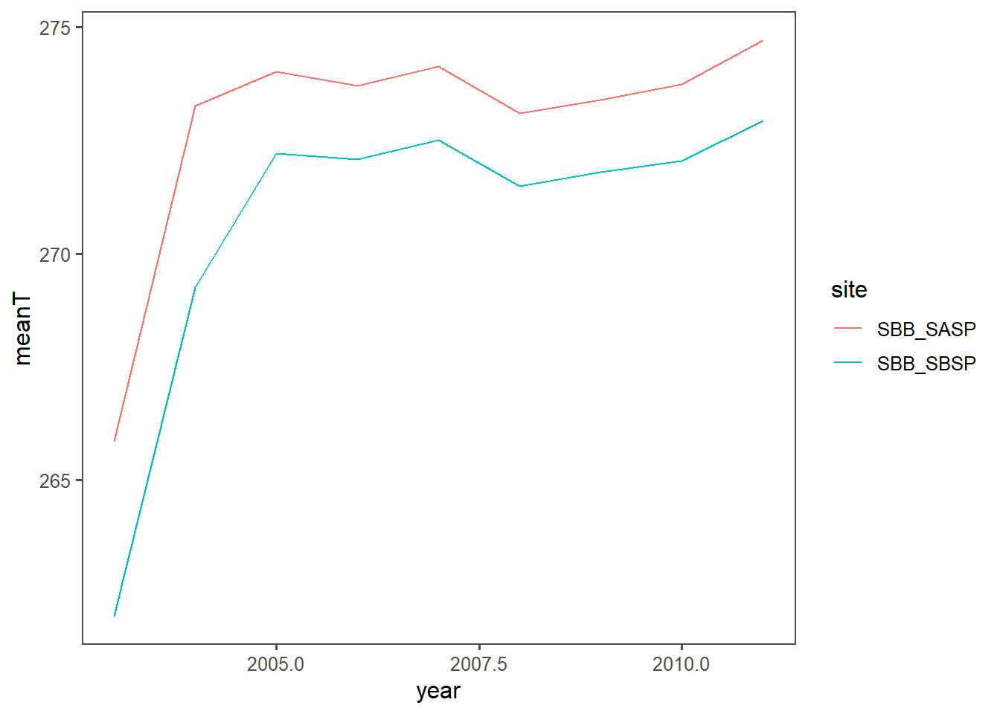
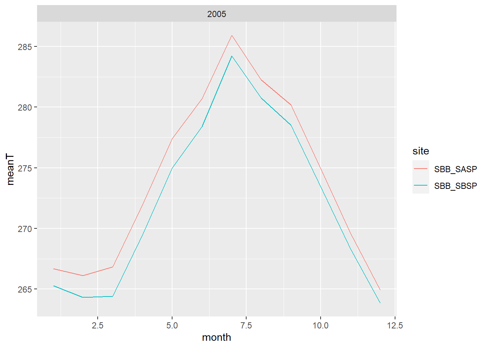
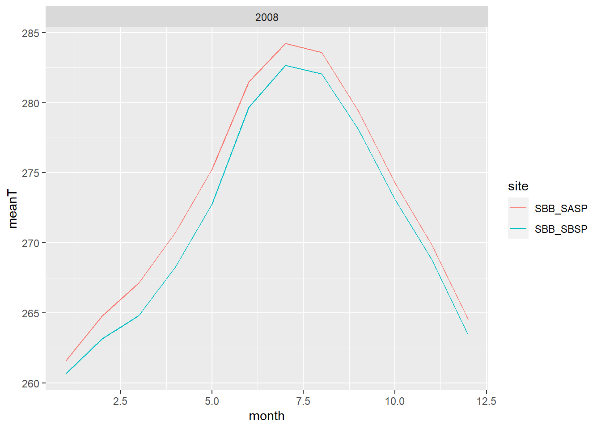
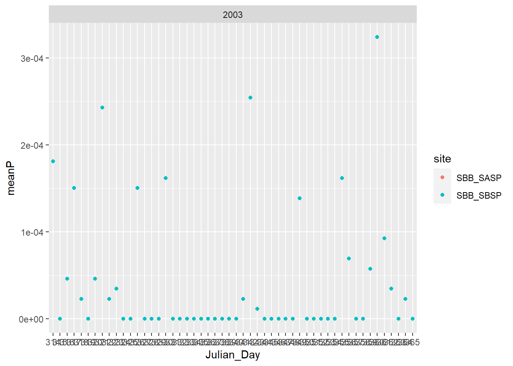
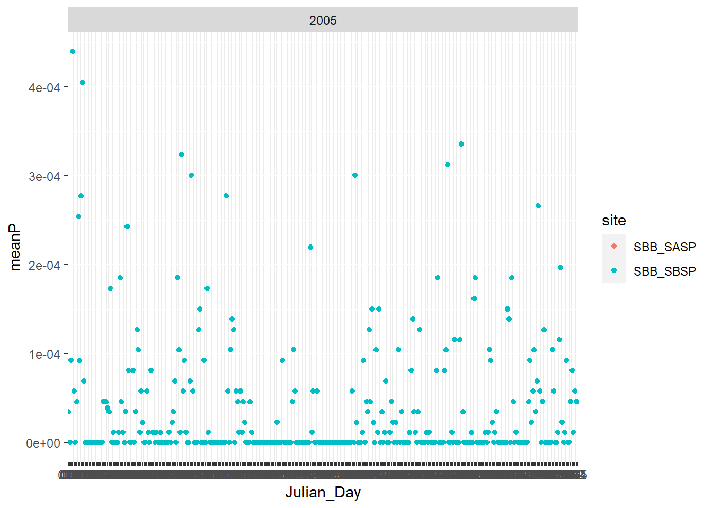

# Functions and Iterations
Learning to quickly go through and pull data out of a dataset using functions and iterations to avoid repeatitive code. 


```r
library(rvest)
site_url <- 'https://snowstudies.org/archived-data/'
#Read the web url
webpage <- read_html(site_url)

#Extract only weblinks and then the URLs!
links <- webpage %>%
  html_nodes('a') %>%
  .[grepl('forcing',.)] %>%
  html_attr('href')
message(links)
```

```
## https://snowstudies.org/wp-content/uploads/2022/02/SBB_SASP_Forcing_Data.txthttps://snowstudies.org/wp-content/uploads/2022/02/SBB_SBSP_Forcing_Data.txt
```
## Loop to read in data 
Download the meteorological data. Use the `download_file` and `str_split_fixed` commands to download the data and save it in your data folder. You can use a for loop or a map function. 

```r
splits <- str_split_fixed(links,'/',8)
#Keep only the 8th column
dataset <- splits[,8] 
#generate a file list for where the data goes
file_names <- paste0('data/',dataset)
for(i in 1:2){
  download.file(links[i],destfile=file_names[i])
}
downloaded <- file.exists(file_names)
list.dirs(path='3_snow_functions_iteration/data')
```

```
## character(0)
```
## Read in Function
Write a custom function to read in the data and append a site column to the data. 


```r
# this code grabs the variable names from the metadata pdf file
library(pdftools)
```

```
## Using poppler version 22.02.0
```

```r
headers <- pdf_text('https://snowstudies.org/wp-content/uploads/2022/02/Serially-Complete-Metadata-text08.pdf') %>%
  readr::read_lines(.) %>%
  trimws(.) %>%
  str_split_fixed(.,'\\.',2) %>%
  .[,2] %>%
  .[1:26] %>%
  str_trim(side = "left")
headers
```

```
##  [1] "year"                                                       
##  [2] "month"                                                      
##  [3] "day"                                                        
##  [4] "hour"                                                       
##  [5] "minute"                                                     
##  [6] "second"                                                     
##  [7] "precip [kg m-2 s-1]"                                        
##  [8] "sw down [W m-2]"                                            
##  [9] "lw down [W m-2]"                                            
## [10] "air temp [K]"                                               
## [11] "windspeed [m s-1]"                                          
## [12] "relative humidity [%]"                                      
## [13] "pressure [Pa]"                                              
## [14] "specific humidity [g g-1]"                                  
## [15] "calculated dewpoint temperature [K]"                        
## [16] "precip, WMO-corrected [kg m-2 s-1]"                         
## [17] "air temp, corrected with Kent et al. (1993) [K]"            
## [18] "air temp, corrected with Anderson and Baumgartner (1998)[K]"
## [19] "air temp, corrected with Nakamura and Mahrt (2005) [K]"     
## [20] "air temp, corrected with Huwald et al. (2009) [K]"          
## [21] "qc code precip"                                             
## [22] "qc code sw down"                                            
## [23] "qc code lw down"                                            
## [24] "qc code air temp"                                           
## [25] "qc code wind speed"                                         
## [26] "qc code relhum"
```

```r
#function to read in 1 data file
# 
#file=file_names[1]
reader<- function(file){
  name = str_split_fixed(file,'/',2)[,2]%>%
  gsub('_Forcing_Data.txt','',.)
  df<-read_fwf(file)%>%
    select(c(1:11))
    names(df)<-headers[1:11]
    df<-df%>%
      mutate(site=name)
}
view(reader(file_names[1]))
```

```
## Rows: 69168 Columns: 19
```

```
## -- Column specification --------------------------------------------------------
## 
## chr  (2): X12, X14
## dbl (17): X1, X2, X3, X4, X5, X6, X7, X8, X9, X10, X11, X13, X15, X16, X17, ...
## 
## i Use `spec()` to retrieve the full column specification for this data.
## i Specify the column types or set `show_col_types = FALSE` to quiet this message.
```

## Map Function
Use the `map` function to read in both meteorological files. Display a summary of your tibble.

```r
met_files<- map_dfr(file_names, reader)
```

```
## Rows: 69168 Columns: 19
## -- Column specification --------------------------------------------------------
## 
## chr  (2): X12, X14
## dbl (17): X1, X2, X3, X4, X5, X6, X7, X8, X9, X10, X11, X13, X15, X16, X17, ...
## 
## i Use `spec()` to retrieve the full column specification for this data.
## i Specify the column types or set `show_col_types = FALSE` to quiet this message.
## Rows: 69168 Columns: 19
## -- Column specification --------------------------------------------------------
## 
## chr  (2): X12, X14
## dbl (17): X1, X2, X3, X4, X5, X6, X7, X8, X9, X10, X11, X13, X15, X16, X17, ...
## 
## i Use `spec()` to retrieve the full column specification for this data.
## i Specify the column types or set `show_col_types = FALSE` to quiet this message.
```

```r
summary(met_files)
```

```
##       year          month             day             hour           minute 
##  Min.   :2003   Min.   : 1.000   Min.   : 1.00   Min.   : 0.00   Min.   :0  
##  1st Qu.:2005   1st Qu.: 3.000   1st Qu.: 8.00   1st Qu.: 5.75   1st Qu.:0  
##  Median :2007   Median : 6.000   Median :16.00   Median :11.50   Median :0  
##  Mean   :2007   Mean   : 6.472   Mean   :15.76   Mean   :11.50   Mean   :0  
##  3rd Qu.:2009   3rd Qu.: 9.000   3rd Qu.:23.00   3rd Qu.:17.25   3rd Qu.:0  
##  Max.   :2011   Max.   :12.000   Max.   :31.00   Max.   :23.00   Max.   :0  
##      second  precip [kg m-2 s-1] sw down [W m-2]     lw down [W m-2]  
##  Min.   :0   Min.   :0.000e+00   Min.   :-9999.000   Min.   :-9999.0  
##  1st Qu.:0   1st Qu.:0.000e+00   1st Qu.:   -3.510   1st Qu.:  173.4  
##  Median :0   Median :0.000e+00   Median :   -0.344   Median :  231.4  
##  Mean   :0   Mean   :3.838e-05   Mean   :-1351.008   Mean   :-1325.7  
##  3rd Qu.:0   3rd Qu.:0.000e+00   3rd Qu.:  294.900   3rd Qu.:  272.2  
##  Max.   :0   Max.   :6.111e-03   Max.   : 1341.000   Max.   :  365.8  
##   air temp [K]   windspeed [m s-1]       site          
##  Min.   :242.1   Min.   :-9999.000   Length:138336     
##  1st Qu.:265.8   1st Qu.:    0.852   Class :character  
##  Median :272.6   Median :    1.548   Mode  :character  
##  Mean   :272.6   Mean   : -790.054                     
##  3rd Qu.:279.7   3rd Qu.:    3.087                     
##  Max.   :295.8   Max.   :  317.300
```
## Plotting data
Make a line plot of mean temp by year by site (using the `air temp [K]` variable). Is there anything suspicious in the plot? Adjust your filtering if needed.

```r
temperature<-met_files%>%
  group_by(year, site)%>%
  summarize(meanT = mean(`air temp [K]`))
```

```
## `summarise()` has grouped output by 'year'. You can override using the
## `.groups` argument.
```

```r
ggplot(temperature, aes(x=year, y=meanT, color=site))+
  geom_line()+
  ggthemes::theme_few()
```



```r
message("Site SBB_SASP has a higher yearly mean temperature than site SBB_SBSP for all years in the dataset. There is a big jump in temperature from the first year to the following years. Further inspection (in Q6) is needed to determine the suspicious jump in data.")
```

```
## Site SBB_SASP has a higher yearly mean temperature than site SBB_SBSP for all years in the dataset. There is a big jump in temperature from the first year to the following years. Further inspection (in Q6) is needed to determine the suspicious jump in data.
```
## Function to create multiple plots
Write a function that makes line plots of monthly average temperature at each site for a given year. Use a for loop to make these plots for 2005 to 2010. Are monthly average temperatures at the Senator Beck Study Plot ever warmer than the Snow Angel Study Plot?
Hint: https://ggplot2.tidyverse.org/reference/print.ggplot.html

```r
loopy<-function(data, xyear){
  #y<-as.vector(unique(data[c("year")]))
  met<-data%>%group_by(year, month , site)%>%
  summarize(meanT=mean(`air temp [K]`))%>%
    dplyr::filter(year==xyear)
  print(ggplot(met,aes(x=month, y=meanT, color=site))+
            geom_line()+ facet_wrap(xyear))}
  
for (i in 2005:2010){
  loopy(met_files, i)
}
```

```
## `summarise()` has grouped output by 'year', 'month'. You can override using the
## `.groups` argument.
## `summarise()` has grouped output by 'year', 'month'. You can override using the
## `.groups` argument.
```



```
## `summarise()` has grouped output by 'year', 'month'. You can override using the
## `.groups` argument.
```


```
## `summarise()` has grouped output by 'year', 'month'. You can override using the
## `.groups` argument.
```


```
## `summarise()` has grouped output by 'year', 'month'. You can override using the
## `.groups` argument.
```



```
## `summarise()` has grouped output by 'year', 'month'. You can override using the
## `.groups` argument.
```


```r
message("From 2005 to 2010 the monthly average temperatures at the Senator Beck Study Plot are never warmer than the Snow Angel Study Plot")
```

```
## From 2005 to 2010 the monthly average temperatures at the Senator Beck Study Plot are never warmer than the Snow Angel Study Plot
```
## Bonus
Make a plot of average daily precipitation by day of year (averaged across all available years). Color each site. 

```r
#coloring each site will not work with duplicate site data
met_files$second<-as.Date(with(met_files,paste(month,day,sep="-")),"%m-%d")%>%
format(., "%j")
  pre<-group_by(met_files,second)%>%
  summarize(meanPre = mean(`precip [kg m-2 s-1]`))
    names(pre)=c('Julian_Day', 'Mean_Precip')
ggplot(pre, aes(x=Julian_Day,y=Mean_Precip))+
  geom_point()+
  ggthemes::theme_few()
```


Bonus #2: Use a function and for loop to create yearly plots of precipitation by day of year. Color each site. 

```r
Ploopy<-function(data, xyear){
  #y<-as.vector(unique(data[c("year")]))
  met<-data%>%group_by(year, second , site)%>%
  summarize(meanP=mean(`precip [kg m-2 s-1]`))%>%
    dplyr::filter(year==xyear)
    colnames(met)[2]='Julian_Day'
  print(ggplot(met,aes(x=Julian_Day, y=meanP, color=site))+
            geom_point()+ facet_wrap(xyear))}
  
for (i in 2003:2010){
  Ploopy(met_files, i)
}
```

```
## `summarise()` has grouped output by 'year', 'second'. You can override using
## the `.groups` argument.
## `summarise()` has grouped output by 'year', 'second'. You can override using
## the `.groups` argument.
```



```
## `summarise()` has grouped output by 'year', 'second'. You can override using
## the `.groups` argument.
```


```
## `summarise()` has grouped output by 'year', 'second'. You can override using
## the `.groups` argument.
```



```
## `summarise()` has grouped output by 'year', 'second'. You can override using
## the `.groups` argument.
```


```
## `summarise()` has grouped output by 'year', 'second'. You can override using
## the `.groups` argument.
```


```
## `summarise()` has grouped output by 'year', 'second'. You can override using
## the `.groups` argument.
```


```
## `summarise()` has grouped output by 'year', 'second'. You can override using
## the `.groups` argument.
```


