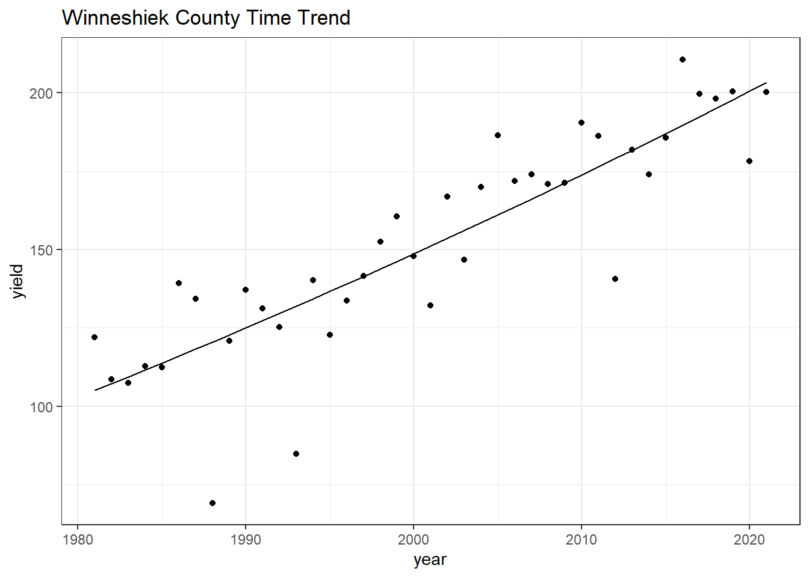

# Regressions
Using regressions to make assumptions about data trends


## Weather Data Analysis
Load the PRISM daily maximum temperatures


```r
# daily max temperature
# dimensions: counties x days x years
prism <- readMat("data/prismiowa.mat")

# look at county #1
t_1981_c1 <- prism$tmaxdaily.iowa[1,,1]
t_1981_c1[366]
```

```
## [1] NaN
```

```r
# assign dimension names to tmax matrix
dimnames(prism$tmaxdaily.iowa) <- list(prism$COUNTYFP, 1:366, prism$years)

# converted 3d matrix into a data frame
tmaxdf <- as.data.frame.table(prism$tmaxdaily.iowa)

# relabel the columns
colnames(tmaxdf) <- c("countyfp","doy","year","tmax")
tmaxdf <- tibble(tmaxdf)
```

## Temperature trends

Summer temperature trends: Winneshiek County


```r
tmaxdf$doy <- as.numeric(tmaxdf$doy)
tmaxdf$year <- as.numeric(as.character(tmaxdf$year))

winnesummer <- tmaxdf %>%
  filter(countyfp==191 & doy >= 152 & doy <= 243) %>%
  group_by(year) %>%
  summarize(meantmax = mean(tmax))

ggplot(winnesummer, mapping = aes(x = year, y = meantmax)) +
  geom_point() +
  theme_bw() +
  labs(x = "Year", y = "Max Temperature (°C)") +
  geom_smooth(method = lm)
```

```
## `geom_smooth()` using formula 'y ~ x'
```


```r
lm_summertmax <- lm(meantmax ~ year, winnesummer)
#summary(lm_summertmax)
```

Winter Temperatures - Winneshiek County


```r
winnewinter <- tmaxdf %>%
  filter(countyfp==191 & (doy <= 59 | doy >= 335) & !is.na(tmax)) %>%
  group_by(year) %>%
  summarize(meantmax = mean(tmax))

ggplot(winnewinter, mapping = aes(x = year, y = meantmax)) +
  geom_point() +
  theme_bw() +
  labs(x = "Year", y = "Max Temperature (°C)") +
  geom_smooth(method = lm)
```

```
## `geom_smooth()` using formula 'y ~ x'
```


```r
lm_wintertmax <- lm(meantmax ~ year, winnewinter)
#summary(lm_wintertmax)
```

## Multiple regression -- 
Quadratic time trend


```r
winnewinter$yearsq <- winnewinter$year^2

lm_wintertmaxquad <- lm(meantmax ~ year + yearsq, winnewinter)
summary(lm_wintertmaxquad)
```

```
## 
## Call:
## lm(formula = meantmax ~ year + yearsq, data = winnewinter)
## 
## Residuals:
##     Min      1Q  Median      3Q     Max 
## -3.3539 -1.2985 -0.2813  1.4055  4.2620 
## 
## Coefficients:
##               Estimate Std. Error t value Pr(>|t|)
## (Intercept) -1.086e+04  1.238e+04  -0.877    0.386
## year         1.085e+01  1.239e+01   0.876    0.387
## yearsq      -2.710e-03  3.097e-03  -0.875    0.388
## 
## Residual standard error: 2.051 on 35 degrees of freedom
## Multiple R-squared:  0.02694,	Adjusted R-squared:  -0.02867 
## F-statistic: 0.4845 on 2 and 35 DF,  p-value: 0.6201
```

```r
winnewinter$fitted <- lm_wintertmaxquad$fitted.values

ggplot(winnewinter) +
  geom_point(mapping = aes(x = year, y = meantmax)) +
  geom_line(mapping = aes(x = year, y = fitted)) +
  theme_bw() +
  labs(x = "Year", y = "Max Temperature")
```


## Download NASS corn yield data
USDA NASS data download

```r
# set our API key with NASS
nassqs_auth(key = "2FCF525A-8D93-3647-9216-07E60D61705D")

# parameters to query on 
params <- list(commodity_desc = "CORN", util_practice_desc = "GRAIN", prodn_practice_desc = "ALL PRODUCTION PRACTICES", year__GE = 1981, state_alpha = "IA")

# download
cornyieldsall <- nassqs_yields(params)

cornyieldsall$county_ansi <- as.numeric(cornyieldsall$county_ansi)
cornyieldsall$yield <- as.numeric(cornyieldsall$Value)

# clean and filter this dataset
cornyields <- select(cornyieldsall, county_ansi, county_name,county_code, yield, year) %>%
  filter(!is.na(county_ansi) & !is.na(yield))
cornyields <- tibble(cornyields)
```

## Question 1a:
Extract Winneshiek County corn yields, fit a linear time trend, make a plot. Is there a significant time trend?

```r
winne<- cornyieldsall%>%
  filter(county_name=='WINNESHIEK')
Winne_CY <- tibble(winne)

Winne_CY$yield <- as.numeric(Winne_CY$yield)

ggplot(Winne_CY, mapping = aes(x=year, y=yield))+
  geom_point()+
  theme_bw()+
  geom_smooth(method = lm)+
  xlab("Year")+
  ylab("Yield (tons/acre)")+
  ggtitle("Corn Yields in Winneshiek County")
```

```
## `geom_smooth()` using formula 'y ~ x'
```


"There is an increasing linear trend between year and yield."

### Question 1b: Fit a quadratic time trend (i.e., year + year^2) and make a plot. Is there evidence for slowing yield growth? 

```r
Winne_CY$year <- as.numeric(Winne_CY$year)
Winne_CY$yearsq <- Winne_CY$year^2

lm_winnequad <- lm(yield ~ year + yearsq, Winne_CY)
summary(lm_winnequad)
```

```
## 
## Call:
## lm(formula = yield ~ year + yearsq, data = Winne_CY)
## 
## Residuals:
##     Min      1Q  Median      3Q     Max 
## -51.384  -3.115   1.388   9.743  25.324 
## 
## Coefficients:
##               Estimate Std. Error t value Pr(>|t|)
## (Intercept)  2.583e+04  8.580e+04   0.301    0.765
## year        -2.812e+01  8.576e+01  -0.328    0.745
## yearsq       7.641e-03  2.143e-02   0.357    0.723
## 
## Residual standard error: 17.17 on 38 degrees of freedom
## Multiple R-squared:  0.7559,	Adjusted R-squared:  0.7431 
## F-statistic: 58.84 on 2 and 38 DF,  p-value: 2.311e-12
```

```r
Winne_CY$fitted <- lm_winnequad$fitted.values


ggplot(Winne_CY) +
  geom_point(mapping = aes(x = year, y = yield)) +
  geom_line(mapping = aes(x = year, y = fitted)) +
  theme_bw() +
  labs(x = "year", y = "yield")+
  ggtitle("Winneshiek County Time Trend")
```



```r
message("There does not seem to be evidence of slowing yield in Winneshiek County because there is a positive quadratic relationship. ")
```

```
## There does not seem to be evidence of slowing yield in Winneshiek County because there is a positive quadratic relationship.
```
## Question 2 
Time Series: Let's analyze the relationship between temperature and yields for the Winneshiek County time series. Use data on yield and summer avg Tmax. Is adding year or Tmax^2 to your model helpful? Make a plot and interpret the results.

```r
q2<-inner_join(winnesummer, Winne_CY)
```

```
## Joining, by = "year"
```

```r
ggplot(q2,aes(x=meantmax, y=yield))+
  theme_bw()+
  geom_point()+
  labs(x="Mean Max Temperature (°C)", y="Corn Yield")+
  ggtitle("Temperature and Yield for Winneshiek County")
```


```r
q2$tmp2<-q2$meantmax^2
lm_quad <- lm(yield ~ meantmax + tmp2, q2)
summary(lm_quad)
```

```
## 
## Call:
## lm(formula = yield ~ meantmax + tmp2, data = q2)
## 
## Residuals:
##     Min      1Q  Median      3Q     Max 
## -56.587 -22.262  -0.982  22.409  52.798 
## 
## Coefficients:
##              Estimate Std. Error t value Pr(>|t|)   
## (Intercept) -4223.604   1446.639  -2.920  0.00609 **
## meantmax      328.918    107.068   3.072  0.00410 **
## tmp2           -6.173      1.979  -3.119  0.00362 **
## ---
## Signif. codes:  0 '***' 0.001 '**' 0.01 '*' 0.05 '.' 0.1 ' ' 1
## 
## Residual standard error: 29.5 on 35 degrees of freedom
## Multiple R-squared:  0.2417,	Adjusted R-squared:  0.1984 
## F-statistic: 5.579 on 2 and 35 DF,  p-value: 0.007887
```

```r
q2$fittedq <- lm_quad$fitted.values


ggplot(q2)+
  geom_point(mapping = aes(x=meantmax, y=yield))+
  geom_line(mapping = aes(x=meantmax, y=fittedq))+
  theme_bw()+ 
  labs(x="Mean Max Temperature (°C)", y="Corn Yield")+
  ggtitle("Trend of Temperature and Yield for Winneshiek County")
```


'Adding a model of Tmax^2 is helpful to interperte the trends of temperature and its effects on corn yield. From this graph you can see as temperature increases yield does as well until a threshold is reached and yield begins to decrease as temperature gets hotter.'

## Question 3 
Cross-Section: Analyze the relationship between temperature and yield across all counties in 2018. Is there a relationship? Interpret the results.

```r
colnames(cornyields)[1]="countyfp"
cornyields$countyfp<- as.numeric(cornyields$countyfp)
tmaxdf$countyfp<- as.numeric(tmaxdf$countyfp)

yield18<- cornyields%>%
  filter(year=='2018')
temp18<-tmaxdf%>%
  filter(year=='2018')


jd18<-inner_join(yield18, temp18, by ="countyfp")%>%
  filter(!is.na(tmax))%>%
  group_by(countyfp, yield)%>%
  summarise(meanTmax=mean(tmax))
```

```
## `summarise()` has grouped output by 'countyfp'. You can override using the
## `.groups` argument.
```

```r
ggplot(mapping = aes(x=jd18$meanTmax, y=jd18$yield))+
  geom_point()+
  ggtitle("2018 Temperature and Yield Analysis")+
  theme_bw()+
  labs(x="Mean Max Temperature (°C)", y="Corn Yield (tons/acre)")+
  geom_smooth(method = lm)
```

```
## `geom_smooth()` using formula 'y ~ x'
```


'There does not seem to be much of a trend between temperature and corn yield over all of the counties in 2018. When a linear model if fitted to the data you can see a slight decreasing trend in temperature vs yield. '

## Question 4 
Panel: One way to leverage multiple time series is to group all data into what is called a "panel" regression. Convert the county ID code ("countyfp" or "county_ansi") into factor using as.factor, then include this variable in a regression using all counties' yield and summer temperature data. How does the significance of your temperature coefficients (Tmax, Tmax^2) change? Make a plot comparing actual and fitted yields and interpret the results of your model.

```r
summer <- tmaxdf %>%
  filter(doy >= 152 & doy <= 243) %>%
  group_by(year) %>%
  summarize(meantmax = mean(tmax))

cornyields$year <- as.numeric(cornyields$year)

combo<- inner_join(cornyields, summer, by='year')
combo$fac<- as.factor(combo$countyfp)
combo$temp2<-combo$meantmax^2
lm_combo<-lm(yield~meantmax+temp2+year+fac, combo)
summary(lm_combo)
```

```
## 
## Call:
## lm(formula = yield ~ meantmax + temp2 + year + fac, data = combo)
## 
## Residuals:
##     Min      1Q  Median      3Q     Max 
## -90.667  -9.604   1.444  13.250  48.201 
## 
## Coefficients:
##               Estimate Std. Error t value Pr(>|t|)    
## (Intercept) -5.787e+03  1.217e+02 -47.548  < 2e-16 ***
## meantmax     1.154e+02  8.252e+00  13.989  < 2e-16 ***
## temp2       -2.172e+00  1.469e-01 -14.794  < 2e-16 ***
## year         2.199e+00  2.972e-02  73.980  < 2e-16 ***
## fac3        -4.363e+00  4.495e+00  -0.971 0.331814    
## fac5         1.088e+01  4.495e+00   2.420 0.015567 *  
## fac7        -1.902e+01  4.526e+00  -4.202 2.71e-05 ***
## fac9         8.829e+00  4.495e+00   1.964 0.049603 *  
## fac11        1.246e+01  4.495e+00   2.772 0.005602 ** 
## fac13        1.407e+01  4.495e+00   3.130 0.001761 ** 
## fac15        1.844e+01  4.495e+00   4.102 4.19e-05 ***
## fac17        1.871e+01  4.495e+00   4.162 3.22e-05 ***
## fac19        1.517e+01  4.495e+00   3.374 0.000749 ***
## fac21        1.518e+01  4.495e+00   3.377 0.000740 ***
## fac23        1.544e+01  4.495e+00   3.434 0.000601 ***
## fac25        1.612e+01  4.495e+00   3.586 0.000341 ***
## fac27        1.398e+01  4.495e+00   3.111 0.001880 ** 
## fac29        6.453e+00  4.495e+00   1.435 0.151258    
## fac31        2.040e+01  4.495e+00   4.538 5.86e-06 ***
## fac33        1.239e+01  4.495e+00   2.757 0.005858 ** 
## fac35        1.935e+01  4.495e+00   4.304 1.72e-05 ***
## fac37        1.023e+01  4.495e+00   2.277 0.022866 *  
## fac39       -2.427e+01  4.526e+00  -5.362 8.73e-08 ***
## fac41        1.341e+01  4.495e+00   2.984 0.002866 ** 
## fac43        1.654e+01  4.495e+00   3.680 0.000236 ***
## fac45        1.553e+01  4.495e+00   3.456 0.000555 ***
## fac47        1.133e+01  4.495e+00   2.521 0.011753 *  
## fac49        1.189e+01  4.495e+00   2.646 0.008180 ** 
## fac51       -1.859e+01  4.526e+00  -4.108 4.09e-05 ***
## fac53       -1.720e+01  4.526e+00  -3.801 0.000147 ***
## fac55        1.704e+01  4.495e+00   3.790 0.000153 ***
## fac57        9.116e+00  4.495e+00   2.028 0.042650 *  
## fac59        1.033e+01  4.495e+00   2.298 0.021635 *  
## fac61        1.726e+01  4.495e+00   3.838 0.000126 ***
## fac63        1.533e+01  4.495e+00   3.410 0.000657 ***
## fac65        1.538e+01  4.495e+00   3.421 0.000632 ***
## fac67        1.219e+01  4.495e+00   2.713 0.006704 ** 
## fac69        1.824e+01  4.495e+00   4.057 5.08e-05 ***
## fac71        4.174e+00  4.495e+00   0.928 0.353237    
## fac73        1.659e+01  4.495e+00   3.692 0.000226 ***
## fac75        1.816e+01  4.495e+00   4.040 5.45e-05 ***
## fac77        4.829e+00  4.495e+00   1.074 0.282799    
## fac79        1.814e+01  4.495e+00   4.035 5.58e-05 ***
## fac81        1.666e+01  4.495e+00   3.706 0.000214 ***
## fac83        1.938e+01  4.495e+00   4.312 1.66e-05 ***
## fac85        6.074e+00  4.495e+00   1.351 0.176745    
## fac87        3.134e+00  4.495e+00   0.697 0.485714    
## fac89        9.113e+00  4.495e+00   2.027 0.042710 *  
## fac91        1.740e+01  4.495e+00   3.871 0.000110 ***
## fac93        1.729e+01  4.495e+00   3.846 0.000122 ***
## fac95        9.826e+00  4.495e+00   2.186 0.028887 *  
## fac97        5.045e+00  4.495e+00   1.122 0.261845    
## fac99        1.697e+01  4.495e+00   3.775 0.000162 ***
## fac101      -5.500e+00  4.495e+00  -1.223 0.221224    
## fac103       7.003e+00  4.495e+00   1.558 0.119378    
## fac105       1.369e+01  4.495e+00   3.045 0.002346 ** 
## fac107       1.571e+00  4.495e+00   0.349 0.726746    
## fac109       1.997e+01  4.495e+00   4.441 9.20e-06 ***
## fac111      -3.897e+00  4.495e+00  -0.867 0.386010    
## fac113       1.196e+01  4.495e+00   2.660 0.007847 ** 
## fac115       4.632e+00  4.495e+00   1.030 0.302934    
## fac117      -2.184e+01  4.557e+00  -4.793 1.71e-06 ***
## fac119       1.411e+01  4.495e+00   3.139 0.001709 ** 
## fac121      -1.661e+00  4.495e+00  -0.369 0.711860    
## fac123       7.953e+00  4.495e+00   1.769 0.076964 .  
## fac125       1.505e+00  4.495e+00   0.335 0.737758    
## fac127       1.995e+01  4.495e+00   4.438 9.35e-06 ***
## fac129       3.948e+00  4.557e+00   0.866 0.386439    
## fac131       1.537e+01  4.495e+00   3.418 0.000637 ***
## fac133      -1.079e+00  4.495e+00  -0.240 0.810332    
## fac135      -1.590e+01  4.526e+00  -3.513 0.000448 ***
## fac137       2.805e+00  4.495e+00   0.624 0.532642    
## fac139       8.576e+00  4.495e+00   1.908 0.056492 .  
## fac141       2.073e+01  4.495e+00   4.612 4.12e-06 ***
## fac143       1.629e+01  4.495e+00   3.623 0.000295 ***
## fac145      -3.671e+00  4.495e+00  -0.817 0.414190    
## fac147       1.427e+01  4.495e+00   3.175 0.001510 ** 
## fac149       1.027e+01  4.495e+00   2.284 0.022449 *  
## fac151       1.764e+01  4.495e+00   3.924 8.87e-05 ***
## fac153       1.427e+01  4.495e+00   3.175 0.001510 ** 
## fac155       1.022e+01  4.526e+00   2.259 0.023966 *  
## fac157       1.257e+01  4.495e+00   2.796 0.005203 ** 
## fac159      -2.102e+01  4.495e+00  -4.676 3.04e-06 ***
## fac161       1.519e+01  4.495e+00   3.380 0.000734 ***
## fac163       2.032e+01  4.495e+00   4.520 6.37e-06 ***
## fac165       1.143e+01  4.495e+00   2.542 0.011069 *  
## fac167       1.963e+01  4.495e+00   4.366 1.30e-05 ***
## fac169       1.662e+01  4.495e+00   3.697 0.000222 ***
## fac171       1.516e+01  4.495e+00   3.371 0.000756 ***
## fac173      -1.572e+01  4.526e+00  -3.473 0.000521 ***
## fac175      -1.095e+01  4.526e+00  -2.420 0.015579 *  
## fac177      -1.460e+01  4.495e+00  -3.247 0.001176 ** 
## fac179      -5.989e+00  4.526e+00  -1.323 0.185792    
## fac181      -2.482e+00  4.495e+00  -0.552 0.580959    
## fac183       8.547e+00  4.495e+00   1.901 0.057330 .  
## fac185      -2.161e+01  4.526e+00  -4.775 1.87e-06 ***
## fac187       2.020e+01  4.495e+00   4.493 7.24e-06 ***
## fac189       1.633e+01  4.495e+00   3.634 0.000283 ***
## fac191       1.291e+01  4.495e+00   2.871 0.004118 ** 
## fac193       4.774e+00  4.495e+00   1.062 0.288343    
## fac195       1.419e+01  4.495e+00   3.156 0.001610 ** 
## fac197       1.838e+01  4.495e+00   4.088 4.44e-05 ***
## ---
## Signif. codes:  0 '***' 0.001 '**' 0.01 '*' 0.05 '.' 0.1 ' ' 1
## 
## Residual standard error: 19.59 on 3646 degrees of freedom
## Multiple R-squared:  0.6977,	Adjusted R-squared:  0.6893 
## F-statistic:  83.3 on 101 and 3646 DF,  p-value: < 2.2e-16
```

```r
combo$fitted<-lm_combo$fitted.values

ggplot()+
  geom_point(combo, mapping=aes(x=fitted, y=yield))+
  geom_smooth(combo, mapping=aes(x=fitted, y=yield),method = lm)+
  theme_bw()+
  labs(x='Predicted Yield', y='Actual Yield')+
  ggtitle("Actual Yield and Fitted Yield")
```

```
## `geom_smooth()` using formula 'y ~ x'
```


'The model fits yield based on multiple variables including mean max temp, temperature squared, each county, and each year. The coefficients for temperature is positive but the coefficient for temp^2 is negative. The graph shows how well the modeled predicts values for yield, it is not quite a one to one relationship but there is a linear trend.'

## Question 5
Soybeans: Download NASS data on soybean yields and explore either a time series relationship for a given county, the cross-sectional relationship for a given year, or a panel across all counties and years.

'There is a steady increase in soybean yield over time in the Buena Vista county.'
