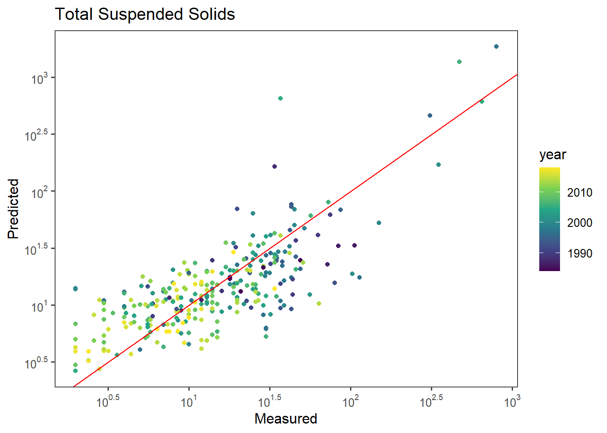

# Machine Learning
Using machine learning to fine tune a model to get the lowest error. 


A friend told me today about a term called ["Grad student descent"](https://sciencedryad.wordpress.com/2014/01/25/grad-student-descent/) which is a 
play on words with the term gradient descent, an extremely common tool used to 
tune hyperparameters (and parameters) for machine learning models. Grad student
descent then is when that method is simply having grad students search a parameter
space manually in part to improve the model, and in part to learn how these
algorithms work.

Today we are trying to predict the concentrations of either chlorophyll a (`CHLA`) 
or total suspended sediment (`TSS`) in the Loire River France using satellite imagery.
The grab sample data (someone grabbing water from a stream for analysis), comes
from the French electricity agency who collects this data to meet their water
quality standards. 
Basically the core idea here is that water color as captured in an image tells you
something about what is in the water. If it's green and bright (lots of light 
reflected from the water), then it may have a lot of algae (Chlorophyll a is a proxy
for algal biomass). If it's tan and bright, it may have lots of sediment. If it's
dark and blue it's clear!

This color information is captured in "bands" like red, blue, green etc... from
the Landsat series of satellites, which have collected data over the world since
the late 70s. For this analysis we are only using Landsat 5,7, and 8, so the
data goes back to 1984. 


## Model development


```r
wq_sr <- read_csv('data/wq_sr.csv') %>%
  mutate(year = year(date))
```

```
## Rows: 777 Columns: 109
## -- Column specification --------------------------------------------------------
## Delimiter: ","
## chr    (6): site_name, geometry, LS_ID, sat, season, hexcolor
## dbl  (100): site_no, TSS, PheoP, CHLA, lat, long, split_ID, Cloud_Cover, azi...
## dttm   (1): date_time
## date   (1): date
## time   (1): time
## 
## i Use `spec()` to retrieve the full column specification for this data.
## i Specify the column types or set `show_col_types = FALSE` to quiet this message.
```


This is the fiddly bit. The goal? Tune hyperparameters to get the lowest
RMSE and the best Measured/Predicted fit (points close to the red line). 


```r
# A vector that contains all the columns I want to keep. 
predictors <- c("azimuth", "blue","green", "nir" ,"red", "swir1","swir2","zenith"  , "NR" ,"BR" ,"GR" , "SR" ,    "BG" , "BN", "BS" ,"GS" ,"GN" , "ndvi", "ndwi", 'fai',  "hillshade", "hue", "bright_tot", "bright")

booster <- function(df = wq_sr,pred='CHLA',title='Chlorophyll a',
                    features = predictors){
  
  non_nas <- (!is.na(df[,pred]))
  
  #remove nas
  df = df[non_nas,]
  
  
  #Sample 60% of the data. 
  train <- df %>%
    sample_frac(0.6) 
  
  #Keep only data that is not in train
  #How could we make this safer (spatiotemporal robustness)
  test <- df %>%
    anti_join(.,train,by='index')
  
  
  # Actual boosting model
  ag_mod <- xgboost(data=train %>%
                    dplyr::select(features) %>% 
                      as.matrix(.),
                  label = train %>% pull(pred) %>% log10(.),
                  nthread=4,
                  max_depth=4,
                  eta=0.1,
                  gamma = 0.1,
                  nrounds=300,
                  subsample = 0.5, #best_par['subsample'], # 0.5,
                  colsample_bytree = 0.5,  #0.5,
                  min_child_weight = 1, 
                  lambda = 3,
                  print_every_n = 100)
  
  #Tune ntree, k, numcut, bands that you use, etc...
  
  
  #apply predictions. 
  test <- test %>% 
    mutate(bpred= 10^predict(ag_mod,test %>%
                               dplyr::select(features) %>% 
                      as.matrix(.)))
  #Optional for log
  #test[,pred] = 10^test[,pred]
  
  #Remove NAs
  test <- test %>%
    filter(!is.na(pred)) %>%
    as.data.frame()
  
  error <- 
    tibble(rmse=Metrics::rmse(test$bpred,test[,pred]),
                       mdae=Metrics::mdae(test$bpred,test[,pred]),
                       mape=Metrics::mape(test$bpred,test[,pred]),
                       bias=Metrics::bias(test$bpred,test[,pred]))


g1 <- ggplot(test,
         aes_string(x=pred,y='bpred',color='year'))  +
    geom_point() + 
    geom_abline(intercept=0,slope=1,color='red') +
    labs(x='Measured',y='Predicted') + 
    theme_few() +
  scale_color_viridis_c() + 
     scale_x_log10(breaks = trans_breaks("log10", function(x) 10^x),
                labels = trans_format("log10", math_format(10^.x)))  +
       scale_y_log10(breaks = trans_breaks("log10", function(x) 10^x),
                labels = trans_format("log10", math_format(10^.x))) + 
  ggtitle(title)


# returns a list of the plot (g1), the error metric (error), and the 
# model (ag_mod)
return(list(g1,error,ag_mod))
}
```
## Chl-a model


```r
set.seed(2020526) ## Makes the work reproducible, but you can hack this!
chl_boost <- booster(df = wq_sr)
```

```
## Note: Using an external vector in selections is ambiguous.
## i Use `all_of(features)` instead of `features` to silence this message.
## i See <https://tidyselect.r-lib.org/reference/faq-external-vector.html>.
## This message is displayed once per session.
```

```
## [1]	train-rmse:0.806420 
## [101]	train-rmse:0.192442 
## [201]	train-rmse:0.136304 
## [300]	train-rmse:0.123537
```


### Chl-a Model Measured/Predicted Plot


```r
chl_boost[[1]]
```


```r
chl_boost[[2]]
```

```
## # A tibble: 1 x 4
##    rmse  mdae  mape  bias
##   <dbl> <dbl> <dbl> <dbl>
## 1  24.3  6.16  1.12 -4.75
```

## TSS Model


```r
predictors <- c("azimuth", "blue","green", "nir" ,"red", "swir1","swir2","zenith"  , "NR" ,"BR" ,"GR" , "SR" ,    "BG" , "BN", "BS" ,"GS" ,"GN" , "ndvi", "ndwi", 'fai',  "hillshade", "hue", "bright_tot", "bright")
boosted <- function(df = wq_sr,pred='TSS',title='Total Suspended Solids',
                    features = predictors){
  
  non_nas <- (!is.na(df[,pred]))
  
  #remove nas
  df = df[non_nas,]
  
  
  #Sample 60% of the data. 
  train <- df %>%
    sample_frac(0.6) 
  
  #Keep only data that is not in train
  #How could we make this safer (spatiotemporal robustness)
  test <- df %>%
    anti_join(.,train,by='index')
  
  
  # Actual boosting model
  ag_mod <- xgboost(data=train %>%
                    dplyr::select(features) %>% 
                      as.matrix(.),
                  label = train %>% pull(pred) %>% log10(.),
                  nthread=4,
                  max_depth=4,
                  eta=0.1,
                  gamma = 0.1,
                  nrounds=300,
                  subsample = 0.5, #best_par['subsample'], # 0.5,
                  colsample_bytree = 0.5,  #0.5,
                  min_child_weight = 1, 
                  lambda = 3, #3
                  print_every_n = 100)
  
  #Tune ntree, k, numcut, bands that you use, etc...
  
  
  #apply predictions. 
  test <- test %>% 
    mutate(bpred= 10^predict(ag_mod,test %>%
                               dplyr::select(features) %>% 
                      as.matrix(.)))
  #Optional for log
  #test[,pred] = 10^test[,pred]
  
  #Remove NAs
  test <- test %>%
    filter(!is.na(pred)) %>%
    as.data.frame()
  
  error <- 
    tibble(rmse=Metrics::rmse(test$bpred,test[,pred]),
                       mdae=Metrics::mdae(test$bpred,test[,pred]),
                       mape=Metrics::mape(test$bpred,test[,pred]),
                       bias=Metrics::bias(test$bpred,test[,pred]))


g2 <- ggplot(test,
         aes_string(x=pred,y='bpred',color='year'))  +
    geom_point() + 
    geom_abline(intercept=0,slope=1,color='red') +
    labs(x='Measured',y='Predicted') + 
    theme_few() +
  scale_color_viridis_c() + 
     scale_x_log10(breaks = trans_breaks("log10", function(x) 10^x),
                labels = trans_format("log10", math_format(10^.x)))  +
       scale_y_log10(breaks = trans_breaks("log10", function(x) 10^x),
                labels = trans_format("log10", math_format(10^.x))) + 
  ggtitle(title)


return(list(g2,error,ag_mod))
}
```


### TSS Evaluation


```r
set.seed(2020526) ## Makes the work reproducible, but you can hack this!
tss_boost <- boosted(df = wq_sr)
```

```
## [1]	train-rmse:0.750469 
## [101]	train-rmse:0.154017 
## [201]	train-rmse:0.121745 
## [300]	train-rmse:0.113153
```

```r
tss_boost[[1]]
```



```r
tss_boost[[2]]
```

```
## # A tibble: 1 x 4
##    rmse  mdae  mape  bias
##   <dbl> <dbl> <dbl> <dbl>
## 1  90.4  5.05 0.648  5.30
```
